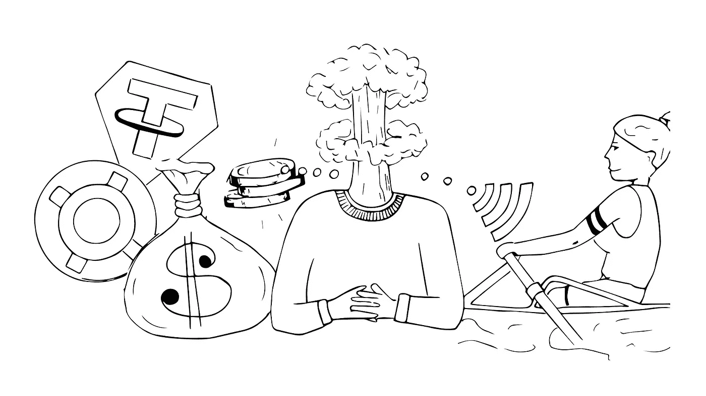
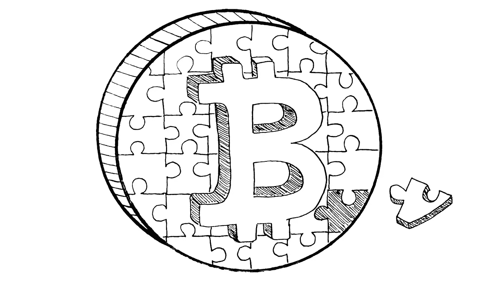

# Stablecoin 入门介绍

> 原文：<https://medium.com/coinmonks/stablecoin-primer-intro-54689d6fcdba?source=collection_archive---------13----------------------->

# **划手和慢炖锅**

*本文是 Stablecoin 初级读本系列的一部分。如果你有兴趣阅读其他文章，请滚动到这篇文章的底部。*

Thinking about money by [diedamla](https://www.instagram.com/diedamlas/)

今年，当我回伊斯坦布尔老家过寒假时，迎接我的是一箱箱新东西。我心想，我乞求新年礼物的岁月终于结束了。(圣诞节不是伊斯坦布尔的事)。几分钟后，我发现我爸爸匆忙打开同样的盒子，里面装着一堆健身和烹饪设备——肯定不是我想要的耳机。所以我立即问他在做什么。他面带微笑地看着我，说:“你一定没注意到，里拉是 16，不值得把我的钱留在现金里。”

他刚从美国来到这里，他说的话没有立即被理解。毕竟，我期待他对健身或烹饪发表评论。我花了一整天的时间适应环境，并与其他家庭成员和朋友以及当地企业主进行了交流，才明白他的真正意思。所以让我试着澄清一下我父亲想说的话:

> “在过去的一个月里，土耳其里拉对美元贬值了近 42%,使美元对土耳其里拉的汇率达到 16。如果我把辛辛苦苦挣来的钱存在我的里拉银行账户里，那就像把它放在火上，扔到海里，或者在街上免费分发。相反，我决定买一个**划船机**和一个**慢炖锅**，因为我相信与里拉相比，这些东西在短期内对我更有用，在将来我转卖它们时对我更有价值。”

我爸是个讲道理的人。他本身并不是金融大师或经济学奇才，但作为一名拥有委员会认证的临床病理学家，他在日常生活中做出延长生命的决定，并作为一名企业主投入到游戏(经济)中。所以他对我问题的反应让我想了，很多。

慢炖锅和稳定的黄瓜有什么关系？还有病理学？为什么所有这些都是相关的？因为这件轶事让我思考抽象的宏观货币政策是如何在微观层面如此切实地影响我们的生活的。更具体地说，在诞生这本初级读本的同时，这段轶事让我对一些事情产生了疑问:

1.  我们本能地用钱做什么？
2.  为什么我们所知的法定货币，尤其是在世界上某些地方，比如土耳其，不能满足所有这些预期的用途？
3.  为什么我们还没有用承诺的点对点电子货币比特币取代法定货币？
4.  如果菲亚特和比特币不能满足我们所有的货币需求，那么稳定硬币会是货币拼图的最后一块吗？

Last piece in the money puzzle by [diedamla](https://www.instagram.com/diedamlas/)

这篇初级读本最终是对 stablecoins 的深入研究，上面的#4 是更广泛的关注点。然而，为了对 stablecoins 的价值主张有一个基本的了解(其供应量同比增长了 5 倍，达到 1810 亿美元)，我们首先需要看看它们所解决的问题。归根结底，像所有的工具和解决方案一样，stablecoins 是为了解决我们的特定需求或问题而发明的。如果我们把稳定的货币看作是对当前货币形式的升级，我们就需要了解关于后者的问题。沿着这些思路，初级读本的第一部分 聚焦于法定货币的通货膨胀，比特币的波动性，以及对稳定货币实力的介绍。

然后我们在**第二章**中谈论稳定币的总体情况。在这里，我们提供了来自世界各地的真实例子，突出了 stablecoins 强大的产品市场适应性。进一步探索，我们讨论了人们使用 stablecoins 的各种方式。在 stablecoin 语言场景讨论的基础上，在第 3 节中，我们强调了现有的三大类 stablecoin，以及每种 stable coin 类型的不同优化参数。

在第 4 节的**中，我们深入探讨了一组精选的 stablecoin 项目，以阐明不同的 stable coin 如何实现稳定性以及它们之间的权衡。最后，我们在第 5 节**的**中讨论了 stablecoins 达到大规模采用所需要的真实情况，以此来结束本教程。按照程序，我们在这里也讨论与稳定资本相关的风险。**

因为所有读者，无论他们对 stablecoins 的熟悉程度如何，都欢迎阅读本初级读本，所以我提供了以下部分的链接，以便每个人都可以按照他们的偏好顺序进行探索:

**Stablecoin Primer —简介**:划手和慢炖锅(你在这里)

**Stablecoin 引物—第 1 节**:[stable coin 的路径](https://namsso.medium.com/stablecoin-primer-section-1-path-to-stablecoins-8bcdb39c73e1)

**Stablecoin 底漆—第二节** : [Stablecoin 景观](/coinmonks/stablecoin-primer-section-2-stablecoin-landscape-132b27f7f2d3)

**稳定蛋白引物—第三节** : [稳定蛋白类型](https://namsso.medium.com/stablecoin-primer-section-3-stablecoin-types-c416ce5f455f)

**稳定潜水引子——第四节** : [稳定潜水浅潜](https://namsso.medium.com/stablecoin-primer-section-4-stablecoin-projects-28b509624165)

**Stablecoin Primer —第五节** : [Stablecoins 的未来](https://namsso.medium.com/stablecoin-primer-section-5-stablecoins-future-b9649a85a722)

**稳定币入门—奖励部分**:错过了什么

尽情享受吧！乐意通过评论、 [Twitter](https://twitter.com/_namsso_) 或 [Linkedin](https://www.linkedin.com/in/osman-sarman/) 进一步聊天

特别感谢 NEAR Team Grants([NEAR Team](https://medium.com/u/1fbe737011b4?source=post_page-----54689d6fcdba--------------------------------))让这项研究成为可能。