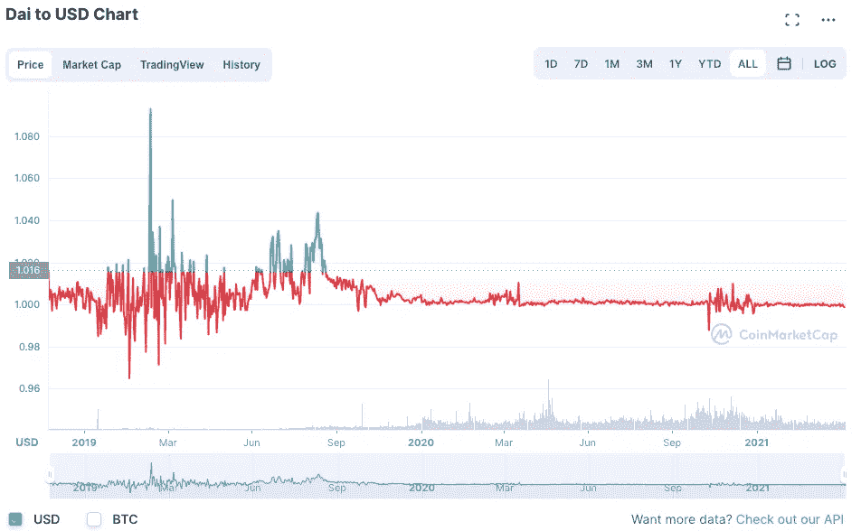

# 稳定币底火——制造者戴浅潜

> 原文：<https://medium.com/coinmonks/stablecoin-primer-maker-dai-shallow-dive-a6103338ea6f?source=collection_archive---------22----------------------->

*本文是 Stablecoin 入门系列文章* [***第 4 节***](https://namsso.medium.com/stablecoin-primer-section-4-stablecoin-projects-28b509624165) *的一部分。如果你有兴趣阅读其他文章，* [*看看这篇文章*](https://namsso.medium.com/stablecoin-primer-intro-54689d6fcdba) *。*

**浅潜格式如下**:协议- >令牌- >设计原则- >关键指标- >为什么要用戴或者薄荷？

## 草案

DAI stablecoin 由 Maker 协议创建和管理，该协议由 MakerDAO 管理。可以把 Maker Protocol 想象成一家在区块链(即以太坊)全球运营的专注于放贷的金融机构。一个广泛使用的 Maker 协议的类比是一个典当行。

MakerDAO 是由一组分散的贡献者(即 MKR 令牌持有者)组成的组织，这些贡献者管理 Maker 协议的重要方面。Maker Protocol 的主要收入来源是其发放贷款的利息费用，其主要支出是支付给储户的利息(尽管收入和支出的来源更多)。Maker Protocol 与众不同的一些关键方面是，它是全球性的，不要求 KYC 发放贷款。此外，做市商协议不作为客户抵押资产的集中保管人。

## 代币

正如我们在第 3 节中简要讨论的，令牌允许事情在区块链完美运行。对于《创客协议》来说，有两个标志处于核心位置:戴和。

*   [**戴**](https://coinmarketcap.com/currencies/multi-collateral-dai/) 是制造者协议的最终产物。这是一种稳定的货币，与 1 美元软挂钩，并由额外的抵押品支持。例如，价值 100 美元的戴至少由价值 170 美元的乙醚支持。Maker Protocol 有多种机制来协调公开市场上对 DAI 的供应和需求，确保其价格保持稳定(更多信息见下面的*稳定性*部分)。现在，把戴看作是一个创客协议的最终产品，就像 Twitter Inc .的 Twitter 应用一样。
*   **令牌的功能就像一个徽章，表明其持有者在刀匠处工作，有点像一个就业徽章。MKR 令牌的持有者参与决策，并对关键活动做出贡献，如软件开发，以改进 Maker 协议及其最终产品 DAI stablecoin。MKR 令牌不仅仅是一个就业徽章，因为任何人都可以拥有它，随着越来越多的人使用 Maker 协议，它的价值可以升值。具体来说，MKR 令牌持有者对利率(即稳定费)、接受作为抵押品的资产类型(如比特币、以太网、真实世界资产)、抵押品比率等重要决策进行投票。**

****

## **设计原则——稳定性**

**Maker Protocol 有各种相互关联的机制来影响 DAI 稳定币的需求和供应，最终目标是将其价值固定在 1 美元。让我们来讨论这些关键机制:**

*   ****维稳费**:马可道通过调整维稳费来保证戴的供应量。用户通过向制造商金库存放附属加密资产来创造新的 DAI，制造商金库是具有托管功能的智能合同。当用户想要赎回抵押资产时，他们需要支付一笔稳定费，这实质上是一笔利息费用。简单来说，当 DAI > $1 时，稳定性费用降低，因此更多用户选择 DAI，反之亦然。请记住，我们在这里谈论的是产生净新的 DAI，它增加了 DAI 的总供应量。从二级市场购买 DAI 时，稳定费不相关。**
*   ****最低抵押品比率**:流通中的每一个 DAI 都有多余的抵押品做后盾。超额抵押品由最低抵押品比率定义，该比率始终为> 100%。例如，当最低抵押比率为 170%时，要使用乙醚产生 100 DAI，用户需要存入至少价值 170 美元的乙醚。在这种情况下，如果抵押醚的价值降至 170 美元以下，Maker Protocol 会对用户进行罚款，并使用这笔费用来保持系统的超额抵押(这就是为什么该协议建议用户存放比最低抵押率更多的抵押。)在协议级别，这确保了 Maker 得到足够的支持。每种类型的抵押品都有不同的最低抵押品比率，由庄家治理风险协议商定。每种担保品的最新担保品比率可在[这里找到](https://daistats.com/#/collateral)。**
*   ****债务上限**:每种担保品类型都有协议范围内可发行的最大债务金额。例如，只有 200 亿美元的债务可以通过以太网发行。这确保支持协议的抵押品(及其相关风险)足够多样化。**
*   ****DAI 储蓄率(DSR)** :用于激励 DAI 需求的全局参数，DSR 本质上是用户将其 DAI 锁定在 DSR 智能合约时获得的储蓄率。当代币为 1 美元时，DSR 被 MKR 代币持有者降低，因此对代币的需求减少，从而将其价格推回到 1 美元。**
*   ****紧急关闭**:为了进一步保护 DAI 的稳定性，使协议具有抗崩溃能力，Maker 协议有一个紧急关闭模块。这是由做市商治理管理的最后手段机制，确保系统允许用户提取他们有权获得的资产净值。即使在银行挤兑的最坏情况下——如果所有用户都想通过立即上交他们的 DAI 来赎回他们的抵押品——用户也将能够赎回一定数量的抵押品，至少等于他们带来的 DAI 的数量。这会建立信任。**

**我在很大程度上改写了来自 [Maker 协议白皮书](https://makerdao.com/en/whitepaper/#use-of-the-mkr-token-in-maker-governance)的内容，这里只包含了最重要的稳定性机制。如果感兴趣，强烈建议通读他们的白皮书。**

## **设计原则——分散化**

**在回顾 Maker Protocol 的去中心化时，我们希望了解系统中是否存在单点故障，以及其货币政策对用户的透明度如何。**

*   ****分散治理**:正如我们已经建立的，Maker 协议及其 DAI stablecoin 由 MakerDAO (DAO =分散自治组织)治理。MakerDAO 参与者对与协议相关的重要决策进行投票，Maker Protocol 获得的收入对所有令牌持有者都是完全可见的。Maker 协议只能由 MKR 令牌持有者集体关闭。然而，MKR 令牌持有者不愿意在没有正当理由的情况下关闭协议，因为这将直接对 MKR 的价值产生负面影响。**
*   ****透明的货币政策**:我们在上面稳定性一节中讨论的参数几乎构成了 Maker Protocol 的货币政策，它对和戴的持有者是完全透明的。虽然这对于建立对 Maker 协议的信任至关重要，但用户仍应了解 Maker 的货币政策。**
*   ****担保品类型**:戴为加密担保品。如果用于支持 DAI 的加密是分散的，那么可以安全地假设 DAI 没有足够的权限。例如，乙醚支持的 DAI 可以安全地认为是无权限的，或分散的。然而，如果用法币支持的稳定币作为抵押品，戴的未经许可的性质就成问题了。**

## **设计原则——资本效率**

**对于 Maker 协议，定义资本效率的关键问题是，“用户在 Maker Vault 智能合约中存放抵押品可以获得多少 DAI？”如果你还不知道，这是由*最低抵押品比率*定义的，其计算方法是将抵押品的价值除以 DAI 的铸造量。如果抵押品被认为是有风险的，抵押品比率往往会更高，使戴的资本效率更低。特别是在熊市，当不稳定的货币加密货币被认为风险更大时，制造商协议变得越来越资本效率低下。这导致了更多的 DAI 被作为安全措施的菲亚特支持的 stablecoins 抵押。然而，最酷的事情是，由于做市商协议是基于代码的，所需的最低抵押比率可以根据市场需求即时调整。**

## **关键指标**

**Maker Protocol 有一个名为 [MakerBurn](https://makerburn.com/#/) 的网站，上面有仪表盘和许多关于 Maker Protocol 和 DAI 令牌的 KPI 图表。在这里，我精心挑选了最符合我们讨论的指标/图表:**

*   **【戴供应】:94 亿美元**

****

**Source: [Makerburn.com](https://makerburn.com/#/charts/dai)**

*   ****戴钉住差异**:**

****

**Source: [Coinmarketcap](https://coinmarketcap.com/currencies/multi-collateral-dai/)**

*   ****稳定币抵押品比率**:该比率显示稳定币与非稳定币产生的 DAI 的多少。稳定硬币比率目前为 63%,表明大多数 DAI 是由集中稳定硬币产生的。戴的批评者认为，对菲亚特支持的稳定资本的过度依赖影响了戴的权力下放。支持者认为，由于 DAIs 抵押品类型和比率是由其用户决定和调整的，稳定的 coin 抵押品是目前市场所需要的。**

****

**Source: [Makerburn.com](https://makerburn.com/#/charts/dai)**

## **为什么用的还是薄荷戴？**

**有了所有这些令人信服的东西，Maker 协议在我们身后真的很棒，你可能仍然会问，为什么你要像戴一样拥有一个复杂的分散式稳定币，而不是像 Tether 的那样拥有一个集中和更成熟的稳定币。或者更好的是，你可能会问为什么锁定额外的抵押品来铸造戴。你可能会问这对我有什么好处？以下不是财务建议，但我会为你提供一些你可能想持有和/或持有戴的理由。**

****使用**(更适用于消费者)**

**你(作为一名消费者)希望将辛苦挣来的法定货币保留在与美元挂钩的稳定货币中，你担心中央稳定货币(如 USDC)的长期稳定性会因即将到来的监管而处于危险之中。如果是这样的话，你想找一个稳定的，没有权限(即没有要求，没有审查)的币，戴是一个很好的选择。你可以进行一个法定到加密的交易来购买 DAI。**

****Mint** (更适用于 DeFi 参与者)**

**正如在*稳定费*一节中所讨论的，这里我们指的是生成(铸造)新的 DAI。生成新的 DAI 类似于创建一个抵押债务头寸，因为你存放一些抵押品来创建阿呆头寸，这本质上就像是你需要偿还的贷款。因此，铸造 DAI 是一个更复杂的过程，需要铸造者(即 DeFi 参与者)具有一定程度的财务知识以及铸造 DAI 的有效理由。话虽如此，以下是一些你可能想要薄荷戴的理由:**

*   ****比从二级市场购买更容易赚钱**——如果你想购买数百万个 DAI 放入流动性池，并且你已经持有大量长期加密投资，那么通过 [Oasis.app](https://oasis.app/) 铸造新的 DAI 可能比在交易所购买更容易。**
*   ****分散杠杆** —如果你认为你的抵押资产(如乙醚)会升值，你可以用它来铸造 DAI，然后用那个 DAI 来购买更多的同样的抵押品。例如，你可以把 200 美元的乙醚锁在一个制造商的金库里铸造 100 戴，然后再买 100 美元的乙醚。这样，你在乙醚上投资了 300 美元，而不是 200 美元。这基本上是保证金交易。**
*   ****以加密资产为抵押的贷款(典当行)** —如果您合法地想要以您的加密资产为抵押获得美元计价的贷款，该怎么办？例如，如果你想购买房地产，但仍然希望暴露在加密市场，不想支付资本收益的加密，否则你需要出售。针头提到，这些贷款是实时的，不需要 KYC。**
*   ****套利**——如果 DAI 价格在 1 美元以上，你可以铸造 DAI 在交易所卖出获利。**

## **STABLECOIN 底漆系列**

****Stablecoin Primer —简介:** [划手和慢炖锅](https://namsso.medium.com/stablecoin-primer-intro-54689d6fcdba)**

****Stablecoin 引物—第 1 节**:[stable coin 的路径](/coinmonks/stablecoin-primer-section-1-path-to-stablecoins-8bcdb39c73e1)**

****Stablecoin 底漆—第二节** : [Stablecoin 景观](/coinmonks/stablecoin-primer-section-2-stablecoin-landscape-132b27f7f2d3)**

****稳定蛋白引物—第三节** : [稳定蛋白类型](/coinmonks/stablecoin-primer-section-3-stablecoin-types-c416ce5f455f)**

****《稳定之歌入门》——第四部** : [稳定之歌浅潜](https://namsso.medium.com/stablecoin-primer-section-4-stablecoin-projects-28b509624165) —、戴(你在这里)、等**

****稳定币入门—第五讲**:稳定币的未来**

**稳定币入门——奖励部分:遗漏了什么**

**尽情享受吧！乐意通过评论、 [Twitter](https://twitter.com/_namsso_) 或 [Linkedin](https://www.linkedin.com/in/osman-sarman/) 进一步聊天**

**特别感谢 [NEAR 团队](https://nearprotocol.medium.com/)的资助使这项研究成为可能。**

> **加入 Coinmonks [电报频道](https://t.me/coincodecap)和 [Youtube 频道](https://www.youtube.com/c/coinmonks/videos)了解加密交易和投资**

# **另外，阅读**

*   **[币安 vs FTX](https://coincodecap.com/binance-vs-ftx) | [最佳(索尔)索拉纳钱包](https://coincodecap.com/solana-wallets)**
*   **[比诺莫评论](https://coincodecap.com/binomo-review) | [斯多葛派 vs 3Commas vs TradeSanta](https://coincodecap.com/stoic-vs-3commas-vs-tradesanta)**
*   **[Capital.com 评论](https://coincodecap.com/capital-com-review) | [香港的加密借贷平台](https://coincodecap.com/crypto-lending-hong-kong)**
*   **[如何在 Uniswap 上交换加密？](https://coincodecap.com/swap-crypto-on-uniswap) | [A-Ads 评论](https://coincodecap.com/a-ads-review)**
*   **[WazirX vs CoinDCX vs bit bns](/coinmonks/wazirx-vs-coindcx-vs-bitbns-149f4f19a2f1)|[block fi vs coin loan vs Nexo](/coinmonks/blockfi-vs-coinloan-vs-nexo-cb624635230d)**