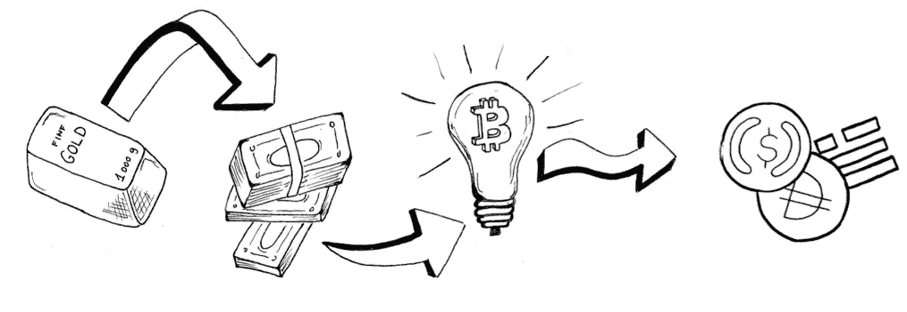
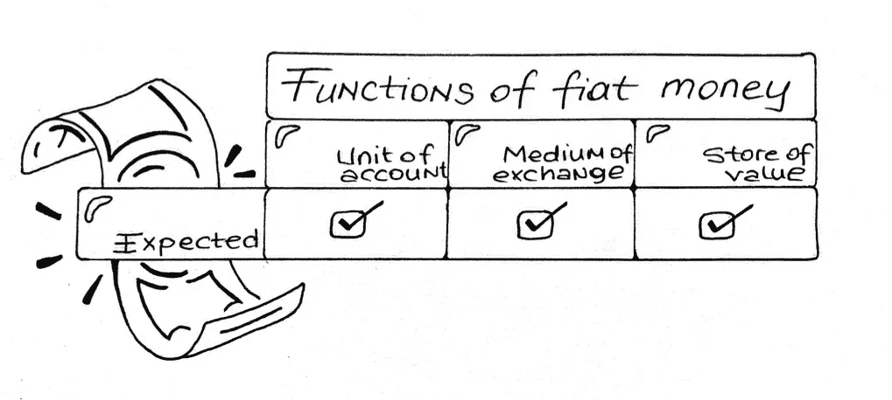
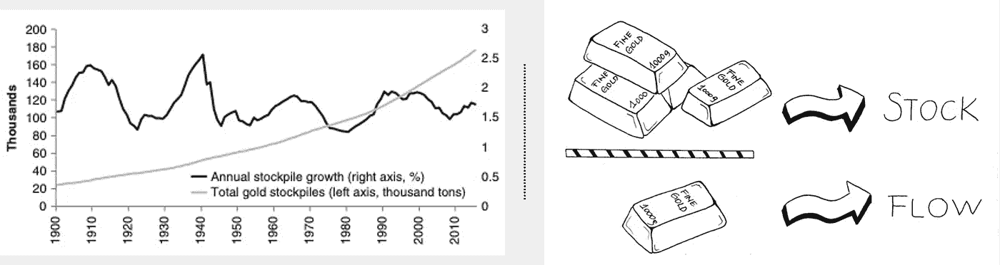
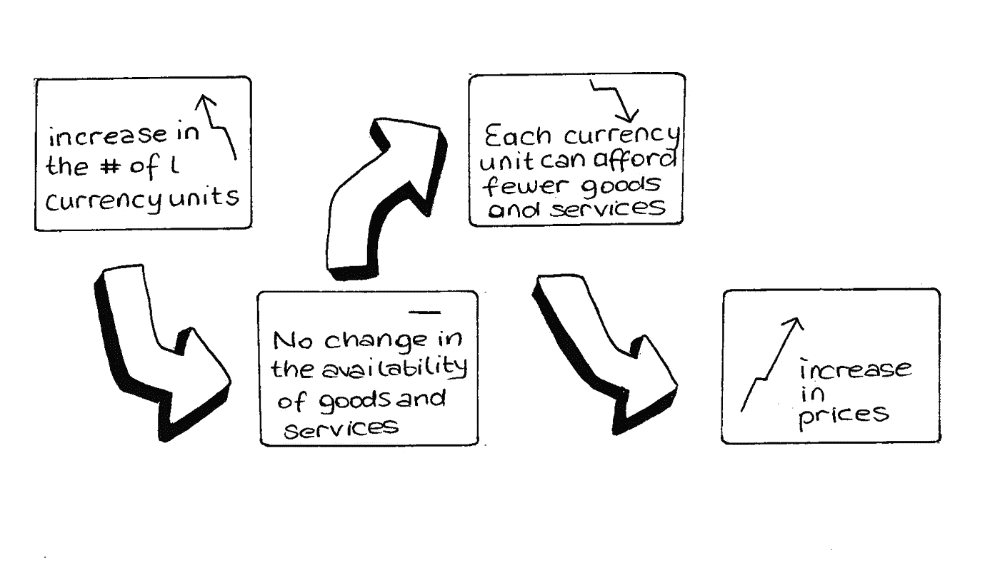
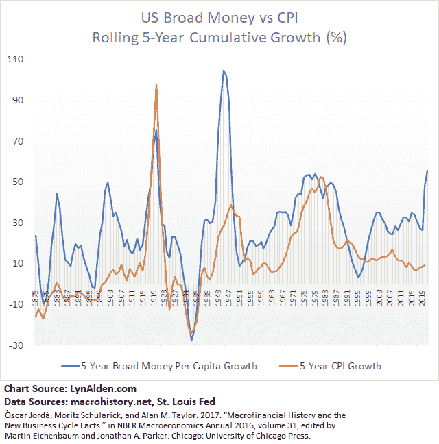
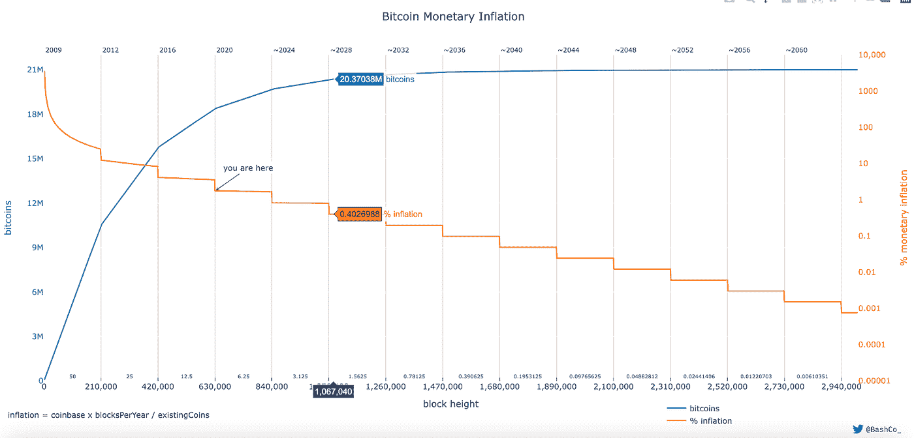
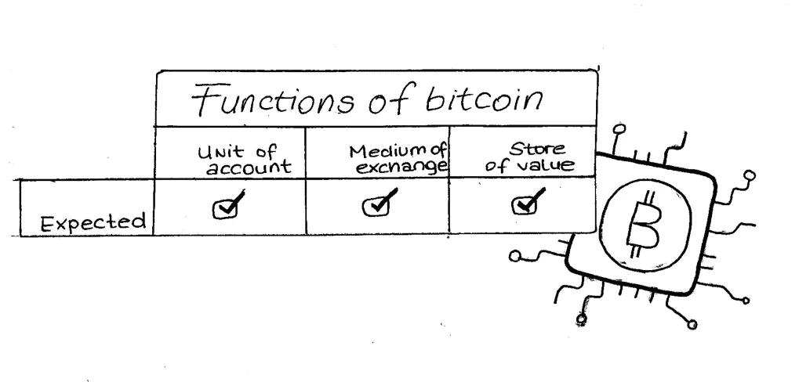
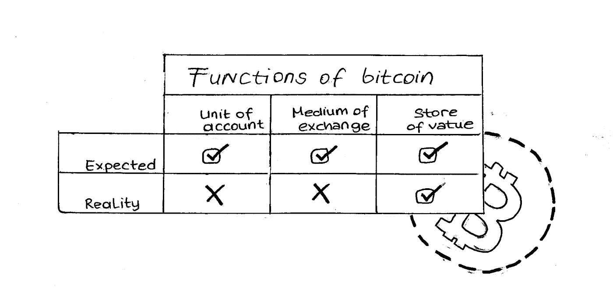
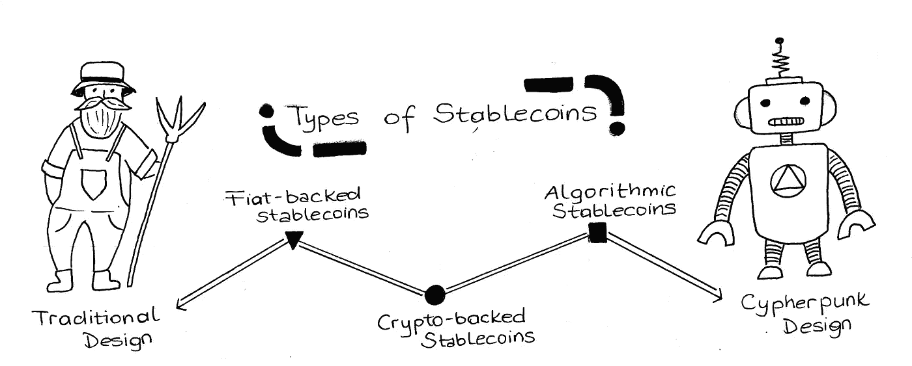
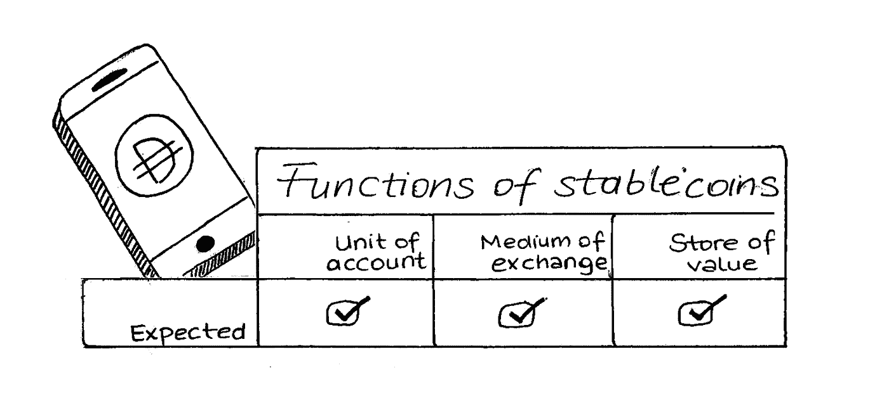

# Stablecoin 初级读本第 1 部分 Stablecoin 的路径

> 原文：<https://medium.com/coinmonks/stablecoin-primer-section-1-path-to-stablecoins-8bcdb39c73e1?source=collection_archive---------5----------------------->

# 法定货币的通胀，比特币的波动性缺陷，以及稳定货币的威力

本文是 Stablecoin 初级读本系列的一部分。如果你有兴趣阅读其他文章， [*看看这个帖子*](https://namsso.medium.com/stablecoin-primer-intro-54689d6fcdba) *。*

Path to stablecoins by [diedamla](https://www.instagram.com/diedamlas/)

## 法定货币的功能

让我们先来看看为什么我们需要货币，以及法定货币(例如，美元或土耳其里拉)如何缺乏我们希望从货币中获得的一些特征。当我问自己想用钱做什么时，比如说 1000 美元，我最初的回答是:“买我想要的东西。”尽管这听起来很有决定性，但它并没有给出全部情况。比如我为什么有时候会在床头柜的抽屉里放一些现金？所以为了真正理解我为什么需要钱，我发现自己更深入一层，观察我到底用钱做了什么。相应地重述问题:

我用钱做什么？

1.  **算一算**:为了成为社会和复杂经济体的一部分，我需要知道如何评估自己的生产性产出，以及我能从中获得什么回报。例如，没有钱，假设我是苹果生产商，我需要知道苹果的相对价格。但是，如果我想买的东西(例如，梨)对苹果没有价值，仅仅因为它们的生产商不想要苹果，那该怎么办？金钱是一个共同的标准，让我可以很容易地评估我的苹果相对于梨和许多其他商品和服务的价值。我们可以把它想象成一个国际单位，比如米，来衡量事物的价值，而不是长度或重量。因此，货币的这种功能通常被称为**记账单位**。
2.  **进行交易**:再次考虑这样一个场景，我是一个苹果生产商，正在寻找梨子，但这次我已经知道梨子生产商不想要我的产品。于是我去找一个想要我的苹果的番茄生产商，用我的苹果换番茄，我打算用番茄换梨。不幸的是，梨生产商又一次拒绝了我的提议，因为她不想要我的西红柿。然而，有了钱，我可以去番茄生产商那里，用我的苹果换钱，然后用那些钱买梨。这是一个更有效率的过程，因为货币充当了苹果、梨、西红柿和许多其他商品和服务的交易媒介。
3.  节约:有时我们的生产力超过了当前的需求，我们想把工作的“成果”保存起来，以备后用。例如，作为一名苹果生产商，我生产的苹果可能超过了我的需求。因此，与其让多余的苹果腐烂浪费掉，我需要把它们换成能在下周或下个月保值的东西。没有钱，我最终不得不经历繁琐的程序，敲开许多生产商的门，希望有耐用品的人会购买我多余的苹果。然而，有了钱，我就不必经历单调乏味的任务*去寻找专门寻找苹果的耐用品生产商。我可以把我的苹果卖给任何想要苹果的人，然后把卖苹果的钱存在我的保险箱里，作为一个**价值储存库**。*

这么初级，对！？我认为，因为钱是我们生活中根深蒂固的一部分，我们并不经常明确地思考我们使用它的各种方式。货币的这三个功能构成了一个很好的框架，让我们能够详细说明我们真正需要什么，以及用钱做什么。

那么，为什么我们可以用纸片作为货币，却不能用苹果或鹅卵石呢？尽管上述三种功能听起来很简单，但作为货币使用的材料必须同时具备多种特性。有很多文章都是以“硬通货的特征”为主题的，但是在这本入门书中，我会试着用一句话来总结它们。从本质上来说，一种材料要发挥货币的功能，它需要在全球范围内被广泛接受、可携带、耐用、稀缺，并能随着时间的推移保持其价值，还需要统一的颗粒，这样它才能被用作基本单位。幸运的是，法定货币具备所有这些特征。但是真的吗？

Expected functions of fiat money by [diedamla](https://www.instagram.com/diedamlas/)

## 非稀缺法定货币

在我上面总结的特征中，除了一个之外，几乎所有的都不能通过法定货币完全实现:**稀缺性**。稀缺实际上是一个非常简单的概念——世界上任何供应短缺的东西都是稀缺的，更难获得，因此在我们看来通常是有价值的。为了衡量货币的稀缺性，一个很好的衡量标准是[存量与流量比率](https://academy.glassnode.com/indicators/stock-to-flow/stock-to-flow-ratio#:~:text=The%20Stock%20to%20Flow%20(S,applied%20across%20many%20asset%20classes.)。这个比率是通过将已经存在(例如，在储备中)的资源(例如，货币)的量除以每年生产的该资源的量来计算的。基本上，股票按流量划分。如果一种材料有很高的库存流量比，这意味着大量的这种材料已经存在，如果需要的话，没有那么多可以生产。

Gold has a high-stock-to-flow ratio because a lot of gold already exists and its annual production remains relatively stable. Graph source: [The Bitcoin Standard](https://www.resistance.money/research/library/to%20be%20organised%20better/The%20Bitcoin%20Standard.pdf), Chapter 3; Stock-to-flow by [diedamla](https://www.instagram.com/diedamlas/)

在早期，法定货币是稀缺的，因为它与金本位挂钩，金本位要求货币完全由黄金支持。简单地说，这意味着有多少黄金就有多少钱。鉴于黄金是一种天然稀缺商品，在技术上不可能复制，而且大量黄金已经存在，法定货币受到黄金稀缺性或高库存流量比的限制。

然而，随着脱离金本位，法定货币的稀缺性不再受黄金供应的约束，而是由政府(中央政府和中央银行)的货币政策控制。这里的问题是，长期思考是罕见的，每个政治政府都希望在他们向公民口袋里放了多少钱方面被人记住。这使我们想到:

## 鼓励打印

第一次世界大战后，放弃金本位的种子被播下[。在这场战争之前，每个国家的战斗力受限于他们的战争金库里有多少黄金。然而在战争期间，人们认为持久的生存胜过了所有其他的生存选择。因此，政府可以轻而易举地印刷更多纸币，为战时需求和战后赤字提供资金，这变得太诱人了，而且比向公民征税容易得多。](https://www.investopedia.com/news/when-fdr-abandoned-gold-standard/)

因此，在接下来的一个世纪里，世界主要大国背离了金本位制的稳固性，转而利用通货膨胀主义来解决经济问题。当储备货币脱离金本位时，非储备货币除了跟风之外别无选择。这意味着，一届又一届的政府，法定货币的稀缺以及由此带来的稳定都处于危险之中。

## 通货膨胀=-稀缺

正如吉姆·比安科在[的无银行播客](https://open.spotify.com/episode/3ZrCi5dKQVsaxE6vutAkkX?si=f7d0198a81594750)中所说，“通货膨胀是一个我们并不真正完全理解的怪物”。他是对的。在解释通货膨胀的原因时，经济界有不同的学派。我会从消费价格通胀(CPI)的角度出发，因为我认为作为经济的消费者，这更容易理解。(为了更全面的视角，我强烈推荐[这首来自雷伊·达里奥](https://www.linkedin.com/pulse/money-credit-debt-ray-dalio/)的曲子。)

CPI 指的是经济中大多数商品和服务的价格上涨。这里的关键是货币的购买力下降了，而不是商品的价格上升了。想想看，从一年到下一年，同样数量的苹果从同样数量的树上长出来。如果通货膨胀导致经济中有更多的货币，货币对苹果的相对价值就会降低，因为更多的人有了钱，但苹果的可获得性保持不变。当我考虑 CPI 时，下图对我来说是个很好的提醒。

CPI diagram by [diedamla](https://www.instagram.com/diedamlas/)

这里需要注意的是，衡量 CPI 是一个棘手的问题，会导致这样的问题:应该跟踪哪一篮子商品和服务？这些商品有什么内在的性能提升来证明涨价的合理性吗？一篮子商品应该多久换一次？还有更多。值得庆幸的是，有很多资源可以解决这些问题，比如 Lyn Alden 的《通货膨胀终极指南》——这本入门书不会涉及这些领域。目前，我们关心的是什么原因导致法定货币的购买力下降。

## 那么是什么导致了消费价格的上涨呢？

If money supply grows (blue line), we would expect consumer prices to inflate (orange line). That’s why throughout the accounting history, the orange line and blue line have been closely linked — with a few exceptions. The period from 1995-now is one of these exceptions. During this period, tech advancements in the US made goods and services more accessible and cheaper, meaning the growth in money supply was successfully used in increased production. However, with the recent reports suggesting that [CPI](https://www.cnbc.com/2022/02/10/january-2022-cpi-inflation-rises-7point5percent-over-the-past-year-even-more-than-expected.html) is at an historically high level, we may finally be at a point where growth in money supply does not translate to growth in production but in consumer prices. [Source](https://www.lynalden.com/inflation/#cpi)

虽然有许多变量，如政治体制变化或气候变化可能会影响消费价格，但人均货币供应量增长是联系最紧密的变量之一。回到脱离金本位的话题，我们已经确立了主要法定货币是自由浮动的。这意味着它们不是由一些具有高库存流量比的材料支持的，而是由具有可塑性且容易出现人为错误的政策和决策支持的。这就是为什么在一战或最近的新冠肺炎疫情事件中，以快速见效为导向的政府可以完全自由地通过印刷更多的货币来“拯救”他们的经济(例如，[美联储的 2020 年货币和信贷创造计划](https://www.federalreserve.gov/newsevents/pressreleases/monetary20200323b.htm))。通过允许短期债务得到偿付，这确实挽救了局面。然而，从长期来看，货币供应的增长最终会导致人们以法定货币积累的财富耗尽。考虑到这一点，最好能指望你 5 年前放在床头柜上的 20 美元钞票会让你少买几个苹果，因为政府在那段时间印了很多钱。

这就引出了一个问题:法定货币真的能起到价值储存的作用吗？

Expected vs. Real functions of fiat money by [diedamla](https://www.instagram.com/diedamlas/)

## 输入比特币

通过互联网转移价值的历史表明，关于法定货币的疑问和问题长期以来一直是一个有待解决的谜。自 80 年代以来，使用不同的方法对法定货币进行了多次迭代。例如，Chaum 的 [Ecash](https://en.wikipedia.org/wiki/Ecash) 使用先进的加密技术优先考虑匿名性，Jackson 和 Downey 的 [E-Gold](https://en.wikipedia.org/wiki/E-gold) 通过集中存储和数字分割黄金优先考虑稳定性和便携性。类似地，比特币也是这些迭代中的一个，除了它之所以获得巨大成功，是因为它设计了一套微调的功能。

比特币最重要的特征之一是其**固定供应时间表**。可以说，这一特性推动了它的采用，从 cypherpunk 社区扩展到数百万人，成为一种点对点电子现金。让我们快速回顾一下比特币的“通缩”供应时间表:

[比特币的减少供应时间表](https://en.bitcoin.it/wiki/Controlled_supply):

*   比特币有 2100 万单位的有限供应量(相比之下，法定货币有无限供应量)
*   每当一名矿工(想想一名金矿矿工)在区块链发现一个新区块时，比特币的供应量就会增加
*   比特币供应率是固定的，并随着时间的推移而降低。区块发现率每两周调整一次，每个区块产生的比特币数量呈几何级数下降。这意味着每 210，000 块(约 4 年)，每块产生的比特币数量减少 50%(蓝线的增长率下降)
*   比特币的供应算法被固定在区块链上，并得到所有节点运营商的同意。改变比特币的供应时间表需要超过 50%的分散节点运营商同意——这在算法上是不利的，因为这就像是对矿工开枪

The more bitcoin is extracted, the harder it becomes to extract new bitcoins. That’s why the rate of increase of new bitcoins (blue line) and thus bitcoin’s monetary inflation decreases (orange line) over time. This decreasing supply schedule is cool because it tries to mimic the rate at which new gold is mined and ensures a high stock-to-flow ratio for bitcoin. [Source](http://bashco.github.io/Bitcoin_Monetary_Inflation/)

用简单的语言来说，这意味着比特币的稀缺性是确定的、一致的，并且不能由任何人(例如，一个国家的总统)或任何人(例如，一组中央银行)来改变。因此，从长远来看，随着比特币的使用人数从数百万人增加到数十亿人，你现在忘记放在加密钱包中的 0.00052 BTC(截至 3 月 22 日价值 20 美元)肯定会在五年内为你多买几个苹果。

Expected functions of bitcoin by [diedamla](https://www.instagram.com/diedamlas/)

# 比特币的波动性缺陷

> “在它(BTC)目前的状态下，它可能不方便交易，还不足以在你当地的美德信号咖啡连锁店购买无咖啡因的浓缩玛奇朵咖啡。现在作为一种货币，它可能太不稳定了。但它是第一种有机货币。”

纳西姆·塔勒布(Nassim Taleb)在 2018 年引用的比特币标准前言仍然适用。虽然有些人和国家正在测试在日常交易中使用比特币，但我个人在购买苹果时不会使用比特币。我 99%确定我不是局外人。像整个加密市场一样，比特币仍然是一种不稳定的货币，它甚至每年都会有几次[死亡和](https://99bitcoins.com/bitcoin-obituaries/)复活。很难预测比特币未来几天的走势，因为它的[每天波动约 3%](https://www.buybitcoinworldwide.com/volatility-index/)。另一方面，我们知道一个简单的事实，为了能够使用某种东西作为交换媒介，我们希望它在中短期内有一个稳定的价值。从这个意义上说，尽管像美元这样的主要法定货币在较长时间内会失去购买力，但它们作为交换媒介的功能很好。我可以放心，用 20 美元的钞票，我可以在本周和下周买到同样数量的苹果(如果苹果的可用性保持不变)。此外，比特币价格的波动性破坏了它作为记账单位的功能——想象一下，如果明天 1 米意味着不同的长度，那会是什么样子。

因此，经过 10 年的运营和超过 5000 亿美元的市值，比特币尚未实现其作为第一种有机点对点电子现金的全部潜力。我们只是还没有把我们有价值的比特币投资作为交易媒介或记账单位。

Expected vs. Real functions of bitcoin by [diedamla](https://www.instagram.com/diedamlas/)

然而，这并不意味着比特币没有革命性。除了固定供应之外，比特币的匿名性、去中心化治理和快速廉价的结算能力都使其成为一种高级货币形式。然而，就目前而言，比特币寻求对法定货币构成真正威胁的最后一步似乎是稳定。虽然这是否会实现仍然是一个万亿美元的问题，但我们知道的一件事是，随着[越来越多的采用](https://www.coindesk.com/markets/2021/10/28/why-bitcoins-volatility-is-a-feature-not-a-bug/)，比特币的波动性逐年降低。这或许使得**信任**和**时间**成为任何加密货币都需要求解稳定性方程的两个变量。考虑到解决这个稳定性之谜的紧迫性(以及可能到来的天文数字回报)，密码界最优秀的人才目前正在这方面进行创新。

# 通向稳定圈的路径

在上文中，当我咆哮比特币的波动性时，我提到了“*就像整个加密市场*”。波动性实际上并不完全适用于所有类型的加密货币，稳定的货币除外。

在定义什么是 stablecoins 之前，让我们考虑一下这个问题。如果我们想使用任何加密货币作为交易基础货币，我们希望它在足够长的时间范围内保值，并在中短期内保持稳定。例如，如果我收到比特币形式的工资，某一天我的工资提供给我 20 个苹果，第二天可能会提供给我 14 个苹果。由于这将非常令人困惑，我自然会寻找一种更稳定的替代货币，从而减少困惑。

这是将我们引向 stablecoins 的逻辑路径，stable coins 是**加密的本地非易失性资产，支持价值的全球转移**。

那么 stablecoins 是如何实现稳定的呢？**钉住** —他们通过利用各种机制将价值与一种货币(如 [BiLira's TRYB](https://www.bilira.co/en/home) 中的土耳其里拉)或某个价格(如基于一篮子商品)挂钩，以确保围绕这一挂钩的差异最小。迄今为止，已经有许多 stablecoin 实验来测试最佳的**钉住机制**。每个实验都是对前一个实验的功能更新，这些实验针对一组参数进行优化，同时针对其他参数进行权衡，因此实验继续进行。

你可能会问，“作为一个最终用户，为什么我必须关心稳定的货币挂钩机制，只要它能保证我的稳定性，并允许我方便地进行交易？”答案是，我们仍然处于这些加密实验的早期，鉴于这些实验往往需要用户的参与和承诺，以实现引导目的，我们需要围绕这些实验成功所需的真实情况提供信息。

最终，选择的钉住机制导致了不同类型的稳定货币的存在。由于没有任何挂钩机制被证明具有明确的产品-市场匹配，不同类型的稳定资本针对不同参数进行优化，包括**稳定性**、**分权**和**资本效率**。对这些参数进行微调后，出现了三大类稳定曲线:

**1)** Fiat-backed stablecoins, **2)** Crypto-backed stablecoins, and **3)** Algorithmic stablecoins. While fiat-backed stablecoins rely on a widely used reserve mechanism, algorithmic stablecoins depend on game theoretic coordination of their backers. Types of stablecoins by [diedamla](https://www.instagram.com/diedamlas/)

在我们深入讨论设计原则和 stablecoins 的类型之前，让我们暂停一下，快速总结一下到目前为止的进展。到目前为止，我们已经确定，法定货币的通胀和比特币的波动引领着稳定的比特币创新。对于任何稳定货币来说，要成功达到主流采用(即作为法定货币的替代品)，无论其机制如何，它们都需要通过发展**信任**来实现稳定，并存在足够长的**时间**。当我们为 stablecoin 的大规模采用提供理由时，在第 2 节中，让我们看看市场在哪里，以及是否有大规模采用的早期迹象。

Expected functions of stablecoins by [diedamla](https://www.instagram.com/diedamlas/)

*文章系列*:

**Stablecoin Primer —简介:** [划手和慢炖锅](https://namsso.medium.com/stablecoin-primer-intro-54689d6fcdba)

**stable coins Primer—第 1 节**:stable coins 的路径(你在这里)

**Stablecoin 底漆—第二节** : [Stablecoin 景观](/coinmonks/stablecoin-primer-section-2-stablecoin-landscape-132b27f7f2d3)

**稳定币引物—第三节** : [稳定币类型](https://namsso.medium.com/stablecoin-primer-section-3-stablecoin-types-c416ce5f455f)

**稳定潜水入门——第四节** : [稳定潜水浅潜](https://namsso.medium.com/stablecoin-primer-section-4-stablecoin-projects-28b509624165)

**Stablecoin 初级读本—第 5 节**:stable coin 的未来

**稳定币引物—奖励部分**:遗漏了什么

尽情享受吧！很乐意通过评论、 [Twitter](https://twitter.com/_namsso_) 或 [Linkedin](https://www.linkedin.com/in/osman-sarman/) 进一步聊天

特别感谢 [NEAR 团队](https://medium.com/u/1fbe737011b4?source=post_page-----8bcdb39c73e1--------------------------------)的资助使这项研究成为可能。