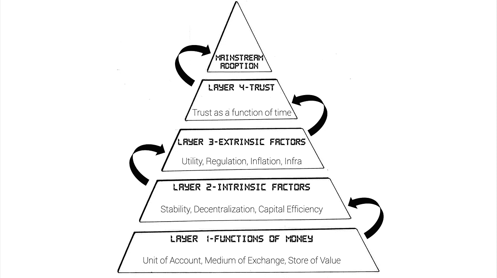

# Stablecoin 初级读本第 5 部分——stable coin 的未来

> 原文：<https://medium.com/coinmonks/stablecoin-primer-section-5-stablecoins-future-b9649a85a722?source=collection_archive---------14----------------------->

# stablecoins 要被主流采用需要具备哪些条件？

本文是 Stablecoin 初级读本系列的一部分。如果你有兴趣阅读其他文章， [*看看这个帖子*](https://namsso.medium.com/stablecoin-primer-intro-54689d6fcdba) *。*

> “stablecoin 是三万亿美元的加密叙述之一” [Sam Kazemian](https://open.spotify.com/episode/4tmZGHhwLtQlHBLlweKMkq?si=4613c91700c644d6) ，算法 stable coin 发行商 [Frax Finance](https://frax.finance/) 的创始人

在这一点上，上述内容应该不会让您感到惊讶。在第 2 节中，我们讨论了稳定币行业的潜在市场总额可能高达 57 万亿美元——这是因为稳定币不仅是不受加密波动影响的避风港，也是比美元更容易获得和先进的全球储备货币候选。

所以现在的问题是——要让 stablecoins 发挥出被数十亿人采用的全部潜力，需要什么条件？因为我不是在水晶凝视业务，我没有一个简单的答案。然而，我有一个简化的方法，我称之为:采纳链。

The chain of adoption

## 收养链

可以把这想象成一个流程图，每一层代表一组需求，只有当一层中的所有需求都得到满足，采用循环才能继续到下一层。这是高层次的，让我们谈谈细节。

**第 1 层——货币的功能**:在[第 1 节](/coinmonks/stablecoin-primer-section-1-path-to-stablecoins-8bcdb39c73e1)中，我们讨论了货币如何像一种技术一样具有三个主要功能:*记账单位*、*交易媒介*和*价值储存*。在此基础上，在[第 2 节](/coinmonks/stablecoin-primer-section-2-stablecoin-landscape-132b27f7f2d3)中，通过现实生活中的产品市场适用性示例和使用案例，我们确定了 stablecoins 如何在现实生活中成功拥有这些功能。支票

**第二层——内在因素**:在[第三节](/coinmonks/stablecoin-primer-section-3-stablecoin-types-c416ce5f455f)和[第四节](/coinmonks/stablecoin-primer-section-4-stablecoin-projects-28b509624165)中，我们讨论了稳定的内在因素，我们称之为*设计原则*。通过讨论像泰瑟公司的、马克公司的戴和泰拉公司的这样的稳定圈背后的机制是如何工作的，我们回答了这个简单而又受欢迎的问题——“那么这些稳定圈实际上是如何工作的？”虽然稳定核机制仍然受到质疑，特别是在 Terra 最近崩溃之后，可以有把握地说，某些机制类型，如分数算法稳定核，被证明比其他机制运行得更好。随着不同机制设计实验的继续，我们也越来越接近满足这一层的所有需求。

**第 3 层——外在因素**:现在这是我们在采用链中接近的位置。是的，任何稳定硬币的最终目标都是稳定，是的，大多数稳定硬币背后都有复杂的机制来完成这个复杂的任务。但是，机制设计只是故事的一部分，稳定的内容还依赖于某些外部因素来达到主流采用。虽然这不是一个详尽的列表，但外部因素可以归结为以下几个方面:

*   **效用**:正如 Terra stablecoin (rip)的创始人 Do Kwon [在推特上说的](https://twitter.com/stablekwon/status/1405742215960219659)，伟大的 stablecoin 机制需要周围更强大的经济体来支持。在法定经济中，我们把钱用于很多目的(例如，交易、储蓄、捐赠、投资、消费)。Stablecoins 也需要这种类型的工具。用户需要简单的上/下坡道解决方案来将他们的菲亚特移入 stablecoins，并能够在菲亚特经济和区块链经济中使用他们的 stablecoins。说到底，s *tablecoin 是一种金钱交易，如果不能使用，金钱又有什么用呢？*
*   **规定**:蜻蜓首都[的哈齐布·库雷希说](/dragonfly-research/fighting-to-be-stable-the-evolution-of-stablecoins-aca81fb432f9)“在分散的稳定选举有机会获胜之前，必须用尽所有其他途径。”按照他的思路，目前，大多数稳定币的使用都是基于菲亚特支持的稳定币(如 USDC)。虽然这要归功于其简单的机制设计、强大的稳定性和早期的市场进入，但菲亚特支持的 stablecoins 是完全许可的，并且不可扩展。这意味着，如果监管者想要审查稳定硬币的使用(例如，认为它对其他法定货币构成威胁)，他们可以很容易地这样做。此外，它们的规模取决于它们可以获得多少法定抵押品。然而，分散的 stablecoins 为他们的用户提供了更多的灵活性，因为它们完全基于区块链，无需许可，并且不需要托管。这意味着，增加对菲亚特支持的稳定资本的监管实际上可能会导致分散稳定资本的采用增加，因为人们会回避监管。
*   **美元的通货膨胀**:即使在撰写本书的整个过程中，美国的通货膨胀仍在持续加剧。在 8.5% 的水平上，通货膨胀侵蚀了人们的法定货币储蓄，使得美元成为可疑的价值储存手段。但是作为世界储备货币，美元不是应该超级稳定吗？也许不是。像 Volt 和 Frax 的 FPI 这样的稳定币项目旨在通过将其稳定币的价值与消费者价格指数(即经济中商品和服务的实际价格)挂钩而不是与美元挂钩来解决这个问题。)关键是，稳定的硬币有灵活的设计，它们总是遵循更稳定的选择。美元的持续高通胀可能会导致这种稳定货币的采用，加速稳定货币的主流采用。
*   **基础设施**:虽然像 Avalanche 和 Terra 这样的区块链吹嘘他们的 TPS 限制(即分别为 50，000 和 10，000)，但这些限制还没有经过大规模的战斗测试。如果 stablecoins 将被数十亿人使用，我们需要一个强大的基础设施。

**第 4 层——信任与时间的关系** : *信任需要数年才能建立，几秒钟就能打破*。这也适用于对金钱的信任。当美元通过 1792 年[硬币法案](https://www.coindesk.com/tech/2021/07/06/the-quest-for-a-truly-decentralized-stablecoin/)首次确立时，并不是每个人都立即接受了 1 美元应该等于 416 格令标准银的规则。美元在经济中根深蒂固并登上世界舞台需要多年的共识建设。现在，美元实际上没有任何硬资产支持，但人们仍然对它有信心，因为它在足够长的时间里对他们来说一直运转良好。

由于难以建立信任，许多形式的私人资金来来去去。同样，许多算法稳定的货币已经失去了与 1 美元挂钩的地位(例如，UST、 [ESD](https://cointelegraph.com/news/algorithmic-stablecoins-aren-t-really-stable-but-can-the-concept-redeem-itself) 、 [USDN](https://www.yahoo.com/video/russia-ethereum-loses-stablecoin-peg-081857369.html) )。一些人主张，一种不可信的赚钱方式是通过超额抵押(想想第 3 节中提到的加密支持的 stable)。逻辑是，使用这种方法，用户不需要信任任何中央发行人，因为他们知道他们的稳定债券背后有真实的抵押品支持。但话说回来，过度抵押也有不足之处，因为它无法满足数十亿用户的需求。这使得算法稳定币可能更适合成为主流采用的稳定币类型。虽然这是一个极其困难的壮举，但长期生存似乎是 stablecoins 收养链的最后一层。

## **关闭思路**

如你所知，我还没有明确提到与稳定资本相关的具体风险。每种类型都有自己的风险，评估稳定币的抗脆弱性和长期稳定性的一个好方法是通过稳定币在采用链上的进展情况。

这是一次激动人心的旅程，我希望这本入门书能激起你对 stablecoins 的一点点兴趣。我们生活在一个货币不断变化的时代。每一次 stablecoin 实验，无论是失败还是坚持，都可以被视为在寻找更好的钱的道路上前进了一步。stablecoin 创新是基础，使其成为少数几项可能触及世界上每个人生活的技术进步之一。

如果你也有同样的兴奋，让我们通过 [twitter](https://twitter.com/_namsso_) 联系一下。

奥斯曼

# STABLECOIN 底漆系列

**Stablecoin Primer —简介:** [划手和慢炖锅](https://namsso.medium.com/stablecoin-primer-intro-54689d6fcdba)

**Stablecoin 引物—第 1 节**:[stable coin 的路径](/coinmonks/stablecoin-primer-section-1-path-to-stablecoins-8bcdb39c73e1)

**Stablecoin 底漆—第 2 节** : [Stablecoin 景观](/coinmonks/stablecoin-primer-section-2-stablecoin-landscape-132b27f7f2d3)

**Stablecoin 引物—第 3 节** : [Stablecoin 类型](/coinmonks/stablecoin-primer-section-3-stablecoin-types-c416ce5f455f)

**Stablecoin Primer —第 4 节** : [Stablecoin 项目](/coinmonks/stablecoin-primer-section-4-stablecoin-projects-28b509624165)

Stablecoin 初级读本—第五部 : Stablecoins 的未来(你在这里)

**稳定币入门——奖励部分**:遗漏了什么

尽情享受吧！乐意通过评论、 [Twitter](https://twitter.com/_namsso_) 或 [Linkedin](https://www.linkedin.com/in/osman-sarman/) 进一步聊天

特别感谢 NEAR 团队为这项研究提供的资助。