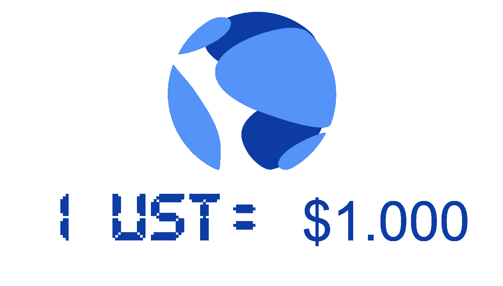
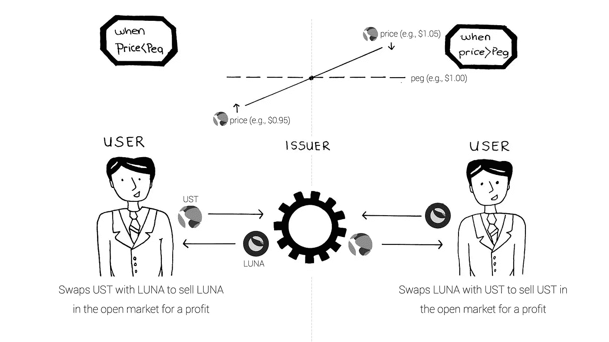
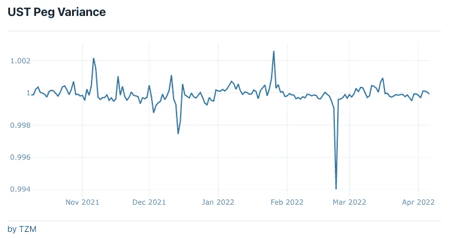
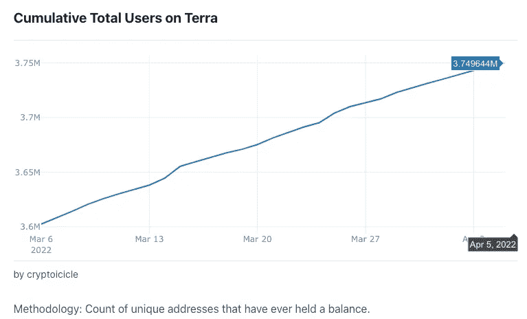
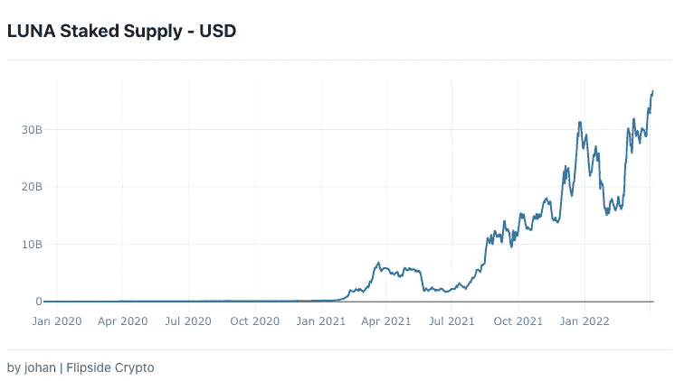
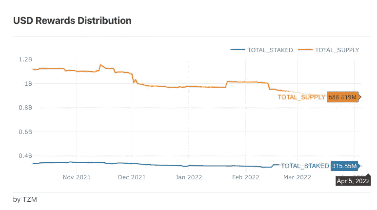

# Stablecoin 底漆—特拉 UST 浅潜

> 原文：<https://medium.com/coinmonks/stablecoin-primer-terra-ust-shallow-dive-e9b874e8814f?source=collection_archive---------12----------------------->

*本文是 Stablecoin 入门系列文章* [***第 4 节***](https://namsso.medium.com/stablecoin-primer-section-4-stablecoin-projects-28b509624165) *的一部分。如果你有兴趣阅读其他文章，* [*看看这篇文章*](https://namsso.medium.com/stablecoin-primer-intro-54689d6fcdba) *。*

**浅潜格式如下**:协议- >令牌- >设计原则- >关键指标- >为什么使用或造币 UST？

## 草案

UST 是由 Terra 协议创建和管理的算法稳定币。Terra Protocol 是一个去中心化、开源的区块链生态系统，其目标是让大众能够获得和使用无许可的货币。Terra Protocol 认为，分散的稳定币可以为法定货币、不稳定的加密货币和集中的稳定币提供更好的替代品，并提出稳定币大规模采用的答案在于尽可能让它们有用。通过严格关注用例，Terra Protocol 提供了一个丰富的分散应用场所，用户可以在这里消费、投资和保存他们的 Terra stablecoins。因为如果你不能花在任何地方，钱有什么用？考虑到这一点，我们可以把 Terra Protocol 想象成一个自给自足的经济体(例如美国经济),用户可以用他们的钱做很多事情。

Terra Protocol 利用的另一个补充策略是提供各种与不同法定货币挂钩的稳定货币(例如，TerraUSD 兑换美元，TerraKRW 兑换韩元)，以尽可能方便地获取无许可货币。通过让用户能够在不同的 Terra 稳定货币面值之间无缝转换，Terra 允许其用户以当地货币进行交易，并以更强的货币进行储蓄。例如，收到 TerraKRW 付款的韩国商家可以立即以微不足道的成本将这笔付款转换为 TerraUSD，以更稳定的货币保存他们的财富。

在治理方面，Terra 协议是由一个分散的贡献者团体来治理的，他们持有协议的标记 Luna。与创客的 MKR 令牌类似，Luna 持有者对生态系统和货币政策相关的提案进行投票，并参与 Terra 区块链的共识制定。

## 代币

Terra 协议的核心有两个标志。算法稳定币**泰拉**和多用途赌注令牌**露娜**。让我们双击两者。

**Terra 指的是与不同法定货币挂钩的一批算法稳定的货币，其中 TerraUSD (UST)是目前最受欢迎的(Terra 和 UST 在本节的其余部分将互换使用。)把 Terra 想成是 Terra 协议的消费级终端产品。因为 Terra 既没有任何法定货币支持，也没有任何法定支持的稳定货币支持，所以它完全不受审查。尽管这是一件好事，但没有稳定的后盾会让价格稳定成为一大挑战。Terra 协议利用两种机制来实现稳定性:**分散 oracle 投票**和**公开市场套利激励**，这将在下面的*稳定性*部分中讨论。**

**[**LUNA**](https://coinmarketcap.com/currencies/terra-luna/) 是 Terra 协议的多用途令牌，可以让 Terra stablecoins 顺利运行。概括地说，Luna 有三个相互关联的功能:**

*   ***吸收 Terra 的波动性*:当 UST 超过钉住汇率(即 1 美元)时，Luna 从用户手中被买走并被烧掉，从而推高了它的价格。随着 UST 跌破钉住汇率，Luna 被铸造并出售给用户，[推动其价格下跌](https://twitter.com/WestieCapital/status/1496223636339970051?s=20&t=EYj9aQssT-fvtSTDL7Vs-A)。通过这种方式，UST 的供应和价格得到了控制。**
*   ***利益攸关* : Terra 是一个利益攸关区块链，意味着参与者需要证明他们有利益攸关的资产(例如 Luna)来参与区块链的运营。更具体地说，区块链交易由一组被称为验证者的不可信参与者来确认。验证者把露娜押在区块链身上，让她参与共识过程，并因为他们的参与而获得奖励。共识过程基本上是确认在区块链土地上的交易是有效的，可以最终确定。普通用户可以把他们的 Luna 押在验证器上，从验证器收到的奖励中分一杯羹。**
*   **治理:治理是一个民主的过程，允许用户和验证者通过标注他们的 Luna 来修改 Terra 协议。**

**如果你要记住关于 Terra Protocol 的令牌的一件事，它应该是:*(在交易中)使用 UST 越多，Luna 获得的价值就越大*。每当 Terra 经济扩张时，Luna 就会被烧毁，从而推动 Luna 的价格上涨。与此同时，随着交易数量的增加，验证者和删除者会获得更多的回报。**

****

## **设计原则——稳定性**

**UST 稳定加入的稳定性是通过 Terra 协议特有的各种机制实现的。让我们回顾一下这些机制:**

****分散式 oracle 投票** : Terra Protocol 的主要目标是将 UST 的价值保持在 1 美元(TerraKRW 在 1₩,…).的价值问题是，Terra 是一个封闭的区块链，无法访问外部数据(例如，真实世界的数据，如美元价格或纽约的温度)。)如果该系统依靠像彭博这样的集中数据提供者来获得价格数据，那么它就不会完全分散，因为彭博数据馈送的失败会影响整个 Terra 用户。危险太大了。作为一种解决方案，Terra Protocol 依赖于一种分散的 oracle 投票机制，即一组不可信的参与者对价格数据进行投票，更具体地说，是对 Luna 和不同 Terra 挂钩之间的正确汇率进行投票。类似于共识过程，参与者锁定大量资产参与投票，并因正确投票中位价格而获得奖励。基本上，这个过程允许 Terra Protocol 以分散的方式将外部(外部)价格数据带入区块链，并且 Terra 算法使用这些数据来设定目标价格。**

****公开市场套利激励**:一旦系统有了目标价格，算法会将系统中 UST 的价格与该目标进行比较，并据此调整货币政策。需求和供给的基础也适用于 UST 稳定货币。当 UST 有大量需求但供应有限时，UST 变得比 1 美元更有价值(例如，1.05 美元)。为了重新挂钩，该协议创建了更多的 UST 单位，并承诺任何存入 1 美元 Luna 的用户将获得 1 美元 UST(此时价值 1.05 美元。)这样做的用户可以在公开市场上以 1.05 美元的价格卖出 1 UST，获利 0.05 美元。另一方面，如果对 UST 的需求与其供应量相比太低，UST 的价值就会低于 1 美元(例如 0.95 美元)。)为了重新挂钩，该算法创建了更多的 Luna，并向任何用户承诺价值 1 美元的 Luna 存款 1 UST。这样做的用户可以通过在公开市场上出售价值 1 美元的 Luna 获利 0.05 美元。因此，套利动机在于这样一个事实，即 Terra Protocol 的市场模块总是承诺如下:*无论 Terra 和 Luna 在二级市场的价格如何，如果用户向该协议存入 1 UST，他们将总是收到价值 1 美元的 Luna，反之亦然。***

****稳定的赌注回报**:Terra Protocol 在其[原始白皮书](https://assets.website-files.com/611153e7af981472d8da199c/618b02d13e938ae1f8ad1e45_Terra_White_paper.pdf)中指出:“*当该协议持续地奖励保护它的人时，该协议就是最好的选择*。那么，谁来保护 Terra 呢？一群超级用户被称为验证者。**

**通过加入共识机制，验证者向 Terra 区块链添加包含交易的新区块。这一点很重要，因为只有通过增加新的区块，用户使用 UST 进行的交易才能在区块链上实际确认和完成。基本上，没有验证器，没有 UST。通过参与共识机制，这些验证器产生诸如设备和时间相关成本的费用。**

**此外，验证者和授权者(即，将他们的 Luna 令牌与验证者挂钩的用户)会导致 Terra 经济萎缩的成本，因为当对 UST 的需求下降时，该协议会创造更多的 Luna 来吸收 UST 的波动性(拉低 Luna 的价格)。)因此，验证者需要得到适当的激励，以保护土地经济，无论是在扩张阶段还是收缩阶段。**

**这使我们需要稳定的赌注回报。验证者通过向区块链添加区块而获得的回报是基于每个区块中包含的交易费用。交易费用是可变的。在收缩期，交易费用通常会增加(交易较少，但费用较高)，在扩张期，交易费用通常会减少(交易较多，费用较低)。Terra economy 的目标是在好的和坏的时候都奖励验证者，它保留了它的保护者，并且能够经受住 UST 的波动。**

****Luna Burn** :类似于稳定赌注奖励的目标，Luna Burn 机制确保相信并保护 Terra 生态系统的用户和验证者得到奖励。如上所述，当 Terra 经济收缩时，协议创造了 Luna 从市场上购买 UST，增加了 Luna 的供应量。短期内，这会对 Luna 持有人(即验证人、授权人和用户)产生负面影响，因为这会降低 Luna 的价格，侵蚀他们的财富。为了抵消月神创造在收缩阶段的影响，在扩张阶段，协议购买并焚烧月神，减少月神的供应量，提高其价格。**

****月神基金会卫队(LFG)**:2022 年 1 月，Terra 协议宣布成立月神基金会卫队。LFG 是 Terra 协议的卓越中心，有两个使命:1-保护 Terra 稳定的社区，2-促进 Terra 经济以维持 Terra 的主流采用。具体到第一项任务，LFG 通过出售 Luna 为[筹集了 10 亿美元的比特币](https://www.theblockcrypto.com/post/134871/luna-founation-guard-token-sale)。LFG 的比特币储备将在货币政策中发挥杠杆作用，当 UST 低于盯住汇率时，这一储备将用于从市场上购买 UST(而不是完全依赖 Luna creation 来这样做)。虽然批评者认为比特币储备的使用使 Terra 类似于加密支持的 stablecoins，但比特币储备的预期目的将只是保护下行周期，以保持 Terra 的稳定性。Terra 的 Do Kwon [最近声明](https://www.bloomberg.com/news/videos/2022-04-04/why-terra-wants-to-be-the-biggest-bitcoin-whale-video)每次 Terra 协议增加我铸造更多的 UST，铸造利润的一定百分比将用于购买更多的比特币，增加 LFG 的储备。**

## **设计原则——分散化**

**在回顾 Terra Protocol 的去中心化时，我们希望了解系统中是否存在单点故障，以及其货币政策对用户的透明度如何。**

*   **分散治理:类似于 MakerDAO，Terra 协议由一个分散的团体成员管理，这些团体成员持有 Luna 令牌。社区成员提交、投票并实施[提案](https://agora.terra.money/c/governance/13)以改进 Terra 协议。这确保了 Terra stablecoins 不是由一个中央机构管理。**
*   ****不变的货币政策**:系统愿意尊重目标汇率，而不管市场条件如何，这使得 Terra 的市场汇率保持在一个狭窄的区间。这种汇率以区块链编码，不能针对某一方进行调整或定制，以确保世界各地的用户能够信任和使用 Terra stablecoins。**
*   ****无许可货币** : Terra 没有法定货币或集中稳定的货币支持，因此没有可以被监管机构审查的集中抵押品。**

## **设计原则——资本效率**

**与过度抵押的加密支持的 stablecoins 不同，Terra 协议不要求用户提供任何抵押品来赎回 UST。不依赖任何其他加密货币使该系统能够随着用户需求的增长而扩展。**

## **关键指标**

**这些度量可以被视为 Terra 协议和 UST 稳定圈的高级生命体征。 [Flipsidecrypto](https://terra.flipsidecrypto.com/terra) 有一个关于 Terra 相关指标的专用网站，在 KPI 报告方面做得很好——在这里，我精心挑选了最符合我们讨论的指标/图表:**

*   ****UST 钉住率差异**:显示了 TerraUSD 如何很好地将价格保持在钉住率附近。我们已经确定，作为一种算法稳定的硬币，UST 的价格比其他中央稳定的硬币更不稳定，因此在图中呈之字形。然而，这里有两件事需要注意。首先，如果你看下图的 y 轴，价格在小面额中变化。第二，一个更精细、更可行的分析是查看 Terra 高于或低于 peg 的时间百分比。我会留着以后用的**

****

*   ****Terra 上的累计总用户数**:显示 Terra 经济随着时间的推移增长了多少。请记住，网络效应在任何货币的采用中都起着关键作用。因此，使用 Terra 的人越多，每个新参与者从加入 Terra 网络中获得的价值就越大。**

****

**Source: [Flipsidecrypto](https://terra.flipsidecrypto.com/terra/overview/index)**

*   **月神的补给:显示了对 Terra 协议的信心。请记住，赌注实质上是锁定你的资产，在 Terra 区块链的一致实相过程中做出贡献，并获得回报。押记的风险在于押记的资产会被锁定一段时间。这意味着，如果卢娜经历价格大幅下跌，赌注者将承担失去他们在卢娜赌注上的财富的风险。沿着这些思路，更多的赌注卢娜表明，人们认为卢娜赌注是一个风险较小的过程，因为他们相信卢娜的价格一定会表现良好。**

****

**Source: [Flipsidecrypto](https://terra.flipsidecrypto.com/terra/overview/index)**

*   ****美元奖励分配**:显示 Terra 协议被保护的有多好。记住，作为对验证者工作的回报，奖励会分发给验证者和删除者(即，把 Luna 押在验证者身上的用户)。为了让 Terra 经济开始运行，验证者需要将交易添加到 Terra 区块链中。然而，如果没有适当的激励，验证者根本不会这么做。从下面的蓝线可以看出，Terra 协议确实以稳定的方式奖励验证者，确保验证者获得所需的奖励，并且 Terra 协议在任何时候都是可操作的。**

****

**Source: [Flipsidecrypto](https://terra.flipsidecrypto.com/terra/overview/index)**

## **为什么用 OR MINT？**

**所有这些都很棒，但是你为什么要用一个看似危险的算法稳定币来复杂化你的生活呢？**

**在这里，我不会讨论为什么要持有 UST 的稳定器月神令牌。虽然这两个令牌应该考虑在一起，因为他们互惠互利的关系，我们的重点是稳定，所以 UST。让我们来谈谈你使用或制造 UST 的动机:**

****使用**(更适用于消费者)**

*   **如果你担心菲亚特支持的马房可以被监管，而由菲亚特支持的马房抵押的加密马房基本上容易受到同样的风险，那么 Terra stablecoins 是现实世界和虚拟世界的一个很好的替代货币。**
*   ****不同货币的即时互换** : Terra stablecoins 可以以最低的费用即时相互转换。因此，希望投资于多种货币的用户可以在不同的固定追踪账户中交易和保存他们的财富。**
*   ****交易、储蓄和投资** : Terra 生态系统优先考虑让其稳定的账户对所有用户有用。这意味着，生态系统投资并为其用户提供许多应用程序，以利用他们的 Terra stablecoins。最受欢迎的应用程序是 Chai、Anhor 和 Mirror，使用户能够进行低成本交易、高收益储蓄和投资真实生活金融资产的合成版本。**

****Mint** (更适用于 DeFi 参与者)**

*   ****套利**:如果 UST 的价格高于 1.00 美元(例如 1.05 美元)，用户可以铸造 UST 作为向 Terra 协议存入价值 1.00 美元的 Luna 的回报。然后，用户可以在公开市场上以 1.05 美元的价格出售新铸造的 UST，获利 0.05 美元。**
*   ****比购买更容易造币**:如果用户想购买数百万 UST 放入流动性池，通过 Terra Protocol 造币可能比在加密交易所等二级市场购买更容易、更便宜，因为后者的 Terra stablecoins 供应可能有限。**

## **STABLECOIN 底漆系列**

****Stablecoin Primer —简介:** [划手和慢炖锅](https://namsso.medium.com/stablecoin-primer-intro-54689d6fcdba)**

****Stablecoin 引物—第 1 节**:[stable coin 的路径](/coinmonks/stablecoin-primer-section-1-path-to-stablecoins-8bcdb39c73e1)**

****稳定土底漆—第二节** : [稳定土景观](/coinmonks/stablecoin-primer-section-2-stablecoin-landscape-132b27f7f2d3)**

****稳定蛋白引物—第三节** : [稳定蛋白类型](/coinmonks/stablecoin-primer-section-3-stablecoin-types-c416ce5f455f)**

****稳潜入门—第四节** : [稳潜浅潜](https://namsso.medium.com/stablecoin-primer-section-4-stablecoin-projects-28b509624165) —、戴、(你在这里)等**

****Stablecoin 初级读本—第 5 节**:stable coin 的未来**

****稳定币引物-奖励部分**:遗漏任何东西**

**享受吧！很高兴通过评论、[推特](https://twitter.com/_namsso_)或[领英](https://www.linkedin.com/in/osman-sarman/)进一步聊天**

**特别感谢 [NEAR 团队](https://nearprotocol.medium.com/)拨款使本研究成为可能。**

> **加入 Coinmonks [电报频道](https://t.me/coincodecap)和 [Youtube 频道](https://www.youtube.com/c/coinmonks/videos)了解密码交易和投资**

# **此外，请阅读**

*   **[什么是融资融券](https://coincodecap.com/margin-trading) | [美元成本平均](https://coincodecap.com/dca)**
*   **[坚持卡审核](https://coincodecap.com/uphold-card-review) | [信任钱包 vs 元掩码](https://coincodecap.com/trust-wallet-vs-metamask)**
*   **[Exness Review](https://coincodecap.com/exness-review)|[moon xbt Vs Bitget Vs bing bon](https://coincodecap.com/bingbon-vs-bitget-vs-moonxbt)**
*   **[如何通过密码借贷开始获取被动收入](https://coincodecap.com/passive-income-crypto-lending)**
*   **[big one Exchange Review](/coinmonks/bigone-exchange-review-64705d85a1d4)|[网格交易机器人](https://coincodecap.com/grid-trading)**