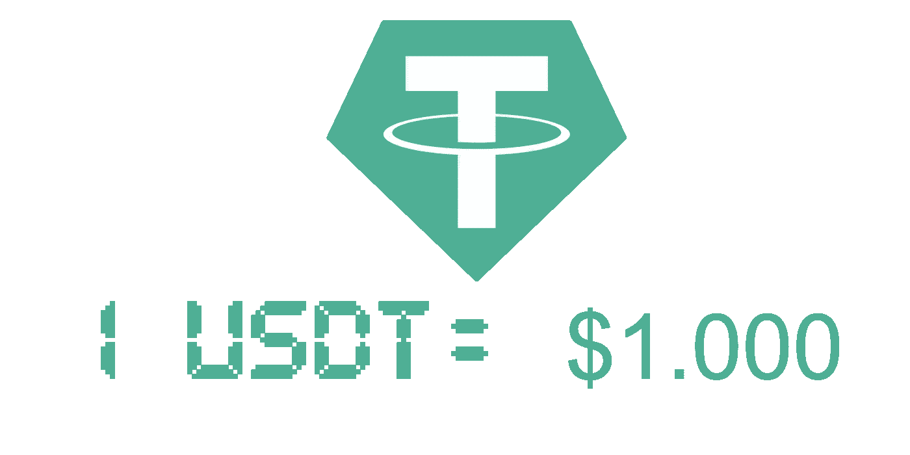
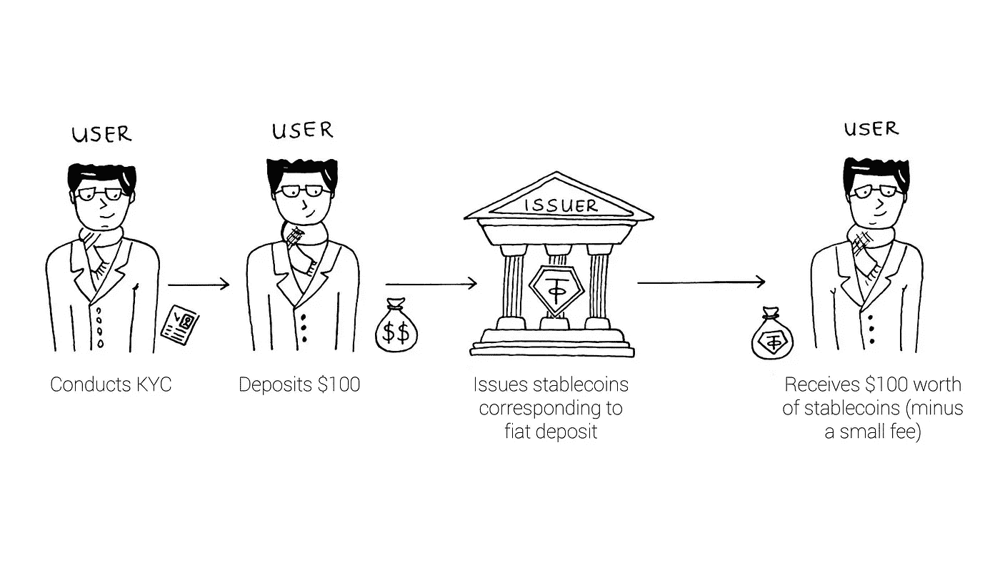
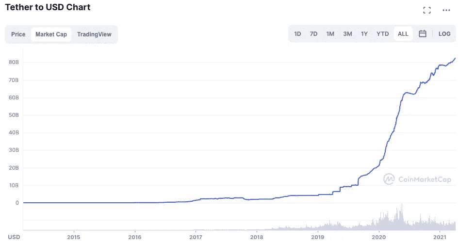
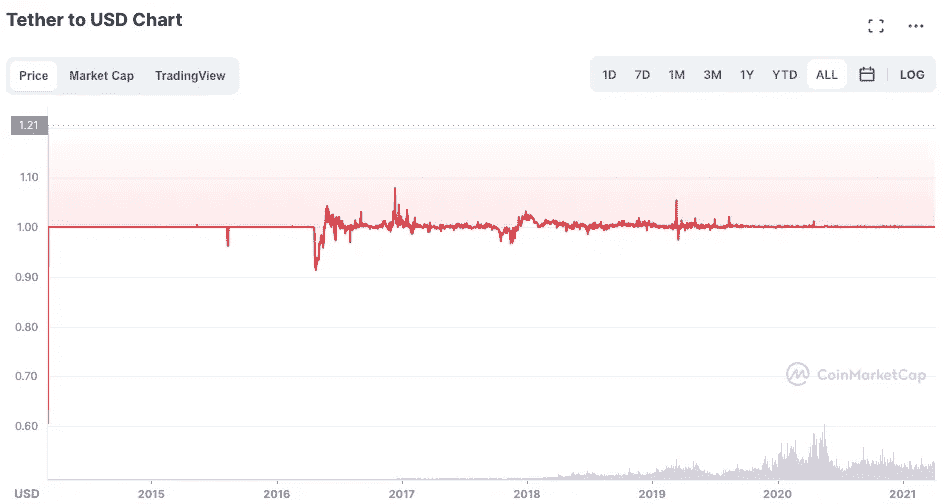
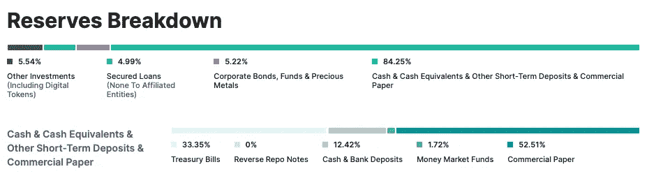

# stable coin Primer——系绳 USDT 浅潜

> 原文：<https://medium.com/coinmonks/stablecoin-primer-tether-usdt-shallow-dive-c59861953a4f?source=collection_archive---------21----------------------->

*本文是 Stablecoin 入门系列文章* [***第 4 节***](https://namsso.medium.com/stablecoin-primer-section-4-stablecoin-projects-28b509624165) *的一部分。如果你有兴趣阅读该系列的其他文章，* [*可以看看这篇文章*](https://namsso.medium.com/stablecoin-primer-intro-54689d6fcdba) *。*

**浅潜格式如下**:协议- >令牌- >设计原则- >关键指标- >为什么使用或造币 USDT？

## 草案

USDT 稳定币由开曼群岛以外的 Tether Holding Limited 发行和管理。)成立于 2014 年的 USDT 是第一个被大规模采用的 stablecoin。正如其白皮书[所述，Tether 创造价格稳定的加密货币的想法有两个方面:](https://assets.ctfassets.net/vyse88cgwfbl/5UWgHMvz071t2Cq5yTw5vi/c9798ea8db99311bf90ebe0810938b01/TetherWhitePaper.pdf)

1-区块链是法定货币更好的交易和结算层，因为它的加密证明能力减少了对所有中介的需求，这些中介使法定系统变得缓慢和昂贵。

2-像比特币这样的现有加密货币仍然太不稳定，技术上太复杂，无法在主流交易中使用。

因此，为了保留两个世界的精华，泰瑟干脆创造了区块链版的美元。每个 USDT 基本上都有等量的美元储备支持。换句话说，用户必须向 Tether 投入 1 美元来创建 1 个 USDT。虽然 Tether 是否真的在其储备中完整地保留了用户的存款是一个热门的讨论话题，但该公司定期由第三方进行[储备证明审计](https://assets.ctfassets.net/vyse88cgwfbl/4hiNJsZ98LlZqCJHKzrLpV/2b6338482ef0093382885f80ba6f1083/Tether_Assurance-12-31-21.pdf)。迄今为止，这些审计强调指出，Tether 储备中的现金、现金等价物和其他资产的价值大于流通中的 USDT。

如果你还不知道，Tether 更像是一个传统的区块链扭曲的储备银行，而不是分散的协议。用户不是自己资产的保管人，但 Tether 是。鉴于其传统的设计，我更喜欢把系绳想象成一个票房，它位于菲亚特和加密经济之间的一座虚构的桥的中间，在那里，USDT 是用菲亚特的钱购买的进入加密仙境的门票。这里有两个类比。

## 代币

USDT 是一种稳定的辅币，与美元 1 比 1 挂钩，并由储备中的美元提供全面支持。Tether 的 1 对 1 支持实现的简单性使其对于非技术用户来说更容易接近，因此在其主流采用中起着关键作用。

幕后有两种 usdt:**1**-*已发*和 **2** - *已授权未发*。*已发行* *美元债券*已出售给用户以换取其存款，在公开市场上流通，并计入 USDT 的市值。*已授权但未发行的 usdt*是已经在区块链上创建的令牌，尚未出售给用户，并且处于 Tether 的储备中。虽然授权但未发行的令牌可能会让 Tether 看起来像是凭空印刷钞票，但 Tether 的 FAQ 页面表明，拥有第二组令牌的原因是一种安全措施(稍后将详细介绍)。

## 设计原则——稳定性

在讨论 USDT 的稳定性时，我们需要记住 Tether Limited 及其储备结构的各个方面:

*   **储备机制**:为了保持可问责性，保证稳定性，Tether 使用了储备机制。每一个流通中的 USDT 都是由 Tether 储备中的现金、现金等价物和其他类型的资产支持的。USDT 稳定币本身并没有任何价值。这就像是区块链上的一段代码。事实上，每张代币都有相应的现金储备，这就是 USDT 稳定币的价值所在。由于 Tether 承诺 1 比 1 支持美元，1 USDT 的价格等于 1 美元，这也意味着 Tether 只与美元一样稳定。
*   **USDT 烧钱**:想要从 Tether 的储备金中取回现金的用户可以将他们的 USDT 存入 Tether。然后，Tether 要么烧掉这些美元，要么将它们列为*已授权但未发行，从而使其退出流通。*这样做是为了避免 USDT 在公开市场上供过于求，而 Tether 又没有资金支持。记住，美元最大的稳定性指标是它的支持。
*   储备类型:这是一个 Tether 受到很多批评的领域。是的，Tether 公开声明其储备不仅包括现金，还包括现金等价物、其他资产和贷款应收款。但是，它也经常在其网站上使用一对一的支持叙述。因此，虽然普通用户可能认为 Tether 的储备中有 860 亿张 1 美元的钞票(或 8.6 亿张 100 美元的钞票)，但事实并非如此。实际上，Tether 的储备只包括 10%的现金，并包括其他风险更高的金融资产，如商业票据(44%)和公司债券(5%)——见他们的[透明页](https://tether.to/en/transparency/)。这只是表明，Tether 的管理团队认为，大量用户不会想要立即从 Tether 的储备中赎回他们的现金存款，这对 Tether 和密码行业来说可能是非常成问题的。
*   **银行挤兑的可能性**:虽然不太可能，但只有当足够多的投资者立刻要求取回他们的美元**时，银行挤兑才会发生。在这种情况下，Tether 需要立即折价清算其储备中的一些非现金资产(如公司债券)。反过来，这将使剩余的流通中的 USDT 不是 100%有担保，而是 70%有担保。这会让更多的投资者要求拿回他们的钱，因为他们相信泰斯将会破产。这种向下的螺旋将使系绳更少抵押。这就是为什么批评人士认为，在储备中持有现金以外的资产是一种风险极高的押注，可能会加剧 USDT 价格的不稳定性，甚至会影响整个加密经济。**

## **设计原则——分散化**

**在回顾 Tether 的分散化时，我们希望了解系统中是否存在单点故障，以及其货币政策对用户的透明度如何。**

*   ****多个授权密钥** : Tether 依靠多个授权密钥来创建新令牌。这意味着多方授权可以在 Y 区块链铸造 X 数量的 USDT(USDT 在 9 个不同的区块链有售)。这样，系统就不会出现单点故障，从而可以授权铸造新代币和凭空铸造货币。**
*   ****KYC 验证**:不像 Maker 这样的分散协议，它允许任何用户，不管他们的年龄和国籍，创造新的稳定密码，Tether 更传统一些。为了能够通过 Tether 的网站创造新的美元，用户必须通过一个潜在的漫长的尽职调查和风险评级过程。因此，Tether 不是不可信的、无许可的、实时的——缺乏加密货币的一些最大的去中心化相关承诺。**
*   ****保管** : Tether Limited 充当用户资产的集中保管人。例如，巴哈马的 Deltec 银行持有[~ 150 亿美元的现金和低风险债券，作为 Tether 储备的一部分。从这个意义上说，Tether 确实有一个单点故障。](https://www.bloomberg.com/news/features/2021-10-07/crypto-mystery-where-s-the-69-billion-backing-the-stablecoin-tether)**
*   ****透明度**:任何稳定币要想被主流采用，透明度是关键。Tether 在他们的[透明页面](https://tether.to/en/transparency/)上发布每日银行余额记录以及季度准备金证明审计报告。然而，人们应该认识到，仅有透明度是不够的。因为如果所有用户都能看到基础资产的风险，透明的货币政策有什么用？(也许透明度确实有很大影响——Tether 仍然是市值最大的稳定公司。)**

## **设计原则——资本效率**

*   **Fiat deposit = Stablecoin :如果用户想铸造 100 USDT，他们需要存入 100 美元外加少量费用。这是一个比加密支持的 stablecoins 更有效的结构，后者通常需要更多的过度加密(见戴浅潜)。**
*   ****传统结算渠道**:由于 Tether 依赖于传统结算渠道，因此从 Tether 存取现金是一个漫长的过程。在某些情况下，当秘密经济的需求超过了法定经济的供给时，限制就变成了资本低效。例如，在乌俄战争最激烈的时候，乌克兰公民涌向当地的密码交易所 Kuna 要求 USDT。由于 Kuna 手头的 USDT 供应量有限，USDT 最终以高达 4%的溢价交易。**

## **关键指标**

**这些指标可以被视为系绳和 USDT 稳定圈的高级生命体征。**

*   ****USDT 供应量**:目前 USDT 供应量为 850 亿美元，这是 2020 年 DeFi 热潮期间的第一个高峰。不过，USDT 的供应增长从未停止。由于 USDT 是整个秘密经济的重要流动性来源，秘密经济发展越快，对 USDT 的需求就越大。虽然新的 stablecoin 能够从 stable coin 馅饼中分得一杯羹，但随着越来越多的用户加入 crypto，馅饼继续增长，USDT 仍然是冠军。**

****

**Source: [Coinmarketcap](https://coinmarketcap.com/currencies/tether/)**

*   ****USDT 钉住汇率变化**:不管 Tether 的储备构成和它所吸引的所有争议，对 USDT 的需求仍然持续增长。反过来，这也有助于 USDT 将人民币汇率保持在 1 美元上下。**

****

**Source: [Coinmarketcap](https://coinmarketcap.com/currencies/tether/)**

*   ****系绳储备构成**:直接来自系绳的透明度[页](https://tether.to/en/transparency/#reports)，此图显示系绳储备的构成。可以看到，Tether 的储备中只有 12.42%是由现金构成的。**

****

**Source: Tether’s [Transparency Page](https://tether.to/en/transparency/#reports)**

## **为什么使用或薄荷 USDT？**

**系绳生态圈有三类玩家:**个人**、**商家**、**交易所**。如果你还记得我们在第 3 节中对稳定币用户的消费者与 DeFi 参与者的分析，你会记得不是每种类型的玩家都以相同的方式与稳定币互动。按照这种思路，对 USDT 来说，个人和商人倾向于使用 USDT，而交易所则使用 USDT。**

****使用**(更适用于消费者)**

*   ****个人**:正如我们在第 2 节中详细讨论的，个人以多种方式使用 USDT，包括点对点交易和价值储存。鉴于从加密交易所等二级市场购买 USDT 很容易，个人较少依赖通过系绳铸造新的美元。**
*   ****商户** : USDT 允许商户进行更快捷、更国际化、更划算的支付。**

****Mint** (更适用于 DeFi 参与者)**

*   **交易所:大多数交易所从交易中获得收入，所以更多的交易量意味着更多的收入。只有交易所能够吸引更多的客户，贸易量才会增加。由于大多数客户持有 USDT，许多交易所提供基于 USDT 的交易(例如，卖出 BTC 买入 USDT)。)为了能够提供 USDT 交易对，交易所需要在其储备或流动性池中随时储备大量 USDT。因此，铸造新 USDT 是交易所重要的流动性来源。**

## **STABLECOIN 底漆系列**

****Stablecoin Primer —简介:** [划手和慢炖锅](https://namsso.medium.com/stablecoin-primer-intro-54689d6fcdba)**

****Stablecoin 引物—第 1 节**:[stable coin 的路径](/coinmonks/stablecoin-primer-section-1-path-to-stablecoins-8bcdb39c73e1)**

****Stablecoin 底漆—第二节** : [Stablecoin 景观](/coinmonks/stablecoin-primer-section-2-stablecoin-landscape-132b27f7f2d3)**

****稳定涂料底漆—第 3 节** : [稳定涂料类型](/coinmonks/stablecoin-primer-section-3-stablecoin-types-c416ce5f455f)**

****稳扎稳打入门—第四节** : [稳扎稳打浅潜](https://namsso.medium.com/stablecoin-primer-section-4-stablecoin-projects-28b509624165) — USDT(你在这里)、戴、等**

****稳定币入门—第五讲**:稳定币的未来**

**稳定币入门——奖励部分:遗漏了什么**

**尽情享受吧！乐意通过评论、 [Twitter](https://twitter.com/_namsso_) 或 [Linkedin](https://www.linkedin.com/in/osman-sarman/) 进一步聊天**

**特别感谢 [NEAR 团队](https://nearprotocol.medium.com/)的资助使这项研究成为可能。**

> **加入 Coinmonks [电报频道](https://t.me/coincodecap)和 [Youtube 频道](https://www.youtube.com/c/coinmonks/videos)了解加密交易和投资**

# **另外，阅读**

*   **[什么是保证金交易](https://coincodecap.com/margin-trading) | [美元成本平均法](https://coincodecap.com/dca)**
*   **[支持卡审核](https://coincodecap.com/uphold-card-review) | [信任钱包 vs 元掩码](https://coincodecap.com/trust-wallet-vs-metamask)**
*   **[Exness 回顾](https://coincodecap.com/exness-review)|[moon xbt Vs bit get Vs Bingbon](https://coincodecap.com/bingbon-vs-bitget-vs-moonxbt)**
*   **[如何开始通过加密贷款赚取被动收入](https://coincodecap.com/passive-income-crypto-lending)**
*   **[BigONE 交易所评论](/coinmonks/bigone-exchange-review-64705d85a1d4) | [电网交易机器人](https://coincodecap.com/grid-trading)**