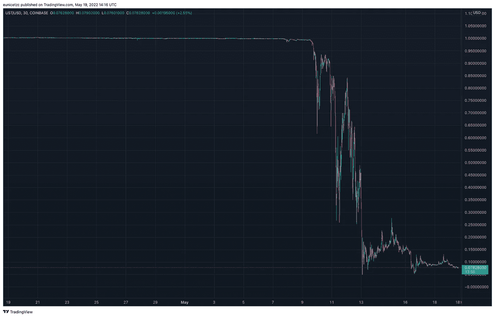
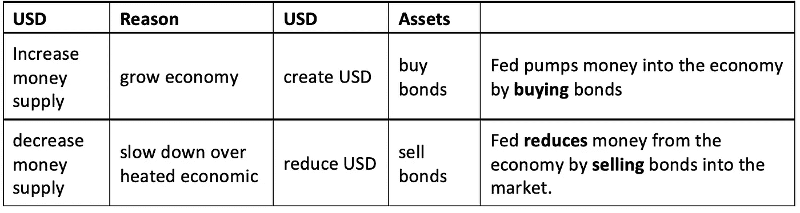
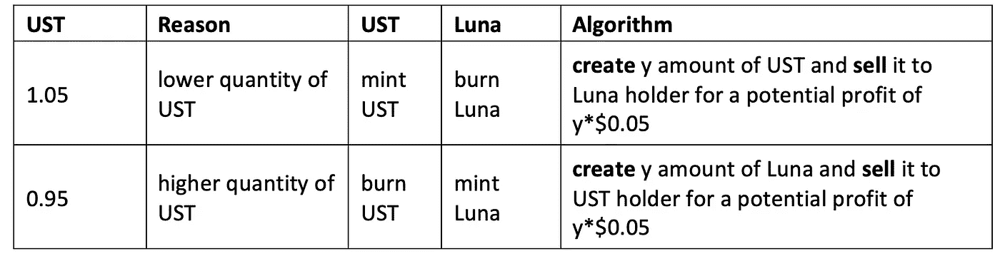
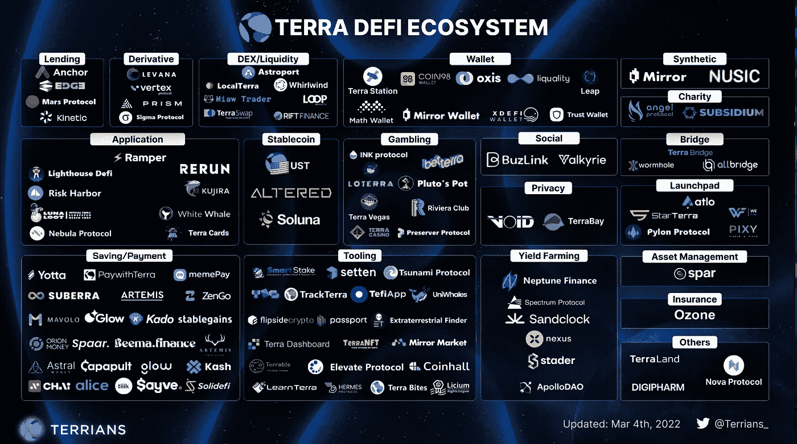

# 稳定币不稳定？-死亡陷阱

> 原文：<https://medium.com/coinmonks/stablecoin-unstable-terra-death-trap-969782654835?source=collection_archive---------38----------------------->

Terra UST Price Chart

2022 年 5 月 9 日将被称为“加密界的雷曼兄弟”，但我想将其命名为“ **Terra 带来了比特币进行死亡螺旋旋转，并开启了加密冬天**”

Terra 的 stablecoin UST(按市值排名前十的加密货币之一)失去了与美元的挂钩。目前，UST 股价为 0.079，跌幅高达 92%。

这篇文章将在我们进入 UST 和卢娜灭亡之前解释什么是稳定币。

**什么是稳定币？**

代币旨在充当动荡的加密货币市场的**锚**。稳定币，顾名思义，是维持法定货币与稳定币 1:1 的稳定挂钩比率；比如 1 美元兑 1SC。

**实物资产支持稳定币？**

一种由有形资产(如美元、欧元、实物金属(如黄金),甚至债券)担保以保持 SC 价格稳定的 SC。乍看之下，这意味着“安全”。但是，需要注意的关键点是:

1.  它是一个集中的发行人，就像你的传统银行一样，除了大多数银行，都是 FDIC 保险的。
2.  目前还没有规定对声称的 1:1 挂钩进行审计。集中发行人有责任通过拥有足够的有形资产来覆盖所有流通中的 SC，从而保持合规性。
3.  在保持联系汇率制的过程中，持有资产的流动性如何？

USDC 和 USDT 是加密领域支持 SC 的顶级实体资产。

**加密资产支持 Stablecoin？**

一种由另一种加密资产(如比特币、以太坊等)担保的 SC。加密资产支持的 SC 在某种程度上违背了 SC 作为锚的目的。为了平息批评，解决方案是超额抵押，例如由价值 1.5 美元的密码支持的 1 美元:1 美分的证券。然而，在一天结束时，这是一个 1 美元的交换，1 个单位的信念由另一个 1 个单位的信念支持，即使我们考虑到超额抵押。有人可能会说，美元是由信仰支撑的法定货币，但我们不要忘记，我们生活在一个由法定货币管理的世界里，美元仍然是石油美元。

在加密支持的供应链方面，戴是领先者。

## **算法稳定系数**

Robert Sams 于 2014 年首次提出，[关于加密货币稳定的说明:铸币税份额](https://blog.bitmex.com/wp-content/uploads/2018/06/A-Note-on-Cryptocurrency-Stabilisation-Seigniorage-Shares.pdf)。整个白皮书的关键在于，供应链在价格和数量上的稳定性可以通过模仿中央银行的货币政策，特别是美联储的公开市场操作，减去分散化环境中的部分银行系统来实现。参考下表，了解美联储公开市场操作的货币供应量。

Fed’s Open Market Operations

在分散式算法供应链环境中:

*   美联储被一个智能合约计算机代码所取代，该代码包含稳定供应链价格和数量的算法
*   从理论上讲，人民币可以与美元挂钩，但人民币是需要稳定的主要货币
*   被称为**股票**的资产是最关键的组成部分，必须吸收供应链的波动性。它应该包含激励人们参与稳定供应链的机制

回到 Terra 区块链，UST 是 Terra SC，而露娜是 Terra native token。Luna 掌握着通过铸造(创造)和燃烧(摧毁)机制来维持 UST 与美元人为挂钩的关键。请参考下表了解其工作原理。

Terra Algorithms Stablecoin

为了让算法 UST 保持工作状态，借贷平台、加密钱包甚至保险业务等生态系统正在积极构建，以激励人们留在区块链土地上。请参考图表以获得完整的图片。

Terra Ecosystem- https://twitter.com/Terrians_/status/1499629415302500355/photo/1

拥有如此庞大的生态系统，Terra 不可能在价格跌至接近零的情况下倒闭。然而，还记得我们如何痛斥美联储向市场注入数万亿美元，从而将美元抛入贬值轨道，引发我们今天面临的通货膨胀吗？

有趣的是，同样的事情也发生在 Terra 身上。如果有人持有足够多的 UST，决定赎回美元，该怎么办？这一行为本身将导致过量 UST 倾倒入 Terra 生态系统，并导致 UST 价格下跌。算法将被触发，卢娜将被铸造来吸收 UST 过剩的流动性。这反过来导致卢娜的价格下降，除非有人足够快地介入，吸收多余的卢娜，以保持卢娜的价格稳定。如果其中任何一个出现问题，Terra 用户将会失去信心，大规模抛售将会发生；因此，死亡螺旋是不可避免的，使 UST 和卢娜一文不值。这正是 Terra 的遭遇。

总之，从 Tron Finance 到 Terra，算法稳定币一次又一次地被证明是不稳定的，它是一个失败的经济实验，摧毁了人们对区块链的信心。

> 加入 Coinmonks [电报频道](https://t.me/coincodecap)和 [Youtube 频道](https://www.youtube.com/c/coinmonks/videos)了解加密交易和投资

# 另外，阅读

*   [Bookmap 评论](https://coincodecap.com/bookmap-review-2021-best-trading-software) | [美国 5 大最佳加密交易所](https://coincodecap.com/crypto-exchange-usa)
*   最佳加密[硬件钱包](/coinmonks/hardware-wallets-dfa1211730c6) | [Bitbns 评论](/coinmonks/bitbns-review-38256a07e161)
*   [新加坡十大最佳加密交易所](https://coincodecap.com/crypto-exchange-in-singapore) | [收购 AXS](https://coincodecap.com/buy-axs-token)
*   [红狗赌场评论](https://coincodecap.com/red-dog-casino-review) | [Swyftx 评论](https://coincodecap.com/swyftx-review) | [CoinGate 评论](https://coincodecap.com/coingate-review)
*   [投资印度的最佳加密软件](https://coincodecap.com/best-crypto-to-invest-in-india-in-2021)|[WazirX P2P](https://coincodecap.com/wazirx-p2p)|[Hi Dollar Review](https://coincodecap.com/hi-dollar-review)