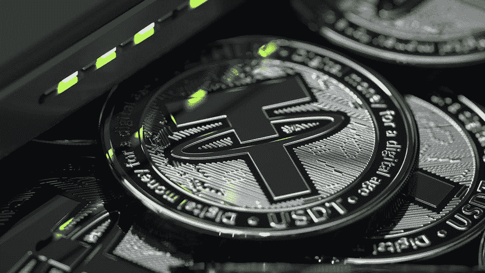
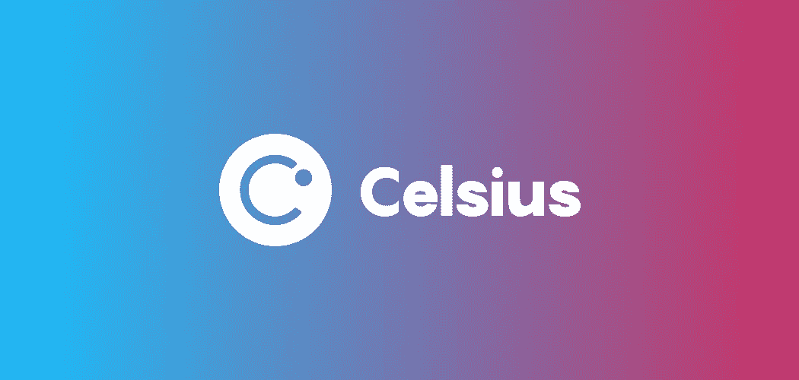
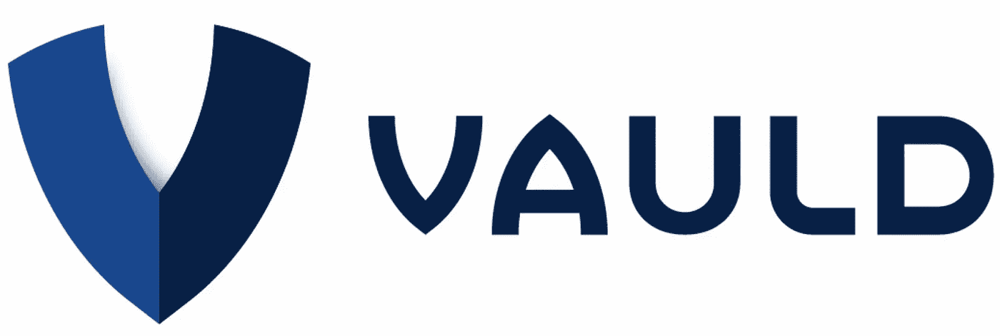
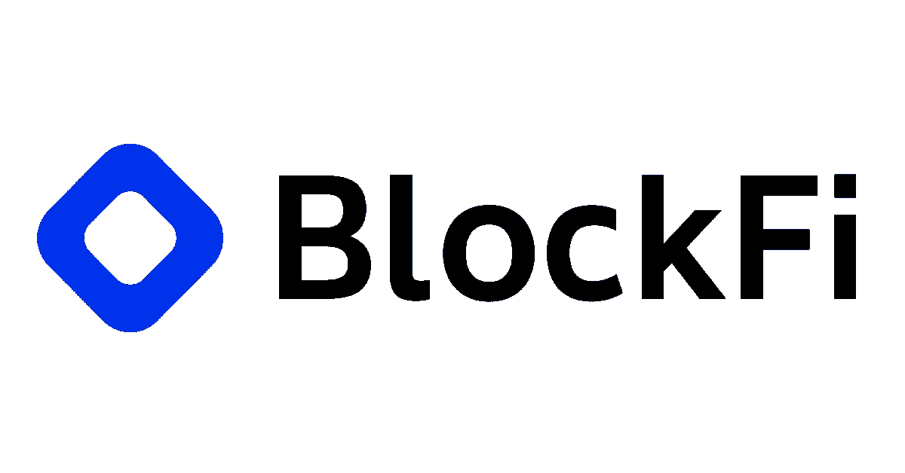
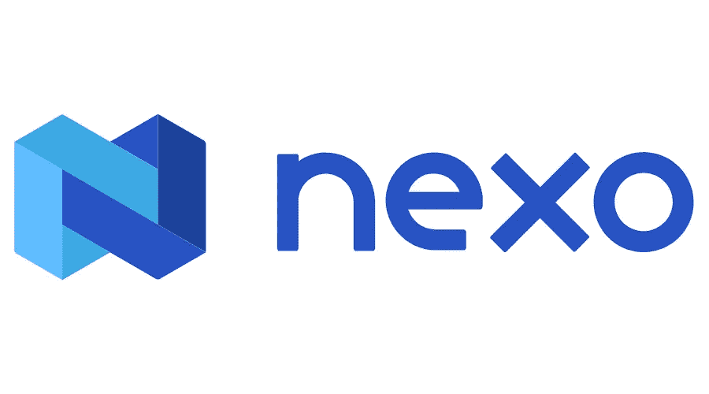
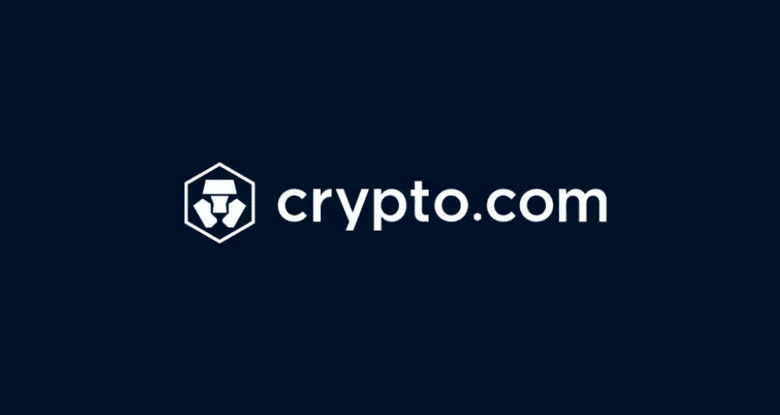
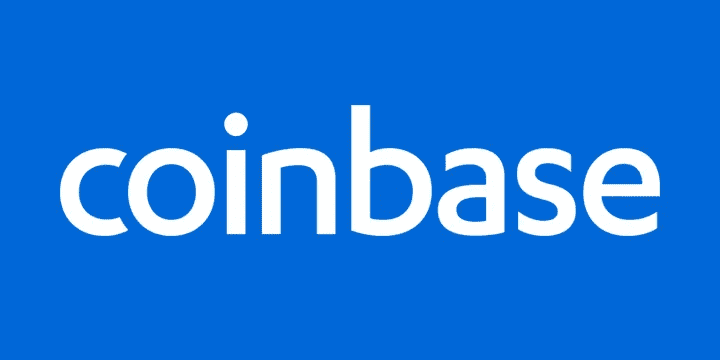
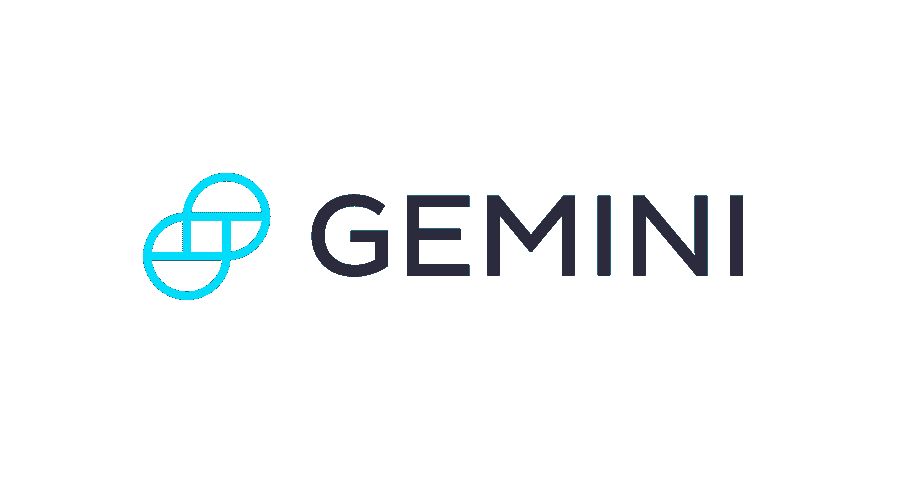
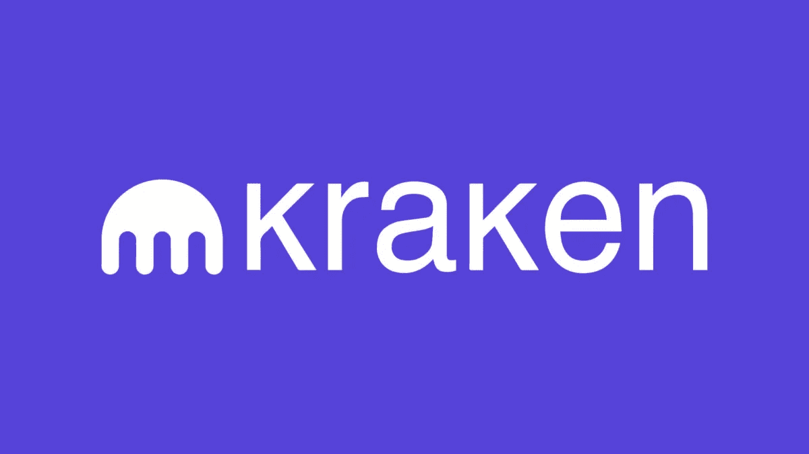

# StableCoins 寻找最高赌注/贷款 APY 的初学者指南

> 原文：<https://medium.com/coinmonks/stablecoins-a-beginners-guide-to-finding-the-highest-staking-lending-apy-c0e9b43b178b?source=collection_archive---------16----------------------->

浏览你的垃圾邮件，你会经常看到银行提供高达 0.4%年利率的广告！

在网上快速搜索一下，你会发现非热门银行提供的最高年利率为 0.7%。这些银行走来走去，宣称他们提供高收益的一流储蓄。你可能心里在想，“0.7%？为什么这么少？”

下表列出了最常见的贷款/赌注平台，这些平台提供高达两位数的美元回报。

1.  摄氏网络

Photo curtesy of [https://cryptodaily.co.uk/](https://cryptodaily.co.uk/)

*   每周支付 8-11%的 APY(全年范围)。
*   全年随机提供促销奖励，如果你的资金闲置，你将获得额外的美元奖金！注册电子邮件列表，以获得可用促销代码的提醒。
*   需要了解你的客户(KYC)。
*   难度等级:容易。
*   [https://celsius . network/earn](https://celsius.network/earn)

2.Vauld

Photo curtesy of [https://jobs.lever.co/Vauld](https://jobs.lever.co/Vauld)

*   所有用户每日支付 9.41%的 APY。锁定您的代币 30 天的选项允许您获得 12.68%的 APY。
*   不需要了解你的客户(KYC)。
*   难度等级:容易。
*   https://www.vauld.com/rates

3.BlockFi

Photo courtesy of [https://boards.greenhouse.io/blockfi](https://boards.greenhouse.io/blockfi)

*   最高 40，000 美元的 APY 为 8%，此后为 5%，按月支付(利率不断变化)。
*   需要了解您的客户(KYC)(仅限美国客户)。
*   难度等级:容易。
*   【https://blockfi.com/rates/ 

4.Nexo

Photo curtesy of [https://seekvectorlogo.com/nexo-io-vector-logo-svg/](https://seekvectorlogo.com/nexo-io-vector-logo-svg/)

*   APY 每天支付 8%的利息。
*   需要了解您的客户(KYC)(仅限美国客户)。
*   难度等级:容易。
*   [https://support . nexo . io/HC/en-us/articles/360014283839-Earn-high-yielding-annual-interest-on-crypto-assets-Explained](https://support.nexo.io/hc/en-us/articles/360014283839-Earn-high-yielding-annual-interest-on-crypto-assets-Explained)

5.Crypto.com

Photo curtesy of [https://www.crypto-news-flash.com/](https://www.crypto-news-flash.com/)

*   如果你在 CRO 持有少于 400 美元，并选择“灵活”选项(无锁定期)，则为 6%。
*   如果你在 CRO 的存款少于 400 美元，并选择 1 个月的锁定计划，你可以获得 8%的利息。
*   如果您在 CRO 至少持有 4000 美元并选择“灵活”选项，则可享受 8%的优惠。
*   如果您在 CRO 的存款少于 400 美元，并选择 3 个月的锁定计划，则为 10%。
*   如果您至少持有 4，000 美元 CRO，并选择 1 个月的锁定计划，则为 10%。
*   如果你持有至少 4，000 美元的 CRO，并选择 3 个月的锁定计划，则为 12%。
*   如果你持有至少 40，000 美元的 CRO，并选择 1 个月的锁定计划，则为 12%。
*   如果你持有至少 40，000 美元的 CRO，并选择 3 个月的锁定计划，则为 14%。
*   奖励按周发放。
*   需要了解你的客户(KYC)。
*   难度等级:中等。
*   [https://crypto.com/us/earn](https://crypto.com/us/earn)

6.比特币基地

Photo curtesy of [https://www.remote-europe.com/company/coinbase](https://www.remote-europe.com/company/coinbase)

*   实时支付 0.15%。
*   难度等级:容易。
*   需要了解您的客户(KYC)(仅限美国客户)
*   [https://www.coinbase.com/staking](https://www.coinbase.com/staking)

7.双子星座

Photo curtesy of [https://www.cryptoninjas.net/](https://www.cryptoninjas.net/)

*   8.05%的 APY (GUSD)和 7.99%的 APY (USDC)按日支付。
*   需要了解你的客户(KYC)。
*   难度等级:容易。
*   https://www.gemini.com/earn#calculator

8.克拉肯

Photo curtesy of [https://backtest-rookies.com/](https://backtest-rookies.com/)

*   2% APY 一周支付两次。
*   难度:容易
*   需要了解你的客户(KYC)
*   https://www.kraken.com/en-us/features/staking-coins

虽然传统银行提供的年利率甚至不到 1%，但加密可以让你最大化回报，让你的钱为你工作！祝赌注和贷款愉快！

*   免责声明这篇文章不打算作为财务建议。

> 加入 Coinmonks [电报频道](https://t.me/coincodecap)和 [Youtube 频道](https://www.youtube.com/c/coinmonks/videos)了解加密交易和投资

# 另外，阅读

*   [ProfitFarmers 回顾](https://coincodecap.com/profitfarmers-review) | [如何使用 Cornix 交易机器人](https://coincodecap.com/cornix-trading-bot)
*   [如何匿名购买比特币](https://coincodecap.com/buy-bitcoin-anonymously) | [比特币现金钱包](https://coincodecap.com/bitcoin-cash-wallets)
*   [瓦济里克斯 NFT 评论](https://coincodecap.com/wazirx-nft-review)|[Bitsgap vs Pionex](https://coincodecap.com/bitsgap-vs-pionex)|[Tangem 评论](https://coincodecap.com/tangem-wallet-review)
*   如何使用 Solidity 在以太坊上创建 DApp？
*   [币安 vs FTX](https://coincodecap.com/binance-vs-ftx) | [最佳(SOL)索拉纳钱包](https://coincodecap.com/solana-wallets)
*   [如何在 Uniswap 上交换加密？](https://coincodecap.com/swap-crypto-on-uniswap) | [A-Ads 评论](https://coincodecap.com/a-ads-review)
*   [加密货币储蓄账户](/coinmonks/cryptocurrency-savings-accounts-be3bc0feffbf) | [YoBit 审核](/coinmonks/yobit-review-175464162c62)
*   [Botsfolio vs nap bots vs Mudrex](/coinmonks/botsfolio-vs-napbots-vs-mudrex-c81344970c02)|[gate . io 交流回顾](/coinmonks/gate-io-exchange-review-61bf87b7078f)
*   [CoinFLEX 评论](https://coincodecap.com/coinflex-review) | [AEX 交易所评论](https://coincodecap.com/aex-exchange-review) | [UPbit 评论](https://coincodecap.com/upbit-review)