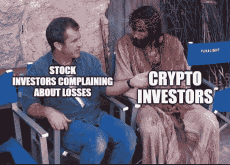
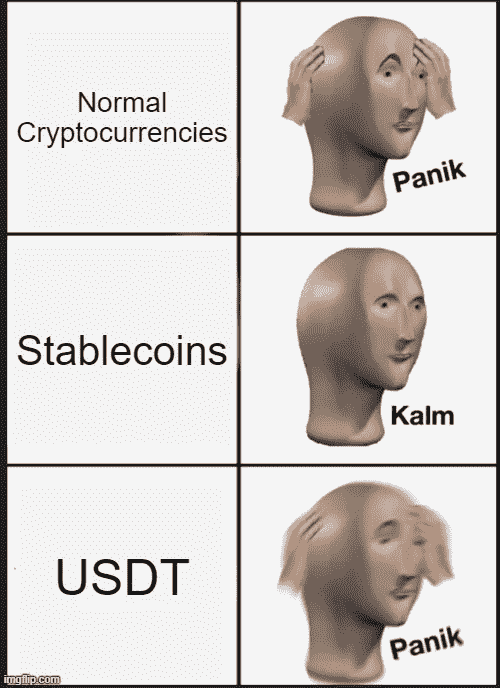
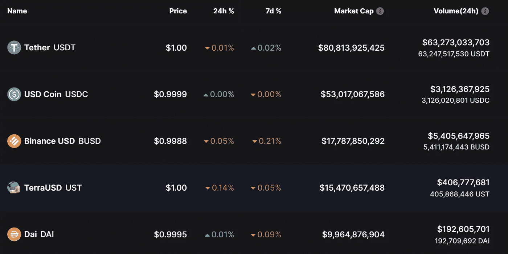
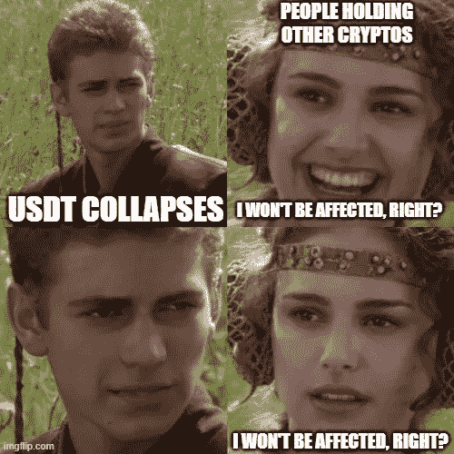
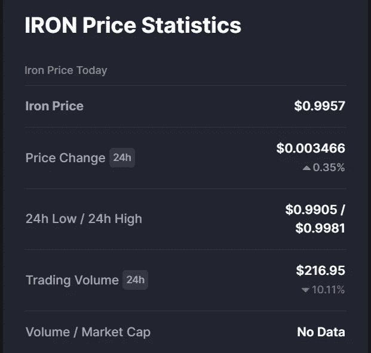
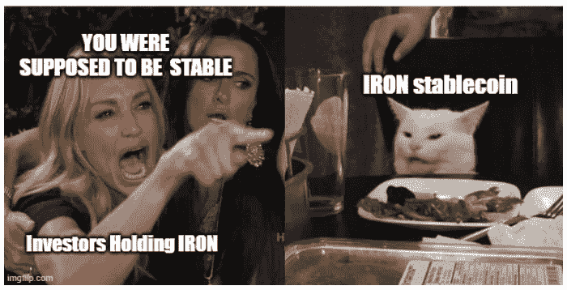

# 稳定币的稳定性

> 原文：<https://medium.com/coinmonks/stablecoins-stability-a3edb5d65082?source=collection_archive---------41----------------------->

## 密码最薄弱的环节？

稳定的密码会导致密码市场的闪电崩盘吗？请继续阅读，寻找答案。

# 什么是 stablecoins？

在加密这个狂野的世界里，极端的波动是常态而非异常。下图可以很好地概括这种波动性:

Keep calm and HODL on!

有一天你在决定买哪种颜色的兰博基尼，一周后你只能买半个卢布。这是这一资产类别的大多数资深人士都很清楚的现实。当市场处于上升趋势时，新手什么都做，但不是那么做。

因此，在 2014 年的某一天，Tether Limited 的某人想到，为什么不给这种混乱带来一些稳定。

Not so stable after all

所以我们有了“稳定的硬币”。顾名思义，稳定币是与法定货币 1:1 挂钩的数字代币，因此价格保持稳定。这意味着 1 USDT(系绳)将永远相当于 1 美元。绝大多数稳定的货币与美元挂钩。这是有意义的，因为美元是世界默认的储备货币。但是稳定的硬币可以与任何货币挂钩。美元更容易在平顶斜坡上获得，这进一步扩大了美元钉住稳定货币的优势。

stablecoins 的目的是提供一种交易媒介和安全港，以防有人希望在波动阶段避免加密市场的剧烈波动，而又不完全退出该领域。你可以把它想象成在股市熊市期间持有现金头寸。通过将你持有的股票转换成稳定的债券，你可以避免市场下跌时的价值损失，然后在市场上涨时买入。另一个好处是转换成稳定币比转换成法币便宜。我们必须明白，fiat 和 crypto 是两个独立的货币系统，从一个系统转移到另一个系统会产生摩擦，表现为提供入口和出口服务的实体收取费用。

它们在 defi 中也有应用，表现为对滑点和清算的免疫，但这是一个完全不同的话题，我们将在其他时间探讨。

就本文的目的而言，记住它们在波动期间提供了一个安全的避难所。

根据设计，有 4 种稳定的类型(基于抵押品):

1.  **法币支持:**法币 1:1 支持。发行稳定硬币的实体在银行账户中持有该法定货币，并且只能发行等量的稳定硬币。例如 USDT、USDC、BUSD
2.  **密码支持:**由密码资产支持。戴
3.  **算法:**由[算法](https://angelprotocol.medium.com/how-does-ust-work-ec7b2f6e2c2c#:~:text=UST%20operates%20similarly%20to%20the,1%20USD%20(US%20dollar).)管理的流通，以维持钉住。例如 TerraUSD (UST)
4.  **商品支持:**以黄金等商品为支持。可以兑换成实物资产。例如 PAXG 帕克思

从铸币的控制者来看，可以分为中央集权制(、、等)和地方分权制(戴、等)。

# 流行的 stablecoins 及其度量

在撰写本文时，市值排名前五的[公司是:](https://coinmarketcap.com/view/stablecoin/)

2 stablecoins come in the top 5 cryptocurrencies by market cap. USDT at 3 and USDC at 5 in the list

名单中的下一个稳定币的市值不到 20 亿美元。所以它在我们的讨论中无关紧要。仅 USDT 和 USDC 的总市值就达 1330 亿美元(占所有稳定货币市场的 74%)，USDT 占 45%的份额！从成交量来看，USDT 24 小时成交量 630 亿美元，绝对令人难以置信。这表明大部分交易是在 USDT 进行的，通常交易量越大，流动性越高。从**的体量百分比来看，** **USDT 控制了 85%以上的巨大份额**。

、、是菲亚特支持的稳定币，是算法稳定币，戴是密码支持的稳定币。

# 关系

1.  **带集中稳定器**

像 Tether 这样的公司说，他们保持的“储备”等于市场供应量。但他们在披露这些细节时非常不透明，直到 2021 年 5 月他们首次给出了明细。此处可以看到电流击穿[。根据他们自己的报告，**只有 12.42%是现金或银行存款**。他们持有的绝大部分是商业票据，一种无担保的短期债务。此外，这些都是保证意见，而不是全面的审计。](https://tether.to/en/transparency/#reports)

如果出现黑天鹅事件，每个人都争先恐后地把他们的 USDT 换成菲亚特，这种支持稳定货币的流动性储备的缺乏将会造成一场**流动性危机(称为银行挤兑)**。当人们意识到他们无法改变 USDT 教时，恐慌将会加速，并在整个加密市场引起巨大的冲击波。这将导致 USDT 无法维持 1:1 的联系汇率。如果国家禁止这种稳定的硬币，这种黑天鹅事件是有可能发生的。这一点在币局的这个[视频里解释的很精彩。](https://youtu.be/Q3tunUaDwN0?t=296)

这样的事件必然会产生连锁反应，影响更广泛的密码市场和其他密码的价格。因此，不持有 USDT 并不能消除加密市场任何参与者的风险。

储备的不透明性也带来了问题，T2 可以随心所欲地凭空印钱。这使稳定的硬币贬值，而没有人意识到，直到为时已晚。

2.**带分散式稳定器**

2021 年 6 月，由于泰坦的流动性危机，发生了[最大的算法稳定币故障](https://www.coindesk.com/markets/2021/06/17/in-token-crash-postmortem-iron-finance-says-it-suffered-cryptos-first-large-scale-bank-run/)。TITAN 的合同被利用，其所有流动性都从 Uniswap 池中被抽走。结果，由 TITAN 支持的算法 stablecoin IRON 涨到了 0.69 美元。从这张图片中可以看出，目前铁稳定币几乎已经死亡。

Glorious trading volume of $216.95

这一切的发生可能是因为合同漏洞，但它给了其他算法稳定者一个强烈的信息。在我们的名单中，UST 是市值最高的硬币之一。月神和 UST 之间的相似之处有点像泰坦和铁。如果 LUNA 指数大幅下跌，可能会影响 UST 的挂钩汇率。这个在这篇[文章](https://coingeek.com/terra-ust-is-now-the-biggest-decentralized-stablecoin-and-it-is-no-better-than-tether/)里有详细介绍。

# 所有的希望都失去了吗？

不会。像 USDC 这样的稳定公司在遵守法规和定期发布储量审计报告方面做得很好。此外，使用密码的银行挤兑不太可能完全扰乱市场，因为它们得到了同等准备金的支持，这与支持少得多的[部分银行系统](https://www.investopedia.com/terms/f/fractionalreservebanking.asp#:~:text=Fractional%20reserve%20banking%20is%20a,by%20freeing%20capital%20for%20lending.)形成对比。

另一方面，像 UST 这样的算法稳定的公司确实依赖于 LUNA 作为一种安全手段的使用。但是这种用法只会越来越多。很难说它将来会成功。

是的，任何没有经过完全测试的东西都有风险。但更重要的是要意识到这些风险，并以有计划的方式参与到这一新的范式转变中，而不是过于害怕并带着不基于逻辑的偏见看待加密。

> 加入 Coinmonks [电报频道](https://t.me/coincodecap)和 [Youtube 频道](https://www.youtube.com/c/coinmonks/videos)了解加密交易和投资

# 另外，阅读

*   [币安期货交易](https://coincodecap.com/binance-futures-trading)|[3 commas vs Mudrex vs eToro](https://coincodecap.com/mudrex-3commas-etoro)
*   [如何购买 Monero](https://coincodecap.com/buy-monero) | [IDEX 评论](https://coincodecap.com/idex-review) | [BitKan 交易机器人](https://coincodecap.com/bitkan-trading-bot)
*   [CoinDCX 评论](/coinmonks/coindcx-review-8444db3621a2) | [加密保证金交易交易所](https://coincodecap.com/crypto-margin-trading-exchanges)
*   [红狗赌场评论](https://coincodecap.com/red-dog-casino-review) | [Swyftx 评论](https://coincodecap.com/swyftx-review) | [CoinGate 评论](https://coincodecap.com/coingate-review)
*   [Bookmap 点评](https://coincodecap.com/bookmap-review-2021-best-trading-software) | [美国 5 大最佳加密交易所](https://coincodecap.com/crypto-exchange-usa)
*   [如何在 FTX 交易所交易期货](https://coincodecap.com/ftx-futures-trading) | [OKEx vs 币安](https://coincodecap.com/okex-vs-binance)