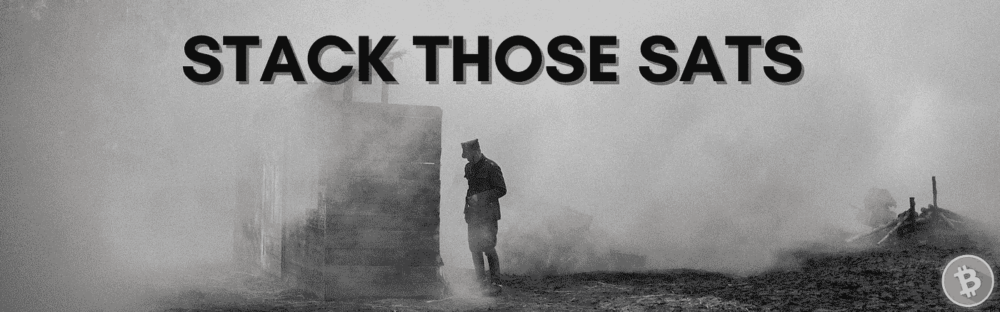

# 关于购买比特币

> 原文：<https://medium.com/coinmonks/stack-those-sats-24ad9cf9898b?source=collection_archive---------57----------------------->

## 比特币与文化战争

因为比特币和密码产业，我染上了轻微的赌博瘾。谢天谢地，我灵魂的腐败是值得的——随着比特币的采用继续积极影响 [***许多***](https://www.statista.com/statistics/647374/worldwide-blockchain-wallet-users/) 人。事实上，比特币仍然会拯救世界——尽管大量的投机者、骗子和堕落者也希望加入这股潮流——利用这一奇妙的发明及其奇妙的效用来实施他们不太谨慎的计划。

现在是 2022 年，从宏观层面来看，人类正在遭遇挫折。列举几个问题——我们有一场文化战争，乌克兰的文字战争，创纪录的货币通胀，以及后流行病时代的世界。

一方面，*正常人*不会注意任何问题。也许，他会因为 [*主流媒体*](https://en.wikipedia.org/wiki/Mainstream_media) 而得到*的一瞥*。他会听到以暴乱形式出现的不安定，他会听到时髦的词语和短语——新的组织——显然，有些代表善，有些代表恶。

也许值得注意的是，会有比平常更多的人因为做了明显的 ***邪恶的*** 事情而惹上麻烦。通常，那些我们不久前认为完全可以接受的事情。

但这些问题都不会影响他的日常生活，所以他会采取某种不冷不热的态度。他会对这些人产生一种看法，“*橘子人不好”，*然后他会继续他的生活。

但是，即使只是下意识地，他也会有一种总的感觉，事情要糟糕了。

## 士兵

然而另一方面，有些人站在冲突的前线。或许，那些已经意识到 [*的卡利宇迦*](https://www.buddhistdoor.net/features/kali-yuga/) *。*有的甚至划出了强硬路线，适当结盟，正在 ***反击*** 。在枪支、弹药和窃听器包中，这些人正在购买 ***比特币。***

文化冲突已经到了他们的门前——**每个人很快都会遇到这种情况。**

事情似乎很黑暗。比特币——品牌、货币、技术、哲学——是一盏闪亮的灯。

## 部落主义是悲剧性的

我们面临的主要问题之一是社会*再次陷入* *部落主义*…。他们通常会被打上某种集体主义的烙印，比如马克思主义或法西斯主义。

这篇文章探讨了比特币如何帮助我们反击。

首先，什么是部落主义？部落主义是一种*无意义*和*悲惨*的力量，就像龙卷风、地震和小行星撞击一样。

想象一下，在一片被茂密的森林包围的宁静的草地上，一只母灰熊正在哺育她的几只幼崽，而第三只在它们旁边的草地上玩耍。突然，一只雄性公牛灰熊冲过森林中的一片空地——它一直在跟踪它们，现在它开始行动了。

现在，接下来的几个时刻是*暴力和残酷的*。毫无意义又悲惨。对这些无辜的人来说，错误的地点，错误的时间。这些受害者将得不到公正的审判。简单地说，他们无力抵抗更强大的反对力量。

同样，部落主义是一种自然力量。一个个体——人类——没有选择是否成为部落的权利，当有足够数量的人被卷入文化战争时，他(*T21()就会被卷入文化战争。*

他的选择仅仅是他将加入哪个部落，这将导致他在生活中采取什么样的行动。

当社会中的一大群暴民开始接受部落行为，从而建立起一套严格的白痴和非理性的信仰时，在他们眼里，我们其余的人就是敌人。

即使讨论这个话题，当我们使用“他们”和“他们”的语言时，也不可能不带有敌意。

这些人和你生活在同一个社会，这些人可以是你的邻居。他们会 ***转*** 因为他们害怕某种疾病，或者有极端的经济困难。通常是当空气中弥漫着痛苦和怨恨的时候。

唉，他们会来到你的门前——首先是思想、哲学和精神上的……然后是字面上的。

## 开始很慢

如今，西方社会有很大一部分人认为，生活在他们中间的是种族主义者和残忍邪恶的偏执狂——他们要压迫他们周围的每一个人。他们处于疯狂状态，他们只会看到他们想相信的东西。就像一只雄性大灰熊盯着它的猎物。

## 为什么？

也许，这些人的生活很艰难。表面上，他们终于找到了摆脱困境的权宜之计，或许还能进入令人兴奋和有利可图的*领域。*

从心理上来说，他们已经找到了某种目标。一些能让他们忘记他们在逃避什么和所有黑暗的东西。

完美的市场契合，他们的假偶像给了这些人更深的意义感，来填补他们虚无的空虚。他们找到了一个实施正义的机会，消灭了那些被 T2 视为敌人的人——那些体现了宇宙所有错误的人。

就像蚱蜢蜕变成蝗虫一样，它们会集体化，成群结队。

*他们*会试图改变你——让你说你知道是假的话，让你举起拳头或低头……让你成为他们法令的*奴隶*。

## 敌人很强大。

**市场力量**安抚这群暴徒。这群乌合之众有钱有势。

有影响力，或者只是大声疾呼和要求，他们只会让那些你赞同他们分裂和不道德的方式的人满足他们的消费主义需求。不可避免的是，公司跟着钱走——投入到一场强大的、看似统一的营销活动中。

然而，战斗*真正*开始的时候，是*机构*站在暴君一边。当*强大的*端着邪恶的**的时候就是**暴行开始的时候。当它升级时。

事实上，在财产被没收、身份被追踪和作废、社会基础设施和公用事业(如银行业)被选择性瘫痪之后，暴行就开始了。

事实上，暴民有不公平地改变规则的手段，这样他们就能永远赢 T21。真相被*夺权所取代。*

## 反击

如今，你可能会发现自己在为争论而争论。我的意思是，只有*有必要争论一个愚蠢而明显的概念，就像只有两种生物性别，而有些人不公平地认为事实并非如此。*

这些人是从哪里来的？

简单地说，打了一拳，你觉得有必要打回去。

然后是广告词，煤气灯。他们会否认任何真相，为明目张胆的谎言而战。

真的是反社会行为，会气死你的。

现在你将不得不*通过投降或者变得好斗来处理它。或者至少，准备变得更有侵略性。*

首先，你必须承认*做这种事情的那群人*需要被阻止，因此，你将*需要*成为部落成员，即使这意味着你所在的部落希望部落主义终结。

讽刺的是，你从哲学的角度来看，有*就有* *其他人。不过，也许你是站在好的一方。尽管如此，你还是把那些想结束集体化的人交给袖手旁观。*

在善与恶的*斗争中，在那些相信破坏性意识形态的人和那些彻底拒绝它的人之间，必须划出一条强硬的界线。*

*当社会陷入部落主义时，你没有选择的权利。*

> *“与怪物战斗的人可能会小心，以免自己因此成为一个怪物。如果你长时间凝视深渊，深渊也在凝视你。”*
> 
> *——弗里德里希·尼采*

## *比特币解决了这个问题*

*像任何工程项目一样，中本聪设计比特币是为了在 T4 最恶劣的条件下生存。*

*一个桥梁建筑师需要设想最严重的自然灾害和最重的负载，而一个数字货币、资产类别、价值储存的发明者需要设想腐败、盗窃和操纵。*

*这个名为中本聪的实体设计了比特币，其功能已经**成功**挫败了对它的所有攻击。*

*随着时间的推移，它变得不太可能被打破。显然，采用率在增长，维护和创新网络的市场压力也在增长。*

*似乎每天都有一位新的亿万富翁资产管理公司首席执行官加入进来。*

*轨迹是向上的——势头在比特币一边。*

*并非巧合的是，这正伴随着部落主义的衰落而发生。因为比特币是[不可改变的](https://academy.binance.com/en/glossary/immutability)，[货币体系的 7^th 财产](https://yakes.io/book/)，它是针对道德败坏的经济机构的*完美防御。**

*如果专制政权想要阻止价值交流——完全合法和真实的价值交流——他们会被比特币挫败。*

*如果这些政权想成为[堕落的赌徒](https://www.investopedia.com/articles/economics/09/financial-crisis-review.asp)，任何对这个货币网络的供应或其协议的操纵都是不可能的。*

*有了比特币——合法的、诚实的、有道德的公民可以组织起来并资助他们的努力，即使这可能违背暴民的强大叙述。*

*把那些血氧饱和度叠加起来。比特币体现了谎言时代的真实。在一长串改善人类的发明中，没有比这更有效的防御人类灵魂潜在的腐败和怨恨的方法了。*

*尽管我们可能会损失一些 100 倍杠杆永久交易。*

> *加入 Coinmonks [电报频道](https://t.me/coincodecap)和 [Youtube 频道](https://www.youtube.com/c/coinmonks/videos)了解加密交易和投资*

# *另外，阅读*

*   *[如何在 FTX 交易所交易期货](https://coincodecap.com/ftx-futures-trading) | [OKEx vs 币安](https://coincodecap.com/okex-vs-binance)*
*   *[CoinLoan 评论](https://coincodecap.com/coinloan-review) | [YouHodler 评论](/coinmonks/youhodler-4-easy-ways-to-make-money-98969b9689f2) | [BlockFi 评论](https://coincodecap.com/blockfi-review)*
*   *[XT.COM 评论](https://coincodecap.com/profittradingapp-for-binance)币安评论 |*
*   *[SmithBot 评论](https://coincodecap.com/smithbot-review) | [4 款最佳免费开源交易机器人](https://coincodecap.com/free-open-source-trading-bots)*
*   *[比特币基地僵尸程序](/coinmonks/coinbase-bots-ac6359e897f3) | [AscendEX 审查](/coinmonks/ascendex-review-53e829cf75fa) | [OKEx 交易僵尸程序](/coinmonks/okex-trading-bots-234920f61e60)*