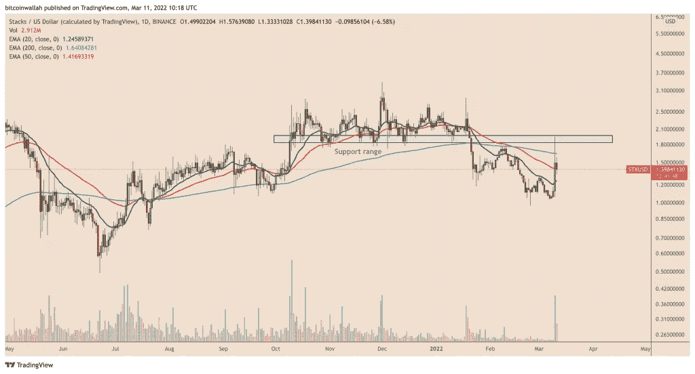

# 股价在单日上涨 70%后急剧下跌——未来还会有更多的 STX 亏损？

> 原文：<https://medium.com/coinmonks/stacks-price-falls-precipitously-after-gaining-70-in-a-single-day-more-stx-losses-ahead-eae4a3bbcac6?source=collection_archive---------41----------------------->

**Visit our website:-** [**https://bitcoinsupports.com/**](https://bitcoinsupports.com/)

巨大的上涨恰逢 OKcoin 引入 1.65 亿美元的基金，使用堆栈在比特币网络上开发应用程序。随着围绕 Stacks 1.65 亿美元承诺推广比特币(BTC)计划的兴奋情绪消退，Stacks (STX)放弃了 3 月 10 日的大部分涨幅。

STX 的价格从本周以来的高点 1.94 美元跌至周五的低点 1.33 美元，跌幅超过 30%。抛售本质上似乎是技术性的，因为 1.94 美元的顶部位于 2021 年 10 月至 2022 年 1 月期间作为坚定支撑的相同范围内，只是在今年晚些时候恢复成为阻力位。

**Visit our website:-** [**https://bitcoinsupports.com/**](https://bitcoinsupports.com/)

此外，由于 3 月 10 日 STX 的长灯芯烛台，交易员似乎已经看到了抛售机会。当天早些时候，股价飙升了 73%,在日线图上形成了异常长的看涨灯芯，这意味着上涨乏力。

**是什么推高了 STX 的价格？3 月 10 日 STX 市场的飙升恰逢“比特币奥德赛”的推出，这是一个 1.65 亿美元的基金，将利用 Stacks 基于比特币的智能合约的开源网络，在比特币区块链上建立 Web3、分散金融(DeFi)和不可兑现的令牌(NFT)项目。

https://twitter.com/TO/status/1501938638967296010

值得注意的是，STX 在 Stacks 生态系统中充当一个公用令牌，允许为网络和合同活动付费。STX 持有者也可以使用“堆叠”来支持 Stacks 网络的区块链共识方法。作为交换，他们获得 BTC 奖金。交易员们似乎已经成群结队地去了 STX，他们预计在比特币奥德赛(Bitcoin Odessey)首次亮相后，需求将会激增。例如，加密货币交易所 OKcoin 是 1.6 亿美元基金的主要支持者，它宣传 Stacks token 的乐观前景，称现在是“进入”Stacks 的“不错的时机”。

**历史新高是否迫在眉睫？**

有趣的是，STX 的连续价格回升发生在两个关键支撑位的交叉点，其中至少有一个表明 Stacks token 有望在不久的将来创下历史新高。

这种汇合是由一条向上倾斜的趋势线和斐波纳契回撤图的 0.5 斐波纳契回撤线(约 1.50 美元)形成的，趋势线自 2020 年初以来一直是交易者的聚集点，斐波纳契回撤图从 0.04 美元的低点到 2.82 美元的高点。**

**Visit our website:-** [**https://bitcoinsupports.com/**](https://bitcoinsupports.com/)

在从双支撑位恢复后，STX 现在似乎准备收在两个中期指数移动平均线(EMAs)上方——20 周(绿色)和 50 周(红色)EMAs。如果突破成功，堆栈令牌可能会重新访问另一个向上倾斜的趋势线，该趋势线自 2020 年以来一直是一个障碍。另一方面，从 20-50 均线阻力位的回调可能会导致在 0.786 纤维水平 0.63 美元附近跌破上升趋势线支撑。

**访问我们的网站:-**[**https://bitcoinsupports.com/**](https://bitcoinsupports.com/)

**免责声明:以上为作者观点，不应视为投资建议。读者应该自己做研究。**