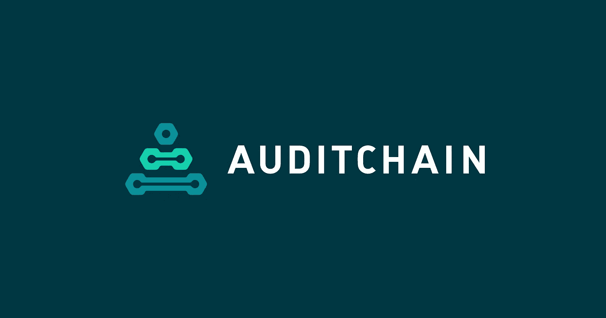

# 审计链的 Pacioli 验证节点的标桩合同已部署在 mainnet 上

> 原文：<https://medium.com/coinmonks/staking-contracts-for-auditchains-pacioli-validating-nodes-have-been-deployed-on-the-mainnet-7018b7b81221?source=collection_archive---------81----------------------->

**Visit our website:-** [**https://bitcoinsupports.com/**](https://bitcoinsupports.com/)

作为其分散 6000 亿美元全球会计、保险和报告服务业务计划的一部分，Auditchain 将于 2022 年 3 月 7 日在 Polygon Mainnet 上部署其 Pacioli 验证节点标桩合同。

audit chain Labs AG([https://audit chain . finance](https://auditchain.finance))，世界上第一个用于保证和披露的分散式会计、财务报告、审计和分析虚拟机的创建者，今天宣布 Pacioli 验证节点标桩合同将于 2022 年 3 月 7 日 16:00 UTC 部署。
T5【Staking contracts】创建 Staking contract 是为了满足 Pacioli 验证节点部署时的 Staking 需求。在 Auditchain 协议上，AUDT 的持有者，比如会计师，将成为验证者，并将 AUDT 委托给 Pacioli 节点操作者。2022 年 6 月 8 日，在伦敦托特纳姆热刺体育场，Auditchain 协议将在 Auditchain 支持的数字会计展上正式启动。

**Pacioli 逻辑引擎是 Pacioli 开发的一款逻辑引擎。**

Pacioli 是 Auditchain 协议的 Web3 逻辑和推理引擎，它根据财务报告方案中每个经济实体的财务报告风格来计算其合法条件的输出。Pacioli 客户端是 Auditchain 协议的重要组成部分，它提高了全球商业和金融数据的质量和可靠性。

赌注合同允许任何拥有 AUDT 的人“支持”Pacioli 节点运营商，并参与新的 Web3 财务报告和保险市场，允许他们委托 AUDT 并接收现金。Pacioli 代理是一个与 Pacioli 逻辑引擎相结合的 node.js 应用程序，旨在为 Pacioli 节点运营商提供竞争验证服务请求的机会，就审计链协议上基于 XBRL 的财务报告验证达成共识，并获得激励。

“基于 XBRL 的分散式报告模型验证的出现，通过激励网络上的多个参与者就报告公司遵守美国 GAAP 和 IFRS 达成共识，代表了财务报告编年史中的一个新时代，”首席架构师 Jason Meyers 说道。迈耶斯补充说:“采用审计链协议的一个重要因素是投资者能够汇总数据，并迅速决定“提交的”财务报表是否可信。”

对于以下关键功能，审计链协议使用委托标记:

基于 XBRL 的“存档”财务报表

在发布和/或提交给监管机构之前，基于 XBRL 的财务模型和财务报表要经过验证。

作为审计师根据新的 CEAOB 建议执行基于 XBRL 的财务报表审计的审计工具。

自动化会计、报告、审计和分析活动的过程控制 NFT 的验证，以及“保证证明”运行每个验证节点最少需要 5,000 AUDT，最多需要 25,000 AUDT。在赌注合同中，必须至少委托 500 澳元。可在[https://docs . audit chain . finance .](https://docs.auditchain.finance.)上获得风险评估合同的文件

**访问我们的网站:-**[**【https://bitcoinsupports.com/】**](https://bitcoinsupports.com/)

**免责声明:这些是作者的观点，不应被视为投资建议。读者应该自己做研究。**

> 加入 Coinmonks [电报频道](https://t.me/coincodecap)和 [Youtube 频道](https://www.youtube.com/c/coinmonks/videos)了解加密交易和投资

# 另外，阅读

*   [Bitsgap 审查](/coinmonks/bitsgap-review-a-crypto-trading-bot-that-makes-easy-money-a5d88a336df2) | [Quadency 审查](/coinmonks/quadency-review-a-crypto-trading-automation-platform-3068eaa374e1) | [Bitbns 审查](/coinmonks/bitbns-review-38256a07e161)
*   [密码本交易平台](/coinmonks/top-10-crypto-copy-trading-platforms-for-beginners-d0c37c7d698c) | [Coinmama 评论](/coinmonks/coinmama-review-ace5641bde6e)
*   [印度的加密交易所](/coinmonks/bitcoin-exchange-in-india-7f1fe79715c9) | [比特币储蓄账户](/coinmonks/bitcoin-savings-account-e65b13f92451)
*   [OKEx vs KuCoin](https://coincodecap.com/okex-kucoin) | [摄氏替代品](https://coincodecap.com/celsius-alternatives) | [如何购买 VeChain](https://coincodecap.com/buy-vechain)
*   [币安期货交易](https://coincodecap.com/binance-futures-trading)|[3 commas vs Mudrex vs eToro](https://coincodecap.com/mudrex-3commas-etoro)
*   [如何购买 Monero](https://coincodecap.com/buy-monero) | [IDEX 评论](https://coincodecap.com/idex-review) | [BitKan 交易机器人](https://coincodecap.com/bitkan-trading-bot)
*   [CoinDCX 评论](/coinmonks/coindcx-review-8444db3621a2) | [加密保证金交易交易所](https://coincodecap.com/crypto-margin-trading-exchanges)