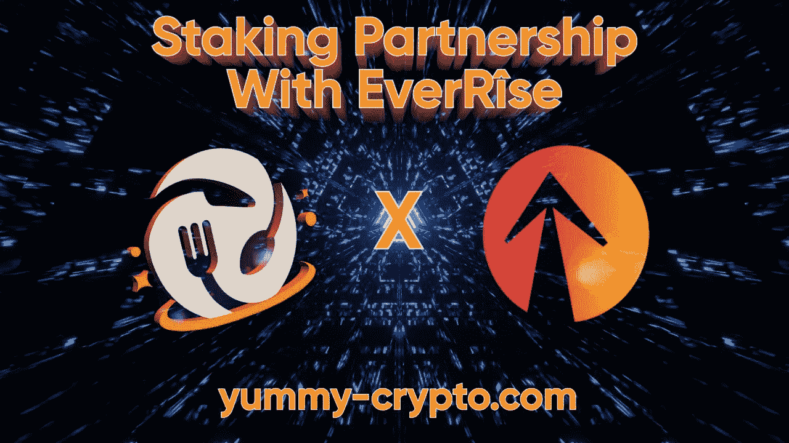
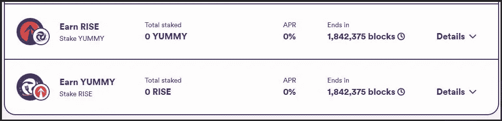

# 赌注合作伙伴公告:EverRise

> 原文：<https://medium.com/coinmonks/staking-partner-announcement-everrise-32e6150e8ef4?source=collection_archive---------11----------------------->

亲爱的社区:

我们非常荣幸地宣布我们的下一个赌注合作伙伴！🤝🏼🤝🏼

EverRise！

在
[staking.yummy-crypto.com](https://www.staking.yummy-crypto.com/)
赌上您今天的上涨，然后转到“合作伙伴”选项卡👍

如果你需要帮助使用我们的赌注平台，来我们的电报【https://t.me/yummyfinance
和管理员会帮你排序👍

*   EverRise Tokenomics
*   社会联系
*   打桩池
*   EverBridge 多边形

🔸**关于 EverRise** 🔸

EverRise 于 2021 年 6 月 15 日推出，是第一个将回购引入 crypto 的令牌。从那以后，回购机制已经成为无数分叉空间的标准。

RISE token 是一种多链加密货币令牌，为 EverRise dApp 生态系统提供动力。自动回购功能加强了 EverRise 流动性池，同时通过独立于团队监督或控制在公开市场上定期购买 Rise 代币来保护所有持有人，并通过将这些代币分配给赌注池来奖励长期持有人。

经审计的 EverRise smart 合同由 EverOwn 担保，确保在没有 RISE stakers 批准的情况下不能进行更改。

未来对智能合同的改进和编辑可能会通过 EverOwn 提出，并可能会在 RISE 治理令牌 veRISE 的持有人进行社区投票后实施。智能合约永远不会离开保险库，并且更改是完全透明的。

由 EverBridge 的技术提供动力，RISE token 可用于多个区块链(BNB 链、以太坊、多边形、Fantom 和 Avalanche)，所有链和平衡流动性池共享一个循环供应。持有者可以将代币移动到他们选择的链上。目标是:用一个协议统一 DeFi，保证所有区块链的安全和互连。

🔸 **EverRise Tokenomics** 🔸

关于 [EverSwap](https://app.everrise.com/everswap/swap) 的掉期:6%
EverRise 转让费 6%
关于其他平台的掉期 8%

**合同:**0x c 17c 30 e 98541188614 df 99239 cabd 40280810 ca 3**符号:**上升 **小数:** 18

🔸**社会联系**🔸

[网站](https://www.everrise.com/rise/) _ [电报](https://www.everrise.com/rise/) _ [推特](https://twitter.com/everrise)_[Youtube](https://www.youtube.com/channel/UCCDMjFJUr9OvV03I3wNX7lw)_[insta gram](https://www.instagram.com/everrisetoken/)_[不和](https://discord.com/invite/everrise) _ [脸书](https://www.facebook.com/EverRiseToken) _ [Reddit](https://www.reddit.com/r/EverRise)

🔸**打桩池**🔸

对于这种合作关系，我们将创建以下池:

赌注上升→赚取利润

Note: image does not represent realistic APR

赌注将在美国东部时间 5 月 5 日星期四下午 4 点左右开始。它们将持续 60 天，并对那些持有 NFT 的人进行 NFT 增强。请记住，完整的协议还没有完全完成，但我们将能够开始提供加强。最初将是空投而不是 self TX，因为 Self TX 的费用仍然太高。

增加的奖励将总是以美味的代币支付。因为完整的协议还没有完成，我们将每两周空投一次奖励。因此，无论你在这 2 周内收获了什么，都将被爬虫拾取，你将获得相当于$$的美味(价格平均超过 72 小时移动平均线)。另外，在这个池中下注时，请确保不要动你钱包中的 NFT 牌，最糟糕的情况是你拿不到奖金。我们的目标是完全完成 NFT 助推协议，使其像承诺的那样正常运行👍🏼

点击以下链接直接访问赌注平台，[staking.yummy-crypto.com](https://www.staking.yummy-crypto.com/)。

🔸**光大桥多边形**🔸

除了赌注池，我们还购买了 EverBridge dApp，将 Yummy 连接到 Polygon。成本是 15，000 美元，USDT 将发送后不久，这一宣布。

为什么是多边形？

因为从交易量来看，它是仅次于 BSC 的第二大非 ETH 连锁店，还因为它们正迅速成为许多革命性 dApps 的试验场。

多边形整合将成为煤渣的重要组成部分。在接下来的几周和几个月里会有更多的细节，

随着我们越来越接近赌注池，EverRise 和 Yummy 之间将会有交叉推广。敬请关注最新消息👍🏼👍🏼👍🏼

最好的，

美味团队！

> 加入 Coinmonks [电报频道](https://t.me/coincodecap)和 [Youtube 频道](https://www.youtube.com/c/coinmonks/videos)了解加密交易和投资

# 另外，阅读

*   [最佳密码交换平台](https://coincodecap.com/best-crypto-swap-platforms) | [最佳密码交易所](https://coincodecap.com/crypto-exchange)
*   [购买比特币印度](/coinmonks/buy-bitcoin-in-india-feb50ddfef94) | [Pionex 评论](/coinmonks/pionex-review-exchange-with-crypto-trading-bot-1e459d0191ea) | [加密交易机器人](/coinmonks/crypto-trading-bot-c2ffce8acb2a)
*   [n rave ZERO Review](/coinmonks/ngrave-zero-review-c465cf8307fc)|[phe MEX Review](/coinmonks/phemex-review-4cfba0b49e28)|[PrimeXBT Review](/coinmonks/primexbt-review-88e0815be858)
*   最佳[区块链分析](https://bitquery.io/blog/best-blockchain-analysis-tools-and-software)工具| [赚比特币](/coinmonks/earn-bitcoin-6e8bd3c592d9)
*   [Cloudbet 赌场评论](https://coincodecap.com/cloudbet-casino-review) | [点火赌场评论](https://coincodecap.com/ignition-casino-review)