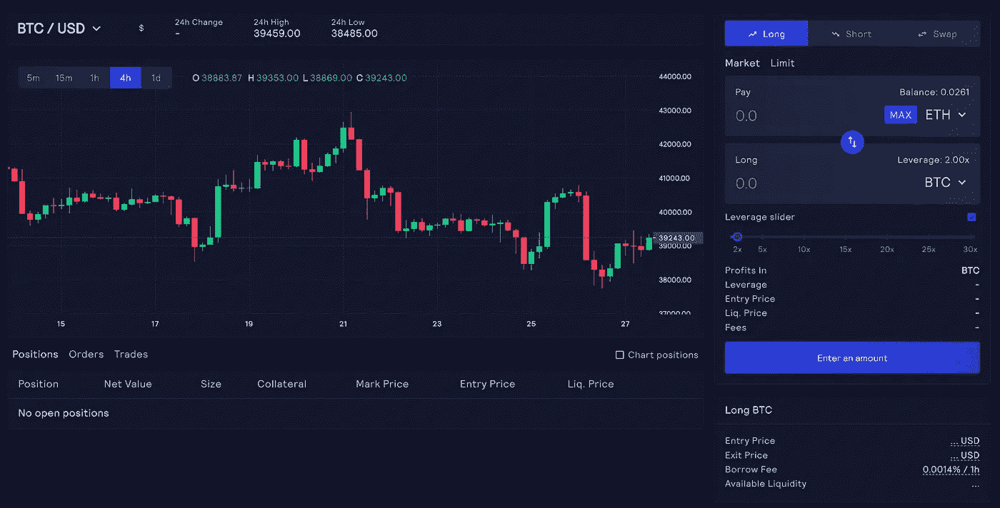
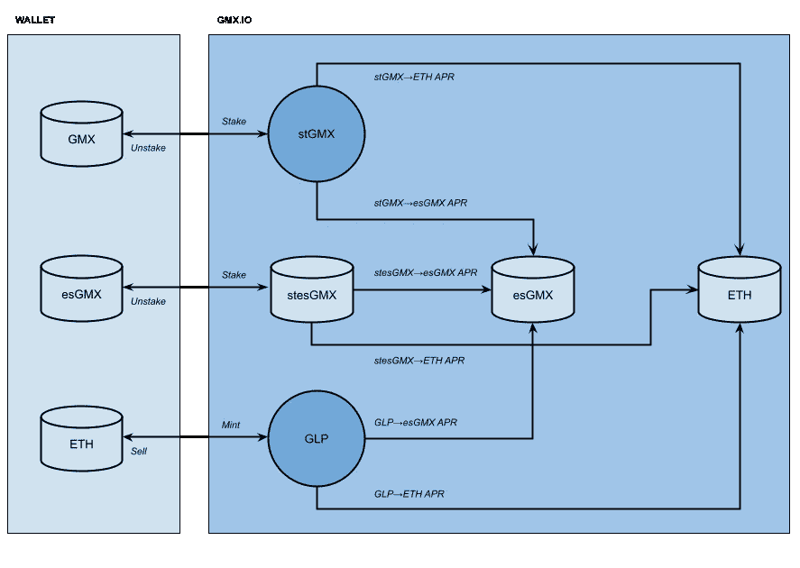

# 把奖金押在 GMX 身上。IO:全面演练

> 原文：<https://medium.com/coinmonks/staking-rewards-on-gmx-io-full-walk-through-8288adf77f16?source=collection_archive---------1----------------------->

gmx.io

*GMX 费用九折参观:*

*[*gmx.io*](https://gmx.io?ref=s0berknight) 是一个分散的永久交易所，提供一些有趣的收益率法明机会。例如， [gmx.io](https://gmx.io?ref=s0berknight) 原生代币 gmx 可以以 AVAX(或 ETH)的形式下注以获得 APR 奖励，同时以下注 GMX 代币的形式获得额外的 GMX。让我们通过一个具体的例子来理解屈服机制:*

*假设我们有 100 个 GMX 代币，我们将这些代币投入 [gmx.io](https://gmx.io?ref=s0berknight) 以获得 100 个 stGMX。我们将从 stGMX 获得两个独立的收益渠道:1)年利率为 16.88%的 esGMX 代币和 2)年利率为 5.18%的 AVAX 代币(撰写本文时由 gmx.io 报告)。*

*假设我们想每周复合回报。第一周之后，我们的奖励将等于:1) 100*0.1688/52=0.324 esGMX 代币，加上 2) 100*0.0518/52=0.099 已转换为 AVAX 代币的 GMX 代币。如果 AVAX 的价格是 80 美元，GMX 的价格是 29 美元，那么 0.099 个 GMX 代币将等于 0.099*29/80=0.035 个 AVAX 代币。*

*此外，相对于我们拥有的 stGMX 的多少，我们将以 100% APR 的固定比率每秒接收乘数点(MP)。因此，一周后，我们将应计:100*2/52 = 3.846 MP。*

*总之，在第一周的下注后，我们将获得 0.324 esGMX+0.035 AVAX+3.846 MP 的奖励。*

*让我们来看看如果我们在第一周之后“复合”我们的奖励会发生什么。复合智能合约做几件事:1)它将 AVAX 奖励转移到我们的钱包，2)它将奖励的 esGMX 作为赌注，3)它将 MP 作为赌注。因此，在复合后，我们的钱包中应该有额外的 0.035 AVAX，0.324 esGMX staked(让我们称之为 stesGMX)和 3.846 staked MP(让我们称之为 stMP)。*

**提升百分比(BP):* 提升百分比等于 stMP 相对于我们持有的 stGMX 加 stesGMX 的数量。这是一个简单的计算:BP = 3.846/(100+0.324)=3.83%。此 BP 将在第二周及以后添加到 AVAX 奖励中。这将有效地将我们的 AVAX 奖励百分比提高到:5.18*1.0383=5.37%。*

*总之，在第二周开始时，我们将有:100 ST gmx+0.324 stesGMX+0.035 AVAX(假设没有费用)+0.0 MP(因为 MP 计时器将重置)+3.846 stMP。我们的 AVAX 回报率将为 5.37%。让我们在第二周末计算我们的奖励。假设托管的 GMX APR 与上周相同，我们的奖励将等于:1) 100*0.1688/52=0.324 个 esGMX 令牌，加上 2) 100*0.0537/52=0.103 个已转换为 AVAX 令牌的 GMX 令牌。如果 AVAX 的价格仍然是 80 美元，GMX 的价格仍然是 29 美元，那么 0.103 个 GMX 代币将等于 0.103*29/80=0.037 个 AVAX 代币。我们本周多赚了 0.002 美元，耶！此外，我们将获得 3.846 MP。*

*我们还将获得前一周 stesGMX 的奖励。回想一下，我们在第一周之后有 0.324 stesGMX。这被视为 stGMX，因此我们将获得:1) 0.324*0.1688/52=0.001 esGMX 加 2)0.324 * 0.0537/52 * 29/80 = 0.0001 AVAX。因此，我们总共将获得:0.324+0.001=0.325 个 esGMX 令牌加上 0.037+0.0001=0.0371 个 AVAX 令牌。*

*如果我们在第二周之后复合，我们将有 3.846+3.846=7.692 stMP，这提高了我们的 BP:7.692/(100+0.324+0.325)= 7.64%。这又将我们的 AVAX APR 提高到:5.18*1.0764=5.57%。*

*两周后总结如下:*

*   *我们的平均年利率从 5.18%上升到 5.37%再到 5.57%，我们赚了 0.035+0.0371=0.072 平均年利率。*
*   *我们赢得了 0.324+0.325=0.649 stesGMX 代币。*

*以美元计算:我们的原始股本是 100 GMX = 2900 美元。我们(平均每周)从 AVAX 获得 0.072 * 80/2 = 2.88 美元，从赌注 esGMX 获得 0.649 * 29/2 = 9.41 美元。所以我们预测的 APY 是 52*(2.88+9.41)/2900=22%。毫不奇怪，22%符合 gmx.io earn 页面上公布的 APR 值。当然，通过每周复利计算，到今年年底，APY 应该会高于 22%。假设 AVAX 和 GMX 的价格不降！*

**下图显示了 gmx.io:* 上各种收益率之间的关系*

**

> *如果你喜欢这篇文章，并正在考虑使用 gmx.io，我会很感激你使用我的参考代码使用[这个链接](https://gmx.io?ref=s0berknight)。通过这种方式，平台将在交易中给我们双方折扣。双赢！*

*【https://app.gmx.io/#/trade/?ref=s0berknight】享受九折 GMX 费用游览:*

> **加入 Coinmonks [电报频道](https://t.me/coincodecap)和 [Youtube 频道](https://www.youtube.com/c/coinmonks/videos)了解加密交易和投资**

# **另外，阅读**

*   **[火币的加密交易信号](https://coincodecap.com/huobi-crypto-trading-signals) | [Swapzone 审查](/coinmonks/swapzone-review-crypto-exchange-data-aggregator-e0ad78e55ed7)**
*   **最佳[密码交易机器人](https://coincodecap.com/best-crypto-trading-bots) | [购买索拉纳](https://coincodecap.com/buy-solana) | [矩阵导出评论](https://coincodecap.com/matrixport-review)**
*   **[Coldcard 评论](https://coincodecap.com/coldcard-review) | [BOXtradEX 评论](https://coincodecap.com/boxtradex-review)|[uni swap 指南](https://coincodecap.com/uniswap)**
*   **[比特币基地评论](/coinmonks/coinbase-review-6ef4e0f56064) | [德里比特评论](/coinmonks/deribit-review-options-fees-apis-and-testnet-2ca16c4bbdb2) | [FTX 评论](/coinmonks/ftx-crypto-exchange-review-53664ac1198f)**
*   **[Coinmetro 评论](https://coincodecap.com/coinmetro-review) | [VirgoCX 评论](https://coincodecap.com/virgocx-review)**