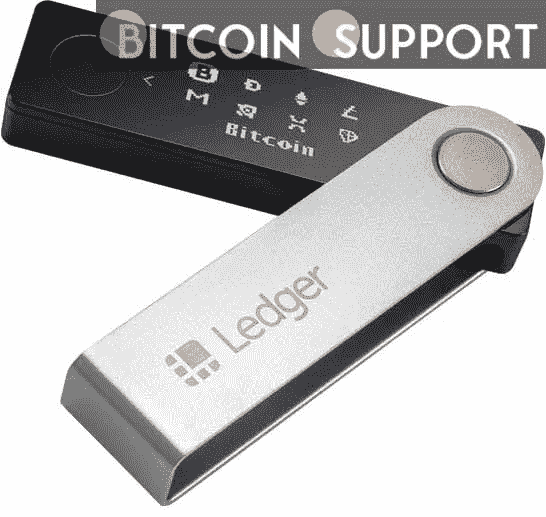

# 硬件赌注来自 Ledger 的代表解释了加密货币钱包的工作原理

> 原文：<https://medium.com/coinmonks/staking-with-hardware-a-representative-from-ledger-explains-how-cryptocurrency-wallets-work-a8a54f3bce09?source=collection_archive---------26----------------------->

**For full blog visit:-**[**https://bitcoinsupports.com/hardware-based-staking-a-ledger-executive-explains-how-crypto-wallets-operate/**](https://bitcoinsupports.com/hardware-based-staking-a-ledger-executive-explains-how-crypto-wallets-operate/)

据 Ledger Enterprise 的首席执行官称，使用硬件钱包进行赌注比使用软件钱包和加密交换提供了更好的安全性和独立性。随着加密货币赌注变得更加突出，不仅加密交易所或软件钱包，而且硬件钱包的赌注前景也越来越受欢迎。

根据定义，赌注允许投资者通过将加密货币委托给赌注验证器来支持区块链，从而在不出售其持有的情况下赚取加密货币。赌注法(staking method)的名字来源于单词“stake”，指的是使用一种被称为赌注证明(PoS)的共识机制从加密中赚取利润和被动收入，这与比特币基于采矿的工作证明(PoW)机制(BTC)相反。

在在线加密交易所和软件钱包中，赌注已经相当流行，随着 PoS 的日益流行，许多交易平台都在积极实施该选项。一些硬件钱包提供商还在他们的便携式物理设备中包括了赌注功能。自 2019 年推出以来，领先的硬件加密货币钱包提供商 Ledger 一直在积极扩展其加密功能。

Ledger 周一推出了 sola 的赌注，允许投资者通过向 sola 网络提交硬币来赚取 SOL。在与区块链服务 Figment 的合作中，该服务提供了使用分类帐验证器进行锁定的节点，新的锁定功能已在分类帐实时应用程序中激活。另外六种硬币，包括 ETH(以太)、Tezos (XTZ)、Polkadot (DOT)、Cosmos(原子)、algrand(ALGO)和其他硬币，现在可以在 Ledger Live 上下注。

# 硬件钱包与软件钱包和交易的较量

Ledger Enterprise 的首席执行官 Alex Zinder 表示，用硬件钱包下注硬币与用软件钱包或加密交易所下注有一些不同。

“押注软件钱包与押注硬件钱包之间的根本区别在于安全性，”津德尔解释说，并补充说，硬件钱包仍然是“消费者保持对数字资产完全控制的最安全解决方案。”

“当你用一个软件钱包下注时，你就拥有了你的硬币和你的私人钥匙，”Zinder 解释说，“但是你的硬币的安全性依赖于一个外部的安全来源。”这位高管表示，软件钱包中资金的安全性取决于用户的电脑或智能手机。

根据 Ledger 首席执行官的说法，通过硬件钱包下注，而不是加密交易所，允许投资者真正拥有和控制他们的加密资产，以及选择验证器的能力。另一方面，辛德表示，在交易所下注更简单，因为它涉及的程序更少。“要在不同的验证者之间做出选择，你不需要那么多的教育，”他继续说道。

# 即使有了硬件钱包，加密货币也是持续在线的

使用硬件加密钱包下注硬币的过程通常被称为“冷下注”，与通过交易所进行的“在线下注”相对，因为硬件加密钱包应该为加密提供一种离线存储。

然而，将加密货币放在硬件钱包中并不意味着加密货币离线。辛德提出了以下观点:

> 每个人都应该明白，即使在使用硬件钱包时，你的密码也总是在区块链上运行当我们谈论硬件钱包时，我们谈论的是保存在硬件钱包的受保护芯片上的私钥。"

“在签署交易时，比如将你的硬币委托给验证机，”这位高管解释说，“信息通过安全元件传输，在 Nano 上签署，然后上传到区块链。”

硬件钱包是一种非托管加密钱包，让用户完全控制他们持有的硬币。与保管钱包相比，非保管钱包不需要用户依靠第三方来检索、冻结或扣押他们的加密资产。为了访问加密资产，用户专门负责存储私钥。硬件钱包是一种存储加密货币钱包和私钥的设备。然而，用户也必须在脱机状态下保持私钥安全。

**完整博客访问:-**[**https://bitcoinsupports . com/hardware-based-staking-a-ledger-executive-explains-how-crypto-wallets-operate/**](https://bitcoinsupports.com/hardware-based-staking-a-ledger-executive-explains-how-crypto-wallets-operate/)

**免责声明:以上为作者观点，不应视为投资建议。读者应该自己做研究。**

> 加入 Coinmonks [电报频道](https://t.me/coincodecap)和 [Youtube 频道](https://www.youtube.com/c/coinmonks/videos)了解加密交易和投资

# 另外，阅读

*   [如何在 FTX 交易所交易期货](https://coincodecap.com/ftx-futures-trading) | [OKEx vs 币安](https://coincodecap.com/okex-vs-binance)
*   [CoinLoan 评论](https://coincodecap.com/coinloan-review) | [YouHodler 评论](/coinmonks/youhodler-4-easy-ways-to-make-money-98969b9689f2) | [BlockFi 评论](https://coincodecap.com/blockfi-review)
*   [XT.COM 评论](https://coincodecap.com/profittradingapp-for-binance)币安评论 |
*   [SmithBot 评论](https://coincodecap.com/smithbot-review) | [4 款最佳免费开源交易机器人](https://coincodecap.com/free-open-source-trading-bots)
*   [比特币基地僵尸程序](/coinmonks/coinbase-bots-ac6359e897f3) | [AscendEX 审查](/coinmonks/ascendex-review-53e829cf75fa) | [OKEx 交易僵尸程序](/coinmonks/okex-trading-bots-234920f61e60)