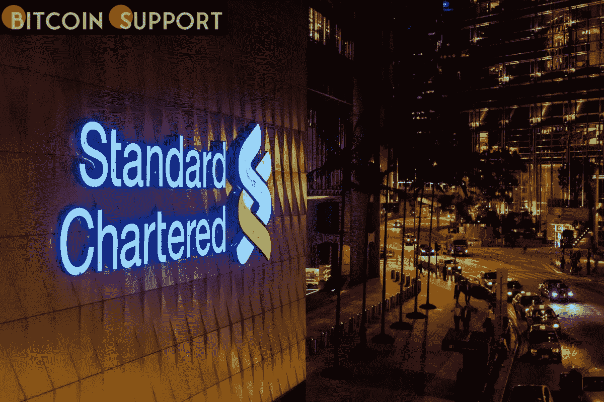

# 渣打银行进军元宇宙

> 原文：<https://medium.com/coinmonks/standard-chartered-bank-makes-a-metaverse-entrance-2d557cf00393?source=collection_archive---------15----------------------->

**Visit our website for full blog:-**[**https://bitcoinsupports.com/**](https://bitcoinsupports.com/)

渣打银行是最新一家进入元宇宙的大型金融机构。该行已经收购了“沙盒元宇宙(Sandbox Hong Kong)特大城市区的虚拟土地，这是一个基于香港人才或受其启发的文化中心。”

渣打银行进军元宇宙

渣打银行周二表示，其子公司渣打银行(香港)有限公司(SCBHK)已与区块链著名虚拟游戏平台沙盒(Sandbox)合作，“打造元宇宙体验”

渣打银行是一家市场领先的全球性银行，拥有约 85，000 名员工，为近 150 个国家的客户提供服务。它在全球经营着 776 家分支机构。据该银行称，它是第一家收购“元宇宙大都会区沙盒中的虚拟土地，这是一个基于香港人才或受香港人才启发的文化中心”渣打集团的创新、金融科技投资和风险资本部门 SC Ventures 是该计划的先锋。

**公告包含以下信息:**

SCBHK 将与客户、合作伙伴、员工和 IT 社区积极合作，以探索这一令人兴奋的新领域的共同创造潜力。新闻稿称，该银行打算为客户试验和创造新的体验，并将“当地的体育和艺术社区与元宇宙联系起来”。

渣打风险投资董事总经理 Alex Manson 补充道:

我们多年来一直在开发加密和数字资产的商业模式，并将元宇宙的出现视为 Web3.0 发展的一个重要里程碑。进入元宇宙的其他大型银行和金融服务机构包括摩根大通、汇丰银行和富达投资。汇丰也通过与沙盒的合作进入了元宇宙，而摩根大通和富达选择了分散的土地。元宇宙很可能在未来几年急剧扩张。花旗集团上个月预测，到 2030 年，元宇宙可能是一个 13 万亿美元的机会，拥有 50 亿用户。世界上最大的两家投资公司高盛和摩根士丹利估计，元宇宙代表着 8 万亿美元的机会。

**访问我们的网站获取完整博客:-**[**https://bitcoinsupports.com/**](https://bitcoinsupports.com/)

**免责声明:以上为作者观点，不应视为投资建议。读者应该自己做研究。**

> 加入 Coinmonks [电报频道](https://t.me/coincodecap)和 [Youtube 频道](https://www.youtube.com/c/coinmonks/videos)了解加密交易和投资

# 另外，阅读

*   [印度最佳 P2P 加密交易所](https://coincodecap.com/p2p-crypto-exchanges-in-india) | [柴犬钱包](https://coincodecap.com/baby-shiba-inu-wallets)
*   [8 大加密附属计划](https://coincodecap.com/crypto-affiliate-programs) | [eToro vs 比特币基地](https://coincodecap.com/etoro-vs-coinbase)
*   [最佳以太坊钱包](https://coincodecap.com/best-ethereum-wallets) | [电报上的加密货币机器人](https://coincodecap.com/telegram-crypto-bots)
*   [交易杠杆代币的最佳交易所](https://coincodecap.com/leveraged-token-exchanges) | [购买 Floki](https://coincodecap.com/buy-floki-inu-token)
*   [3Commas 对 Pionex 对 Cryptohopper](https://coincodecap.com/3commas-vs-pionex-vs-cryptohopper) | [Bingbon 评论](https://coincodecap.com/bingbon-review)