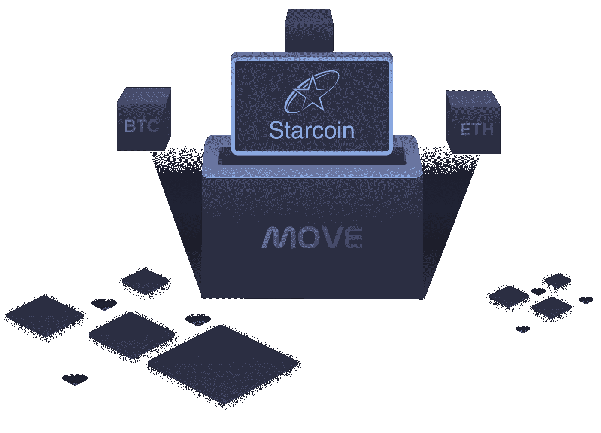
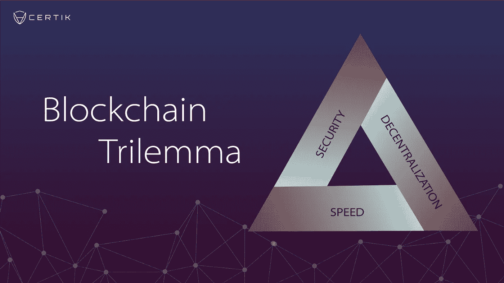
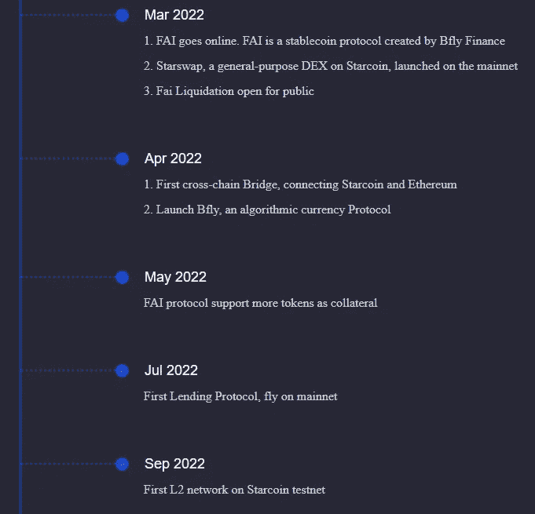
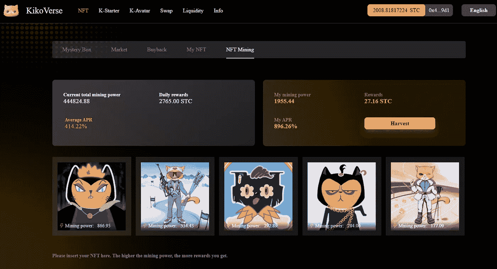
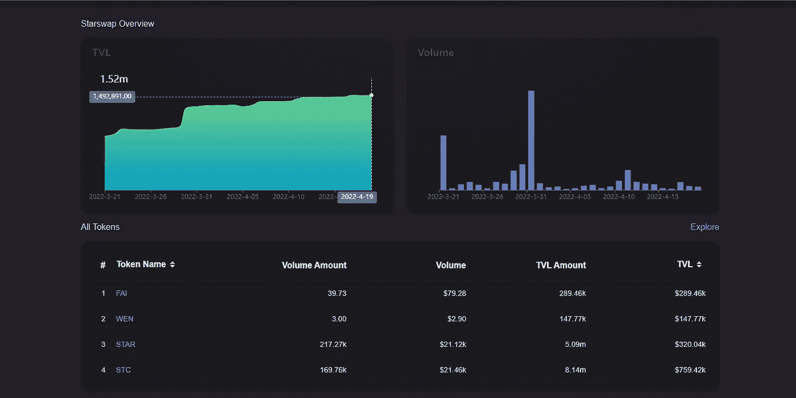

# (✨,✨) Starcoin:一个完全去中心化、开源的多层区块链，建立在 PoW 之上

> 原文：<https://medium.com/coinmonks/starcoin-a-fully-decentralized-open-sourced-multi-layered-blockchain-built-on-pow-9b8fdbda7a21?source=collection_archive---------30----------------------->

与会产生单点故障并因此充满漏洞的集中式利害关系证明区块链不同，Starcoin 运行于工作证明之上，这是一种久经考验的加密范式，用于对网络上的交易进行分散验证。这是 L1 可以处理约 4600 TPS 的快如闪电的终结。

Move 最初由脸书开发，是基于 Rust 的下一代面向资源的编程语言，旨在开发可定制的事务逻辑和智能契约。它的最高优先级围绕安全和保障，确保资产可以被克隆，以确保数字资源的有效性。

最初由 Vitalik Buterin(以太坊的创始人)提出，区块链三难困境是加密领域理论上可解决的困境，它围绕三个原则:*去中心化、速度、安全*。求解等式的一部分会导致其他部分的成本，反之亦然。

星币是为数不多的解决了区块链难题的区块链之一。通过工作区块链的分层证明，全球共识在基础层上实现，而安全的、正在开发的 zkrollup 将本地共识从 L2s 传达给 L1。它甚至计划开发自己的 Web3 命名服务。

在采用之前，Starcoin 正在努力推出其首款 L2，预计将于 2022 年第三季度推出。更值得注意的是，Starcoin 几乎要通过星际之门发布它的第一座通往以太坊的桥梁:连接 Starcoin 和以太坊，以便在两个区块链之间桥接本地资产。

尽管其[目前的市值](https://coinmarketcap.com/currencies/starcoin-stc/)未经核实，但 Starcoin 已经有一个小而强大的生态系统在它的 L1 上蓬勃发展，包括两个 NFT 市场&一套正在开发的 NFT 游戏:[cyber rare](https://www.cyberrare.io/#/home)&[kikovis](https://kikoverse.com/)。

你听说过 NFT 矿业吗？Due Move 的内在品质，如 NFT 矿业，采矿收益支付给用户的股份 NFT，在星币区块链是司空见惯的。

最近于 2022 年推出的 [Starswap](https://starswap.xyz/#/swap) 是 Starcoin 区块链上的主要互换& dex，在撰写本文时 TVL 为 150 万，包括基本的预期互换功能以及 LP farming &原生 dex 令牌$STAR 的单边流动性赌注。到第三季度，Starswap 将推出限价交易和其他令人兴奋的新功能。

在这位拙作作者看来，Starcoin 是一个在正式采用之前进行构建的无声刺客，同时巧妙地避免被机构和风投选中，展示了基于健壮的编程语言 move 从头构建的独特 dapps 的健壮甜蜜。在它的第一座桥连接到以太坊和 TVL 天空火箭之后，这个项目进入平流层只是时间问题。

(✨,✨) ~任

> 加入 Coinmonks [电报频道](https://t.me/coincodecap)和 [Youtube 频道](https://www.youtube.com/c/coinmonks/videos)了解加密交易和投资

# 另外，阅读

*   [币安 vs FTX](https://coincodecap.com/binance-vs-ftx) | [最佳(SOL)索拉纳钱包](https://coincodecap.com/solana-wallets)
*   [如何在 Uniswap 上交换加密？](https://coincodecap.com/swap-crypto-on-uniswap) | [A-Ads 评论](https://coincodecap.com/a-ads-review)
*   [加密货币储蓄账户](/coinmonks/cryptocurrency-savings-accounts-be3bc0feffbf) | [YoBit 审核](/coinmonks/yobit-review-175464162c62)
*   [Botsfolio vs nap bots vs Mudrex](/coinmonks/botsfolio-vs-napbots-vs-mudrex-c81344970c02)|[gate . io 交流回顾](/coinmonks/gate-io-exchange-review-61bf87b7078f)
*   [CoinFLEX 评论](https://coincodecap.com/coinflex-review) | [AEX 交易所评论](https://coincodecap.com/aex-exchange-review) | [UPbit 评论](https://coincodecap.com/upbit-review)
*   [AscendEx 保证金交易](https://coincodecap.com/ascendex-margin-trading) | [Bitfinex 赌注](https://coincodecap.com/bitfinex-staking) | [bitFlyer 审核](https://coincodecap.com/bitflyer-review)
*   [Bitget 回顾](https://coincodecap.com/bitget-review)|[Gemini vs block fi](https://coincodecap.com/gemini-vs-blockfi)cmd |[OKEx 期货交易](https://coincodecap.com/okex-futures-trading)