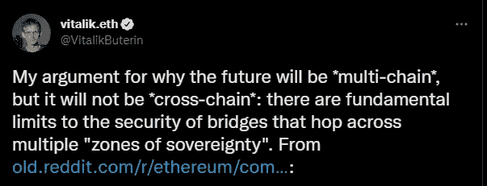
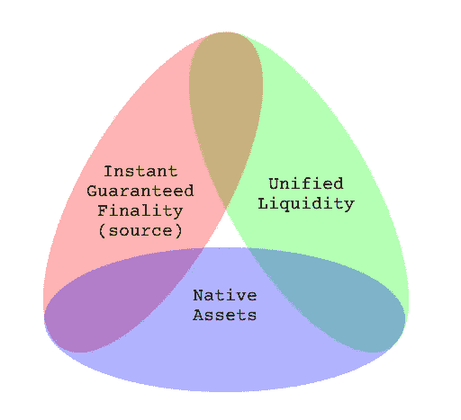
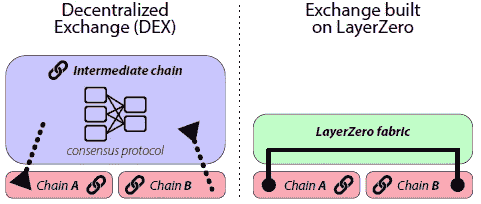
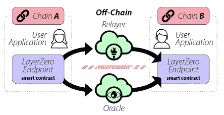
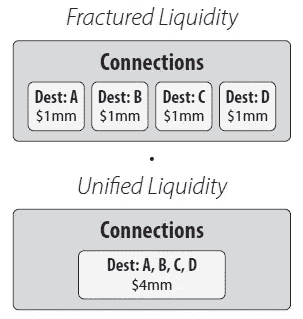

# 星际之门——多链宇宙的下一代

> 原文：<https://medium.com/coinmonks/stargate-the-next-generation-c455c85d60e2?source=collection_archive---------11----------------------->

The future is multi-chain

***不想读了？*** [***此处***](https://twitter.com/tradfichad/status/1509105863486844928?s=20&t=elql3VFs3IM-RxhLWypf7w) ***碎碎念:***[https://twitter.com/tradfichad](https://twitter.com/tradfichad)

## **问题**

在 DeFi 中，流动性是王道。在获取流动性方面最成功的协议也往往是总体上最长久的。这意味着建筑商不得不花更多的时间在激励流动性的方法上。然而，随着新的链和协议的出现，由于缺乏互操作性，流动性变得越来越分散，将用户困在特定的生态系统中，并为采用新的协议设置了障碍。

## **当前景观**

如果说没有任何解决跨链流动性的方案，那就是在淡化我们在这方面已经取得的进展。没有桥和多链网络，就不会有 Bridgor，像我这样的 chad 会发现很难跨越链去模仿 alpha。所以如果我们有所有这些，为什么零层和星际之门？好吧，让我们从今天的交叉链桥的一些问题开始。

1.  有保证的终结性取决于目的地链上的流动性可用性。这导致了可扩展性方面的挑战，因为流动性池将需要呈指数级增长，以跟上令牌覆盖范围。
2.  使用中间或包装代币，造成进一步的流动性分散(单一资产的不同包装版本)，运营效率低下，以及由于协议执行的额外步骤而导致的更高的汽油费用。
3.  很大程度上限于跨链桥接相同的资产和特定的链组，从而要求用户为跨资产交换执行额外的交易。这再次导致更多的时间浪费和更多的钱花在汽油费上。

作为示例，我在下面列出了这一领域中一些比较流行的协议:

**多链(桥)**

像 Multichain 这样的桥使用锁+铸造和烧+赎回模式来促进跨链转移。这依赖于中间合成资产($any)的使用，并存在一些限制，如缺乏 1)统一的流动性:资产流动性分散在各个链中，以及 2)缺乏可组合性:没有跨资产桥接的能力。

例如，在从雪崩到凡托姆的多链上的$USDC 桥将涉及铸造一个合成的$anyUSDC 代币，然后在凡托姆上燃烧并兑换为$USDC。万一出现流动性不足的情况，最终用户就会被$anyUSDC 代币套牢，然后随着流动性的流动，不得不在 Fantom 上手动将这些代币兑换成$USDC。要获得$FTM，用户必须在 DEX 上将$USDC 换成$FTM。

**门户(桥梁)**

传送门，一个基于虫洞的桥使用与多链相似的机制。不同之处在于，中间虫洞包装的资产不依赖于锁定在桥中的流动性量。相反，赎回与各种流动性市场挂钩，如 Curve、Uniswap、Trader Joe 等。这使得它与多链相比具有更高的可扩展性。像多链一样，使用中间虫洞包裹的资产会导致操作效率低下。

然而，较少讨论的特性之一是 xAssets(类似于多链上的$MIM ),它是完全交叉链可替换的。这一功能目前已在$UST 和$猎户座上启用，而$FRAX 正在筹备中。虽然它消除了对双重包装的需要，但是存在一些限制，因为由于跨链的冲突包装版本的数量以及用户需要采取额外的步骤来在目的链上交换他们想要的令牌，所以它难以在诸如$ETH 的令牌上实现。

**THORchain(德克斯)**

THORchain 协议是用 Tendermint 和 Cosmos SDK 构建的节点网络。通过使用$RUNE 配对流动性池和一系列原生资产节点(比特币、以太坊等。).这种机制使 THORchain 比没有通用交换媒介的流动性池更具可扩展性，因为池的数量会随着货币数量的平方而减少。通过这个，用户可以在以太坊上进行一键兑换$USDC 到$月神(USDC 通过以太坊节点兑换$月神。$RUNE 通过 Terra node 换成$LUNA)。

然而，缺点是中间代币的使用仍然固有地麻烦，因为它是两步过程，并且需要足够的流动性来促进交易。这既费时又费钱。

## **星际之门——下一代**

在查看了当前 DeFi 生态系统中一些更流行的协议之后，很明显，跨链交换仍然相对繁琐和低效。这就是 Stargate 的用武之地——一个完全可组合的本地资产桥梁，具有统一的流动性和即时保证的终结性。

星际之门建立在 LayerZero 上，这是一个支持全链条应用的通信原语。不使用中介，链可以使用 LayerZero 直接相互发起通信和交易，而不使用中介。对于互换，交换协议由两个链上的智能合约处理，LayerZero 充当消息传递系统。

星际之门解决了桥接的三难困境:

1.  即时终结:当事务提交到源链时，在目标链上保证资金。
2.  统一流动性:多个链之间共享流动性。
3.  本地资产:目标链上用户所需的资产(本地资产或最具流动性的合成资产)

**瞬间终结**

虽然实现即时终结是所有桥都需要实现的，但 LayerZero 的δ桥通过使用 Oralces 和 Relayers 实现了这一点，允许在不使用中间令牌或中间链的情况下进行无信任的全链通信。核心区别在于，这是链不可知的，有助于解决统一流动性的问题，我将在下面介绍。

**统一流动性/本土资产**

在现有的桥接模型中，流动性池在目的地链之间被分割，需要将中间令牌交换为所需的本地资产。LayerZero 算法解决了这个问题，同时通过使用软分区保持即时保证的终结性。LazyerZero 白皮书中提供的一个例子如下。

在由链 X、Y 和 Z 组成的网络中，链 X 上本地可用的 100 美元流动性将被软划分为属于链 Y 的 50 美元和属于链 Z 的 50 美元。

关键特性是能够在软分区之间借入和归还流动性，并通过利用 LayerZero 通信层来避免透支或竞争情况。在任何一个链出现赤字的情况下，来自其他链的资金被分配来弥补这一点。此外，每个源链跟踪网络中每个其他链的信道带宽的估计，从而确保这种平衡不会超过信道带宽，以保证每个交易有足够的流动性。

## **暗示…**

LayerZero 的另一个独特特性是跨链可组合性，允许在同一事务中与源链和目的链上的智能合约进行交互，即在同一事务中进行桥接和交换。

可能性是无限的:

1.  1 次点击交易
2.  减少单边资产池的非永久性损失
3.  通过避免中间链/令牌降低协议风险
4.  多链通信

这是一个游戏改变者，将创造一个全新的一代复杂的 DeFi 协议。其实有[寿司跨 7 家连锁店整合 Stargate 的提议。鉴于 Stargate 是目前唯一的 LayerZero 协议和 35 亿美元的 TVL，未来看起来很美好。](https://forum.sushi.com/t/enter-the-stargate-omnichain-strategy/9741/2)