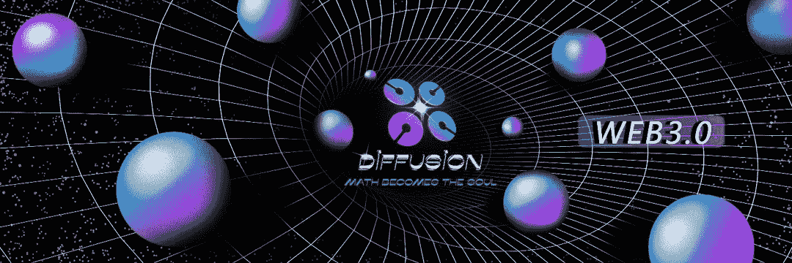
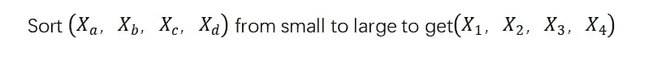
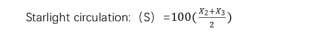

# 星光——扩散道的修改器

> 原文：<https://medium.com/coinmonks/starlight-modifier-for-diffusiondao-feb93ebed494?source=collection_archive---------49----------------------->

扩散道为自己的发展设计了三个阶段，分别是星光、裙带、百万国。星光阶段是初级阶段，是每个 web3 原住民重新认识加密资产的新时代。我们会发现，单一货币资产无法起到宏观调控的作用，因此在不同时期赋予不同的代币不同的价值属性进行调节。星光与 DFS 的交换比例一直是 400:1，星光的发布方式是基于社交平台粉丝在关注度因子中的中位数。我们相信每一个扩散道关注者都会同时关注扩散道的四大平台。Telegram、Discord、Twitter、Medium 和 DiffusionDAO 会根据这个注意力指标发布液体代币。中位数的计算如下:(中位数是数组中间值的平均值)

发行量每天解锁，根据社区提案规则投票。星光的价值在于灵感、互动和吸引注意力的动机。这也是信息经济中第一种基于注意力产生的加密货币。

> 加入 Coinmonks [电报频道](https://t.me/coincodecap)和 [Youtube 频道](https://www.youtube.com/c/coinmonks/videos)了解加密交易和投资

# 另外，阅读

*   [3 商业评论](/coinmonks/3commas-review-an-excellent-crypto-trading-bot-2020-1313a58bec92) | [Pionex 评论](https://coincodecap.com/pionex-review-exchange-with-crypto-trading-bot) | [Coinrule 评论](/coinmonks/coinrule-review-2021-a-beginner-friendly-crypto-trading-bot-daf0504848ba)
*   [莱杰 vs n rave](/coinmonks/ledger-vs-ngrave-zero-7e40f0c1d694)|[莱杰 nano s vs x](/coinmonks/ledger-nano-s-vs-x-battery-hardware-price-storage-59a6663fe3b0) | [币安评论](/coinmonks/binance-review-ee10d3bf3b6e)
*   [Bybit Exchange 审查](/coinmonks/bybit-exchange-review-dbd570019b71) | [Bityard 审查](https://coincodecap.com/bityard-reivew) | [Jet-Bot 审查](https://coincodecap.com/jet-bot-review)
*   [3 commas vs crypto hopper](/coinmonks/3commas-vs-pionex-vs-cryptohopper-best-crypto-bot-6a98d2baa203)|[赚取加密利息](/coinmonks/earn-crypto-interest-b10b810fdda3)
*   最好的比特币[硬件钱包](/coinmonks/hardware-wallets-dfa1211730c6) | [BitBox02 回顾](/coinmonks/bitbox02-review-your-swiss-bitcoin-hardware-wallet-c36c88fff29)