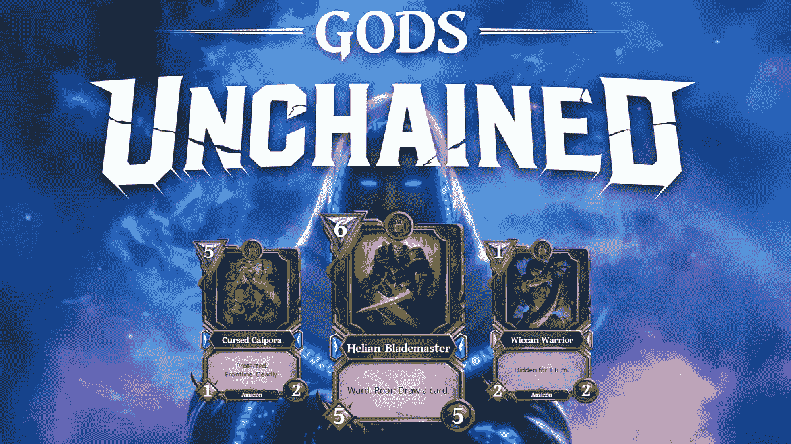
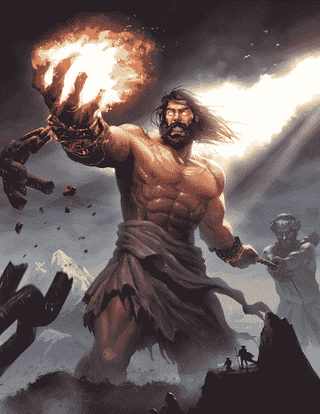
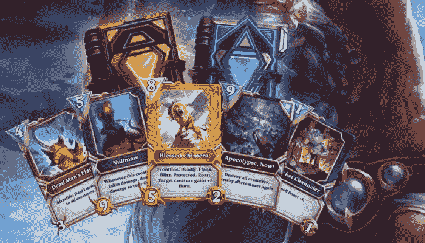

# 像《被解放的上帝》一样发展 NFT 市场，开创稳固的事业

> 原文：<https://medium.com/coinmonks/start-a-solid-business-by-developing-an-nft-marketplace-like-gods-unchained-7fa5b2090749?source=collection_archive---------20----------------------->

NFT Marketplace like Gods Unchained

目前，游戏产业已经成为数字空间发展的基石。不管它对数字世界的影响如何，游戏行业都在不断发展，并随着当前的趋势升级其核心。现在，他们正在利用 NFTs 和区块链网络的实力来创造一个庞大的产品，被认为是整个游戏行业的革命。最近有各种基于 NFTs 概念的新游戏发布。

印象最深的是**诸神解放游戏**。这款游戏为所有想在游戏行业发展业务的人树立了标杆。这个领域最令人印象深刻的事情是，你可以开发一个[**NFT 市场，就像《被解放的神》**](https://bit.ly/3LCJrVC) 一样，并使它成为一个游戏和一个 NFT 市场业务，都在同一个域中。这是从所有可能的角度获得利润和回报的真正定义。

## **为什么 NFT 游戏在数字领域蓬勃发展？**

过去，游戏平台在涉及到**盈利**时，只关注开发者和公司；不是反过来。因此，NFTs 和区块链技术为玩家在玩游戏的同时赚钱铺平了道路。由此，杜撰了这个术语，现在称为 [**【玩赚】**](https://bit.ly/3wF2avx) **。**

## NFT 奥运会的好处

☀在游戏中保存数据是一项非常重要的任务。当面临立即关机时，游戏数据往往会被删除。对于 NFT 博彩业来说，情况并非如此。这是由于利用了区块链网络。完整的游戏数据被保护在数字账本上，并且在游戏突然关闭时不会导致保存的数据被删除。

☀赚取利润是玩 NFT 游戏的主要目的，随着区块链网络的实施，以及在同一个区块链网络下工作的游戏允许在系统内进行 NFT 的网间交易。

☀区块链奥运会的透明度令人难以置信。存储关于收藏品交易的完整数据和信息。因此，允许每个游戏者看一看它们，并避免由对手游戏者强加的不公平优势。

Gods Unchained NFT Marketplace

## **被解放的神-解释**

[**《诸神被解放》**](https://godsunchained.com/) 是一款基于区块链的游戏。这个游戏包括基于交易卡的游戏。游戏中的交易卡用 NFTs 来表示。因此，玩家可以在平台上进行交易以获取利润。但是，这个游戏的关键部分是玩家必须参加每周的锦标赛才能赢得这些 NFT。这样，NFTs 的交易量将受到限制，网络拥塞将得到稳定。这个游戏是建立在**以太坊区块链**上的，此外，它使用了一个名为不可变 X 的分散式交易所来支持成千上万的 NFT 进行日常交易，最重要的是，这个交易所只使用了总网络的 30%，从而提高了交易的速度。

《被解放的神》有自己的 ERC20 令牌，叫做**神令牌**。这些代币为游戏中发生的每一笔交易奠定了基础。这些代币作为游戏中的现金，供玩家在游戏中购买皮肤和其他游戏收藏品。这些代币由数字空间中的各种加密货币交易所出售。因此，通过持有这些代币，玩家可以购买收藏品来升级他们的游戏并赢得更多的 **NFT 卡**；增加以后获得更多利润的机会。

Gods Unchained Trading Cards

## **NFT 市场像神仙一样不受束缚地发展**

游戏世界的商机正在迅速增加。有各种各样的游戏可以用于商业。印象最深的是《诸神的解放》游戏。就像其他的 NFT 开发一样，企业主应该联系一家游戏开发公司，创建一个 [**NFT 市场，就像《被解放的神》**](https://bit.ly/3LCJrVC) 。

## **最后的想法，**

目前， **NFT 博彩业务**正在成为顶级业务发展。各种各样的商业平台正在进入数字空间。因此，现在是时候创建一个像上帝一样的 NFT 市场，并在 NFT 游戏发展机构的帮助下探索巨大的利润水平。

> 加入 Coinmonks [电报频道](https://t.me/coincodecap)和 [Youtube 频道](https://www.youtube.com/c/coinmonks/videos)了解加密交易和投资

# 另外，阅读

*   [Bookmap 点评](https://coincodecap.com/bookmap-review-2021-best-trading-software) | [美国 5 大最佳加密交易所](https://coincodecap.com/crypto-exchange-usa)
*   最佳加密[硬件钱包](/coinmonks/hardware-wallets-dfa1211730c6) | [Bitbns 评论](/coinmonks/bitbns-review-38256a07e161)
*   [新加坡十大最佳加密交易所](https://coincodecap.com/crypto-exchange-in-singapore) | [购买 AXS](https://coincodecap.com/buy-axs-token)
*   [红狗赌场评论](https://coincodecap.com/red-dog-casino-review) | [Swyftx 评论](https://coincodecap.com/swyftx-review) | [CoinGate 评论](https://coincodecap.com/coingate-review)
*   [投资印度的最佳密码](https://coincodecap.com/best-crypto-to-invest-in-india-in-2021)|[WazirX P2P](https://coincodecap.com/wazirx-p2p)|[Hi Dollar Review](https://coincodecap.com/hi-dollar-review)
*   [加拿大最佳加密交易机器人](https://coincodecap.com/5-best-crypto-trading-bots-in-canada) | [库币评论](https://coincodecap.com/kucoin-review)
*   [OKEx vs KuCoin](https://coincodecap.com/okex-kucoin) | [摄氏替代品](https://coincodecap.com/celsius-alternatives) | [如何购买 VeChain](https://coincodecap.com/buy-vechain)