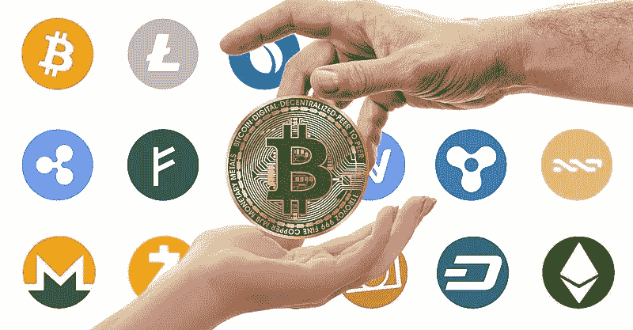
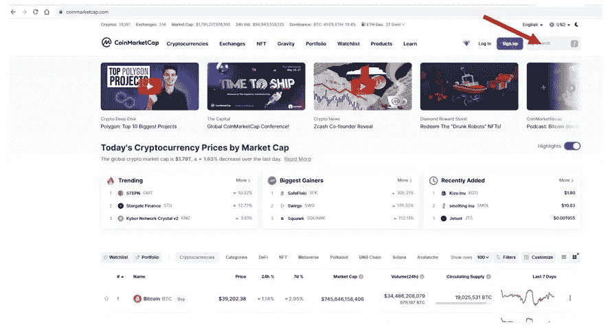

# 开始您的加密货币之旅

> 原文：<https://medium.com/coinmonks/starting-your-cryptocurrency-journey-542311dd7f82?source=collection_archive---------62----------------------->

毫无疑问，加密货币获得了巨大的人气，这并不是因为比特币的表现。对很多人来说，比特币和加密货币是一样的，因为他们倾向于交替使用这两个词。最有可能的是，加密货币领域的新手也属于这一类。

首先，请允许我改变你对加密货币等同于比特币的看法。加密货币是一种基于区块链技术的数字资产(货币)，通过称为挖掘的过程，利用称为密码术的计算机概念。
密码术可被描述为对安全通信技术的研究，该技术仅允许消息的发送者和预期接收者查看其内容。这个词的意思是隐藏的，它来自希腊单词 kryptos。

**通常使用的密码技术类型**

*   对称密钥加密。
*   哈希函数。
*   公钥加密/非对称密钥。

基本上，区块链使加密货币被开采、存储在分散的服务器上并从一个人安全地发送到另一个人(点对点)成为可能。为了避免重复消费，加密货币需要经过矿商的确认，确认结束后，指定的金额将被发送给预期的接收者。

比特币无疑是最受欢迎的加密货币，但它不是唯一的加密货币。在撰写本文时，coinmarketcap 上注册的加密货币不少于 10，073 种。
要提高您对不同加密货币的了解，请访问以下网站:
1。[https://coinmarketcap.com/](https://coinmarketcap.com/)2。[https://www.coingecko.com](https://www.coingecko.com)

让我们来看看 coinmarketcap 上的前 10 种加密货币。
见下图:

你会观察到比特币是台面上的第一个。这是因为，它是加密空间中资本基础(市值)最高的加密货币。
看一下表头，你会看到这样的标签:名称、价格、24 小时%、7d%、市值、成交量(24 小时)、流通供应量。

我会尽力解释使用比特币意味着什么。
从表中来看，比特币占据了第一的位置，有以下几个 tokenomics:
价格:这是感兴趣的 crypto 的当前价格。在这种情况下，比特币的平均市值为 40，039.68 美元。比特币或任何其他加密货币的实际价格因平台而异。随着价格的变化，你可以利用所谓的套利。套利是一种通过在一个交易所以较低价格购买加密资产，并在另一个交易所以较高价格出售加密资产来赚钱的方式。

**24 小时%** :这是过去 24 小时内价格变化的百分比。在这种情况下，3.37%

**7d%** :这是过去 7 天的价格变化百分比。本例中为 5.78%。

**市值**:这是加密货币的总市值。截至截屏时，比特币的市值为 748，982，493，750 美元。这个数量随时都在变化，因为它是你用当前市场价格乘以流通供应量得到的数量。由于市场价格因波动性而不断变化，你也会期望市值也不断变化。点击这里阅读更多关于波动性的内容。

**成交量(24hr)** :这是过去 24 小时内加密货币的交易总量。在本例中，过去 24 小时内共交易了 802，976 BTC，交易量总计为 31，612，263，346 美元。

**流通供应量**:流通供应量是当前流通的给定加密货币的总数。在撰写本文时，总共已经开采了 19，024，743 枚 BTC，目前正在流通。

**加密货币的类型** 加密货币是根据加密货币被创造出来的目的来分类的。以下是我们的一些主要类别:

1.  价值/货币存储，如比特币、莱特币等。
2.  利益证明，例如以太坊
3.  工作证明，例如以太坊、Doge
4.  智能合同，例如以太坊、BNB、ADA
5.  NFT，例如 Ape、Theta、Gmt、Flow、Gala、Omi、Slp、Wax
6.  元宇宙比如无限轴(AXS)，沙盒(沙子)，分散的土地(法力)
7.  Defi。点击阅读更多关于 Defi [的内容。](/coinmonks/decentralized-finance-defi-650c2d0dd9a9)
8.  生产农业代币，例如 Aave、Tron 等
9.  实用令牌，例如图形、曲线、金恩、Yfi、LBlock
10.  迷因或笑话硬币，如埃隆，瓦坎达，柴巴 INU
11.  物体，如 SIA，法力
12.  资产，例如 USDT——点击此处阅读有关 USDT 的更多信息，Gold GLC

**如何入门**
1。决定你想投资哪一类加密货币。
2。知道你感兴趣的加密货币在哪个交易所上市。
3。在加密货币上市的交易所注册。
可以在以下任意一家交易所注册:[币安](https://accounts.binance.com/en/register?ref=PW058YI3)、[雷米塔诺](https://remitano.net/btc/ng/join/147339)、 [Bybit](https://www.bybit.com/en-US/invite?ref=M97M3) 、FTX、Okex、火币、信托钱包、比特币基地、北海巨妖、Luno、
4 .向您的帐户注入资金，然后进行购买。

如何知道一种加密货币在哪家交易所上市
1。拜访[https://coinmarketcap.com/](https://coinmarketcap.com/)
2。在搜索框中搜索硬币/密码，或者从长长的加密货币列表中找到硬币。让我们在这个例子中使用 USDT

3.从搜索结果中点击加密货币

4.点击市场

5.见表格标题“来源”下列出的交易所

**买了你的第一个加密货币后要做什么**
1。你可以短期/中期/长期保存它。然而，你必须确保你不会以低于成本价的价格出售。当然，除非你有紧急情况，需要你迅速筹集一些现金。
在加密货币中赚钱需要耐心，因为这里推崇低买高卖的基本经济原则，而价格上涨需要时间。
2。可以做套利交易。通过做一些研究，你可以了解不同交易所出售的特定加密货币的价格。在这些交易所注册，并在提供更高价值的交易所以更高的价格出售。
3。你可以 HODL。对 HODL 来说，只要你有足够的耐心，就要一直持有你的数字资产。然后，你可以决定在价值已经升值时，在你对利润率感到满意的任何时候卖出。
4。你可以下注你的加密货币
一些加密交易所或平台提供下注服务。当您下注一枚硬币时，它在下注期间是锁定的，在此期间您无法使用它，但是在下注期结束时，商定的%会返还给您。

5.你可以用你的加密货币种植其他代币
一些平台允许你发送你的加密货币，在给定的时间内锁定它，而你可以不时地获得其他代币，然后你锁定的加密货币会被释放给你。

6.你可以提供本地交换服务
为了能够做到这一点，你必须得到信任。因为除非人们信任你，否则他们不会把资金交给你。
例如，你可以在币安以 396 美元的价格买入 BNB，然后以 450 美元的价格卖给希望买入的朋友或任何其他联系人，这样你的利润率就是 54 美元。

这是人们在加密领域赚钱的方式，还有很多其他方式

如需进一步查询、澄清或专业聘用/合同
联系人:
邮件:akanfeoluwagbemiga@gmail.com
Whatsapp:[点击此处](https://wa.me/message/2OTJVOE7654RC1)

> 加入 Coinmonks [电报频道](https://t.me/coincodecap)和 [Youtube 频道](https://www.youtube.com/c/coinmonks/videos)了解加密交易和投资

# 另外，阅读

*   [Cloudbet 赌场评论](https://coincodecap.com/cloudbet-casino-review) | [点火赌场评论](https://coincodecap.com/ignition-casino-review)
*   [加密套利](/coinmonks/crypto-arbitrage-guide-how-to-make-money-as-a-beginner-62bfe5c868f6)指南| [如何做空比特币](/coinmonks/how-to-short-bitcoin-568a2d0b4ae5)
*   [如何在加拿大购买加密货币？](https://coincodecap.com/how-to-buy-cryptocurrency-in-canada)
*   [无聊猿游艇俱乐部(BAYC)回顾](https://coincodecap.com/bored-ape-yacht-club-bayc-review) | [拜比特 vs 比特币基地](https://coincodecap.com/bybit-vs-coinbase)
*   [5 款最佳加密交易终端](https://coincodecap.com/crypto-trading-terminals) | [最佳 DeFi 应用](https://coincodecap.com/best-defi-apps)