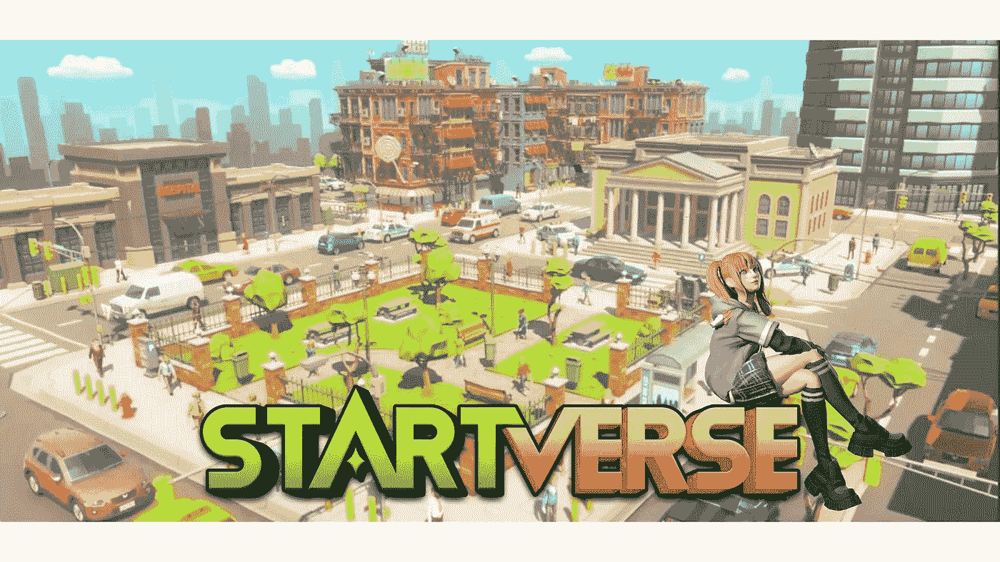
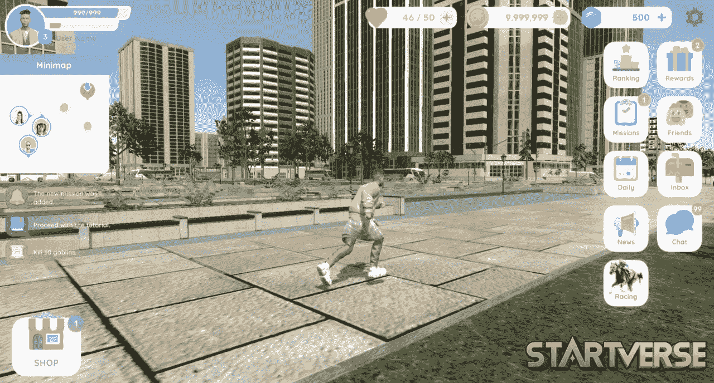
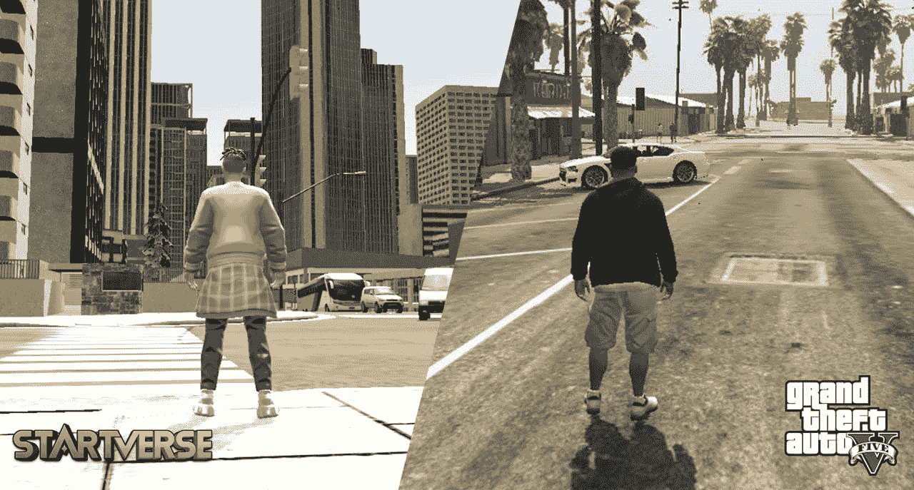
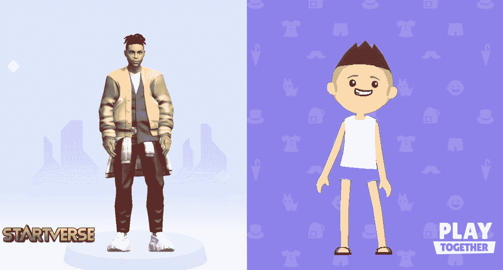

# start verse——侠盗猎车手的杰出后代&一起玩！

> 原文：<https://medium.com/coinmonks/startverse-descendant-of-grand-theft-auto-playtogether-376982ab535?source=collection_archive---------75----------------------->

Startverse 是一个虚拟现实世界，允许用户与全球数百万其他游戏玩家互动，允许我们为未来企业创建一个共同的社区。玩家每天都会通过在这个三维宇宙中工作和完成分配的任务来赚钱。

受 GTA 和 Play Together 的启发，Starverse 的成立目标是使用结合 AR/VR 和不可替代令牌(NFT)的虚拟现实技术为玩家提供各种体验。不仅如此，就角色特征和城市运营模式而言,《星际争霸》比它的前辈们要突出得多。

**城市景观**

[**Panoramic**](https://dictionary.cambridge.org/dictionary/english-vietnamese/panoramic)[**view**](https://dictionary.cambridge.org/dictionary/english-vietnamese/view)[**of**](https://dictionary.cambridge.org/dictionary/english-vietnamese/of)[**the**](https://dictionary.cambridge.org/dictionary/english-vietnamese/the)[**city**](https://dictionary.cambridge.org/dictionary/english-vietnamese/city)

像 GTA 一样，Startverse 利用 3D 图形和细致的地图规划，用真实的建筑、地理和所有可以想象的次要任务填充其城市和农村设置。如果 GTA 拥有一张基于 GTA V 的洛杉矶的地图，洛杉矶是一个名为 Los Santos 的虚构城市，那么 Startverse 就有多种多样的景观——一个充满快乐、喜悦、非法活动和享乐主义快乐的充满活力的世界。

想象一下生活在一个真正的大都市，游戏玩家每 1 公里就能体验到和现实生活中一样的娱乐选择。Startverse 旨在为玩家提供一个与现实平行的元宇宙环境。

**人物特写**

**Startverse vs GTA**

《侠盗猎车手 V》中的角色扮演服务器随着时间的推移越来越受欢迎。由于该平台最受欢迎的 streamers 的参与，GTA V 已经成为 Twitch 上最受欢迎的游戏之一。《侠盗猎车手 V》中的 RPG 持续增长，新角色不断推出。

Startverse 也差不多，然而不同的是，Startverse 中的角色更加多样化，各种颜色的角色更多。玩家在加入星际时会沉浸在节日、去酒吧、恋爱等耐人寻味的事情中，而不是为了金钱而战。

**图形设计**

如果 PlayTogether 给玩家带来了适合年轻女孩和男孩的可爱角色，那么 Startverse 是挑剔玩家的完美选择。Startverse 创建了与现实生活中的玩家身体完全相同的角色，然后将他们转换为具有完美比例身体比例的实际人物。

**Startverse vs Play Together**

因此，Startverse 是游戏玩家实现抱负的理想平台。拥有优于前辈的功能，现在就来体验 **Startverse** 吧！

*在****Startverse****加入来自世界各地的创业公司、老板、土地所有者的社区，同时接收最新的项目新闻，享受特别内容:*

[网站](https://startverse.io/) | [脸书](https://www.facebook.com/Startverse-Global-102077955725659/) | [推特](https://twitter.com/StartverseGame) | [不和](https://discord.gg/cfUSrHUvSz) | [电报](https://t.me/StarverseGlobal) | [白皮书](https://whitepaper.startverse.io/)

> 加入 Coinmonks [电报频道](https://t.me/coincodecap)和 [Youtube 频道](https://www.youtube.com/c/coinmonks/videos)了解加密交易和投资

# 另外，阅读

*   [Bitsgap 审查](/coinmonks/bitsgap-review-a-crypto-trading-bot-that-makes-easy-money-a5d88a336df2) | [Quadency 审查](/coinmonks/quadency-review-a-crypto-trading-automation-platform-3068eaa374e1) | [Bitbns 审查](/coinmonks/bitbns-review-38256a07e161)
*   [加密复制交易平台](/coinmonks/top-10-crypto-copy-trading-platforms-for-beginners-d0c37c7d698c) | [Coinmama 评论](/coinmonks/coinmama-review-ace5641bde6e)
*   [印度的加密交易所](/coinmonks/bitcoin-exchange-in-india-7f1fe79715c9) | [比特币储蓄账户](/coinmonks/bitcoin-savings-account-e65b13f92451)
*   [OKEx vs KuCoin](https://coincodecap.com/okex-kucoin) | [摄氏替代品](https://coincodecap.com/celsius-alternatives) | [如何购买 VeChain](https://coincodecap.com/buy-vechain)
*   [币安期货交易](https://coincodecap.com/binance-futures-trading)|[3 commas vs Mudrex vs eToro](https://coincodecap.com/mudrex-3commas-etoro)