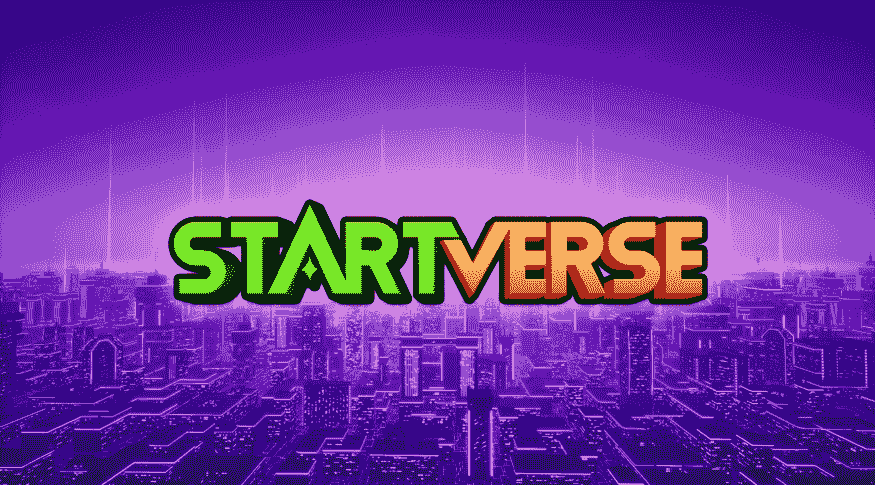
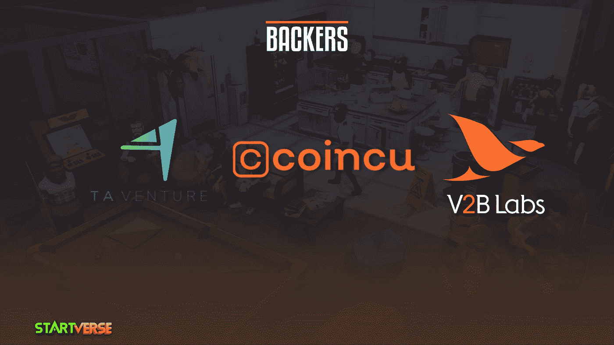
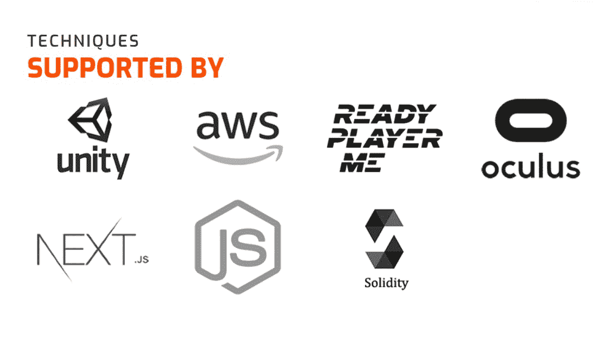
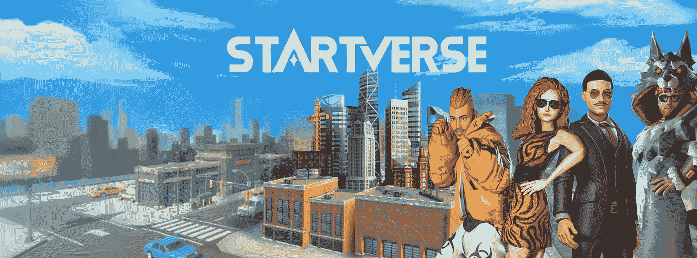

# STARTVERSE:创业公司的第一款元宇宙游戏！—项目概述

> 原文：<https://medium.com/coinmonks/startverse-the-first-metaverse-game-for-startups-3725133a241e?source=collection_archive---------45----------------------->

## Startverse 项目概述

Startverse 是一款元宇宙游戏，面向所有想要建立自己的创业公司的人。在这里，你可以成为老板、著名的艺术家、英俊的披萨外卖员，你甚至可以成为赌场的老板，或者建立一个专门从事土地承包的行会，随心所欲地经营你的帝国！

要在游戏中成功，你必须在事业和人际关系两方面都成功。玩家必须满足他们的需求，平衡睡眠、饮食、工作、健身，就像真正的人类一样。他们还需要找工作或建立自己的公司来赚钱。游戏的真正目标是帮助你的角色用他梦想的职业获得成功。

**我们的常备特色**

*   **自由发挥:** Startverse 推出智能商业模式，去除新人高壁垒问题。
*   **一款元宇宙游戏:**一款大型游戏允许数百万玩家加入元宇宙的实时游戏。
*   **一款品牌游戏:** Startverse 里面有很多迷你游戏，用来为任何需要的公司做品牌广告。
*   **AAA 模拟游戏:**我们投入了无数的时间和大量的资源，为区块链社区推出一个不朽的称号。
*   多玩家功能: Startverse 将支持社交和多人功能，允许玩家在每个活动中与朋友互动。
*   **VR 技术:**将最新的虚拟现实技术实现到 Startverse 中，带来虚拟世界的独特体验。
*   **农业&赌注:**可持续的农业和赌注机制为我们的 **$SVE** 持有者提供了一个金融解决方案。

**我们的支持者**

*   TA 风险投资
*   Coincu
*   V2B 实验室

**我们的合作关系**

*   OpenSea
*   亚马逊网络服务
*   准备好玩家我
*   比特币
*   硬币台
*   火币
*   破折号

**一般信息**

**入门**

*   Startverse 网站:[http://startverse.io/](http://startverse.io/)
*   Startverse 社交媒体:[https://linktr.ee/Startverse](https://linktr.ee/Startverse)

[**白皮书**](https://whitepaper.startverse.io/)

*   什么是 Startverse &游戏性？
*   什么是星际令牌？
*   探索 Startverse:角色、NFT 和功能。

[**俯仰甲板**](https://bit.ly/3tM5LGS)

*   关于 Tokenomic。
*   关于路线图。
*   关于支持者。

希望这篇文章给你提供了有用的信息。如果你有任何问题或者想和 **Startverse** 讨论这个帖子，请在下面留下评论！

*在****Startverse****加入来自世界各地的创业公司、老板、土地所有者的社区，同时接收最新的项目消息，享受特别内容:*

[网站](https://startverse.io/) | [脸书](https://www.facebook.com/Startverse-Global-102077955725659/) | [推特](https://twitter.com/StartverseGame) | [不和](https://discord.gg/cfUSrHUvSz) | [电报](https://t.me/StarverseGlobal) | [白皮书](https://whitepaper.startverse.io/)

> 加入 Coinmonks [电报频道](https://t.me/coincodecap)和 [Youtube 频道](https://www.youtube.com/c/coinmonks/videos)了解加密交易和投资

# 另外，阅读

*   [如何在 Uniswap 上交换加密？](https://coincodecap.com/swap-crypto-on-uniswap) | [A-Ads 评论](https://coincodecap.com/a-ads-review)
*   [加密货币储蓄账户](/coinmonks/cryptocurrency-savings-accounts-be3bc0feffbf) | [YoBit 审核](/coinmonks/yobit-review-175464162c62)
*   [Botsfolio vs nap bots vs Mudrex](/coinmonks/botsfolio-vs-napbots-vs-mudrex-c81344970c02)|[gate . io 交流回顾](/coinmonks/gate-io-exchange-review-61bf87b7078f)
*   [CoinFLEX 评论](https://coincodecap.com/coinflex-review) | [AEX 交易所评论](https://coincodecap.com/aex-exchange-review) | [UPbit 评论](https://coincodecap.com/upbit-review)
*   [AscendEx 保证金交易](https://coincodecap.com/ascendex-margin-trading) | [Bitfinex 赌注](https://coincodecap.com/bitfinex-staking) | [bitFlyer 点评](https://coincodecap.com/bitflyer-review)
*   [Bitget 回顾](https://coincodecap.com/bitget-review)|[Gemini vs block fi](https://coincodecap.com/gemini-vs-blockfi)cmd |[OKEx 期货交易](https://coincodecap.com/okex-futures-trading)