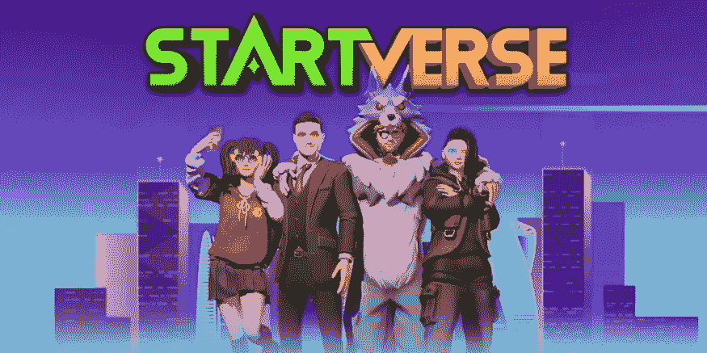
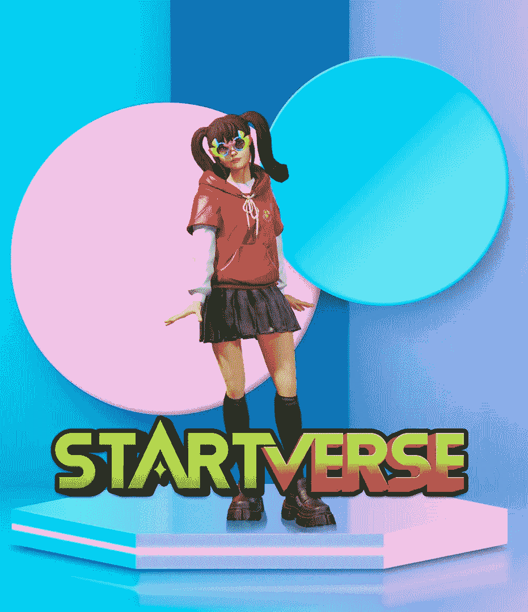
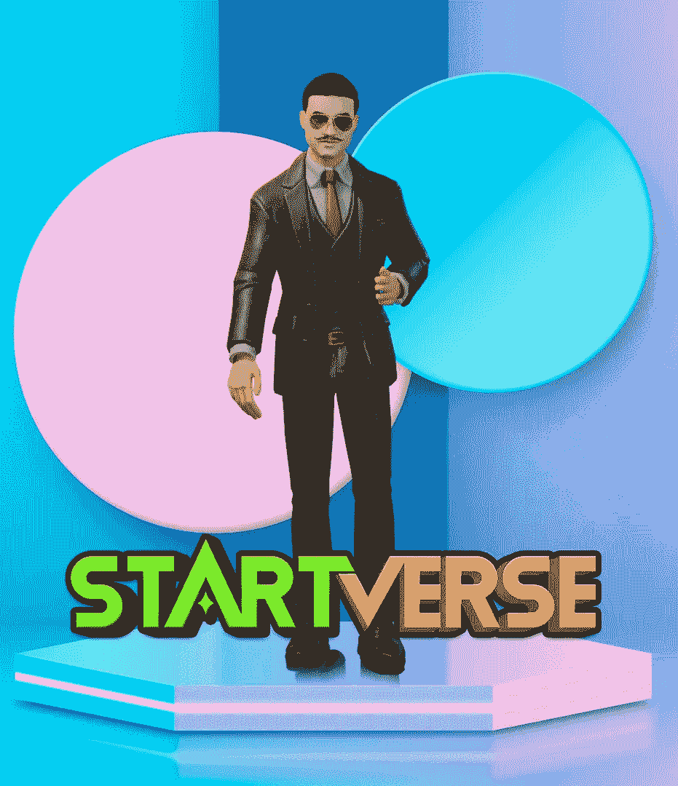
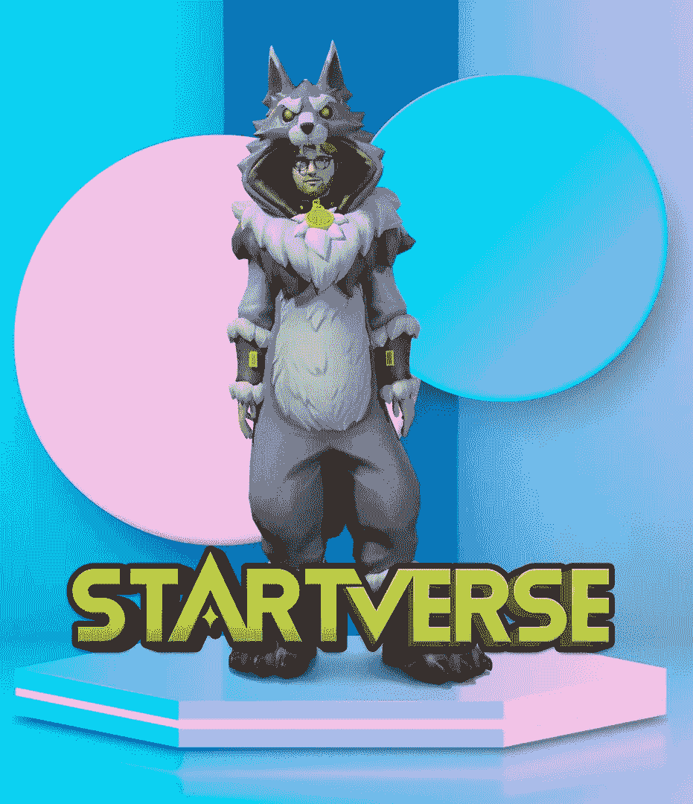
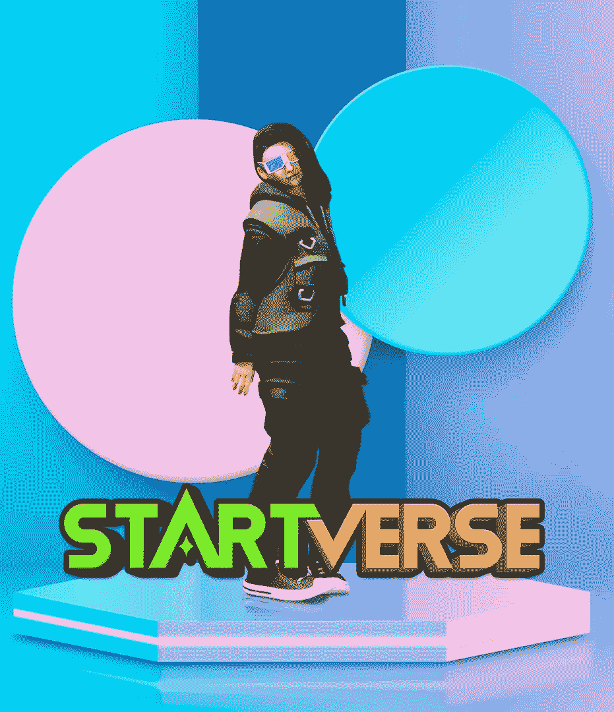

# start verse:4 个角色中哪一个最有魅力？

> 原文：<https://medium.com/coinmonks/startverse-which-of-the-4-characters-is-the-most-attractive-aadaa4ffbc35?source=collection_archive---------43----------------------->

## 关于《星际争霸》中的主要角色还有很多要学的，所以这里先睹为快。

Startverse 是一个虚拟现实世界，允许用户与来自世界各地的数百万其他游戏玩家互动，并为未来的企业创建一个共同的社区。玩家每天都会通过在这个三维宇宙中工作和完成分配的杂务来赚钱。

但正是一系列即将面向大众的角色让《星球大战》如此吸引人。Startverse 提供了一个独特的故事情节，人物丰富多彩，具有各种与众不同的特殊能力。

以下是 2022 年最受期待的四个角色的简要介绍。

1.  **基利格**

*   年龄:18 岁
*   高度:5 英尺
*   职业:高中生，DJ 女孩，啦啦队员
*   趣闻:不喜欢《古镇路》这首歌。幻想有个兼职男朋友。

Kilig 出生在一个弱势家庭，这就是为什么她的父母只为他们的孩子将来寻求最好的。于是，“Kilig”——这个象征幸福的名字——就形成了。

当城市居民听到 Kilig 这个名字时，他们想象的是一个乐观、鼓励、合群、坦率的女孩。Kilig 确实是愉快的，乐观的，可爱的。她通常充满活力，对周围的人很有吸引力。这也是她在学校很受男生欢迎的原因。

**2。大爸爸**

*   年龄:52 岁
*   身高:6 英尺 2 英寸
*   职业:商业大亨
*   有趣的事实:玩电子游戏；想成为喜剧演员，而不是老板

大爸爸是《星球大战》中最老的，也可能是最有同情心的角色。

他出生于 1970 年，由于父亲不在身边，母亲吸毒成瘾，他的成长过程非常艰难。他在游戏开始时努力过上体面的生活，但他最终发展了自己的事业。事情的发展令人沮丧，一切最终都会解决的。

**3。林奇这只狼**

*   年龄:48 岁
*   高度:6.5 英尺
*   职业:联邦调查局特工，抢劫组织者
*   有趣的事实:星塔之城的部分所有者。毒瘾。

林奇狼是一个合法的歹徒以及联邦调查局的卧底特工。林奇在法律的保护下运作，被称为黑帮的猎狗，是屠杀和非法贸易的幕后策划者。

安吉尔的未婚夫林奇是两个孩子的父亲。尽管他是一个冷血杀手，但他有一段美好的婚姻和一个可爱的家庭。他是整场比赛的主要对手，直到他找到他一生的挚爱。

**4。火猫**

*   年龄:22 岁
*   身高:6 英尺
*   职业:脱衣舞女
*   有趣的事实:脸上有湿疹，不知道如何护肤

当人们听到“猫科动物”这个名字时，他们通常会想到猫。火猫不像猫那么可爱，她有一种淘气、强大的能量，也许还有叛逆的性格。

火猫的特点就像她的名字一样，非常热情，喜欢找乐子。她被称为速度之王，舞池中女性的杰作。

希望这篇文章为你提供了关于我们四个主要角色的有用信息。如果你有任何问题或者想和 Startverse 讨论这个帖子，请在下面留下评论！

*在****Startverse****加入来自世界各地的创业公司、老板、土地持有者的社区，同时接收最新的项目消息，享受特别内容:*

[网站](https://startverse.io/) | [脸书](https://www.facebook.com/Startverse-Global-102077955725659/) | [推特](https://twitter.com/StartverseGame) | [不和](https://discord.gg/cfUSrHUvSz) | [电报](https://t.me/StarverseGlobal) | [白皮书](https://whitepaper.startverse.io/)

> 加入 Coinmonks [电报频道](https://t.me/coincodecap)和 [Youtube 频道](https://www.youtube.com/c/coinmonks/videos)了解加密交易和投资

# 另外，阅读

*   [加密复制交易平台](/coinmonks/top-10-crypto-copy-trading-platforms-for-beginners-d0c37c7d698c) | [Coinmama 评论](/coinmonks/coinmama-review-ace5641bde6e)
*   [印度的加密交易所](/coinmonks/bitcoin-exchange-in-india-7f1fe79715c9) | [比特币储蓄账户](/coinmonks/bitcoin-savings-account-e65b13f92451)
*   [OKEx vs KuCoin](https://coincodecap.com/okex-kucoin) | [摄氏替代品](https://coincodecap.com/celsius-alternatives) | [如何购买 VeChain](https://coincodecap.com/buy-vechain)
*   [币安期货交易](https://coincodecap.com/binance-futures-trading)|[3 commas vs Mudrex vs eToro](https://coincodecap.com/mudrex-3commas-etoro)
*   [如何购买 Monero](https://coincodecap.com/buy-monero) | [IDEX 评论](https://coincodecap.com/idex-review) | [BitKan 交易机器人](https://coincodecap.com/bitkan-trading-bot)
*   [CoinDCX 评论](/coinmonks/coindcx-review-8444db3621a2) | [加密保证金交易交易所](https://coincodecap.com/crypto-margin-trading-exchanges)