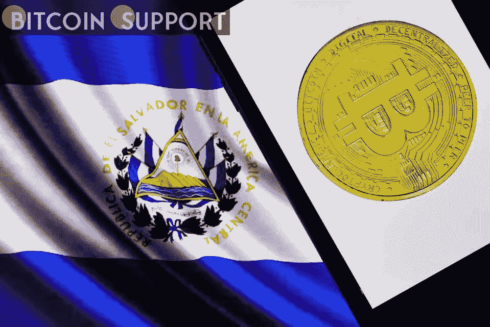

# 国有地热公司 La Geo 可能会发行萨尔瓦多比特币债券，但可能会推迟

> 原文：<https://medium.com/coinmonks/state-geothermal-company-la-geo-may-issue-salvadoran-bitcoin-bonds-but-delays-are-possible-61c9e76eee91?source=collection_archive---------57----------------------->

**Visit our website:-** [**https://bitcoinsupports.com/**](https://bitcoinsupports.com/)

萨尔瓦多财政部长亚历杭德罗·塞拉亚(Alejandro Zelaya)对比特币债券的未来以及该国国家地热发电企业 La Geo 发行比特币债券的可能性进行了更新。塞拉亚还提到了这些工具的发行日期，暗示债券可能在 5 月或 7 月向市场发行。

**萨尔瓦多正考虑通过 La Geo**

发行比特币债券萨尔瓦多财政部长亚历杭德罗·塞拉亚(Alejandro Zelaya)谈到了比特币债券的发行，以及它们可能如何与该国的地热发电公司 La Geo 挂钩。塞拉亚在接受当地电视节目采访时声称，比特币债券将由 La Geo 发行，该公司将负责支持该工具。然而，未来的投资者可以高枕无忧，因为塞拉亚解释说，即使在这种情况下，国家也将对债券发行负责，并将为债券持有人提供担保。对此，塞拉亚声明:

**无论是 La Geo 还是萨尔瓦多政府发行的，都始终是政府债务。我们作为一个国家贡献了全部资金。这些都是国企。**

比特币债券由该国总统纳伊布·布克勒(Nayib Bukele)发行，作为一种筹集资金的方式，用于建设以地热为动力的城市比特币城。首次债券发行将由比特币支持，收益率为 6.5%。

**发行日期仍悬而未决**

塞拉亚还谈到了这些债券发行的确切日期和时间，称在他看来，这些债券可能会在 3 月至 4 月间投放市场。然而，他指出，目前的形势对这个时代不利。他还表示，5 月和 6 月将有利于债券发行。此外，这位部长指出，9 月份以后，此次发行产生重大影响的可能性很小。塞拉亚还表示，他们预计会被超额认购，政府预计将从该计划中获得 15 亿美元的收入。自今年 1 月 20 份促进这些债券发行的法案出台以来，中国一直在为引入这些债券准备法律框架。

**访问我们的网站:-**[**https://bitcoinsupports.com/**](https://bitcoinsupports.com/)

**免责声明:以上为作者观点，不应视为投资建议。读者应该自己做研究。**

> 加入 Coinmonks [电报频道](https://t.me/coincodecap)和 [Youtube 频道](https://www.youtube.com/c/coinmonks/videos)了解加密交易和投资

# 另外，阅读

*   [CoinDCX 点评](/coinmonks/coindcx-review-8444db3621a2) | [加密保证金交易交易所](https://coincodecap.com/crypto-margin-trading-exchanges)
*   [红狗赌场评论](https://coincodecap.com/red-dog-casino-review) | [Swyftx 评论](https://coincodecap.com/swyftx-review) | [CoinGate 评论](https://coincodecap.com/coingate-review)
*   [Bookmap 评论](https://coincodecap.com/bookmap-review-2021-best-trading-software) | [美国 5 大最佳加密交易所](https://coincodecap.com/crypto-exchange-usa)
*   [如何在 FTX 交易所交易期货](https://coincodecap.com/ftx-futures-trading) | [OKEx vs 币安](https://coincodecap.com/okex-vs-binance)