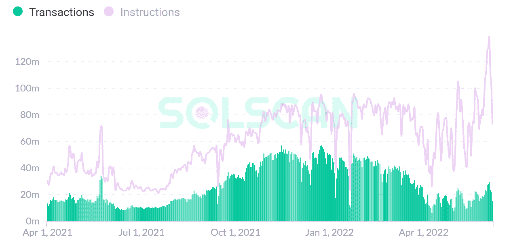

# 第一层区块链的状态:链上基本面分析

> 原文：<https://medium.com/coinmonks/state-of-layer-1-blockchains-on-chain-fundamental-analysis-ba12ce63c0c9?source=collection_archive---------6----------------------->

pixabay.com

区块链的使用正在几个行业和众多现实世界的应用中稳步蔓延。底层协议的变化可能会带来第一层区块链网络的新时代。

Web3 是多链的，为开发者在智能合约区块链上开发提供了多种选择。

第 1 层智能链已经有了一些发展，现在是时候评估它们的效用和未来的可能性了。

# 第 1 层智能合同区块链

**快照**

wheatstones;

我们将根据以下指标分析每个区块链:

***日交易计数***

网络的每日交易计数是链上需求的一个很好的指标，因为它确定了网络参与者特别活跃或不活跃的时间。

***每日活跃地址***

分析每天活动地址的数量有助于识别现有和新市场参与者的网络需求。活跃地址数量的增加可能表明市场参与者的需求增加，反之亦然。

***每日费用***

交易费用是网络需求的一个代理，因为它们代表了市场参与者愿意支付的成本，以将交易包括在协议的分类账中。这将包括分析流行的 dApps。

# 以太坊

以太坊是由 Vitalik Buterin 于 2015 年创立的一个经过验证的区块链。以太坊将最终过渡到另一个被称为“利益证明”的共识协议，在这个协议中，以太网所有者“赌注”他们的以太网来保护网络。

以太坊仍然是最受欢迎的区块链，其智能合同为大多数区块链项目提供动力。

***每日交易计数***

nansen.ai

从 2017 年 1 月开始，以太坊日交易量逐渐上升，2021 年 5 月达到 160 多万笔。尽管市场低迷，以太坊交易仍保持在 100 万笔以上，迄今为止表现出弹性。

交易指标:

*   一年变化 **-11%**
*   年初至今 **-2.4%**

***每日活跃地址***

nansen.ai

每日活跃地址或活跃网络用户的数量也一直在增长。根据 nansen.ai 的数据，在过去的 30 天里，以太坊有超过 580 万独立钱包用户连接到其区块链的应用程序

日活跃用户从 2021 年末的 60 多万下降到 2022 年 5 月的 35 万左右，下降了 40%。虽然这是一个相当大的下降，但与 2018 年 crypto 崩溃时发生的 78%的下降相比，这仍然是一个巨大的进步。

***每日费用***

cryptofees.info; coinmetrics;

以太坊的收费模式是所有交易费用一部分烧，一部分付给矿工。

上周以太坊网络的日均费用约为 890 万美元。按照以太坊目前的估值，这代表着约 65 的价格销售比(P/S)。

然而，在网络活动的高峰期，每天的费用平均达到惊人的 7000 万美元，或大约 22 点/秒的比率。

nansen.ai

正如我们所看到的，Uniswap，一个去中心化的交换，是以太坊上最受欢迎的 dApp，记录了所有与区块链交互的 11%左右。其他流行的应用有 SushiSwap，一个 DeFi 协议，OpenSea，最大的 NFT 市场，以及主要的 stablecoins，USDC & USDT (Tether)。

***概述&潜力***

以太坊继续主导智能合约区块链领域。如果我们加上以太坊的所有 L2 扩展解决方案，如 Arbitrum 和乐观主义，以太坊将占所有链中锁定的所有价值的 61%以上，即 635 亿美元。

defillama.com

以太坊占 stablecoins 总市值的 58%，即 934.2 亿美元，后者价值超过 1600 亿美元。

以太坊是一种通货膨胀资产，目前的通货膨胀率约为每年 3.7%。然而，当以太坊将过渡到股权证明时，乙醚的发行量将大幅下降至每年约 0.5 百万乙醚。这将使通货膨胀率达到 0.54%，加上烧钱机制，这将使以太坊**通货紧缩**，大约每年-1.1%。这是假设 1000 万 ETH 的智能合同和网络活动保持与最近相同的速度。

# 索拉纳

索拉纳是由阿纳托利·亚科文科创立的一家信誉卓著的区块链，结算时间短于一秒，交易成本低。它采用了一个名为 Proof-of-History (PoH)的创新系统，能够自动进行有序交易，使 Solana 成为该领域最快的区块链之一，最高可达 65，000 TPS。索拉纳的 mainnet 于 2020 年 3 月推出，目前处于测试阶段。

***每日交易计数***

analytics.solscan.io

Solana 在 chain 上有两种类型的日常事务:投票和非投票。

非投票事务是任何与建立在 Solana 之上的分散式应用程序交互的事务。这些交易目前占 Solana 所有交易的 23%左右。

投票交易是由 Solana 的验证器节点完成的交易，确保网络安全。换句话说，所有内部共识消息都被视为事务。索拉纳是唯一一个这样设计的区块链，因为所有其他区块链人都只考虑“无投票权”交易。原因是这些投票交易必须支付费用，并在智能合约/程序中执行，竞争块空间，就像所有其他智能合约一样。

出于比较的目的，我们将从交易增长指标中排除投票交易。

analytics.solscan.io

索拉纳的非投票交易在 2021 年一直稳步增长，从 2021 年 4 月的日均 1800 万笔增长到 2022 年 1 月的 5500 万笔，随后密码市场大幅下滑，到 2022 年 5 月，交易量回落到 2021 年的 2000 万笔。

非投票交易指标:

*   一年变化 **33%**
*   年初至今 **-76%**

***每日活跃地址***

nansen.ai

自 2020 年 4 月 mainnet 上线以来，Solana 上的日活跃地址平均每天达到 100 万用户。Solana 的用户采用率增长最快，其原生 Phantom 钱包的用户从 7 月的 40，000 人增长到 2021 年 12 月的 180 万人，增长了 4，400%。

Solana 的日活跃用户在 5 月份达到峰值，约为 125 万，到 6 月初下降了 44%，约为 70 万。

***每日费用***

analytics.solscan.io;

Solana 的收费模式是从每笔交易中抽取固定的一部分(最初是 50%)，剩下的费用归处理交易的现任“领导”所有。

索拉纳在过去 7 天的日均费用为 27k 美元，包括投票和非投票交易。目前我们将排除投票交易产生的费用。这将有助于我们判断网络的费用收入来自分散应用的使用。

在过去的七天里，Solana 非投票交易的日均费用平均为 5000 美元。在 2021 年 11 月的高峰期，费用达到每天 6 万美元，包括非投票交易在内为 26.5 万美元。

巅峰时期，索拉纳的价格销售比在 740 左右。对于索拉纳，我们需要考虑那些日常交易实际上代表了什么。见下文:

nansen.ai

Solana 上的一个分散式应用 Serum 每天处理超过 2700 万笔交易，比所有其他区块链的总和还要多。Serum 是一个无许可的分散式交易所和区块链生态系统，建立在 Solana 之上，做市商在这里为每笔交易生成大量信息。Serum 的最终愿景是推动 DeFi 的大规模采用，并成为首选 DEX，目标是在全球范围内覆盖 10 亿活跃用户和 10 万亿美元的链上价值。

另一个主要协议是 Raydium(每天 670 万笔交易)，它是 Solana 的顶级自动化做市商。本质上，它让分散交易所的交易员能够创建限价单，即指定他们希望交易资产的价格，类似于他们今天在集中交易所的交易方式。这创造了数十亿的“交易”，因为交易者经常会输入限价单，取消它，修改一些参数，然后重新输入。在分散式环境中，所有这些操作都是与区块链的交互，需要付费。

defillama.com

Solana 在其 DeFi 生态系统中锁定了约 29.8 亿美元，在 stablecoins 中锁定了 61.9 亿美元。此外，Solana 还是世界第二大(也是最受信任的)稳定硬币发行商 Circle USDC 的官方区块链。

***概述&潜力***

索拉纳是一种**通胀**资产，目前的年通胀率约为 7%。由于索拉纳的发行量为 5.22 亿份，这意味着每年发行约 3600 万索尔。然而，从长远来看，在 10 年内，根据索拉纳的文件，通货膨胀率将降至 1.5%，索拉纳的总流通供应量将达到 7.5 亿索尔左右。见下文:

docs.solana.com

基于 7.5 亿流通供应量和 1.5%的通货膨胀率，这将意味着每年发行约 1125 万索尔。

到那时，该网络将需要每年 2.12 万亿次交易(或每天 58 亿次)，以抵消 1125 万索尔的排放，基于单个索尔交易费用为 0.0000053，刚好达到收支平衡。高峰时，2021 年 11 月，索拉纳日均交易 2 亿笔。

万亿交易理论上可能吗？是的，只要索拉纳实现他们的愿景，推动大规模采用他们的区块链，无论是在 DeFi，游戏等。这是索拉纳如此受 FTX 和 Jump crypto 等机构投资者欢迎的一个主要原因。考虑到衍生品市场本身的名义价值就超过 1000 亿美元，我们可以想象索拉纳的潜力，即使它只占这个市场的一小部分。

此外，全球加密的采用率低于 4%(Statista.com)，随着区块链博彩、DeFi、NFTs 和其他分散应用的增长，以及更多有待发明的应用，确定 Solana 可以达到这些交易数量并不是不合理的。这将是具有挑战性的。

主要的障碍将是竞争，监管环境，以及解决索拉纳正在进行的内部网络问题。

# 雪崩

Avalanche 是区块链在 2018 年 5 月由一个名为“Team Rocket”的软件开发人员假名小组首次概念化的利益证明后来，它由计算机科学和软件工程师教授 Emin Gün Sirer 领导的康奈尔大学专门研究小组开发，并于 2020 年 9 月推出。

它的设计有三个主要方面区别于其他区块链项目:

*   **共识** **机制** —验证器轮询其他验证器的样本，以确定新事务是否有效。经过一定次数的重复随机二次抽样后，统计数据证明，一笔交易几乎不可能是假的。每个验证者都是完全独立的决策者，没有领袖选举。
*   **三个内置的不同区块链:** x 链(数字资产的创建、管理和交易)、c 链(智能合同)和 p 链(协调验证器，创建子网)，以解决区块链三难困境的局限性。
*   **子网**—Avalanche 的扩展解决方案，允许项目利用 AVAX 创建自己的定制区块链。然后，这些区块链由一组动态的验证器来保护，它们一起工作以达成共识。可能的子网数量没有限制。

***每日交易计数***

nansen.ai

Avalanche 上的日交易量在 2021 年下半年出现爆炸式增长，从 9 月份的 10 万笔交易上升到 2022 年 3 月的 100 万笔，到 2022 年 6 月下降到 40 万笔交易。

交易指标:

*   一年变化**2766%**
*   年初至今 **-38%**

***每日活跃地址***

stats.avax.network

日活跃地址从 2021 年 9 月初的平均 1 万个激增至 2022 年 1 月的 14 万多个。

在 Avalanche 的情况下，日活跃用户(以及交易)的下降并不是非黑即白的，因为这部分归因于 DeFi Kingdoms 和最近 Crabada 的新子网的创建。

Crabada 是一款 DeFi 游戏，最初使用主要的雪崩区块链(C 链)，是雪崩上最受欢迎的 dApps 之一，但已经迁移到他们自己的子网，为他们的用户创建专用的基础设施，以获得最佳体验。这降低了主网络的负荷，从而降低了燃气成本和日常费用。

***每日费用***

cryptofees.info; coinmetrics;

Avalanche 的收费模式意味着所有交易费用都被烧掉了。

到 2022 年 4 月，雪崩网络的平均日费用已达到平均 100 万美元，使得雪崩的 P/S 比率约为 55。由于加密市场的低迷和新子网的出现，到 2022 年 6 月，区块链的费用已经下降到每天 36k 美元。

nansen.ai

Avalanche 上最大的去中心化应用之一是 Trader Joe，这是一个去中心化的交易、借贷、收益和下注应用。按每日费用计算，它目前是 DeFi 中第六大应用程序，平均每日用户支付的收入约为 10 万美元。考虑到它于 2021 年 8 月发布，这是一项相当大的成就。

***概述&潜力***

Avalanche 的 DeFi 生态系统拥有超过 200 个 DeFi dApps，价值超过 67 亿美元，是第三大 DeFi 生态系统。

defillama.com

尽管加密市场不景气，但通过其 DeFi 应用锁定的 AVAX 总量一直在上升，达到创纪录的高水平。

Avalanche 的最大供应上限为 7.2 亿枚 AVAX 硬币，随着网络活动和采用的持续增长，从长期来看将会出现通缩。此外，有一些机制会降低供应，例如烧费和 AVAX 被锁定在验证子网中。

**费烧** —所有的气费都被烧掉，降低了有效供应量。自 2021 年 mainnet 上线以来，c 链已经烧掉了近 180 万 AVAX。

**验证子网** —任何验证器都必须为每个验证器分配至少 2000 个 AVAX。随着更多子网的启动，将会有更多的 AVAX 投入使用。堆叠 AVAX 是子网最低安全性的可测量指标。

Avalanche 目前已创建/正在创建多个子网。

twitter.com/swimmer network

Avalanche 的架构激励子网的创建。随着 Avalanche 的采用率随着每日用户事务数量的增加而增加，它会推高主网络(c 链)的费用。这激励了分散的应用程序迁移到子网上，以便降低费用和增强用户体验。随着更多子网的创建，更多的 AVAX 被锁定，从而降低供应，而在主网络上，现在又变得更便宜，烧钱机制仍像以前一样继续。

目前，燃烧率约为每天 1，100 AVAX，而基于 267 Mil AVAX 的日发放率为 67，782。由于 7.2 亿英镑的上限尚未达到，AVAX 正经历着 9% **的通货膨胀率**。

# 幽灵

Fantom 于 2018 年由计算机科学家 Ahn Byung Ik 博士(他最终离职，首席信息官 Michael Kong 成为首席执行官)创建，是一个第一层区块链，使用单一共识层来支持多个执行链的创建。FTM 是项目的原生令牌，用于支付、治理和发送给与 FTM 有利害关系的验证者和授权者的持续的块奖励。

Fantom 试图采用现有基于 DAG 的协议的改进版本，以区别于传统的基于块分类帐的存储基础架构。

***每日交易数***

ftmscan.com

Fantom 上的日交易量一直在稳步上升，最高时达到 170 万笔，平均稳定在 90 万笔，尽管最近加密业务有所下滑。Fantom 是唯一的一级区块链之一，自年初以来，其日交易量有所增加，这是一个重要的基本面指标。

交易指标:

*   一年变化 **203%**
*   年初至今 **53%**

***每日活跃地址***

nansen.ai

Fantom 上的每日活跃地址自 2021 年 5 月以来一直在上升，网络活动在 9 月达到峰值超过 110，000 个，然后下降到平均 49，000 个。

自 2020 年 8 月以来，Fantom 在其网络上创建的唯一地址已超过 300 万个。

***每日费用***

cryptofees.info; coinmetrics;

Fantom 的收费模式是将 70%的费用支付给验证者，剩下的 30%永远烧掉。

Fantom 全年的平均日费用为 7 万至 8 万美元，不包括 1 月、3 月和 5 月的高峰，高峰时日费用达到 35 万至 45 万美元，Fantom 的 P/S 比率在 30 至 45 之间。

nansen.ai

Fantom 最受欢迎的 dApp 是 SpookySwap，这是一个去中心化的交换。SpookySwap 是 TVL Fantom 上最大的协议(总价值锁定)，按日交易量排名第五。

***概述&潜力***

尽管最近发生了加密崩溃，Fantom 的 DeFi 生态系统仍然保持了价值锁定，显示了对其生态系统的弹性和信任，即使 FTM 令牌价格从 3 美元跌至 0.35 美元。Fantom 仍然是 DeFi 中最大的区块链协议之一。

defillama.com

Fantom 的最大供应上限为 31.75 亿 FTM 硬币，随着网络活动和采用的持续增长，长期而言将会出现通缩。

Fantom 目前的**通货膨胀**率约为每年 8.50%，以激励赌注和协议的安全性。这是基于最初的新流通供应量为 2，392，807，708 立方英尺，剩余 782，192，292 立方英尺在未开采的赌注回报池中。此时，49%的 FTM 已被下注。

messari.io

如前所述，Fantom 的突出供应是固定的。曲线上显示的液体供应增加是授权计划以及预先开采的赌注奖励分配的结果。这些奖励将持续分配给验证者和授权者，预计将于 2024 年结束。一旦分配的资源耗尽，鉴于该项目的固定供应以及所有费用的 30%被烧掉，这将有利于 Fantom 的未来市场价值。

*免责声明:本文包含的信息仅用于教育目的，并不构成 Wheatstones 的任何形式的建议或推荐，用户在做出(或避免做出)任何投资决策时也不打算依赖这些信息。*

> 加入 Coinmonks [电报频道](https://t.me/coincodecap)和 [Youtube 频道](https://www.youtube.com/c/coinmonks/videos)了解加密交易和投资

# 另外，阅读

*   [AscendEx 保证金交易](https://coincodecap.com/ascendex-margin-trading) | [Bitfinex 赌注](https://coincodecap.com/bitfinex-staking) | [bitFlyer 审核](https://coincodecap.com/bitflyer-review)
*   [麻雀交换评论](https://coincodecap.com/sparrow-exchange-review) | [纳什交换评论](https://coincodecap.com/nash-exchange-review)
*   [拥护卡审核](https://coincodecap.com/uphold-card-review) | [信任钱包 vs MetaMask](https://coincodecap.com/trust-wallet-vs-metamask)
*   [TraderWagon 回顾](https://coincodecap.com/traderwagon-review) | [北海巨妖 vs 双子星 vs BitYard](https://coincodecap.com/kraken-vs-gemini-vs-bityard)
*   [Exness 回顾](https://coincodecap.com/exness-review)|[moon xbt Vs bit get Vs Bingbon](https://coincodecap.com/bingbon-vs-bitget-vs-moonxbt)
*   [如何开始通过加密贷款赚取被动收入](https://coincodecap.com/passive-income-crypto-lending)