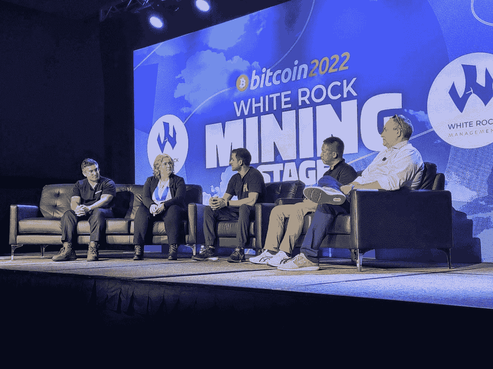

# ASIC 市场的现状

> 原文：<https://medium.com/coinmonks/state-of-the-asic-market-b502907c7e5?source=collection_archive---------46----------------------->

ASICs 的下一步是什么？

*From left to right: Chris Mansano, Kristy-Leigh Minehan, Nishant Sharma, Yao XianJun, and Michael Francis.*

一年一度的比特币大会，今年被称为比特币 2022，总是将最优秀和最聪明的比特币创造者带到最前沿。这通常是一年中最受期待的比特币大会，也可能是历史上持续时间最长的比特币大会。焦点和主题完全集中在比特币上，但你也会看到一些“加密”人员在大厅里游荡。

会议主持了数十场小组讨论，专家们分享了该领域发生的一些新旧事情。他们触及的话题包括政府监管、开源开发、安全、钱包、交换，当然还有……采矿！

在接下来的几篇博客中，我们将以一种信息丰富、富有教育意义的方式，概括并分享一些特定的采矿主题小组会议。采矿业在不断发展，我们有责任站在尖端技术的最前沿，以提高我们的竞争力。

对于这个博客，我们将从谈论 ASIC 市场的现状开始。以下是 Chris Mansano、Kristy-Leigh Minehan、Nishant Sharma、Yao XianJun 和 Michael Francis 在小组讨论中围绕这一主题讨论的主要话题。

ASIC 矿机市场的总体前景如何？

普遍的共识是，新一代 ASICs，如 S19 和 S19 Pro+ Hydro，看起来准备在今年推出。这些新的 ASICs 拥有超过 100 TH/S 的生产能力，S19 Pro+ Hydrop 能够达到 200 TH/S。比特大陆、迦南和 What's Miner 等大型制造商似乎都对及时为客户运送矿工持积极态度。这当然取决于任何零星的 covid 锁定等等，但在大多数情况下，大多数制造商今年对其特定的 ASIC 型号有着强烈的展望。

**我们会得到更小的 ASIC 芯片吗？**

结论是，从 7 到 9 纳米的芯片尺寸转移到更小的尺寸，比如 5 纳米，并没有真正吸引矿工的注意。事实上，他们中的大多数人对此持中立态度，好像这不是他们感兴趣的重要指标。相反，他们认为达到小芯片尺寸需要比预期更长的时间。所以实际上，更小的芯片尺寸真的不是他们感兴趣的东西。

不管怎样，大多数矿工在收到机器后，通过自己的物理调整和篡改机器，从 ASIC 机器中提取更多的价值。这在矿工中很常见。通过对 ASIC 机器进行修补和实验，与那些只使用库存机器的矿工相比，一些矿工已经能够获得更高的性能。

因此，尽管更小的 ASIC 芯片尺寸可能听起来对局外人和新矿工有吸引力，但许多 OG 矿工有自己的方式从每个 ASIC 矿工那里获得更多性能。

**与 2020 年至 2022 年相比，2016 年至 2018 年的矿业市场有何不同？**

2016 年至 2018 年间的矿业市场仍将保持绿色。绿色意味着非常非常早。许多进入这个领域的人仍然不理解采矿的概念，更不用说理解比特币的工作原理了。采矿方面的教育较少。没有合适的框架和蓝图来扩展工业规模的采矿场，也没有记录在案。

地方司法和地方法规现在也更加成熟。他们理解采矿的概念，并有一些基本的法律框架，允许新的采矿者有更多的余地进入并开设商店。过去学到的东西现在已经发展到让矿工和当地社区都受益的程度。

那段时间的矿业制造商也不太可能处理成千上万的矿工。当时，比特币的飙升出乎意料，并被许多矿业公司低估。

当我们快进到 2020 年至 2022 年时，制造商肯定能够扩大业务规模，但最大的挫折是疫情。不幸的是，疫情关闭了许多工厂。供应链被切断和扰乱。人们无法离开自己的家看到整个过程。

**国内采矿趋势。**

我们开始看到许多矿业回到舒适的家园。许多新进入这个领域的人真正相信比特币的利他主义方面，他们希望自己开采比特币，而不是让他们的矿工“托管”在其他地方。尽管 ASIC 矿工可能会给家庭带来不便，但已经有许多巧妙的设置来减轻来自 ASIC 机器的巨大噪音和能源消耗。

已经出现了家庭采矿趋势，如浸入式冷却，其中 ASICs 位于一桶特殊液体中，允许矿工在静音的同时仍然运行。如果有人曾经试图在家里运行 ASIC 机器，他们会很快意识到它可能带来的噪音的烦恼。

**该领域的新制造商有哪些值得期待的地方？**

已经有许多新的芯片和 ASIC 制造商进入这个行业，希望打破比特大陆和其他公司的强势地位。但在与这些新玩家做生意之前，人们需要注意一些红白旗。

您需要注意的危险信号:

*   他们开源他们的技术吗？
*   他们能解释他们的技术是如何工作的吗？
*   他们的技术看起来与竞争对手相似还是不同？
*   谁是他们创始团队的一员？
*   他们计划如何扩展？
*   他们的路线图是什么？

总而言之，ASICs 在这一领域仍有光明的未来。这是过去几年中用于采矿的持续时间最长的技术，而且它们似乎会持续更长时间。和过去一样，CPU、GPU 和 FPGAs 曾经风靡一时，但由于过时而很快消失，人们只能怀疑 ASICs 的寿命何时结束。但就目前而言，没有什么比嗡嗡作响的 ASIC 机器和比特币挖矿更合适的了。

**关于 Valarhash**
总部位于美国的 Valarhash 集矿机销售、矿工托管、矿池和矿山建设服务于一体。在首席执行官 Fiona Lv 的领导下，Valarhash 旨在利用先进的技术，以较低的进入门槛，为用户提供透明和有益的采矿计划。业务运营涵盖硬件研发、数字资产交易和[1 mine](https://www.1tmine.com/)hash 电力合同共享。凭借在 hash power 市场的领先地位，Valarhash 整合了前沿资源和全球视野，提供加密计算服务(CCS)，并通过区块链技术连接物理和数字世界。

**欲了解更多信息，请访问:**

网址:[https://www.valarhash.com](https://www.valarhash.com/)

推特:[https://twitter.com/VaIarhash](https://twitter.com/VaIarhash)

https://www.facebook.com/Valarhash 脸书

领英:[https://www.linkedin.com/company/vhash/](https://www.linkedin.com/company/vhash/)

中:[https://medium.com/Valarhash](/@Valarhash)

电报:

**媒体联系人
邮箱:BD@vhash.io**

**全球支持
电子邮件:Support@valarhash.com**

> 加入 Coinmonks [电报频道](https://t.me/coincodecap)和 [Youtube 频道](https://www.youtube.com/c/coinmonks/videos)了解加密交易和投资

# 另外，阅读

*   [3 商业评论](/coinmonks/3commas-review-an-excellent-crypto-trading-bot-2020-1313a58bec92) | [Pionex 评论](https://coincodecap.com/pionex-review-exchange-with-crypto-trading-bot) | [Coinrule 评论](/coinmonks/coinrule-review-2021-a-beginner-friendly-crypto-trading-bot-daf0504848ba)
*   [莱杰 vs n rave](/coinmonks/ledger-vs-ngrave-zero-7e40f0c1d694)|[莱杰 nano s vs x](/coinmonks/ledger-nano-s-vs-x-battery-hardware-price-storage-59a6663fe3b0) | [币安评论](/coinmonks/binance-review-ee10d3bf3b6e)
*   [Bybit Exchange 审查](/coinmonks/bybit-exchange-review-dbd570019b71) | [Bityard 审查](https://coincodecap.com/bityard-reivew) | [Jet-Bot 审查](https://coincodecap.com/jet-bot-review)
*   [3 commas vs crypto hopper](/coinmonks/3commas-vs-pionex-vs-cryptohopper-best-crypto-bot-6a98d2baa203)|[赚取加密利息](/coinmonks/earn-crypto-interest-b10b810fdda3)
*   最好的比特币[硬件钱包](/coinmonks/hardware-wallets-dfa1211730c6) | [BitBox02 回顾](/coinmonks/bitbox02-review-your-swiss-bitcoin-hardware-wallet-c36c88fff29)
*   [BlockFi vs 摄氏度](/coinmonks/blockfi-vs-celsius-vs-hodlnaut-8a1cc8c26630) | [Hodlnaut 审核](/coinmonks/hodlnaut-review-best-way-to-hodl-is-to-earn-interest-on-your-bitcoin-6658a8c19edf) | [KuCoin 审核](https://coincodecap.com/kucoin-review)