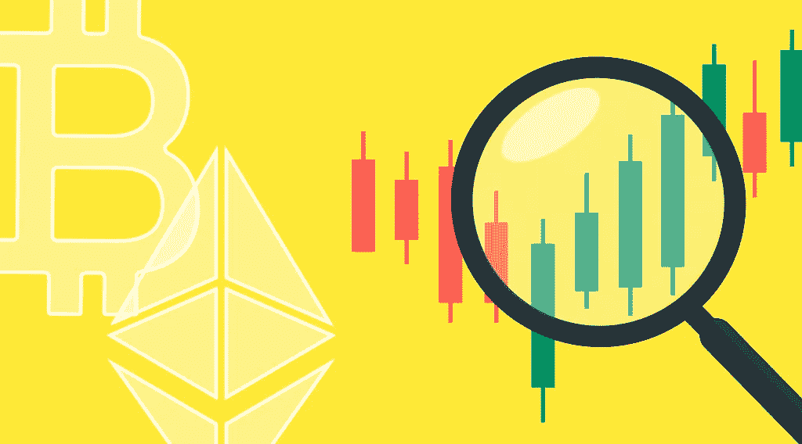

# StealthEX 加密简讯-第 11 期。这是价格的问题

> 原文：<https://medium.com/coinmonks/stealthex-crypto-newsletter-issue-11-this-is-the-question-of-price-b57038146e2d?source=collection_archive---------71----------------------->

看看我们每周文摘的第 11 期！

大约 90%的秘密俚语由描述这一因素的词组成。

霍德林，FUD，抽水，倾倒，翻转，等等。

所有这些都直接或间接地与密码价格和交易有关。毕竟，大多数加密货币都是可交易的资产，每个人都很关心它们的价值。

在本期简讯中，StealthEX 团队将探索加密价格是如何形成和受到影响的，比特币和其他货币在经济困难时期的表现如何，并就加密市场的未来给出一些想法。像往常一样，不是财务建议。

让我们开始吧！

[StealthEX 加密通讯——第 11 期。这是价格的问题](https://www.getrevue.co/profile/stealthex_io/issues/stealthex-crypto-newsletter-issue-11-this-is-the-question-of-price-1178252)

[**赶快订阅接收最新加密消息吧！**](https://www.getrevue.co/profile/stealthex_io)

请记住，我们的工作是提供信息，而不是为您做出投资决策😉

在 [Medium](https://stealthex-io.medium.com/) 、 [Twitter](https://twitter.com/Stealthex_io) 、 [Telegram](https://t.me/StealthEX) 、 [YouTube](https://www.youtube.com/channel/UCeES_XBesX76ge7xf1meuSw) 和 [Reddit](https://www.reddit.com/user/Stealthex_io) 上关注我们，获取 [StealthEX.io](https://stealthex.io/) 更新和关于加密世界的最新消息。对于所有请求，请通过 support@stealthex.io 给我们发消息。

非常欢迎您访问[**stealthexchange**](https://stealthex.io/)**看看它有多快多方便💛**