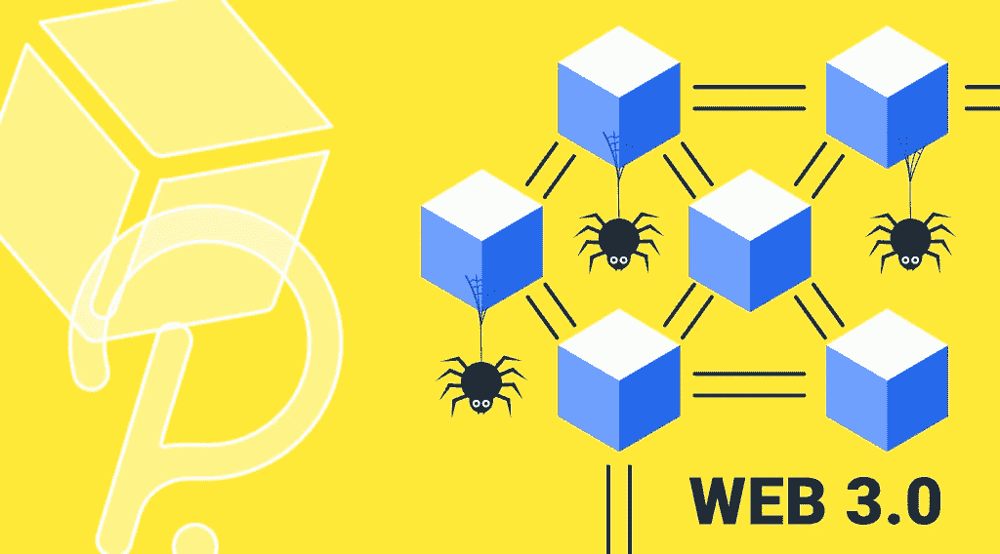

# StealthEX 加密简讯-第 13 期。互联网的未来

> 原文：<https://medium.com/coinmonks/stealthex-crypto-newsletter-issue-13-the-future-of-the-internet-da2f4c86674?source=collection_archive---------61----------------------->

看看我们每周文摘的第 13 期！

我们在 crypto 中做的许多事情都围绕着各种众所周知的概念。Web3 就是其中之一，它意味着去中心化和去垄断万维网。

*   Web 1.0 始于 20 世纪 90 年代，允许每个人(显然，任何人都可以加入)阅读静态网站的内容。
*   Web 2.0 更进一步，给了我们书写和分享自己的东西的能力——这由于社交网络而成为可能。在 Web 2.0 时代，用户生成的内容真正成为了一种东西。
*   Web 3.0 应该是这样的未来:我们都可以在不信任第三方的情况下阅读、书写和拥有内容。听起来很加密，对吧？

[StealthEX 团队](https://stealthex.io/blog/)在这里打破 Web3 的概念，了解那些致力于更好的、分散的未来的项目。

**StealthEX 加密通讯——第 13 期。互联网的未来**

[赶快订阅接收最新的加密新闻吧！](https://www.getrevue.co/profile/stealthex_io)

请记住，我们的工作是提供信息，而不是为您做出投资决策😉

> 加入 Coinmonks [电报频道](https://t.me/coincodecap)和 [Youtube 频道](https://www.youtube.com/c/coinmonks/videos)了解加密交易和投资

在 [Medium](https://stealthex-io.medium.com/) 、 [Twitter](https://twitter.com/Stealthex_io) 、 [Telegram](https://t.me/StealthEX) 、 [YouTube](https://www.youtube.com/channel/UCeES_XBesX76ge7xf1meuSw) 和 [Reddit](https://www.reddit.com/user/Stealthex_io) 上关注我们，获取 [StealthEX.io](https://stealthex.io/) 更新和关于加密世界的最新消息。对于所有请求，请通过 support@stealthex.io 给我们发消息。

非常欢迎你来参观交易所，看看它有多快多方便💛