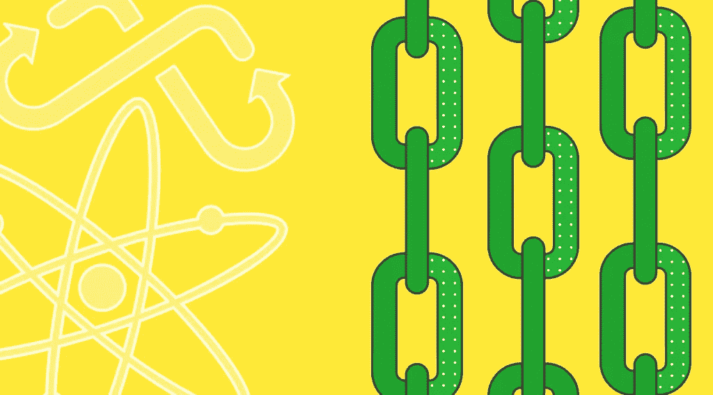

# StealthEX 加密简讯-第 14 期。区块链的下一个趋势

> 原文：<https://medium.com/coinmonks/stealthex-crypto-newsletter-issue-14-the-next-trend-of-blockchain-23b7df97a334?source=collection_archive---------60----------------------->

看看第 14 期的每周文摘吧！

随着 crypto 越来越受欢迎，有一件事变得很明显——人们想要创建他们自己的区块链。无论是以前存在的东西的分支还是一个全新的实体，链的总数都在 1000 左右。一千条锁链，都在解决某种问题。我们如何管理这一切？

这就是跨链技术出现的地方，旨在增加急需的互操作性，并给用户一个选择来欣赏不同链的最佳方面。

在本期时事通讯中，[stealth x](https://stealthex.io/)团队将深入互操作区块链的世界，列举该领域的一些项目，并概述整个跨链概念。

[**StealthEX 加密通讯——第 14 期。区块链的下一个趋势**](https://www.getrevue.co/profile/stealthex_io/issues/stealthex-crypto-newsletter-issue-14-the-next-trend-of-blockchain-1208250)

[赶快订阅接收最新加密消息吧！](https://www.getrevue.co/profile/stealthex_io)

请记住，我们的工作是提供信息，而不是为您做出投资决策😉

在 [Medium](https://stealthex-io.medium.com/) 、 [Twitter](https://twitter.com/Stealthex_io) 、 [Telegram](https://t.me/StealthEX) 、 [YouTube](https://www.youtube.com/channel/UCeES_XBesX76ge7xf1meuSw) 和 [Reddit](https://www.reddit.com/user/Stealthex_io) 上关注我们，获取 [StealthEX.io](https://stealthex.io/) 更新和关于加密世界的最新消息。对于所有请求，请通过 support@stealthex.io 给我们发消息。

非常欢迎你来参观交易所，看看它有多快多方便💛

> 加入 Coinmonks [电报频道](https://t.me/coincodecap)和 [Youtube 频道](https://www.youtube.com/c/coinmonks/videos)了解加密交易和投资

# 另外，阅读

*   [AscendEx 保证金交易](https://coincodecap.com/ascendex-margin-trading) | [Bitfinex 赌注](https://coincodecap.com/bitfinex-staking) | [bitFlyer 点评](https://coincodecap.com/bitflyer-review)
*   [Bitget 回顾](https://coincodecap.com/bitget-review)|[Gemini vs block fi](https://coincodecap.com/gemini-vs-blockfi)cmd |[OKEx 期货交易](https://coincodecap.com/okex-futures-trading)
*   [AscendEx Staking](https://coincodecap.com/ascendex-staking)|[Bot Ocean Review](https://coincodecap.com/bot-ocean-review)|[最佳比特币钱包](https://coincodecap.com/bitcoin-wallets-india)
*   [霍比评论](https://coincodecap.com/huobi-review) | [OKEx 保证金交易](https://coincodecap.com/okex-margin-trading) | [期货交易](https://coincodecap.com/futures-trading)
*   [网格交易机器人](https://coincodecap.com/grid-trading) | [Cryptohopper 审查](/coinmonks/cryptohopper-review-a388ff5bae88) | [Bexplus 审查](https://coincodecap.com/bexplus-review)