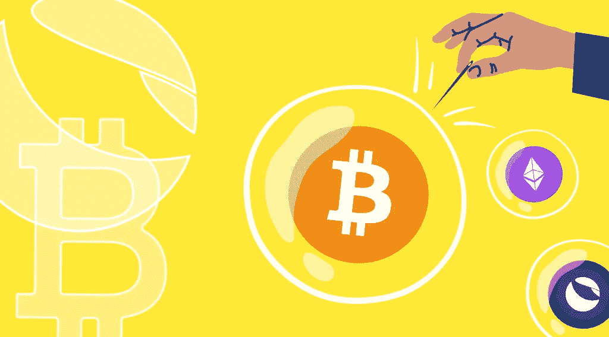

# StealthEX 加密简讯-第 15 期。所有鸡蛋放在一个篮子里

> 原文：<https://medium.com/coinmonks/stealthex-crypto-newsletter-issue-15-all-eggs-in-one-basket-698ad06dd9b?source=collection_archive---------45----------------------->

看看我们每周文摘的第 15 期。

秘密空间是一个非常危险的地方。市场波动很大，价格可能在几分钟内发生变化，诈骗项目到处涌现，黑客就在那里等着侵入你的钱包。好吧，也许没那么激烈，但你已经说到点子上了。

由于缺乏监管和过滤，Crypto 仍被称为“狂野西部”。而且，虽然我们都知道市场波动，但有些事情是可以避免的。

StealthEX 小组在此调查秘密旅行者可能面临的危险。

[**StealthEX 加密通讯——第 15 期。**孤注一掷](https://www.getrevue.co/profile/stealthex_io/issues/stealthex-crypto-newsletter-issue-15-all-eggs-in-one-basket-1219214)

[赶快订阅接收最新的加密新闻吧！](https://www.getrevue.co/profile/stealthex_io)

请记住，我们的工作是提供信息，而不是为您做出投资决策😉

在 [Medium](https://stealthex-io.medium.com/) 、 [Twitter](https://twitter.com/Stealthex_io) 、 [Telegram](https://t.me/StealthEX) 、 [YouTube](https://www.youtube.com/channel/UCeES_XBesX76ge7xf1meuSw) 和 [Reddit](https://www.reddit.com/user/Stealthex_io) 上关注我们，获取 [StealthEX.io](https://stealthex.io/) 更新和关于加密世界的最新消息。对于所有请求，请通过 support@stealthex.io 给我们发消息。

非常欢迎您访问[**stealthexchange**](https://stealthex.io/)**看看它有多快多方便💛**

> 加入 Coinmonks [电报频道](https://t.me/coincodecap)和 [Youtube 频道](https://www.youtube.com/c/coinmonks/videos)了解加密交易和投资

# 另外，阅读

*   [创造并出售你的第一个 NFT](https://coincodecap.com/create-nft) | [密码交易机器人](https://coincodecap.com/best-crypto-trading-bots)
*   [如何在 CoinDCX 上购买柴犬(SHIB)币？](https://coincodecap.com/buy-shiba-coindcx)
*   [CBET 点评](https://coincodecap.com/cbet-casino-review) | [库币 vs 比特币基地](https://coincodecap.com/kucoin-vs-coinbase) | [拜比特 vs 比特币基地](https://coincodecap.com/bybit-vs-coinbase)
*   [折叠 App 回顾](https://coincodecap.com/fold-app-review) | [本地比特币回顾](/coinmonks/localbitcoins-review-6cc001c6ed56) | [Bybit vs 币安](https://coincodecap.com/bybit-binance-moonxbt)
*   [加密保证金交易交易所](/coinmonks/crypto-margin-trading-exchanges-428b1f7ad108) | [赚取比特币](/coinmonks/earn-bitcoin-6e8bd3c592d9) | [Mudrex 投资](https://coincodecap.com/mudrex-invest-review-the-best-way-to-invest-in-crypto)
*   [WazirX vs coin dcx vs bit bns](/coinmonks/wazirx-vs-coindcx-vs-bitbns-149f4f19a2f1)|[block fi vs coin loan vs Nexo](/coinmonks/blockfi-vs-coinloan-vs-nexo-cb624635230d)