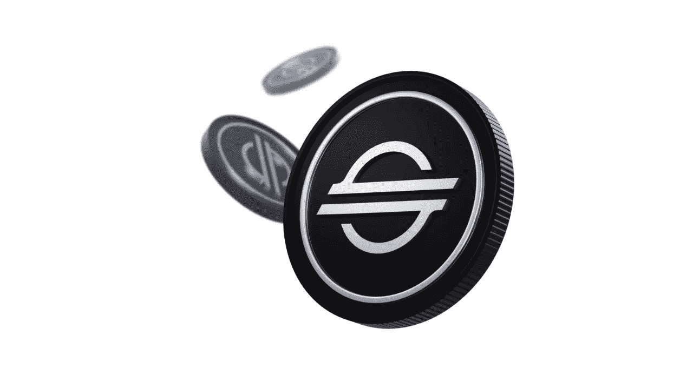

# 恒星(XLM)在 60 秒内解释

> 原文：<https://medium.com/coinmonks/stellar-xlm-explained-in-60-seconds-13e4b0023e3b?source=collection_archive---------41----------------------->

恒星(XLM)由杰德·麦卡勒布于 2014 年创立。McCaleb 是 Ripple 的创始成员之一，但由于与董事会意见不合，于 2013 年离开。随后，他与乔伊斯·金(Joyce Kim)共同创立了 Stellar。这个项目背后的想法是创建一个比 Ripple 更具包容性的系统，Ripple 更集中，并与其他加密货币隔离。

Stellar 致力于创建一个所有人都可以使用的开放金融系统。

这种加密货币是一个开源项目，这意味着任何人都可以为其发展做出贡献，并以他们认为合适的任何方式帮助其发展。

Stellar 旨在供世界各地无法获得可靠金融服务的人使用，甚至只是作为一种在比特币或以太网等波动性货币之外安全储存财富的手段。

Stellar 还具有智能合约功能，这意味着可以在其区块链的基础上构建自动执行的编码合约。

总之，Stellar 是一个开源的全球支付网络，它将银行、支付系统和人们连接起来，以快速可靠地转移资金。Stellar 的合作伙伴包括 IBM、德勤、Stripe 等。

 [## 你准备好迎接加密经济了吗？加密派

### 每次你打开新闻，阅读报纸，或者浏览你的推特，你很可能会看到一些故事…

www.thecryptopie.com](https://www.thecryptopie.com/) 

> 加入 Coinmonks [电报频道](https://t.me/coincodecap)和 [Youtube 频道](https://www.youtube.com/c/coinmonks/videos)了解加密交易和投资

# 另外，阅读

*   [OKEx 评论](/coinmonks/okex-review-6b369304110f) | [Kucoin 交易机器人](/coinmonks/kucoin-trading-bot-automate-your-trades-8cf0ca2138e0) | [期货交易机器人](/coinmonks/futures-trading-bots-5a282ccee3f5)
*   [AscendEx Staking](https://coincodecap.com/ascendex-staking)|[Bot Ocean Review](https://coincodecap.com/bot-ocean-review)|[最佳比特币钱包](https://coincodecap.com/bitcoin-wallets-india)
*   [霍比评论](https://coincodecap.com/huobi-review) | [OKEx 保证金交易](https://coincodecap.com/okex-margin-trading) | [期货交易](https://coincodecap.com/futures-trading)
*   [比特币基地跑马圈地](https://coincodecap.com/coinbase-staking) | [Hotbit 点评](/coinmonks/hotbit-review-cd5bec41dafb) | [KuCoin 点评](https://coincodecap.com/kucoin-review)
*   购买 Dogecoin 的 7 种最佳方式