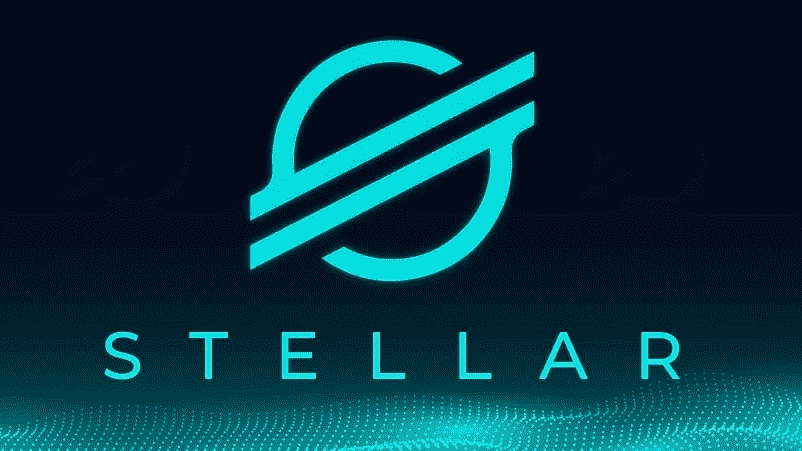

# 恒星(XLM)价格预测:2022-2030 年

> 原文：<https://medium.com/coinmonks/stellar-xlm-price-prediction-2022-2030-554224bf14e5?source=collection_archive---------3----------------------->

Source photo [xlm — Bing images](https://www.bing.com/images/search?view=detailV2&ccid=RjSWXIqs&id=B92E0485E52C3B4ADCE449AA51B754F709F6F0A2&thid=OIP.RjSWXIqs7oOn-nw4O3VyhgHaEK&mediaurl=https%3a%2f%2fwww.coinnewsspan.com%2fwp-content%2fuploads%2f2020%2f04%2fStellar.jpg&cdnurl=https%3a%2f%2fth.bing.com%2fth%2fid%2fR.4634965c8aacee83a7fa7c383b757286%3frik%3dovD2CfdUt1GqSQ%26pid%3dImgRaw%26r%3d0&exph=451&expw=802&q=xlm&simid=608043227675231732&FORM=IRPRST&ck=8241C788FF64A52E7B72976171226607&selectedIndex=0&ajaxhist=0&ajaxserp=0)

总而言之，XLM 的长期投资似乎胜过了短期投资。根据我们对恒星流明价格的估计，到 2022 年底，恒星流明(XLM)的价格将达到 0.80 美元，1.40 美元和 1.91 美元。

除了任何技术分析，你还需要知道恒星流明价格是如何设定的。最好的 XLM 价格预测可以通过结合…