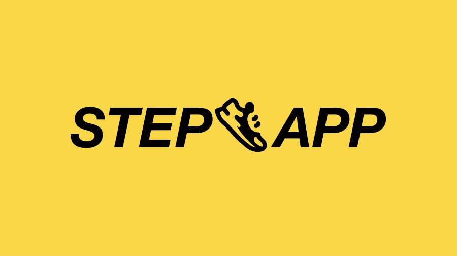
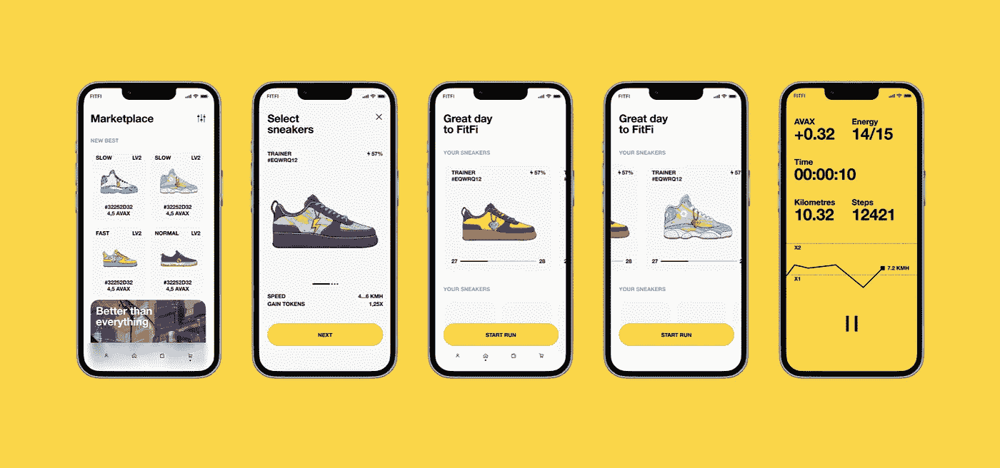
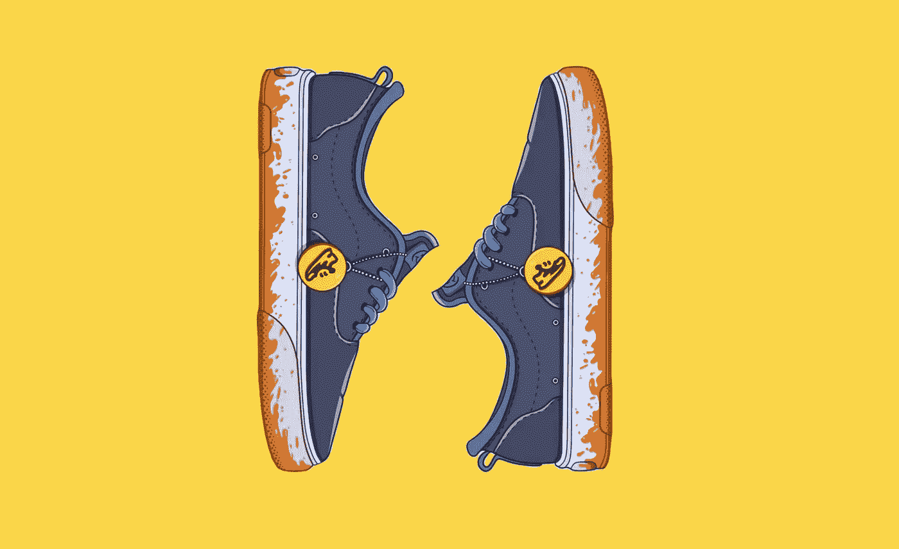
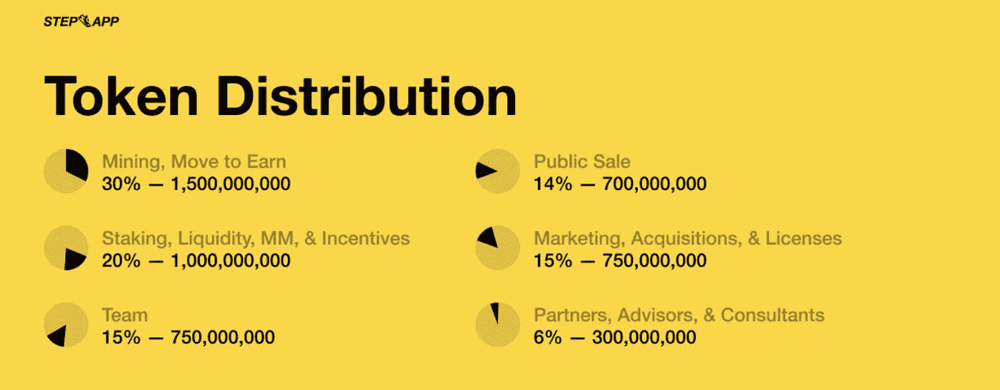
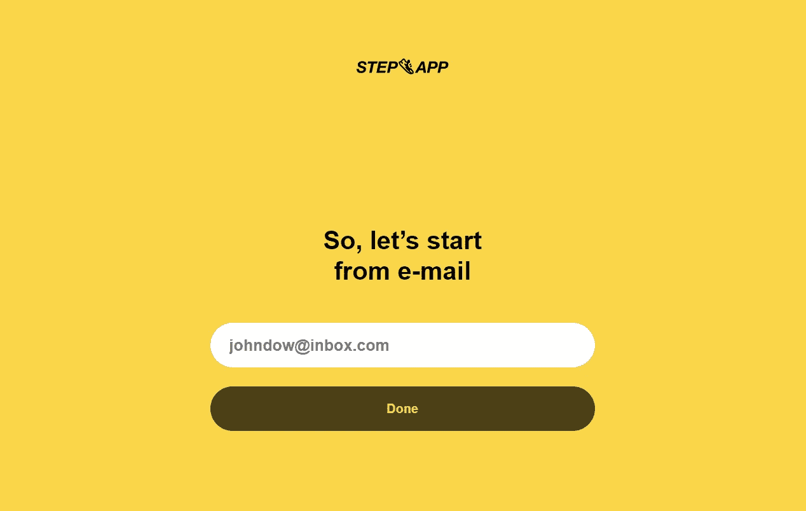
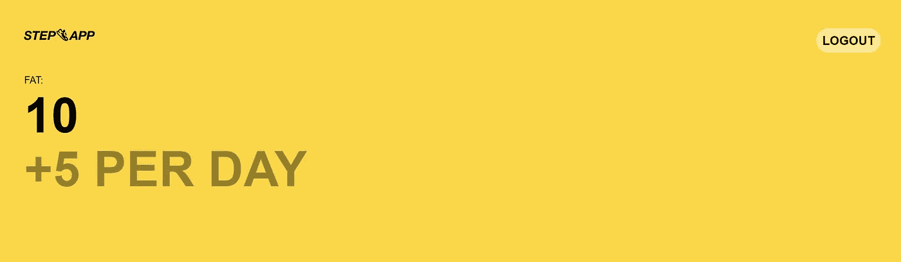

# Step App 获得锻炼的简易密码

> 原文：<https://medium.com/coinmonks/step-app-an-entire-ecosystem-that-rewards-you-for-exercising-50ff4d94bb4?source=collection_archive---------3----------------------->

## 使用 Step 应用程序步行获得报酬

## STEPN 最激烈的竞争对手开始制造噪音

嘿大家好！

在过去，我写过一些关于 [STEPN](https://santiagoschw.medium.com/earn-free-crypto-for-training-with-this-app-841a123ed151) 的文章，这是一款支付你走路和锻炼的 Move2Earn 应用程序。

今天，我将告诉你一个建立在 Avalanche 基础上的类似项目，它刚刚迈出第一步:**步骤**。这个项目旨在建立一个完整的生态系统，基于他们所谓的**FitFi**——健身金融的简称。它已经将自己定位为 STEPN 最激烈的竞争对手。

以下是你需要了解的**步骤。**

> 一如既往，请注意这是有风险的。请记住，这不是财务建议，而是一个简单的信息帖子。你应该自己做研究，只投资你能承受的损失。

## TL；速度三角形定位法(dead reckoning)

*   Step App 提供了一个游戏化的元宇宙，用于社交和锻炼。
*   该应用为散步、慢跑和跑步的用户奖励加密货币。
*   该应用程序尚未推出，但你可以[注册](https://app.step.app?r=1ESHJ431)开始积累代币，在推出时可兑换成游戏内货币。

# 关于 Step 协议和 FitFi 生态系统

Step 的目标是成为一个基于健身金融的完整加密生态系统——或者他们称之为 **FitFi** 。

FitFi 到底是什么？正如该团队所言，这是“一种市场经济，参与者从价值 1000 亿美元的健身行业产生的价值中获利。”

> “[FitFi]是数字健身体验和应用的 web3 版本。”

换句话说，Step 希望建立一个协议，将庞大的健身市场带到人们可以从中获利的框架中。Step App 是该协议的基石。

## Step App，FitFi 的基石

该应用程序是协议开发人员共同努力的结果，也是 FitFi 生态系统的第一个平台。

是目标？为用户提供一个游戏化的元宇宙，利用健身经济对他们有利。通过该应用的网络和游戏组件，用户可以在社交和获得回报的同时锻炼和积累步数。其中包括:

*   **增强现实**:在阶梯元宇宙上创建一个角色，可以进化和定制。
*   **游戏化**:玩家对玩家的挑战、任务和事件，以增强游戏中的社交体验。
*   **赚取**:通过完成目标和达到某些里程碑来产生收入。

Step App’s SNEAK NFTs art.

# 令牌组学:FITFI 和 KCAL

游戏经济由两个主要代币组成，FITFI 和 KCAL。

## 菲特菲

FITFI 是平台的治理令牌，受益于生态系统费用。

## 千卡

大卡代币充当游戏中的货币。这些是用来购买和定制潜行 NFT 的，你必须在跑步时下注以赚取更多的 KCAL。

## 鬼鬼祟祟的人

与 STEPN 类似，Step App 要求你在运动的同时使用鞋子 NFTs 来赚取。在这里，他们被称为潜行 NFT。这些将可用于购买和铸造使用 KCAL，并将奖励用户相同的令牌。

# Step 应用程序入门

你有兴趣加入踏步运动吗？那么，我有好消息和坏消息要告诉你。

坏消息是 app 还没有正式上线，所以现在还不能加入。

好消息是，这为那些相信这个项目的人提供了一个巨大的机会，让他们可以在发布时尽早进入并充分享受所有 Step 应用程序的功能。

按照下面的说明开始。

## 用 Step App 开始积累

为了确保在发布时有一个健康的、不断增长的用户群，Step 允许你在他们的网站上注册并连接你的 Avalanche 钱包来积累**FAT**token。

**FAT** 是一个“收据代币”，可以在发射时兑换成 **KCAL** 。你积累的脂肪越多，当应用程序上线时，你的卡路里就越多，这会让你领先一步。

它是完全免费的，所以你所需要做的就是一劳永逸。要开始赚取脂肪，请点击以下链接:

 [## Step 应用程序| Web

### 每天收集脂肪点。邀请推荐，多收集脂肪点。通过燃烧 FITFI 将脂肪转化为千卡热量。

应用程序](https://app.step.app?r=1ESHJ431) 

> **小心！有几个打着谷歌广告的虚假网站试图欺骗你。你可以直接点击上面的链接或者复制到你的导航栏上来避开这些网站: [**https://app.step.app？r = 1 eshj 431**](https://app.step.app?r=1ESHJ431)**

到了那里，你会被要求提供你的电子邮件，在那里你会收到一个确认码。在网站上输入。

> 注意:如果您没有收到步骤中的电子邮件，请记得检查您的垃圾邮件文件夹。

接下来，网站会询问推荐代码。如果你愿意，你可以用我的来帮我一把，赚更多的脂肪。这是我的推荐代码: **1ESHJ431**

但是，如果你不想用，也可以不用。看你的了！

之后，该网站会将你重定向到你的仪表板，在那里你会看到你当前的脂肪余额和连接钱包的选项。如果你想提高你的脂肪收益率，把你的钱包链接到这个网站。

就是这样！你已经赚了很多钱，一旦应用程序启动，你就可以将它们兑换成游戏中的货币。

> 我希望这篇文章是有帮助的。我会试着发布更多关于 Step App 的内容，以及它在不久的将来会带来什么。敬请期待！

## 你喜欢这个故事吗？

我很高兴你这么做了！我叫桑蒂。我喜欢并写作视频游戏、加密货币和流行文化。如果你想阅读更多类似这样的内容，可以考虑关注我的****和 [**Twitter**](https://twitter.com/SantiagoSchw_) 。我真的很感激！****

## ****谢谢大家的支持！****

****我是一名独立作家，我的故事没有报酬。如果你想用你想要的任何数量来支持我，我会非常感激！****

*   ****我的多链地址(以太坊，雪崩，多边形，BNB 链):**0x 9 a9 ab 154 aeea 167 AFD F5 AE 1a 88955 ea C9 ADF 5807******
*   ****本人 BTC 地址:**BC 1 q 9h 509 sea 3y 7 zcjp 24 dqjpucfq 44 r 0 ueltz 3 z 3c yh 67 qlhvsflrwqzt 6 pr 0******

## ****如果你喜欢这个，你应该读…****

**** [## 使用 STEPN 应用程序进行培训，每天赢取加密奖励

### 这个加密项目给你钱去散步

santiagoschw.medium.com](https://santiagoschw.medium.com/earn-free-crypto-for-training-with-this-app-841a123ed151)  [## 如何在你睡觉的时候从你的密码中赚取高达 16%的被动收入

### 只需将您的资产存入 Nexo，即可每天赚取利息

medium.com](/coinmonks/nexo-earn-up-to-16-of-passive-income-on-your-crypto-while-you-sleep-dfa3a756e9f7)  [## Avalanche trader Joe 的简单、低风险被动收入策略

### 用这种方法在睡在 TraderJoe 上的时候赚钱

santiagoschw.medium.com](https://santiagoschw.medium.com/10-passive-income-strategy-on-trarderjoe-avalanches-main-dex-25eb449be664) 

> 加入 Coinmonks [电报频道](https://t.me/coincodecap)和 [Youtube 频道](https://www.youtube.com/c/coinmonks/videos)了解加密交易和投资

# 另外，阅读

*   [最佳以太坊钱包](https://coincodecap.com/best-ethereum-wallets) | [电报上的加密货币机器人](https://coincodecap.com/telegram-crypto-bots)
*   [交易杠杆代币的最佳交易所](https://coincodecap.com/leveraged-token-exchanges)
*   [最佳加密分析或链上数据](https://coincodecap.com/blockchain-analytics) | [Bexplus 评论](https://coincodecap.com/bexplus-review)
*   [NFT 十大市场造币集锦](https://coincodecap.com/nft-marketplaces)
*   [AscendEx Staking](https://coincodecap.com/ascendex-staking)|[Bot Ocean Review](https://coincodecap.com/bot-ocean-review)|[最佳比特币钱包](https://coincodecap.com/bitcoin-wallets-india)
*   [Bitget 回顾](https://coincodecap.com/bitget-review) | [双子 vs 区块链](https://coincodecap.com/gemini-vs-blockfi) | [OKEx 期货交易](https://coincodecap.com/okex-futures-trading)
*   [美国最佳加密交易机器人](https://coincodecap.com/crypto-trading-bots-in-the-us) | [经常性回顾](https://coincodecap.com/changelly-review)****