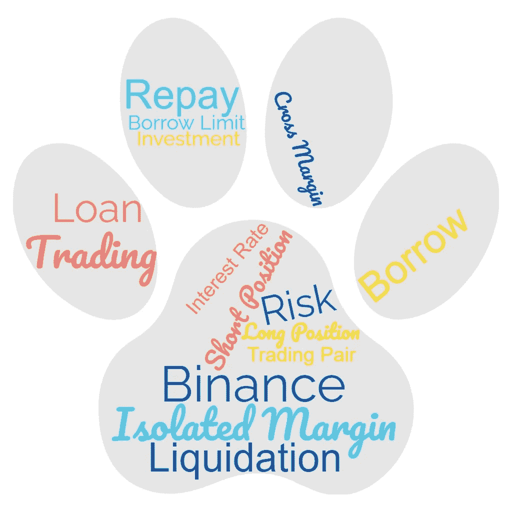

# 在币安交易所卖空的分步指南

> 原文：<https://medium.com/coinmonks/step-by-step-guide-for-short-selling-on-binance-exchange-587dfd5ca7b0?source=collection_archive---------0----------------------->

我将带你了解在币安开设保证金交易账户的细节，并执行卖空交易(以及更多)。

Margin Trading Word Cloud

卖空是交易的基本策略之一。如果你理解卖空背后的概念，在任何金融交易或投资中利用它并不复杂。