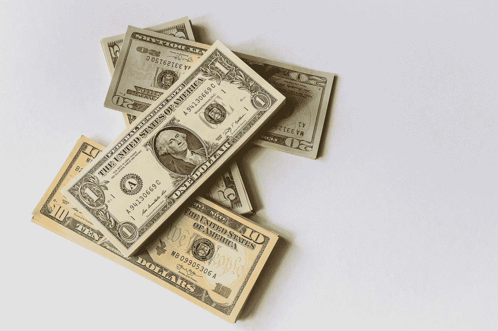

# 初学者如何买卖以太坊的分步指南

> 原文：<https://medium.com/coinmonks/step-by-step-guide-on-how-to-buy-and-sell-ethereum-for-beginners-7292ee508692?source=collection_archive---------65----------------------->

Photo by [shutter_speed](https://unsplash.com/@sspeed?utm_source=unsplash&utm_medium=referral&utm_content=creditCopyText) on [Unsplash](https://unsplash.com/s/photos/ethereum?utm_source=unsplash&utm_medium=referral&utm_content=creditCopyText)

# 以太坊概述:

以太坊是一个去中心化和开源的区块链。它是由 Vitalik Buterin 在 2013 年发表的一份白皮书中首次提出的。2014 年，Vitalik 和他的联合创始人通过在线公开众筹为该项目筹集了资金。以太坊有它的加密货币，被称为 ETH。ETH 可以通过各种在线交易获得。Paypal 和 Robinhood 等热门经纪网站也可以用来购买 ETH。

*[**分步指南开始**](https://thecryptolab.groovesell.com/a/hxfZKodDqjTa) **你的交易之旅***

*以太坊是一个智能合约平台，可以用来运行 dApps 和 ico、NFT 等令牌。*

*根据 coinmarketcap 的数据，以太坊的市值为 351，515，516，323 美元，是世界上第二大最有价值的加密货币。*

*以太坊得到了 500 多家公司的支持，并被多家金融机构使用。因此，许多人被吸引到 ETH 并投资其中。这些年来以太坊的价值增长了数千倍。在本文发表时，以太坊的价格在 2940.45 美元左右波动。*

*然而，许多人想投资但不确定如何收购以太坊，而另一些人可能不确定如何出售他们购买的以太坊。这篇文章将带你了解以太坊的买卖过程。*

# *我如何购买以太坊？*

**

*Photo by [Austin Distel](https://unsplash.com/@austindistel?utm_source=unsplash&utm_medium=referral&utm_content=creditCopyText) on [Unsplash](https://unsplash.com/s/photos/exchange?utm_source=unsplash&utm_medium=referral&utm_content=creditCopyText)*

## *选择交易平台:*

*在任何类型的交易中，第一步也是最重要的一步是选择一个符合你需求的交易平台。以太坊可以在 Bitfinex、Bitstamp、Gemini、北海巨妖、币安和比特币基地等著名的加密交易所使用。*

*在识别交换时，交换的类型同样重要。交易者有两个交易平台可供选择:加密货币转加密货币(C2C)和法币交易所。*

*C2C 交易所对于想要进行多种货币交易或者将其他货币兑换成以太币的投资者来说更为理想。另一方面，许多投资者在 C2C 和菲亚特市场都有账户。*

*由于加密货币不受监管，找到一个值得信赖的平台变得更加重要。*

*在选择交易所时，需要检查的一些问题包括交易所网站的安全性如何，平台是否有适当的许可，以及资金的安全性如何。比特币基地交易所是美国最受欢迎的加密货币交易所。*

## *创建一个帐户*

*下一步就是决定交易平台后开户。程序和在券商平台开户一样，耗时很少。姓名、地址、必要的身份证明形式和社会安全号码只是创建帐户时需要的一些细节。*

*开户流程的最后一步是验证账户。账户经常被交易所核实一两次。然后，用户将被要求上传他们的文件，并证明他们的帐户有适当的监管传票。验证过程可能需要一个小时到一两天的时间，具体取决于交易所。*

## *将钱存入你的账户*

*下一步是用钱给账户注资。就法定货币平台而言，这个过程相对简单。为了增加资金，用户可以使用银行账户或借记卡。加密交易所有一个惊人的好处，即不需要最低投资，并且接受任何金额的资金，无论是 5 美元还是 1000 美元。在交易所一次性进行大量交易，并收取每次交易的费用，效率很高。*

*另一方面，在 C2C 交易所存放货币很困难。用户必须使用代码在这些地区的多个地方之间转移加密货币。传输代码的过程也需要更长的时间，经常长达一个小时。因为以太币是许多 C2C 服务的流行存款货币，拥有大量的以太币可能是有利的。*

## *开始交易*

*完成上述程序后，您可以使用交易所购买以太坊和其他加密货币。尽管每个交易所都有自己的界面，但客户应该期望确认交易，并根据请求的交易总数留出一些处理时间。*

## *应该把钱放进钱包里*

*在交易所购买 ETH 后的最后一步是将货币提取到您的银行账户或您控制的钱包中。同样，提取 ETH 就像出售它并通过法定交易所将资金转到你的银行账户一样简单。C2C 平台可能需要更长的时间来建立。在 C2C 平台上，用户需要将 ETH 代码转移到一个法定交易所，然后卖出去兑现法定货币。每个平台还提供将 ETH 发送到钱包的选项。*

# *以太坊最好的销售方式是什么？*

**

*Photo by [Alexander Schimmeck](https://unsplash.com/@alschim?utm_source=unsplash&utm_medium=referral&utm_content=creditCopyText) on [Unsplash](https://unsplash.com/s/photos/exchange?utm_source=unsplash&utm_medium=referral&utm_content=creditCopyText)*

*以太坊卖的过程和买的过程很像。首先，人们需要找到一个交易所，允许他们在自己的辖区内交易乙醚。然后创建一个用户帐户。填写各种个人信息，如您的住址、出生日期和政府颁发的带照片的身份证。*

*然后，你可以选择出售你的以太作为法定货币，比如美元或欧元，或者换成另一种加密货币。例如，你可以将任意数量的以太从你自己的钱包传送到你在交易所的以太坊地址。同样，传输的总时间将由指定的费用和以太网上的当前流量决定。*

*对于各种加密货币和加密资产，交换平台将拥有特定的钱包和地址。在这里可以找到“卖出”、“存款”或“存入交易所”按钮。通过点击这些链接中的任何一个，你都可以访问钱包和相关的加密货币地址。*

*许多代币是基于其他区块链；例如，ERC-20 代币是建立在以太坊区块链上的。仔细检查你在任何特定交易中使用的钱包是否兼容也是一个好主意。*

*在你的乙醚被确认后，你可以决定你想卖多少，你想得到什么货币作为回报。在大多数集中式密码交易所，可以通过市价单或限价来实现。*

*当交易完成时，你可以查看你账户中的资金，无论是固定的还是加密的。如果你卖掉乙醚来兑换任何一种传统货币，你就可以将资金提取到你的银行账户中。*

*无论你是交易者还是长期投资者，你都需要一个值得信赖的交易所来交易以太币和其他加密货币。你要找的市场必须有你熟悉的那双鞋，而且必须值得信赖。一个好的平台应该是可靠和安全的。*

# *在加密货币市场分散投资组合*

## *现在你可以自己为自己建立一个持续的被动收入流*

*➤一步步引导你开始交易之旅*

*➤初学者友好，并适用于有经验的交易者*

*➤不仅一个，但 10 个不同的策略将被详细教授*

*[**现在加入**](https://thecryptolab.groovesell.com/a/hxfZKodDqjTa)*