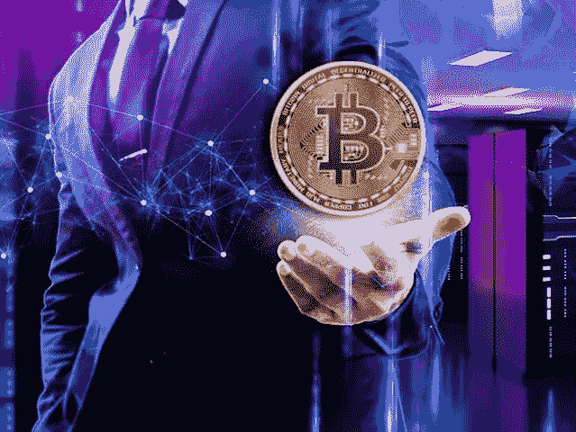
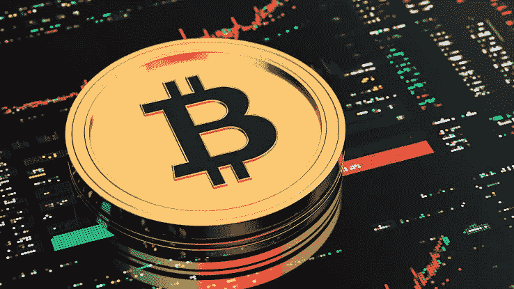
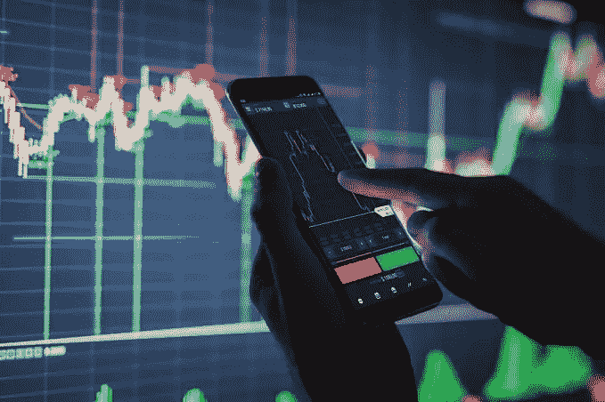
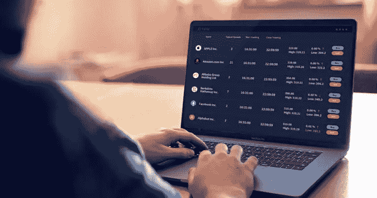

# 投资加密货币的分步指南

> 原文：<https://medium.com/coinmonks/step-by-step-guide-to-investing-in-cryptocurrency-8855c77b2ca9?source=collection_archive---------32----------------------->

尽管密码市场不稳定；个人仍然很难找到一种策略来从市场中获得丰厚的利润，并最小化相关的风险。与此同时，许多人仍在寻求投资加密货币的指导，但让我们看看加密货币意味着什么。

加密货币是一种数字资产，由一种称为“区块链技术”的技术以密码学的形式支持，并且已经去中心化；这意味着没有中央权力机构可以控制这个系统。

**又念:** [*即付即投 2022*](/coinmonks/airdrops-that-pay-instantly-2022-aaacbb36251f?source=your_stories_page-------------------------------------)

比特币是 2008 年由一个名为“中本聪”的匿名团体或个人创造的第一种加密货币，比特币的第一笔交易记录于 2009 年；比特币的产生是为了提名中央权威，把权力还给人民。

然而，这篇文章需要一步一步的投资加密货币的指南，请拿起一杯酒，坐下来，舒服地阅读。

# 投资加密货币的 5 个步骤

当谈到投资加密货币时，一个人需要有一个他/她应该遵循的原则，很不幸的是，人们在没有遵循一些正确的指导如何从市场中获利并最小化相关损失的情况下跳入加密投资；大多数没有原则就投入投资的新手总是赚不到钱——相反，他们记录了巨大的损失。

然而，这里有一个关于如何投资加密货币的全面的 5 步指南。

**亦读；** [邪教刀币——你需要知道的一切](https://link.medium.com/60VHZQXVipb)

# 了解密码市场

投资数字资产(加密)时，需要了解加密市场的波动性，投资者应该明白加密市场是不稳定的，这意味着价格每秒、每分钟、每小时都在变化。

当投资者或个人了解了[密码](https://link.medium.com/jnKHD5GVipb)市场；当资产跌破买入点时，他们可以控制自己对市场的情绪，这不会像是有人或密码系统在欺骗他们或利用他们的资本。

总会有这样的经验，市场可以向上/向下移动，对他们有利或不利，这将形成他们在加密市场的策略。

然而，一枚硬币/代币可以在一天内从 1 美元涨到 100 美元，也可以从 1000 美元涨到 10 美元，甚至 1 美元，因为没有人可以 100%准确地预测市场，因为没有权威机构控制着加密市场，它要么是空头多于多头，要么是多头多于空头，这决定了市场是看涨还是看跌。

# 理解加密货币背后的概念

很多人在不知道加密货币背后的概念的情况下购买或投资加密货币，当投资任何硬币时，知道它是什么或获得一些关于硬币的信息总是更好。

像一个新手一样不断询问顶级大师；现在买什么硬币最好，未来几天什么硬币会让我×3，什么硬币能把 1 美元变成 1000 美元等等。这是不对的，取决于密码市场的大师们，最好对顶级硬币，如比特币、以太坊、币安币等进行一些研究。

然后阅读他们的白皮书，其中有关于项目如何成功的信息和计划、功能、创建它的目的、创始人的姓名、项目 tokenomic 及其产品/用例，所有这些都是加密项目白皮书中的内容。

当你现在理解了硬币，这将使你有能力知道它是一个具有伟大功能/效用的好硬币，还是一个不能带来良好投资回报的坏硬币，尽管许多新上市的硬币非常有前途，但有些将停止按照他们的路线图工作，而有些将最终消失。

# 存储您的加密货币

加密货币存放在加密钱包里，要么是热钱包，要么是冷钱包。热钱包联网，冷钱包不联网。这是一个有点复杂和奇特的过程。这个钱包不是一个实体钱包，而是一个专门用来存储加密货币的软件程序。

它存储将用户连接到加密货币所在的区块链的私有和公共密钥。他们并不存储加密货币，但他们会帮助您使用公钥和私钥访问区块链上的加密货币。用户需要两者来完成交易。它们被称为“钥匙”,因为它们可以打开区块链的加密货币。

有多种数字钱包，如桌面钱包、在线钱包、移动钱包和硬件钱包。人们应该根据安全性和便利性之间的平衡来选择钱包。一些交易所向用户提供数字钱包。

# 保护您的加密钱包

保护您的加密货币是一个重要方面。如果你正在使用加密货币购买产品，或者如果你有一个热门的钱包，这将变得更加值得注意。因此，当密码在线时，需要确保其安全性。通常，人们更喜欢使用 VPN(虚拟专用网)来确保安全和加密的在线交易。

数据加密意味着没有人能看到任何用户的在线交易。这是一个额外的保护层，确保用户的数据和密码购买完全匿名。这使得其他人更难侵入账户，尤其是对于拥有大量密码的用户。

# 风险管理

这是大多数人不重视的方面，而有些人甚至不知道什么是风险管理，以及如何采取适当的风险管理，可以取代他们的损失。同时，当有适当的风险管理时，这是非常重要和非常有利可图的。尽管如此，让我们来看一下风险管理的定义；

风险管理是管理你对市场的风险的行为，它可以是一种知道何时买入何时卖出的策略，也可以是投资一种特定货币的资金。

这将有助于减少市场损失，从投资任何硬币中获得更多利润，同时也控制了对加密市场的情绪，例如

长期投资者的风险管理可能是无论价格如何都不卖任何硬币，这种心态会让投资者坚持持仓，永远不卖。

短期投资者的风险管理可能是在特定的设定价格卖出以获利，或者在价格下跌 10%时卖出以避免市场中的巨额损失。

新投资者需要遵循这些规则或设定他们的风险管理策略，以避免损失更多或学会知道何时获利。

**亦读；** [库币交易所点评——库币交易所安全吗？](https://link.medium.com/ASgIjDQVipb)

# 结论

加密货币是一个长期游戏，有其基本面和服务的社区。它们的使用是独立的，远远超出了我们目前所知的范围。因此，人们不应该把它们当作一个快速致富的计划。购买 crypto 的投资者应该有他们的投资期限，并定期记录利润。

此外，人们应该知道，与其他投资渠道相比，加密市场还很不成熟。因此，新的代币将进入市场，引起轰动，兴奋将会消失。因此，投资者应该警惕这种骗局。按时记录你的利润。

加入我们的电报社区，获取加密新闻、加密宝石、支持和加密教程；

电报链接:【https://t.me/+6ek5FpdVW89jNjE0 

> 加入 Coinmonks [电报频道](https://t.me/coincodecap)和 [Youtube 频道](https://www.youtube.com/c/coinmonks/videos)了解加密交易和投资

# 另外，阅读

*   [如何开始通过加密贷款赚取被动收入](https://coincodecap.com/passive-income-crypto-lending)
*   [加密货币储蓄账户](/coinmonks/cryptocurrency-savings-accounts-be3bc0feffbf) | [加密交易机器人](https://coincodecap.com/best-crypto-trading-bots)
*   [BigONE 交易所评论](/coinmonks/bigone-exchange-review-64705d85a1d4) | [CEX。IO 审查](https://coincodecap.com/cex-io-review) | [交换区审查](/coinmonks/swapzone-review-crypto-exchange-data-aggregator-e0ad78e55ed7)
*   [最佳比特币保证金交易](/coinmonks/bitcoin-margin-trading-exchange-bcbfcbf7b8e3) | [比特币保证金交易](https://coincodecap.com/bityard-margin-trading)
*   [加密保证金交易交易所](/coinmonks/crypto-margin-trading-exchanges-428b1f7ad108) | [赚取比特币](/coinmonks/earn-bitcoin-6e8bd3c592d9)