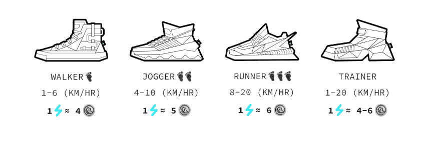
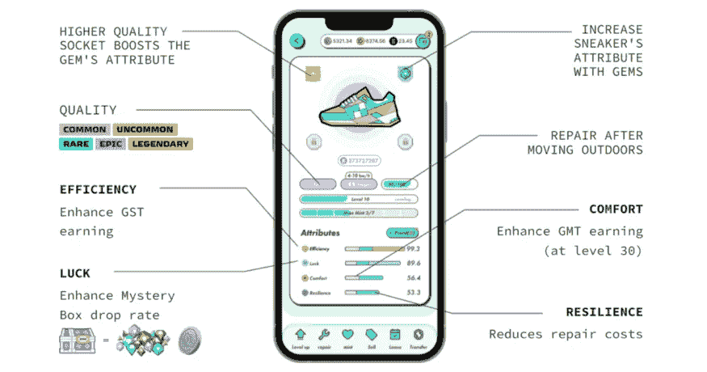
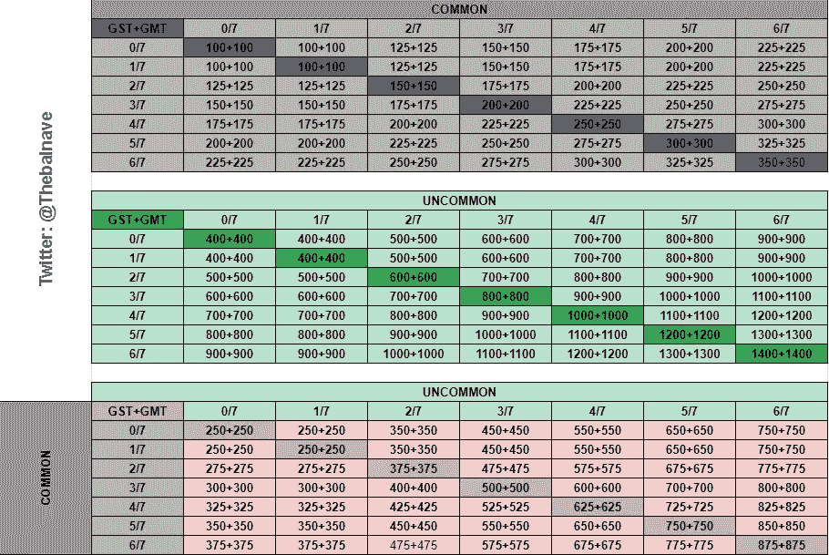
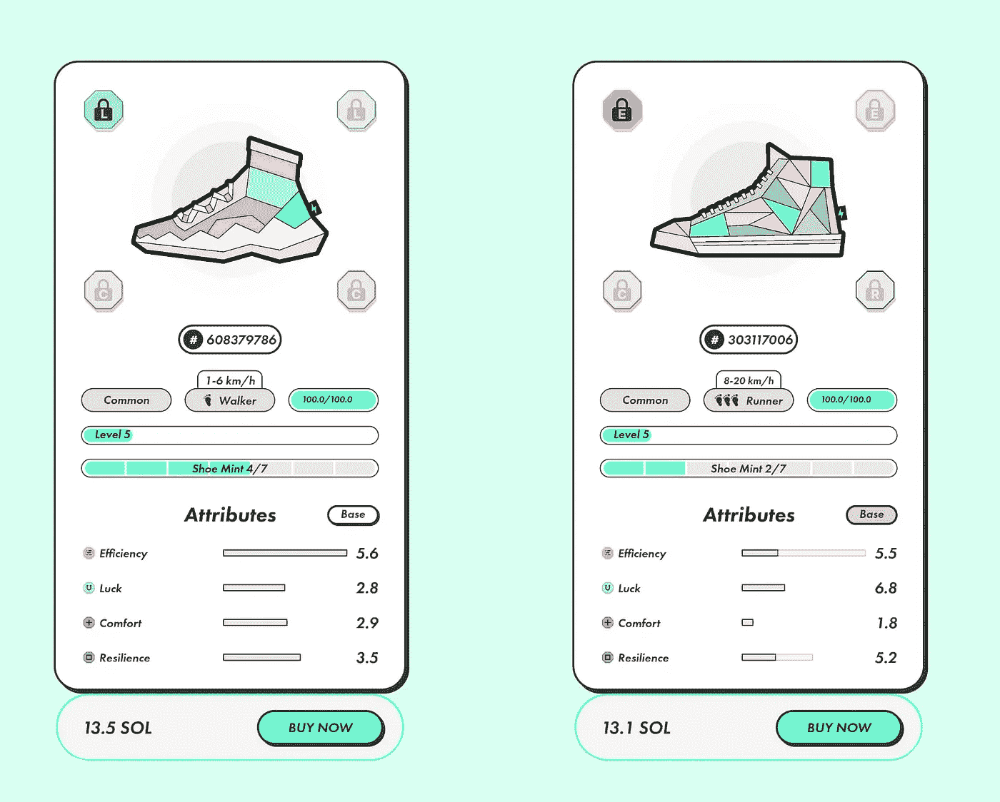
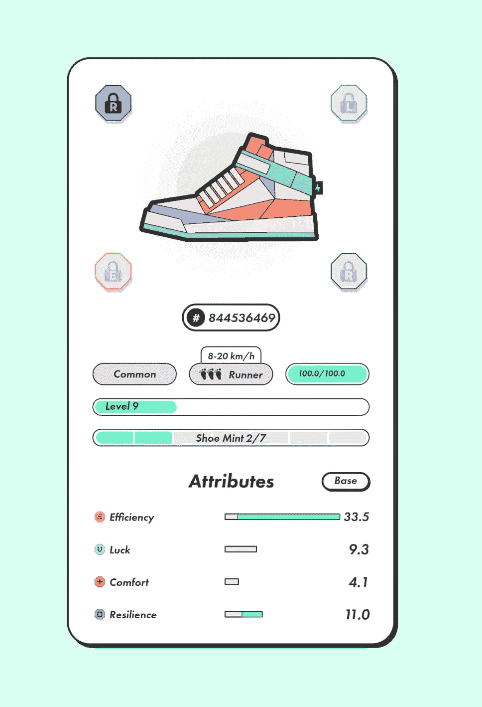

# STEPN 收入策略，第二:机械

> 原文：<https://medium.com/coinmonks/stepn-earning-strategies-2-the-mechanic-59ae9b4fb557?source=collection_archive---------0----------------------->

## GameFi NFT 应用程序

## 改进你的运动鞋，获取最大利润

Photo by [Lefteris kallergis](https://unsplash.com/@lefterisk?utm_source=medium&utm_medium=referral) on [Unsplash](https://unsplash.com?utm_source=medium&utm_medium=referral)

大家好！欢迎来到 STEPN 收入策略系列的新条目。

今天，我想和你分享 STEPN 中最大化收益的第二个策略，Move2Earn 应用程序奖励你走路、训练和走动。

如果你想看第一个策略，请访问下面的链接:

 [## STEPN 赚钱策略#1:步行者

### 如何通过搬家获得被动收入

medium.com](/coinmonks/stepn-earning-strategies-1-the-walker-c8e8d8f6a5f0) 

另一方面，如果您不熟悉 STEPN 或者不知道它是关于什么的，您可以在本文中了解更多信息:

 [## 使用此应用程序进行培训，每天都可以获得加密奖励

### 这个加密项目给你钱去散步

santiagoschw.medium.com](https://santiagoschw.medium.com/earn-free-crypto-for-training-with-this-app-841a123ed151) 

最后，你可以在 STEPN 的官方网站上找到更多信息，或者在 Discord 官方服务器上，你可以通过这个链接加入:

 [## 不和-与朋友和社区聊天的新方式

### 不和谐是通过语音、视频和文本进行交流的最简单方式。聊天，闲逛，和你的朋友呆在一起…

直流步进运行](https://dc.stepn.run/invite?code=16512440940939) 

现在，事不宜迟，让我们深入了解一下“**机械师**”

# 战略概述

这种策略被称为“机械师”，因为它涉及到改善运动鞋的属性，提高你的 NFT，以增加其价格。它部分基于游戏机制，部分基于 NFT 交易。

下面是对“**机械师**战略的概述:

*   **简介**:中等
*   **风险**:中等
*   **复杂度**:中等
*   **强度**:可变(根据您的喜好)
*   **初始投资** : 13.5 索尔，或大约。120 万美元
*   **大约。投资回报率** : 10 天
*   **所需时间**:每天约 20 分钟

# “机械师”入门

这个策略是“[步行者](/coinmonks/stepn-earning-strategies-1-the-walker-c8e8d8f6a5f0)”的变体，与第一部分非常相似。在这一点上，我会假设你已经有一个 STEPN 帐户和钱包，或者至少知道如何设置它。

在写这篇文章的时候，**索尔**价值 **$81.24** ，运动鞋 NFT 的底价大约为 **13.1 索尔。让我们分别把它四舍五入到 85 美元和 13.5 美元。**

因此，你的初始投资大约是 1147 美元。同样，让我们把价格提高到 **$1，200**；以防万一。

# 寻找运动鞋

就像沃克策略一样，你需要一双为赚取商品及服务税而优化的运动鞋。对于那些新来的人，让我们再一次回顾运动鞋的不同方面。

> 如果你已经读过《步行者》,并且记得你需要什么样的运动鞋，你可以跳过这一部分，因为只有一些小的不同。

## 运动鞋类型

对于“机械师”，你可以选择任何你想要的运动鞋类型。这取决于你和你的训练风格。最重要的是你必须承诺。

如果你选择了一个跑步者，你必须坚持每天出去跑步。否则，这个策略是行不通的。

也就是说，以下是你的选择:

*   沃克:最低的收入比率，但也需要最低的努力。如果您不确定或不想提交，请选择此项。
*   **慢跑者**:介于步行者和跑步者之间的中间姿势。非常适合低强度跑步者或初学者。如果你是步行者并想提高速度，或者如果你是刚开始尝试速度的跑步者，请选择此项。
*   **跑步者**:要求最高的收益率和努力程度。如果你准备好全力以赴，每天坚持训练，选择这个。
*   教练:我不推荐教练，因为这是一种灵活的运动鞋，允许用户在所有速度范围内训练。然而，这种优势已经体现在价格中，这也是为什么教练 NFT 比其他职业要高得多的原因。为了获得最大的收益，最好了解自己，选择一款特定的运动鞋。

> 请记住，对于这个策略，你不会坚持穿你的第一双运动鞋很长时间。你将有机会每 10 天左右更换一次血型。也就是说，如果你介于两种类型之间，最好选择省力的运动鞋，如果太慢，以后再换。

## 运动鞋属性

> 就像在《步行者》中一样，你必须专注于**效率**和**弹性**。如果你是一个鉴赏家，你可以跳过这一部分。

**效率**直接影响你的收益率，这意味着该属性的值越高，移动的回报就越高。另一方面，弹性决定了运动鞋磨损的速度。因此，这个统计数据会间接影响你的收入——你的运动鞋损坏得越慢，你花在修理上的费用就越少。

也就是说，你应该试着找到在这两个属性上至少有 5 个或更多基础点的 NFT，或者总共有 10 个基础点，比如 7 个效率，3 个弹性。

## 薄荷糖

在上一篇文章中，我解释了沃克战略不涉及铸造。因此，一双运动鞋有多少薄荷糖并不重要。事实上，我鼓励你以更低的价格买一双含更多薄荷糖的运动鞋。

机械策略也不涉及任何铸造。然而，这确实涉及到在市场上转售你的运动鞋。因此，高薄荷运动鞋可能比其他的更难卖。请记住，已经被用于薄荷超过 2 NFTs 的运动鞋往往比那些薄荷较少的运动鞋价值更低。

也就是说，我会建议你试着找一双含 2 薄荷糖的运动鞋。

为什么特别是 2？0–2 薄荷糖运动鞋的铸造成本较低，因此价格较高。为这个策略购买这些运动鞋会增加你不必要的初始投资。

Sneaker minting costs. Credits to @Thebalnave on Twitter!

我知道你在想什么。如果你不用它造币，你也可以以更高的价格转售。然而，造币者并不真的关心整平的运动鞋，所以即使那是真的，你也会为几乎相同的结果付出额外的时间和努力。不仅如此，你还会承担更高的风险。

另一方面，3+ mints 运动鞋价格较低，但其铸币回报基本为负(铸币成本高于铸币运动鞋的实际价值)。这使得它们难以转售，并降低了价格。

> **记住** : 2 颗薄荷糖，完美平衡。

## 水平

“机械师”就是要把你的运动鞋整平，并提高它的性能，以便以后卖个更高的价钱。也就是说，买一双已经拉平的运动鞋没有任何意义。

确保你选择一些好的，高基础统计，5 级运动鞋开始。

## 宝石和质量

质量是无关紧要的，因为任何超过普通运动鞋将极大地提高你的初始投资。

另一方面，许多 STEPN 用户在购买运动鞋时会查看宝石插座。需求最大的插座是效率宝石。如果有一双运动鞋在 4 个插座中有 3 个插座，那就有问题了。

> 请记住，宝石插座是第二优先属性和铸币厂。

**你注意到了吗？**看看下图。

这是两只真正的运动鞋，价格几乎一样，都是从市场上买的。其中一个适合这个策略。另一个就没那么好了。如果你看红色标记的数据，你就能区分它们。你会选择哪一个？

> ***不要被价格欺骗！*** *右边的跑步者比左边的步行者有更少的薄荷糖，更好的基础统计，更好的宝石插座，使其成为这种策略的更好的运动鞋。*

# 行走、赚钱和消费

一旦你有了运动鞋，你会看到你的能量上限提高到 2。有趣的事情开始了！

## 增强你的运动鞋

> 再说一遍，这一部分将会和《步行者》中的一样。如果你已经读过，请随意跳过它。

如果你买了一个没有附加属性的 5 级运动鞋，你将有 20 点花费在改善你的 NFT 上。

正如我之前提到的，与机械战略最相关的统计数据是效率和弹性。它们也是市场最需要的，因此也是最有价值的，所以这就是你应该花你的点数的地方。我的建议是按照 **3:1 的比例**来改进它们(效率每增加 3 分，弹性就增加 1 分)。

然而，这将取决于你所购买的运动鞋的基本属性。 **2:1** 和**4:1**的比率也是可以接受的，总是优先考虑**效率而不是弹性**。

## 向上拉平

首先，你步行 **10 分钟**所赚的商品及服务税将几乎不足以修复和升级你的运动鞋。**耐心点**。

每天散步后，让你的 NFT 在晚上保持水平(第一级需要几个小时)。第二天，你会看到你的属性又增加了 4 点。

使用相同的比率不断提高你的属性，直到你达到运动鞋**等级 9** 。到那个时候，你的球鞋应该有 **30+效率**和 **10+弹力**。一双运动鞋的这种属性将为你的每种能量带来大约**4–6 GST，**或**0.8–1.2 GST。**

> *按***按****GST****，也就是****【20–30****每天 10 分钟。这个收益率意味着你将在接下来的 40-60 天***内收回你的初始投资****【1200】美元*** *。然而，机械策略并不仅仅依赖于行走。***

**这里有一张很好的图片，展示了你的运动鞋在第 9 级时的样子。**

****

# **转售你的运动鞋**

**在你达到 9 级后，大约一周到 10 天，你将有一个完全升级的运动鞋在市场上出售。**

**在写这篇文章的时候，这种类型的运动鞋在市场上的价格是 14.5 SOL。那是你最初为你的等级 5 支付的的 **~7-10%** 的利润。恭喜你！**

**现在是时候换我之前跟你说过的运动鞋了。**

**在这一点上，你可以购买另一个 5 级，并重新开始这一过程(确保 7-10%的利润)，如果你认为你选择的运动鞋对你来说太激烈或平淡，可以选择切换到另一个运动鞋类。你的 STEPN 钱包里还应该有大约 4–5 GST,这应该会给你下一阶段一个良好的开端。**

> **如果你再次开始这个过程，在**的 10 天**内获得**到 7-10%**的利润，并且考虑到商品及服务税的额外收益，你将需要重复这个过程大约**1.5-2 个月**到**使你的初始投资**翻倍。那可是 **100%** 的利润！**

**另一个选择是重新开始这个过程，但是改用 Walker 策略。这涉及的风险较小，让你以更轻松的方式赚钱。您可以在此访问“步行者”:**

** [## STEPN 赚钱策略#1:步行者

### 如何通过搬家获得被动收入

medium.com](/coinmonks/stepn-earning-strategies-1-the-walker-c8e8d8f6a5f0) 

# 风险和收尾思路

“机械师”比沃克策略风险更大，因为它涉及一定程度的 NFT 交易。也就是说，您应该留意以下因素:

*   **NFT 价格波动**:这一策略的主要风险因素。NFTs 可能会经历价格的大幅波动，你花 13 索尔买的运动鞋第二天可能就值 12.5 英镑了。这将对你的利润产生巨大影响，但如果价格上涨，也会给他们带来巨大的推动。保持警惕！
*   **SOL 波动率**:NFT 以 SOL 定价，因此其价格也会影响盈利能力。如果你以**90 美元【1170 美元】**的价格为 **13 索尔**买一双运动鞋，然后以**80 美元【1120 美元】**的价格为 **14 索尔**卖，你会亏本。即使看起来你赚了 1 索尔，但实际上你损失了 50 美元。当然，只要你想用菲亚特衡量你的收入，你就要确保跟踪菲亚特的硬币价格和总额。

值得注意的是，与沃克策略不同，“技工”并不真正关心**商品及服务税的波动性。这是因为你的利润不是来自商品及服务税，而是来自 NFT 销售。**

> *请将这些风险考虑在内，* ***记得带利润*** *！商品及服务税和 GMT 是不稳定的资产，如果你很贪婪，你最终会一无所有。在我看来，*[*KuCoin*](https://www.kucoin.com/r/rf/r3SD83P)*是从 STEPN 获利的最佳平台，因为它支持 al tokens 和 Solana 直接存款，并且不需要 KYC。可以通过下面的链接报名:*

 [## KuCoin |加密货币交易所|买卖比特币、以太坊等

### KuCoin 是最先进、最安全的加密货币交易所，买卖比特币、以太坊、莱特币、创、USDT…

www.kucoin.com](https://www.kucoin.com/r/rf/r3SD83P) 

就是这样！我希望你会发现这很有用，并能利用“机械”来最大化你的 STEPN 收入——并在这样做的同时得到一些乐趣和锻炼！

在不久的将来，我会分享更多的 STEPN 策略，所以如果你不想错过的话，一定要在 Medium 上关注我。

**感谢阅读！**

## 逐步盈利策略

 [## STEPN 赚钱策略#1:步行者

### 如何通过搬家获得被动收入

medium.com](/coinmonks/stepn-earning-strategies-1-the-walker-c8e8d8f6a5f0)  [## STEPN 赚钱策略，第三:Minter

### 铸币 STEPN 运动鞋，并出售他们的利润

medium.com](/coinmonks/stepn-earning-strategies-3-the-minter-9962ba9a34e5) 

## 你喜欢这个故事吗？

我很高兴你这么做了！我叫桑蒂。我喜欢并写作视频游戏、加密货币和流行文化。如果你想阅读更多类似这样的内容，可以考虑关注我的****和 [**Twitter**](https://twitter.com/SantiagoSchw_) 。我真的很感激！****

## ****支持我****

****我是一名独立作家，我的故事没有报酬。如果你想用你想要的任何数量来支持我，我将非常感激！****

*   ****我的多链地址(以太坊，雪崩，多边形，BNB 链):**0x 9 a9 ab 154 aeea 167 AFD F5 AE 1a 88955 ea C9 ADF 5807******
*   ****本人 BTC 地址:**BC 1 q 9h 509 sea 3y 7 zcjp 24 dqjpucfq 44 r 0 ueltz 3 z 3c yh 67 qlhvsflrwqzt 6 pr 0******

******谢谢！******

**** [## 面向+15% APY 被动收入的 PancakeSwap 低风险策略

### 用这种低风险的互换策略从稳定的收入中赚钱

medium.com](/crypto-universe/pancakeswap-low-risk-strategy-for-15-apy-passive-income-72c50d04adca)  [## 从这些加密平台的稳定收入中赚取高达 20%的 APY 被动收入

### 如果你想要加密收益，但不喜欢波动性，你可以试试这些

medium.com](/crypto-universe/earn-up-to-20-apy-in-passive-income-from-stablecoins-with-these-crypto-platforms-53c8ae197242)  [## Avalanche trader Joe 的简单、低风险被动收入策略

### 用这种方法在睡在 TraderJoe 上的时候赚钱

santiagoschw.medium.com](https://santiagoschw.medium.com/10-passive-income-strategy-on-trarderjoe-avalanches-main-dex-25eb449be664) 

> 加入 Coinmonks [电报频道](https://t.me/coincodecap)和 [Youtube 频道](https://www.youtube.com/c/coinmonks/videos)了解加密交易和投资

# 另外，阅读

*   [3 商业评论](/coinmonks/3commas-review-an-excellent-crypto-trading-bot-2020-1313a58bec92) | [Pionex 评论](https://coincodecap.com/pionex-review-exchange-with-crypto-trading-bot) | [Coinrule 评论](/coinmonks/coinrule-review-2021-a-beginner-friendly-crypto-trading-bot-daf0504848ba)
*   [莱杰 vs Ngrave](/coinmonks/ledger-vs-ngrave-zero-7e40f0c1d694) | [莱杰 nano s vs x](/coinmonks/ledger-nano-s-vs-x-battery-hardware-price-storage-59a6663fe3b0) | [币安评论](/coinmonks/binance-review-ee10d3bf3b6e)
*   [Bybit Exchange 评论](/coinmonks/bybit-exchange-review-dbd570019b71) | [Bityard 评论](https://coincodecap.com/bityard-reivew) | [Jet-Bot 评论](https://coincodecap.com/jet-bot-review)
*   [3 commas vs crypto hopper](/coinmonks/3commas-vs-pionex-vs-cryptohopper-best-crypto-bot-6a98d2baa203)|[赚取加密利息](/coinmonks/earn-crypto-interest-b10b810fdda3)
*   最好的比特币[硬件钱包](/coinmonks/hardware-wallets-dfa1211730c6) | [BitBox02 回顾](/coinmonks/bitbox02-review-your-swiss-bitcoin-hardware-wallet-c36c88fff29)
*   [BlockFi vs 摄氏](/coinmonks/blockfi-vs-celsius-vs-hodlnaut-8a1cc8c26630) | [Hodlnaut 点评](/coinmonks/hodlnaut-review-best-way-to-hodl-is-to-earn-interest-on-your-bitcoin-6658a8c19edf) | [KuCoin 点评](https://coincodecap.com/kucoin-review)******