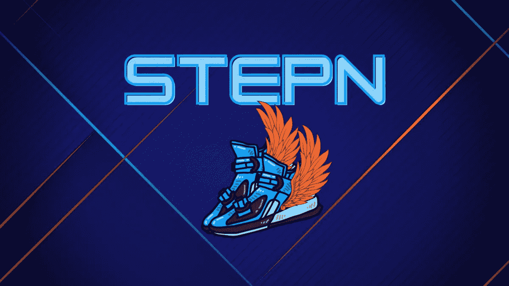
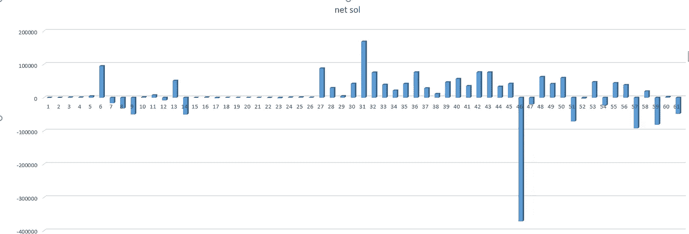
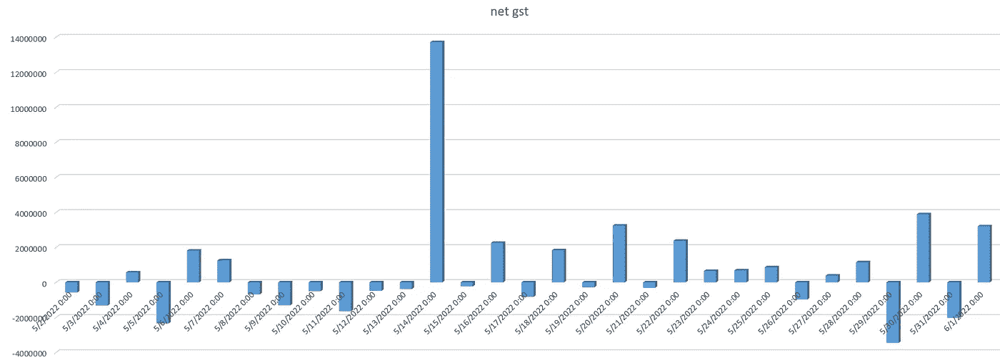
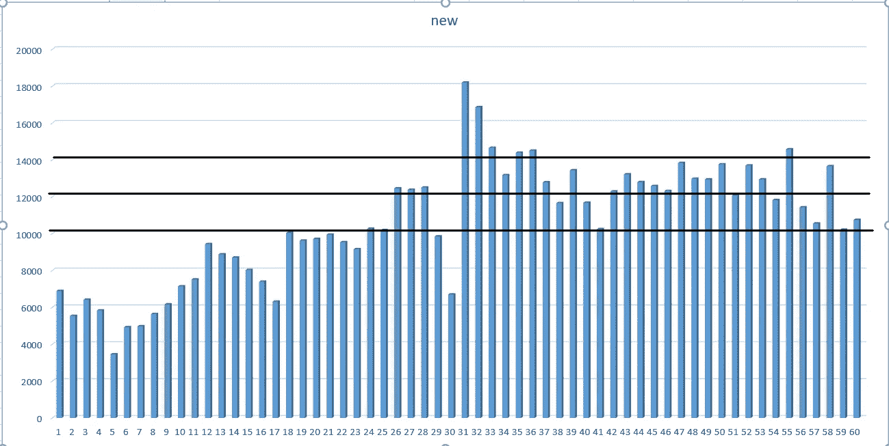

# StepN，按时退出，还是恐慌性抛售？

> 原文：<https://medium.com/coinmonks/stepn-exit-on-time-or-panic-cell-6383ce556a7e?source=collection_archive---------1----------------------->

在我 5 月 23 日对 StepN 项目的第一次分析( [*)中，投资 StepN 现在能盈利吗*？](/coinmonks/can-investing-in-stepn-be-profitable-now-d3ae0af51c32)》)，我考虑了适合投资 StepN 项目的条件，但是 5 月 26 日发生了一件意想不到的事情，项目组宣布从 7 月 15 日起，中国的地点将不再能够在 StepN app 中运营，导致鞋子和 GST 价格大幅波动。

此外，在我 5 天前写的下一篇关于 StepN 情况的分析中，我试图考察中国对 StepN 项目的影响，并最终将他们对该项目的影响评估为短暂的冲击。( [*《中国风暴》在斯捷潘！*](/coinmonks/the-chinese-storm-in-stepn-56d57abdb94d) ))

现在，随着鞋子和商品及服务税价格的大幅下跌，我想回答一个问题，StepN 能安全度过这一难关吗？

首先，我们需要熟悉硬币和代币的功能:

索拉纳币:索拉纳的流入 StepN 表示用户对项目的投资意愿，索拉纳的流出表示不愿意投资。

GMT token:这个 token 流入项目表明了用户卷起鞋子的愿望。

GST 令牌:目前，该令牌的流入表明有卷起并铸造新鞋和购买宝石的愿望，其流出表明用户不想留在应用程序内，更喜欢提取日常收入。

现在，根据上面的概念，我们可以更好地分析项目的链上数据。

下图显示了过去 60 天 Solana 向 StepN 的净流入和流出。

正如你所看到的，直到 5 月 26 日，形势是好的，而且经常是积极的，但在 5 月 26 日之后，一些用户的资本外流已经增加，资本外流到索拉纳意味着增加鞋的供应和降低其价格。

在下图中，你可以看到商品及服务税的净流入和流出

从 4 月 26 日到昨天，商品及服务税令牌的流出量约为 640 万，流入量约为 860 万。在我看来，商品及服务税价格下降的原因是贸易商的销售，而不是使用 StepN 应用的用户。

下图显示了新用户的总数

正如你所看到的，他们的数量在最近几天一直在下降，但我们可以说部分原因是由于最近几天发生的恐惧。

结论:
根据网上项目和社区项目的其他数据，我可以说，中国用户可能在数量上少于其他用户，但就活动量而言，尤其是拥有制鞋厂，在鞋类生产中发挥着重要作用，他们的退出造成了销售压力。

目前，如果我们认为商品及服务税的价格约为 90 美分，最便宜的鞋子的价格为 5 索尔，则项目的盈亏平衡天数约为 30 天。但是最近一周买了鞋的人现在损失很大，但是看起来 ROI 对新人的吸引力可以熏香需求方，吸引更多人来项目。

正如我们在 net GST 的图中看到的，似乎 stepN 应用程序的游戏非常成功，其用户更多地参与其中的活动，而不是 GST 的日常收获。

好消息是，中国用户退出缺口可以修复。只要 StepN 的团队能够克服新用户对未来计划的恐惧，并鼓励他们投资该项目。

> 加入 Coinmonks [电报频道](https://t.me/coincodecap)和 [Youtube 频道](https://www.youtube.com/c/coinmonks/videos)了解加密交易和投资

# 另外，阅读

*   [3 商业评论](/coinmonks/3commas-review-an-excellent-crypto-trading-bot-2020-1313a58bec92) | [Pionex 评论](https://coincodecap.com/pionex-review-exchange-with-crypto-trading-bot) | [Coinrule 评论](/coinmonks/coinrule-review-2021-a-beginner-friendly-crypto-trading-bot-daf0504848ba)
*   [莱杰 vs n rave](/coinmonks/ledger-vs-ngrave-zero-7e40f0c1d694)|[莱杰 nano s vs x](/coinmonks/ledger-nano-s-vs-x-battery-hardware-price-storage-59a6663fe3b0) | [币安评论](/coinmonks/binance-review-ee10d3bf3b6e)
*   [Bybit Exchange 审查](/coinmonks/bybit-exchange-review-dbd570019b71) | [Bityard 审查](https://coincodecap.com/bityard-reivew) | [Jet-Bot 审查](https://coincodecap.com/jet-bot-review)
*   [3 commas vs crypto hopper](/coinmonks/3commas-vs-pionex-vs-cryptohopper-best-crypto-bot-6a98d2baa203)|[赚取加密利息](/coinmonks/earn-crypto-interest-b10b810fdda3)
*   最好的比特币[硬件钱包](/coinmonks/hardware-wallets-dfa1211730c6) | [BitBox02 回顾](/coinmonks/bitbox02-review-your-swiss-bitcoin-hardware-wallet-c36c88fff29)
*   [BlockFi vs Celsius](/coinmonks/blockfi-vs-celsius-vs-hodlnaut-8a1cc8c26630)|[Hodlnaut 点评](/coinmonks/hodlnaut-review-best-way-to-hodl-is-to-earn-interest-on-your-bitcoin-6658a8c19edf) | [KuCoin 点评](https://coincodecap.com/kucoin-review)