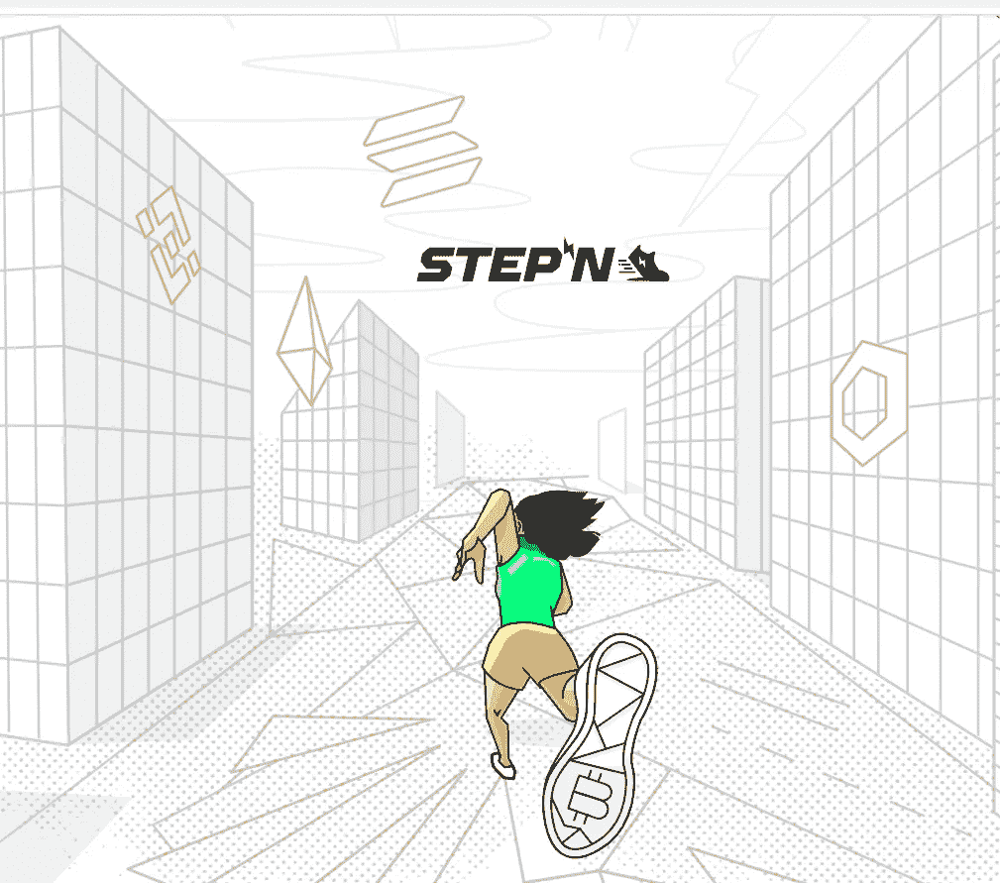

# STEPN 常见问题

> 原文：<https://medium.com/coinmonks/stepn-frequently-asked-questions-f1160320d3bf?source=collection_archive---------1----------------------->

## 第一部分



```
· [How to get the energy?](#d143)
· [How do I start the app?](#66a6)
· [Can I transfer my minted sneakers to another person?](#b41c)
· [Can two accounts and two devices walk/run the same route at the same time?](#0f80)
· [Is there any way where I can get a free sneaker?](#69e6)
· [Where can I buy NFT Sneakers?](#6939)
· [How long does it take and how much does it cost for me to level up my sneaker?](#f3ad)
· [What are Base and Additional Points?](#b7f8)
· [I sent](#1c8e)…
```