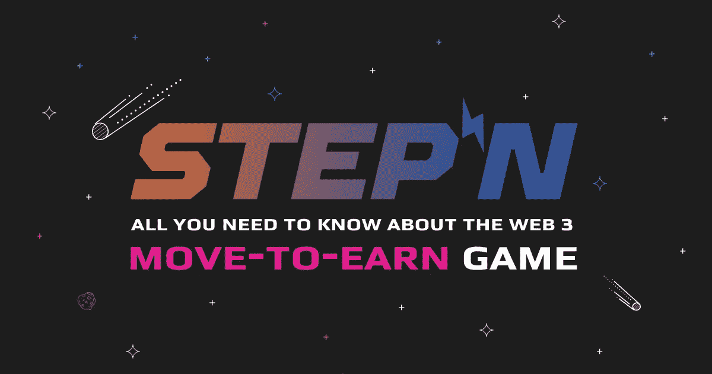
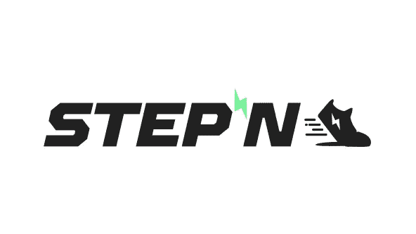
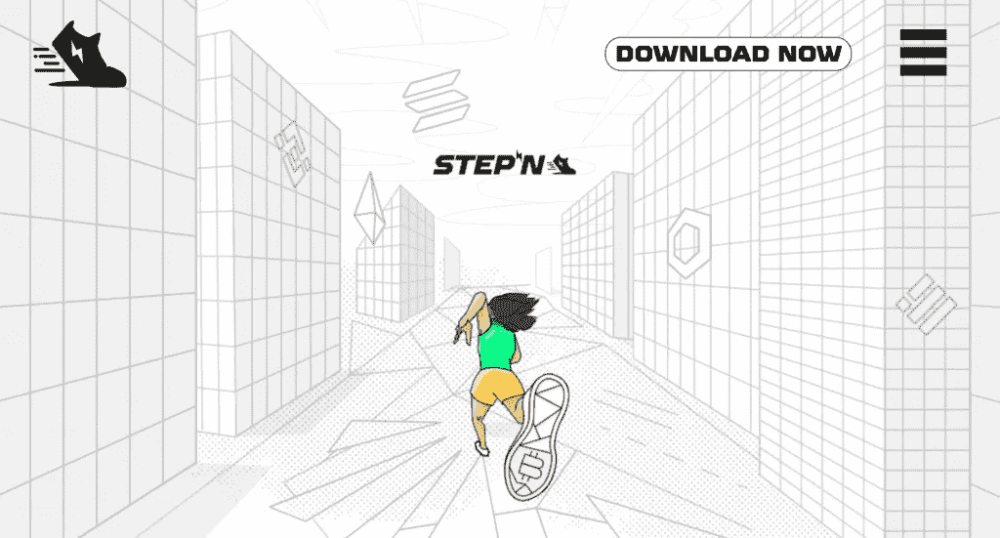
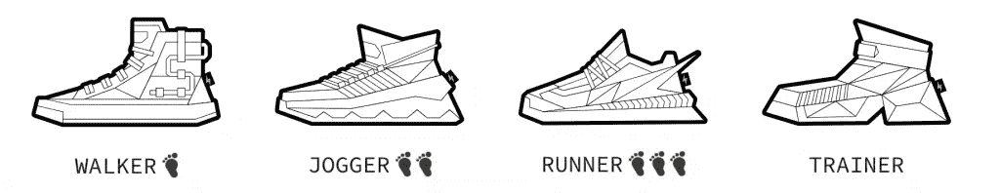
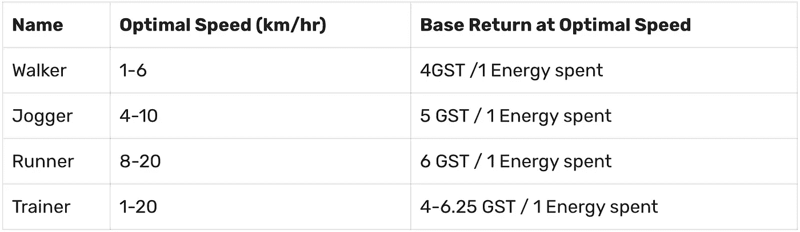
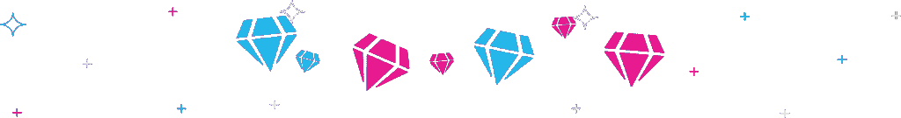

# StepN:关于移动赚钱的 WEB 3 游戏的完全初学者指南

> 原文：<https://medium.com/coinmonks/stepn-full-beginners-guide-on-the-move-to-earn-web-3-game-c00690f7888f?source=collection_archive---------1----------------------->

STEPN 是游戏和健身社区的革命性补充，它出现在主流互联网越来越接受基于区块链的游戏的时候。STEPN 的目标是塑造新生的 web 3 游戏生态系统，提供创新的用户体验，涵盖人们谈论最多的 GameFi 和 SocialFi 空间。

自 2022 年 3 月推出以来，StepN 及其原生 GMT 和 GST 令牌的销售使加密市场进入了一个疯狂的螺旋，成千上万着迷的用户涌向加密交易所，以获得新的移动赚取游戏。

要了解更多关于创新的移动赚取游戏，或回答问题，如何 StepN 工作？你可以继续阅读我们对 STEPN 的全面概述，这是一款帮助用户通过锻炼和跑步获得被动收入的 DeFi 应用程序。

# StepN:所有你需要知道的关于新的移动赚取网页 3 游戏

StepN 是一款 web 3 生活方式应用，在游戏玩法上结合了 SocialFi 和 GameFi 元素。StepN 玩家可以从简单的活动中获得加密代币，如散步、慢跑或户外跑步。由于其身体要求，开创性的“移动赚钱”游戏鼓励其用户通过健康的生活方式赚钱。

StepN 是由澳大利亚的 Jerry Huang 和哈欠荣在 2021 年 Solana hackathon 活动中获得第四名后创立并进一步发展的。根据官方 [STEPN](https://www.stepn.com/) 网站上的详细信息，创始人早些时候创办了一家名为 FindSatoshi lab 的金融科技公司，在加密、游戏和创业方面有很强的背景。

STEPN 是建立在索拉纳区块链，一个流行的以太坊区块链的狂热对手。因此，STEPN 要求 SOL 从其市场购买或制造 NFT 运动鞋。然而，需要像 GST 和 GMT 这样的本地令牌来访问游戏中的功能，如运动鞋升级、装备运动鞋、增加能量上限等。

除了令人兴奋和独特的用户体验，STEPN 平台还采用了双令牌经济模式——绿色 Satoshi 令牌(GST)用于购买应用程序上的升级和商品，绿色元宇宙令牌(GMT)用于支付汽油费。

 [## 2022 年最佳加密交换平台| CoinCodeCap

### 如果我们看看今天的场景，许多加密货币交换平台提供了广泛的功能和深度…

coincodecap.com](https://coincodecap.com/best-crypto-swap-platforms) 

# 移动到收入模型

移动赚钱模式给 GameFi 领域增加了一层复杂性。每一个游戏，尤其是 web 3 元宇宙，都需要一个创造价值的活动来运作。对于大多数游戏来说，这种活动只存在于游戏的虚拟世界中。然而，在区块链技术的帮助下，移动挣钱模式将这一概念扩展到了现实和物理世界。一个明显的例子可以在健身追踪器应用中看到。

此外，移动赚取模式通过添加激励性令牌奖励、可转售 NFT 收藏品、社交互动和进度/完成徽章，将健身追踪器应用程序向前推进了一步。这些令人上瘾的成分，以及它们的奖励、里程碑和成就激励，是区块链版“移动到收入”模型的基础。

此外，移动赚取模式包括地理标记的 NFT 技术，该技术改编自现有的游戏，如口袋妖怪 Go。STEPN 将这一想法带到了另一个层面，是在新的移动挣钱领域值得关注的先驱之一。

# 什么是 STEPN？

STEPN (GMT)是快速崛起的移动挣钱 web 3 生活方式应用的本地治理令牌。硬币也可以用于在游戏中从行走、跑步和慢跑等活动中获得收入。自推出以来，这种硬币在市场上表现良好，根据 CoinMarketCap 的数据，其市值已经超过 14 亿美元。

# 什么是 STEPN 平台？

STEPN 平台旨在提供易于使用的用户体验。每个特性都很容易发现、访问和使用，无需任何经验。首先，你需要购买与你的 SOL 钱包地址相关的 NFT 运动鞋。

购买 NFT 运动鞋后，剩下的就是去户外开始跑步、散步或慢跑，以赚取一些游戏内的 GMT 和 GST 货币。你可以兑现或再投资于你的运动鞋收藏，以增加你赚取更多利润的机会。

值得注意的是，STEPN 在其平台上结合了 GameFi 和 SocialFi 元素。SocialFi 组件的目标是促进 web 3 中的用户交互和锻炼文化，该组件仍在工作中，而大多数 GameFi 组件已在应用程序上向用户发布。另一方面， **GameFi components** ，其最终目标是激励用户走向更健康的生活方式，同时减少与运输车辆相关的净碳排放，在 STEPN 官方网站上概述为:

*   **游戏模式**:包括单人模式(现在已经完全可用)、马拉松模式和背景模式(这两种模式都还在开发中)
*   **运动鞋**:运动鞋 GameFi 组件由运动鞋属性组成，可以使用游戏内 GST 代币购买和升级。可以升级的运动鞋属性包括效率、运气、舒适和弹性。对这些属性的投资转化为收益率的增加。
*   **宝石和插座**:四个可用的宝石代表前面讨论的每一个运动鞋属性。因此，一旦你的运动鞋达到一定的级别，你就可以解锁宝石插槽，并通过将相应的宝石插入解锁的插槽中来增强你的运动鞋属性。
*   **制鞋**:制鞋事件(SME)发生在用户使用他们已经拥有的 2 双 NFT 运动鞋作为“繁殖”的蓝图，在这个过程中生产出一个鞋盒。铸造的成本取决于运动鞋的属性。
*   **徽章**:徽章是通过完成游戏内任务获得的，任务越难获得的徽章越好(徽章按 5 个品质排名)。赚取徽章伴随着游戏中的额外津贴，这些津贴可能会影响游戏性、制鞋和治理。

# STEPN 的路线图

STEPN 于 2021 年 8 月开始了它的成名之旅。当月 10 日，其开拓性的“移动挣钱”概念诞生后，可行性研究和模型设计紧接着在同一个月底之前展开。在整个 2021 年，更多的功能，如运动感应模块，GPS 校准等，都被添加到应用程序中，然后以社区活动结束这一年，其中包括 12 月的公开测试。

今年，STEPN 计划继续为其应用程序添加更多有益的功能。仅在 Q1，就增加了应用内交易功能、应用内市场和 IEO/IDO 等功能。目前，应用内钱包、多链钱包和多链市场等关键应用功能正在进行重要升级。在今年剩下的时间里，用户应该会期待 SocialFi 元素与 Quest 和 rental system 等其他元素一起实现。

# STEPN 应用程序是如何工作的？

STEPN 是一款基于区块链的 web 3 健身应用，将 SocialFi 和 GameFi 元素融入到游戏中。为了玩，用户需要购买 NFT 运动鞋，他们可以使用游戏的不同模式。

按照以下步骤开始使用 STEPN 应用程序:

1.  点击下载 STEPN 应用
2.  **注册 STEPN:** 在您的设备上打开应用程序，然后使用您的电子邮件地址注册 STEPN。您应该会收到一个验证码，让您能够访问主应用程序。
3.  **创建新的钱包:**点击屏幕右上角的钱包图标，创建一个带有新的 12 字恢复密码短语的 SOL 钱包地址。
4.  **将 SOL 转入你的应用内钱包:**设置好新地址后，你可以将 SOL 转入应用内钱包，在市场上购买 NFT 运动鞋。建议你的钱包里总是存一些汽油。
5.  **买一双运动鞋:**去应用商店挑选一双运动鞋！你可以使用过滤工具寻找你喜欢的运动鞋类型。确保你有足够的 SOL 来购买。
6.  **在任何 GameFi 模式上练习:**购买运动鞋后，你可以查看游戏模式、制鞋、获得宝石和徽章。

# 游戏模式

STEPN 应用程序有三种游戏模式，即单人、马拉松和背景。单人游戏模式已经在应用程序上提供给用户玩和赚，而马拉松和背景模式仍在开发中。

## 独奏模式

在单人模式中，玩家装备购买的 NFT 运动鞋赚取 GMT 和 GST 代币。如果玩家在他们的 NFT 运动鞋里有足够的能量，他们最初会得到绿色的 Satoshi 代币(GST ),随后随着他们等级的上升会得到 GMT。值得注意的是，如果你的运动鞋没有能量，STEPN 不会支付任何奖励代币。

当您在应用程序界面上按下 start 表示您的 move-to-earn 阶段开始时，您可以通过应用程序后台的状态栏监控您的进度，状态栏会自动显示步行或跑步。该应用程序内置了一个传感器，可以惩罚用户的月球漫步——这个术语在 [STEPN 白皮书](https://whitepaper.stepn.com/)中使用，指的是欺诈用户，他们可能通过使用电动滑板车模拟运动，甚至将手机绑在狗身上来作弊。

在 STEPN 中每一分钟的运动支付的双重奖励代币 GST 和 GMT 取决于四个主要因素运动鞋类型、运动鞋的效率属性、运动鞋的舒适属性和运动速度。此外，当你在单人模式下移动时，装有一至三级宝石的神秘盒子会被放入单人游戏中分配给每个玩家的 4 个神秘盒子槽中。

## 马拉松模式

虽然仍在开发中，但推出时的马拉松模式将为用户举行每周和每月的马拉松比赛，注册期为每场比赛开始前的 24 小时——这些比赛通常会持续规定时间的整个持续时间。实施后，用户将能够参加每周 2.5 公里、5 公里和 7.5 公里的马拉松比赛，以及每月 5 公里、10 公里和 15 公里的马拉松比赛。

## 后台方式

还在开发中，后台模式将允许用户只要在应用程序中持有运动鞋，就可以继续赚取商品及服务税。STEPN 应用程序将从用户的设备移动健康应用程序中提取每日采取的步骤数据，以确定奖励。然而，这一奖励将以 3000 步为上限，并且不会影响其他游戏模式产生的收益或游戏内成本。

# NFT 运动鞋

STEPN NFT 运动鞋可通过五个关键属性区分开来，它们是:

1.  属性
2.  类型
3.  质量
4.  水平
5.  用户化

## 1.运动鞋属性

运动鞋的属性可以显著影响在 STEPN 游戏中使用的不同 NFT 运动鞋的性能和奖励。这些 NFT 运动鞋的属性可以进一步分为以下模式:

*   **效率:**该运动鞋属性直接影响单人和即将到来的马拉松游戏模式中的商品及服务税收入。在单人模式下，拥有更高的效率属性将导致更好的每单位能源消耗的商品及服务税收入。在马拉松模式下，效率属性越高，排行榜积分积累越快。
*   **运气:**这个运动鞋属性决定了单人跑步时神秘盒子掉落的质量和频率。
*   **舒适:**这个属性会影响你在单人和马拉松模式下的 GMT 收入以及赌注和管理。该属性仍在开发中。
*   **韧性:**也被称为耐久/修复，单人模式下的韧性正面影响耐久的衰减率。例如，50/100 的耐用性将运动鞋的效率降低到 90%，而 20/100 的耐用性将效率降低到 10%。

## 2.运动鞋类型

STEPN 的运动鞋有四种不同的类型，每一种都是专为适应某种强度和健身水平而设计的。

值得注意的是，每双运动鞋的商品及服务税回报不是静态的，可能导致其不断波动的因素有运动鞋效率、GPS 信号强度、移动数据信号稳定性和随机性。

## 3.运动鞋质量

在 STEPN 元宇宙，运动鞋质量是新推出的 NFT 运动鞋属性的决定因素之一。有五种不同类型的运动鞋质量。下面列出了其中的每一项:

*   **普通**:运动鞋属性范围在 1-10 之间
*   **不常见**:运动鞋属性范围在 8-18 之间
*   **稀有**:运动鞋属性范围在 15-35 之间
*   **史诗**:运动鞋属性范围在 28-63 之间
*   **传奇**:运动鞋属性范围在 50-112 之间

## 4.运动鞋级别

在 STEPN 世界中，运动鞋等级是运动鞋的另一个属性决定因素。要升级运动鞋，用户需要在固定时间内缴纳商品及服务税。升级后，用户可以根据他们的球鞋质量获得 4 到 12 个额外的属性点。

然而，要升级超过 29 级的球鞋，除了商品及服务税，用户还需要烧 GMT。

## 5.运动鞋定制

这是斯捷潘元宇宙最迷人的特征之一。虽然仍在开发中，运动鞋定制将允许用户通过燃烧 GST，GMT 或 NFT 达到 30 级时定制他们的运动鞋。这个定制特性将允许用户自由地更改名称、添加报价、添加额外的属性点等等。

STEPN 还与顶级运动鞋品牌合作，发布与币安的定制和联名运动鞋，以及 Solana 和 BNBChain 的 Genesis 运动鞋。Youtuber， [Solana Gaming with Barndog](https://www.youtube.com/watch?v=rt0QY7z8jwI) 详细介绍了 Genesis 运动鞋。

# 宝石和插座

一旦用户达到一定等级(从 5 级开始)，用户将可以解锁宝石插座。当宝石被插入解锁的插孔时，用户会增强他们的运动鞋属性。然而，宝石和插座是成对解锁的(例如，效率宝石被插入效率插座)

有四种类型的属性宝石(效率，运气，舒适和韧性)，每一种都可以通过燃烧 GST 和组合 3 种相同级别和类型的宝石来升级。需要注意的是，从 4 级升级宝石需要 GMT，低级宝石有更高的失败几率。你可以在 STEPN 的官网上查看更多关于宝石和插座的信息。

# 徽章

当徽章元素完成后，用户将能够通过完成游戏中的任务获得徽章。徽章是根据任务难度分发给用户的，最难的任务授予 5 级徽章。

获得徽章可以让玩家在游戏性、挖鞋和治理方面获得一些额外的好处。

1.  **游戏特权**

*   独奏模式——额外能量
*   马拉松模式—排行榜积分奖励

1.  **制鞋补贴**

*   租赁和销售相关——出租运动鞋的几率更高
*   鞋印相关——降低铸造成本

1.  **治理津贴**

*   TBD

# 双重令牌经济

STEPN 使用独特的双令牌系统来帮助用户、令牌持有者和开发人员保护网络并从中获得最大收益。STEPN 使用 GMT 和 GST 令牌，这两种令牌都是基于索拉纳区块链来实现这一点。

**GMT** 是堆叠令牌

*   网络的主要验证令牌
*   GMT 是一种通货紧缩的硬币，最大供应量为 60 亿代币
*   在 STEPN 中达到非常高的水平后，用户可以开始赚取 GMT 硬币
*   成为保护和管理网络的验证者

**商品及服务税**是消费代币

*   商品及服务税用于结算交易费用和其他游戏费用
*   该代币用作 29 级以下用户的游戏内奖励
*   商品及服务税会导致通货膨胀，而且没有发行上限

# STEPN (GMT)价格和价格预测

虽然整个加密市场有点低迷，但专家和投机者预计 GMT(目前交易价格低于 2 美元)将在未来几个月反弹并达到新的价格高点。一个流行的加密价格预测网站 CryptocurrencyPricePrediction 预计 GMT 将在 2022 年达到 7.7 美元，并在 2010 年之前达到 120 美元。

然而，由于不稳定的加密市场相关的不确定性，建议您在投资任何加密硬币之前进行研究和尽职调查。

# 哪里买 GMT

您可以从任何在线流行的加密货币交易所购买 STEPN (GMT/GST)。像币安、[、Swapzone](https://swapzone.io/exchange/sol/gmtbsc) 、比特币基地、FTX、PancakeSwap、Huobi 等热门交易所都在其网站上列出了 GMT 交易对。

# 如何购买 GMT

你想开始你的跨步之旅吗？或者你想投资一个有前途的移动赚取加密令牌？，然后前往 Swapzone，以市场上最优惠的价格用 700 多种加密货币兑换$GMT 和$GST 的低费用。

使用 Swapzone，您可以通过各种即时加密货币交换提供商轻松地将 GMT 令牌与任何其他加密硬币进行交换，并查看提供商、他们的报价、速度和汇率。要在[获得$GMT](https://swapzone.io/exchange/sol/gmtbsc) ，请按照以下步骤操作。

1.  在发送部分选择硬币。
2.  输入您希望交换的金额。
3.  在“起床时间”部分选择 GMT。
4.  选择一个交换条件以继续。
5.  输入您的钱包地址以接收您的 GMT。
6.  将您的 GMT 存款发送到生成的地址。
7.  接收您的 GMT 代币。

# 开始为你的日常训练赢取加密奖励

STEPN 应用是锻炼和健身的未来。自 GMT 向市场公布以来，这枚硬币吸引了崇拜者和投资者的巨大兴趣，导致了巨大的交易量和对未来的积极猜测。

此外，考虑到 Solana 区块链中有用的 web3 应用程序和工具的不断开发，专家预计开发者越来越有兴趣继续添加 GameFi 和 SocialFi 功能，这将使用户长期保持兴趣，从而将好处扩展到整个 web 3 生态系统。

总的来说，STEPN 提出的锻炼可以获得健康和每日被动收入的双重回报的建议有点太好了，令人难以拒绝。

> 加入 Coinmonks [电报频道](https://t.me/coincodecap)和 [Youtube 频道](https://www.youtube.com/c/coinmonks/videos)了解加密交易和投资

# 另外，阅读

*   [瓦济里克斯 NFT 评论](https://coincodecap.com/wazirx-nft-review) | [比茨盖普 vs 皮奥克斯](https://coincodecap.com/bitsgap-vs-pionex) | [坦吉姆评论](https://coincodecap.com/tangem-wallet-review)
*   [如何使用 Solidity 在以太坊上创建 DApp？](https://coincodecap.com/create-a-dapp-on-ethereum-using-solidity)
*   [币安 vs FTX](https://coincodecap.com/binance-vs-ftx) | [最佳(SOL)索拉纳钱包](https://coincodecap.com/solana-wallets)
*   [如何在 Uniswap 上交换加密？](https://coincodecap.com/swap-crypto-on-uniswap) | [A-Ads 审查](https://coincodecap.com/a-ads-review)
*   [加密货币储蓄账户](/coinmonks/cryptocurrency-savings-accounts-be3bc0feffbf) | [YoBit 审核](/coinmonks/yobit-review-175464162c62)
*   [Botsfolio vs nap bots vs Mudrex](/coinmonks/botsfolio-vs-napbots-vs-mudrex-c81344970c02)|[gate . io 交流回顾](/coinmonks/gate-io-exchange-review-61bf87b7078f)