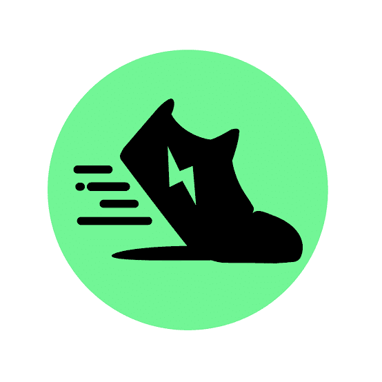
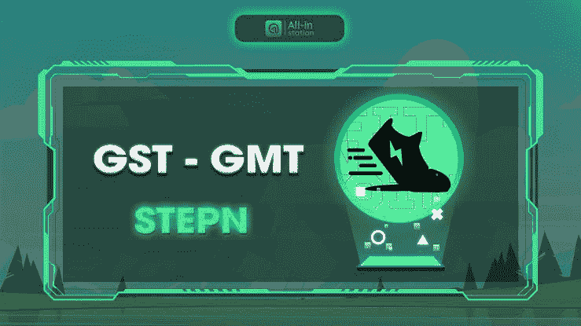

# 2022 年 Stepn(GMT)加密价格预测——Stepn 加密是一项好的投资吗？

> 原文：<https://medium.com/coinmonks/stepn-gmt-crypto-price-prediction-2022-is-stepn-crypto-a-good-investment-b1120c4e6715?source=collection_archive---------20----------------------->

Stepn Crypto 最近做得很好，很多人都乐于采用这个项目，因为它的功能和它在不久的将来创下历史新高的潜力，并且有很多新闻在网上传播，Stepn 现在在 Twitter 上关注阿迪达斯，Stepn 支持希望 Stepn 与耐克合作，如果这种情况发生，价格将会以如此快的速度上涨。

与此同时，Stepn 的功能实在是太棒了；用户可以步行并获得他们的代币(GST)，只需从他们的商店购买运动鞋，你就可以获得大量代币(GST)，许多用户通过这一功能获得了巨大的收益。

然而，这篇文章需要什么是 Stepn 加密，它的价格预测，如果 Stepn 加密是一个很好的投资，同时，请拿一杯酒和一个座位，而你仔细阅读。

# 什么是 Stepn 加密？

[STEPN](https://stepn.com/) 是一款 Web3 生活类 app，拥有好玩的社交组件和游戏化设计。拥有 NFT 运动鞋的用户——在户外散步、慢跑或跑步以赚取 GST，GST 可用于升级和打造新运动鞋。

玩家可以选择在应用内市场租赁或出售他们的 NFT 运动鞋；用户的商品及服务税收入存储在内置交换功能的应用钱包中

STEPN 由总部位于澳大利亚的金融科技工作室 Find Satoshi Lab 创建。该团队赢得了 2021 Solana Ignition Hackathon 游戏赛道，是 DeFi 联盟游戏团队的一部分。

GMT 是 STEPN 的治理令牌，限量供应 60 亿个令牌。玩家购买 GMT 在 STEPN 应用中燃烧，以访问 STEPN 提供的功能，如薄荷高质量运动鞋，升级高质量宝石和参与治理投票。

# Step(GMT)加密价格预测 2022–2031

目前，STEPN (GMT)以 2.13 美元的价格在整个加密市场排名第 80 位，其中包括 6 亿美元(600，000，000 GMT)的流通供应和 60 亿美元(60，000，000 GMT)的总供应。

截至本文撰写之时，其最大供应量为 60 亿美元(60 亿 6,000,000,000 GMT)，市值为 12.8 亿美元(1278814705.58 美元)，完全摊薄后市值为 127.9 亿美元(12788147055.79 美元)。

[**阅读更多 it 价格预测**](https://bulliscoming.com/stepngmt-crypto-price-prediction-2022/)

# 好投资？

Stepn 最近获得了很大的吸引力，在撰写本文时，Stepn 的价格在一个月内从 0.15 美元降至 3.11 美元，然后降至 2.14 美元，这意味着这只是它的起点。

投资者目前正在投资这个项目，交易者目前正在从这个项目中赚很多钱，它的社区目前正在支持这个项目并从中获利。

许多有影响力的人都支持这个项目，以便在推广它的同时获得更多的关注。与此同时，该团队目前正在开发一种回馈社区的方式，他们正在努力使这个项目取得成功。

但是，如果你期待投资这个项目；这是一个很好的投资机会，因为它有可能为持有者带来巨大的投资回报。

**亦读；** [波币价格预测——波币是好投资吗？](https://bulliscoming.com/wave-coin-price-prediction/)

# 结论

Stepn coin 有更多的事情要做，这意味着它将增加价值，以获得良好的投资回报。同时，持有者还可以在行走时赚取大量代币，这一特性吸引了许多投资者投资于该项目。

然而，现在当你有运动鞋走路时，赚钱变得容易了，你可以边走边赚。因此，本文仅用于教育目的，而非任何投资建议。

> 加入 Coinmonks [电报频道](https://t.me/coincodecap)和 [Youtube 频道](https://www.youtube.com/c/coinmonks/videos)了解加密交易和投资

# 另外，阅读

*   [如何在加拿大购买加密货币？](https://coincodecap.com/how-to-buy-cryptocurrency-in-canada)
*   [无聊猿游艇俱乐部(BAYC)评论](https://coincodecap.com/bored-ape-yacht-club-bayc-review)
*   [5 款最佳加密交易终端](https://coincodecap.com/crypto-trading-terminals) | [最佳 DeFi 应用](https://coincodecap.com/best-defi-apps)
*   [在美国如何使用 BitMEX？](https://coincodecap.com/use-bitmex-in-usa) | [BitMEX 评论](https://coincodecap.com/bitmex-review)
*   [最佳期货交易信号](https://coincodecap.com/futures-trading-signals) | [流动性交易所评论](https://coincodecap.com/liquid-exchange-review)
*   [南非的加密交易所](https://coincodecap.com/crypto-exchanges-in-south-africa) | [BitMEX 加密信号](https://coincodecap.com/bitmex-crypto-signals)