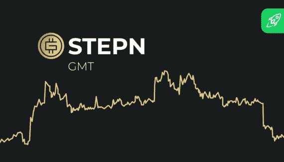

# STEPN(GMT)2022 年价格预测

> 原文：<https://medium.com/coinmonks/stepn-gmt-price-prediction-2022-866fd631ae98?source=collection_archive---------32----------------------->

Source photo [gmt crypto — Bing images](https://www.bing.com/images/search?view=detailV2&ccid=0Vm9bTBu&id=2DE5B7F1CBD56FC0CBCFD8902B207512A7A5D7FB&thid=OIF.lSzvBlz0V3wRPq2UzhtapA&mediaurl=https%3a%2f%2fchangelly.com%2fblog%2fwp-content%2fuploads%2f2022%2f05%2fGMT-570x325.png&cdnurl=https%3a%2f%2fth.bing.com%2fth%2fid%2fR.d159bd6d306ebae5c2a5057a01cc8083%3frik%3d%26pid%3dImgRaw%26r%3d0&exph=325&expw=570&q=gmt+crypto&simid=6957237423883&FORM=IRPRST&ck=952CEF065CF4577C113EAD94CE1B5AA4&selectedIndex=15&ajaxhist=0&ajaxserp=0)

## 什么是 GMT (STEPN)？

STEPN 是一个 Web 3.0 生活方式应用程序，拥有大量加密资产。其中包括 socialFi 和 gameFi 组件。迄今为止，这是唯一一个使用“移动挣钱”概念的 NFT 协议。为了在散步、慢跑或跑步时赚取外汇，STEPN 允许用户购买 NFT 鞋。