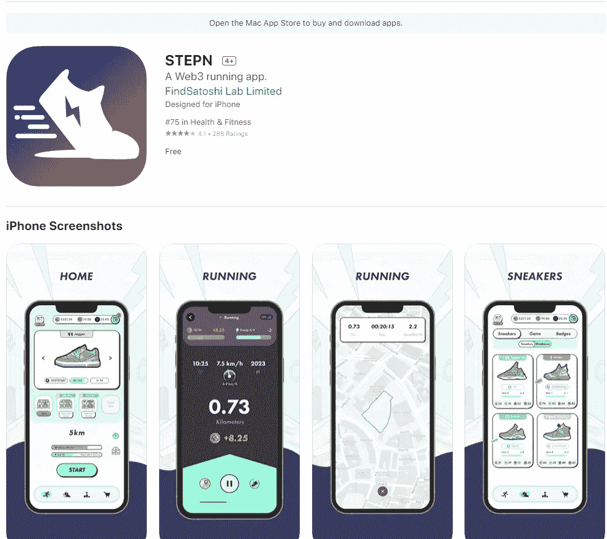

# StepN (GMT):每天跑步并赚取高达 100 美元的被动收入

> 原文：<https://medium.com/coinmonks/stepn-gmt-running-and-earning-passive-income-up-to-100-usd-per-day-6970f7bf0460?source=collection_archive---------2----------------------->

在 BTC 没有一个明确的趋势，密码市场仍然有一个新的趋势来领导市场。投资者称之为“跑步赚钱”趋势。其中一个重要的项目是 StepN。

# 什么是 StepN？

StepN

StepN (GMT)是一个项目，它创造了一种叫做“跑步赚钱”的趋势。StepN 赢得了 [Solana](https://solana.com/) 的黑客马拉松。从根本上说，StepN。关于 StepN，投资者将投资 Stein 购买 NFT 以及参与游戏的鞋子。从本质上说，投资者购买了 StepN 的 NFT 项目，并用它来通过跑步赚钱。每个 NFT 将提供不同的利润。

# 怎样才能加入 StepN？

要参加 StepN，您必须遵循以下步骤:

# 第一步:下载

在 [IOS](https://apps.apple.com/us/app/stepn/id1598112424) 上下载 StepN:

Ios

或者在 [Androi](https://play.google.com/store/apps/details?id=com.bcy.fsapp) 下载 StepN:

Androi

# 第二步:账户注册

要注册帐户，请遵循以下步骤:

***第一步*** :打开 app

***第二步:*** 在“电子邮件地址”框中输入电子邮件，然后选择“发送代码”

Step 2

***第三步:*** 查看你的邮箱，在“邮箱验证码”框中输入确认码。然后选择“登录”

Step 3

***第四步:*** 选择“获取激活码”

Step 4

***第五步:*** 选择“Go”，然后加入项目电报组

Step 5

***第六步:*** 在电报组获取“激活码链接”

Step 6

***第七步*** :获取代码

Step 7

***第八步*** :在“激活码”框中输入代码，然后选择“开始”

Step 8

# 第三步:创建一个钱包，把钱转到里面去买运动鞋

Click here to Create a wallet

# 第四步:买运动鞋跑步

Illustration

# 我能从 StepN 得到什么？

第一，我们会坚定地从这个游戏中获得健康。你会觉得你的身体更强壮，更灵活。第二，你也可以通过这个游戏获利。根据你的鞋子和你跑过的路，你将根据你的 NFT 和日常活动获得利润。

StepN 一发布，StepN 代币的价格就飞速上涨。因此，购买 StepN 的 NFT 的跑步者获得了很多钱，每天至少获得 50 到 100 美元。不过，在我看来，这个时候不适合投资 StepN (GMT)。如果你是一个努力工作又爱跑步的人，StepN 会很适合你。此外，StepN 还能激励想要改善身材的投资者。

# 我能和 StepN 一起在跑步机上作弊吗？

玩家在 STEPN 上赚钱时不能使用跑步机，因为该系统有运动传感器和 GPS 来避免欺诈案件。

# 结论

游戏要想长期存在，大众玩家的数量必须大于投资并获利的玩家数量。即使 STEPN 想把 GameFi 和 SocialFi 这两个元素和谐地结合起来，跑步本身也是索然无味的，所以他们还得从“社交”平台上加紧吸引玩家。然而，如果你想改善你的健康或身体，让我们试试 StepN。

以上都是 **StepN (GMT):每天跑步赚取高达 100 美元的被动收入**。如果你对我有任何问题，请在本帖下方评论；我会为你写下他们。别忘了跟随我的媒介。祝你投资之旅成功。

> 加入 Coinmonks [电报频道](https://t.me/coincodecap)和 [Youtube 频道](https://www.youtube.com/c/coinmonks/videos)了解加密交易和投资

# 另外，阅读

*   [最佳加密分析或链上数据](https://coincodecap.com/blockchain-analytics) | [Bexplus 评论](https://coincodecap.com/bexplus-review)
*   [NFT 十大市场造币集锦](https://coincodecap.com/nft-marketplaces)
*   [AscendEx Staking](https://coincodecap.com/ascendex-staking)|[Bot Ocean Review](https://coincodecap.com/bot-ocean-review)|[最佳比特币钱包](https://coincodecap.com/bitcoin-wallets-india)
*   [Bitget 回顾](https://coincodecap.com/bitget-review) | [双子星 vs BlockFi](https://coincodecap.com/gemini-vs-blockfi) | [OKEx 期货交易](https://coincodecap.com/okex-futures-trading)
*   [美国最佳加密交易机器人](https://coincodecap.com/crypto-trading-bots-in-the-us) | [经常性回顾](https://coincodecap.com/changelly-review)
*   [在印度利用加密套利赚取被动收入](https://coincodecap.com/crypto-arbitrage-in-india)