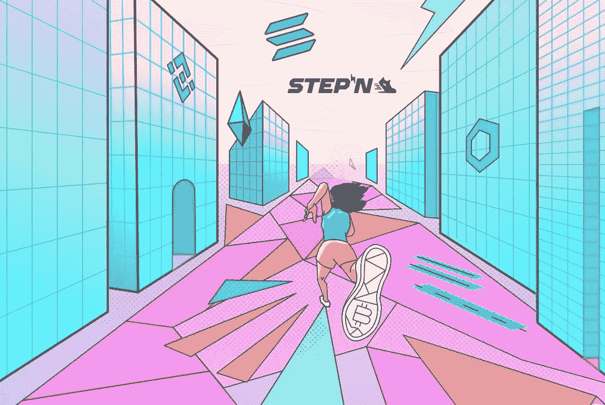

# STEPN 模仿者窃取用户的初始短语

> 原文：<https://medium.com/coinmonks/stepn-impersonators-steal-users-initial-phrases-74d948a5de29?source=collection_archive---------45----------------------->

区块链知名安全公司 Peckshield 周一披露，Web3 生活方式应用程序 STEPN 存在大量钓鱼网站。这些网站在浏览器中插入一个伪造的 [MetaMask](https://metamask.io/) 插件，利用它他们可以从不知情的 STEPN 用户那里窃取种子短语。

当网络犯罪分子收到种子时，他们就可以完全控制用户的 STEPN 控制面板，在那里他们可以将自己被盗的钱包与自己的钱包相连，或者参与免费赠送。

> “PeckShield 检测到许多 STEPN 钓鱼网站。PeckShieldAlert 说，他们安装一个伪造的元掩码浏览器扩展，窃取您的种子短语，或邀请您插入您的钱包或分发声明。

Peckshield 敦促 STEPN 用户，如果他们发现自己的账户有任何可疑之处，应尽快联系支持部门。一些客户表示他们遇到了问题，向支持团队报告了这些问题并解决了问题。

> “我遇到了完全相同的问题，但几分钟内就解决了，只要我通过下面的链接联系支持人员，也试试吧，伙计！”克里斯蒂亚诺罗纳尔多写道。

然而，STEPN 尚未就此事发表任何官方评论。网络钓鱼通知是在 Web3 生活方式应用程序结束其 Twitter AMA 会话近 20 小时后发出的。Peckshield 是一个受欢迎的 Twitter 账户，加密货币社区可以在这里发现黑客或网络钓鱼欺诈。

STEPN (GMT)是一款基于 [Solana (SOL)](https://solana.com/) 的游戏，游戏玩家购买不可替换的 token (NFT)运动鞋开始游戏。该应用程序通过手机上的 GPS 跟踪用户的移动，并向他们发放游戏中的代币，名为绿色 Satoshi (GST)。这些硬币随后可以兑换成[美元硬币(USDC)](https://coinmarketcap.com/currencies/usd-coin/) 或索拉纳(索尔)，用户可以从中套现。

随着分散金融(DeFi)和不可替代令牌(NFT)变得越来越流行，网络钓鱼攻击、诈骗和协议漏洞在加密货币行业越来越常见。这些类型的攻击并不新鲜，但它们在不断演变。

上个月，游戏 Axie Infinity (AXS)中使用的 Ronin bridge 遭到攻击，导致以太坊(ETH)中超过 6 亿美元和美元硬币 stablekins 被盗。正如最近报道的那样，一次拙劣的 DeFi 平台抢劫未能让攻击者收集到 100 万美元的被盗加密货币。今年早些时候，当黑客通过模拟存款欺骗一项协议，允许他们创建一种桥接货币资产时，量子金融公司的 8000 万美元加密货币被盗。

> 加入 Coinmonks [电报频道](https://t.me/coincodecap)和 [Youtube 频道](https://www.youtube.com/c/coinmonks/videos)了解加密交易和投资

# 另外，阅读

*   [最佳比特币保证金交易](/coinmonks/bitcoin-margin-trading-exchange-bcbfcbf7b8e3) | [萝莉点评](/coinmonks/lolli-review-e6ddc7895ad8) | [比特币保证金交易](https://coincodecap.com/bityard-margin-trading)
*   [创造并出售你的第一个 NFT](https://coincodecap.com/create-nft) | [密码交易机器人](https://coincodecap.com/best-crypto-trading-bots)
*   [如何在 CoinDCX 上购买柴犬(SHIB)币？](https://coincodecap.com/buy-shiba-coindcx)
*   [CBET 评论](https://coincodecap.com/cbet-casino-review) | [库科恩 vs 比特币基地](https://coincodecap.com/kucoin-vs-coinbase) | [拜比特 vs 比特币基地](https://coincodecap.com/bybit-vs-coinbase)
*   [折叠 App 回顾](https://coincodecap.com/fold-app-review) | [LocalBitcoins 回顾](/coinmonks/localbitcoins-review-6cc001c6ed56) | [Bybit vs 币安](https://coincodecap.com/bybit-binance-moonxbt)
*   [加密保证金交易交易所](/coinmonks/crypto-margin-trading-exchanges-428b1f7ad108) | [赚取比特币](/coinmonks/earn-bitcoin-6e8bd3c592d9) | [Mudrex 投资](https://coincodecap.com/mudrex-invest-review-the-best-way-to-invest-in-crypto)