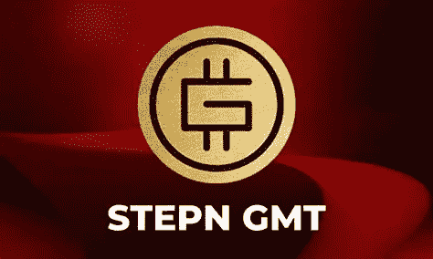

# STEPN(GMT)2022–2025 年价格预测

> 原文：<https://medium.com/coinmonks/stepn-price-prediction-2022-2025-1b3dd08324a7?source=collection_archive---------23----------------------->

Source photo [stepn cripto — Bing images](https://www.bing.com/images/search?view=detailV2&ccid=imw3Yysv&id=45258CA7AA2BE891F242C1B45D70AE617B9582BC&thid=OIP.imw3YysvHTpeJKXp3vuNvAHaEc&mediaurl=https%3a%2f%2finvestfoxy.com%2fwp-content%2fuploads%2f2022%2f04%2fjpg_20220418_013739_0000-1000x600.jpg&cdnurl=https%3a%2f%2fth.bing.com%2fth%2fid%2fR.8a6c37632b2f1d3a5e24a5e9defb8dbc%3frik%3dvIKVe2GucF20wQ%26pid%3dImgRaw%26r%3d0&exph=600&expw=1000&q=stepn+cripto&simid=608026030656202427&FORM=IRPRST&ck=4747BAD124768FE2CDAF0F8F3B47D50A&selectedIndex=11&ajaxhist=0&ajaxserp=0)

# 什么是 STEPN (GMT)？

当谈到数字资产时，STEPN 作为一个 Web 3.0 生活方式应用程序在人群中脱颖而出。所以它是 gameFi 和 socialFi 的混合体！该协议是第一个使用“移动挣钱”原则的 NFT 项目。为了在散步、慢跑或跑步时赚取外汇，STEPN 允许用户购买 NFT 鞋。