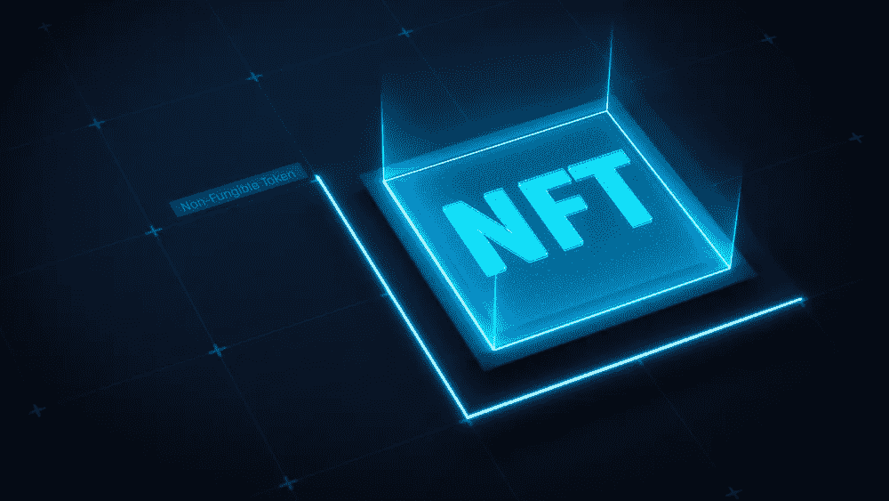

# 在不出售 NFT 的情况下从 NFT 中赚钱的步骤

> 原文：<https://medium.com/coinmonks/steps-in-making-money-from-nfts-without-selling-them-9aa0b26cc343?source=collection_archive---------53----------------------->

这整个时期可以变成一个非常有利可图的活动。没有必要打电话或说服任何人点东西，然后参加金字塔，最后失望而归。创造力是必不可少的成分。嗯，还有 0X0。NFT 艺术展门票，你可以随时出售。但是如果它要生金蛋，值吗？请继续阅读，了解这个想法背后的天才之处。

你的钱包里有一堆无收益的非金融资产吗？你做了所有正确的事，你是一个模范 NFT 士兵。**现在是时候招募 NFT 了**。是的，不是卖掉他们，而是招募他们，提升他们的价值。让你的社区购买你所拥有的真实的 NFT 的高分辨率照片。想象一下，如果你只发行 10 个这样的拷贝，并且全部售出，你将如何增加你的 NFTs 的价值！想象一下，如果那些画转手了，即使那样，你也能得到佣金。

在澳大利亚或日本的某个地方，陌生人之间的一笔成功交易可以直接给你的钱包带来收入。怎么会？嗯，多亏了一个不可伪造的贴纸+区块链+ NFT。我们甚至不能复制第二个。

因此，通过扫描二维码，你将获得关于这幅画的所有信息:副本数量、所有者数量、发行和销售日期、NFT 图像和价格。出售艺术品将同样容易！换个主人会像转移几只聪一样简单。

您的 NFTs 将通过进入区块链得到官方的重视和确认！如果发生事故，您可以向保险公司、警察或任何需要的人提供经过验证和认证的信息。任何数码艺术转化成真正的绘画都会得到完整的保护。它们转售的价格越贵，你的利润就越多。奖金的所有控制权都将是你的。还是你有其他的数码艺术？把它放在区块链上，以同样的方式使用。记住，用一幅真实的画；你给了你的 NFT 一个意义，比以前多得多。

**所以，当你买一个 0x 0 艺术 NFT，你得到:**

1.  使用人工智能工具。你会写一段文字，比如“太阳在海上落山，我很不幸”，你会得到一幅人工智能如何理解它的画面。不喜欢吗？不断尝试，直到你想要。该工具正在不断改进，我们的团队中有一名科学家(链接到 V.R LinkedIn)。
2.  一幅免费的 50×38 木框高科技印刷画。请访问网站获取样本。无论你选择凸起的印刷品还是高分辨率，你想在画中看到什么取决于你。
3.  一次免费送货到世界上任何一个国家。想送一幅画给住在国外的亲人？完美的礼物。请记住，它将是独一无二的作品，还是许多份——这取决于你。
4.  证明这幅画真实性的全息贴纸。当扫描时，整个故事将是可见的。
5.  其他买家出售的每一件 NFT 都会为你带来被动收入。所以，你也从别人的成功中获益。

剩下什么来决定下一步做什么？你会在 OpenSea 上购买高超的 NFT 还是用我们的 AI 工具自己画？交易他人创作的数字艺术，将其转化为质量惊人的真实可悬挂的画作。你甚至不用离开你的房子；确认你是数码艺术品的所有者，然后继续前进。也许是易贝？一个不和谐的社区？想好你要在哪里卖，我们会负责印刷和运输。

如果你被列入白名单，你将获得 98 美元的 0x 0 艺术 NFT。下一阶段是 125 美元；第三阶段 150 美元。如何获得白名单？加入 Discord(链接)和 Twitter(链接)。

关注我们了解更多故事[点击这里](http://t.me/etellworld)

> 加入 Coinmonks [电报频道](https://t.me/coincodecap)和 [Youtube 频道](https://www.youtube.com/c/coinmonks/videos)了解加密交易和投资

# 另外，阅读

*   [CoinFLEX 评论](https://coincodecap.com/coinflex-review) | [AEX 交易所评论](https://coincodecap.com/aex-exchange-review) | [UPbit 评论](https://coincodecap.com/upbit-review)
*   [AscendEx 保证金交易](https://coincodecap.com/ascendex-margin-trading) | [Bitfinex 赌注](https://coincodecap.com/bitfinex-staking) | [bitFlyer 审核](https://coincodecap.com/bitflyer-review)
*   [Bitget 回顾](https://coincodecap.com/bitget-review) | [双子星 vs BlockFi](https://coincodecap.com/gemini-vs-blockfi) cmd| [OKEx 期货交易](https://coincodecap.com/okex-futures-trading)
*   [AscendEx Staking](https://coincodecap.com/ascendex-staking)|[Bot Ocean Review](https://coincodecap.com/bot-ocean-review)|[最佳比特币钱包](https://coincodecap.com/bitcoin-wallets-india)
*   [霍比评论](https://coincodecap.com/huobi-review) | [OKEx 保证金交易](https://coincodecap.com/okex-margin-trading) | [期货交易](https://coincodecap.com/futures-trading)
*   [网格交易机器人](https://coincodecap.com/grid-trading) | [Cryptohopper 审查](/coinmonks/cryptohopper-review-a388ff5bae88) | [Bexplus 审查](https://coincodecap.com/bexplus-review)