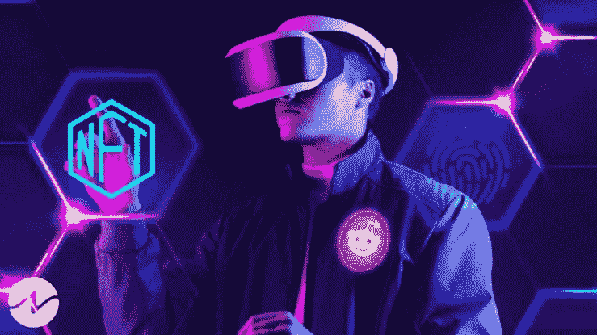

# 还是在密码和区块链时代，NFTs 够重要吗？

> 原文：<https://medium.com/bityard/still-in-the-era-of-crypto-and-blockchain-are-nfts-important-enough-76fad321d92d?source=collection_archive---------63----------------------->

Photo by TheNewsCrypto

对于还在对**[**【区块链】**](/bityard/the-blockchain-technology-3f7385ad55d4) 的世界记忆犹新的人来说，对**不可替代代币【NFT】**的兴趣及其交易量的飞速增长会感到令人发指。更重要的是，花在单个 NFT 上的钱的数量和 NFT 的总价值会高得惊人。**

# **NFT 真的像买家认为的那样重要吗？**

**简短的回答是**是的**，他们可以。更准确的答案是，这取决于你用它们做什么。**

**那么 [**NFTs**](https://coinmarketcap.com/alexandria/article/what-is-a-non-fungible-token-nft) 如何才能真正构成一个不变的值呢？首先，产生不可替代代币现象的世界本身已经表现出相当的成熟。毕竟，在过去的几年中，crypto 变得更加成熟。它可以用来购买越来越多的商品和服务，从特斯拉这样特殊的商品到智能手机账单这样平淡无奇的商品。**

**然而，加密真的与我们所有人所习惯的不同吗？我们都习惯于没有金本位制支持的货币，事实上稳定的硬币可以由抵押法令货币支持，这种货币我们都花，政府支持，以及其他有形的材料。**

**但正是加密硬币和不可替代代币之间的具体差异，使得终极硬币变得更加珍贵，也变得不那么珍贵。NFT 更为珍贵，因为它代表了商品的独特性，但不像加密硬币那样是可交易的商品。**

**任何 [**NFT**](https://coinmarketcap.com/alexandria/article/what-is-a-non-fungible-token-nft) 都有其独特的本质价值，它不像加密那样需要流动性来保持其可行性。**

**让它变得不那么珍贵和不确定的是， **NFTs** 为艺术工作室创造的新要求有多不稳定。任何人只要有互联网连接，有时只要几千个以太币，就可以在类似于**或 [**OpenSea**](https://opensea.io/) 的网站上生产一个不可替代的代币。****

****这已经成为你在 YouTube 上学习如何做并尝试自己出售的效果之一。与以传统方式出售的艺术品相比，这使得评估一件 NFT 艺术品变得相当困难。****

****话虽如此，收藏不可替代的代币艺术品的体验真的和传统艺术品有很大区别吗？通过 NFT 艺术教育出来的东西，尤其是在虚拟画廊里，与在简陋的画廊里看到的作品并没有本质上的不同。数字权力工具证明原始的**不可替代令牌**是真实的，可以买卖，并且由一条法律支持，该法律保证是唯一的，并且没有复杂的出处链。****

****此外，事实上，NFT 价值相当高的不可预测性可能是 NFT 艺术和其他非传统艺术如此迷人的部分原因。****

****任何东西都可以变成不可替代的代币，从推特到屁——85 美元的屁。那么，一个小便池，一桶坎贝尔的油烟桶，一根粘在墙上的香蕉呢——这些作为艺术而受人尊敬的东西难道不是随意的吗？难道它们没有表明，把艺术作为一种商品的要求，不同于任何一种对一件艺术作品的感官体验的解释吗？****

# ****比一张吸引人的照片更重要****

****最终，如何对不可替代的代币艺术品进行估价的问题将不得不解决，当它解决时，它将是一种更稳定的长期投资。****

****除了作为商品的 NFT 艺术品之外，NFT 馅饼的其他部分在确定长期价值方面要好得多。事实上，在 NFT 艺术品领域，保护价值是可以保证的，就像通过聪明的合同收回资金的方法一样，这些合同规定 NFT 艺术品的原所有者承认有可能进行事后交易。****

****除了艺术之外，体育收藏品 NFT 肯定还有长期价值，因为它们为买家鉴定了一件实物，并证明它是一件真实而独特的东西。****

******说说后劲。******

****体育迷永远是体育迷，体育明星永远是体育明星。这适用于所有类型的体育收藏品，从球员穿的衣服到印有他们头像的棒球卡，当他们不再需要遭受磨损和划伤。****

****NFTs 的另一个具有持久力的领域与最成熟的不可替代令牌的用例之一——虚拟空间有关。****

****从过去的 [**模拟城市**](https://www.ea.com/games/simcity) 到 [**第二人生**](https://secondlife.com/) 再到最近增加的类似**《我的世界》****堡垒之夜**和**机器人**的游戏，参与网络世界对许多人来说都很重要，包括购买和出售虚拟房地产 NFT，通过 NFT 交易在线游戏中不再需要的细节是 NFT 玩家收回资金的另一种方式。****

# ****NFTs 继续掌权的最高证据——提供独特的手势****

****在线世界及其社区的持久力凸显了另一个快速增长的不可替代的代币行业——虚拟房地产 NFTs——目前的成功和未来的承诺。类似于**依附地**、**隐体素**、**索姆空间**、**沙盒**和**以太地**的地点给了虚拟空间，这些空间变得非常珍贵。事实上，在最近一段时间，当其他 NFT 板块的价值下降时，NFT 虚拟房地产板块的价值却上升了。****

****此外，网络世界，也被称为 [**米节**](/bityard/metaverse-explained-cf0a0258224?source=your_stories_page----------------------------------------) ，目前不仅仅是复杂的城堡和食人魔攻击武器。它们还与虚拟世界有关，在虚拟世界中，“居民”和来电者可以见证他们在现实世界中无法见证的事情，与广告类似的“真实”房地产也可以帮助买家在虚拟世界中收回资金。****

****同样，与虚拟世界中的植物类似，社区的元素具有永恒的持久力，在 NFT 经济中，虚拟社区中与邻居有着几乎无限的隐性手势财富——以及无尽的可能的货币化方式。****

****在这方面，崭露头角的虚拟现实平台 Republic Realm 旨在通过各种平台实现社区参与，提供低价虚拟房地产名册的实时事务，并使用调查结果来确定诱人的加入目标。****

# ****而 NFTs 持久力的最大证明呢？他们很有用！****

****其他公司，如意大利公司 Genuino，正在使用不可替代的令牌技术来确保食品安全，以及 **AIKON** ，即将把 Republic Realm 整合到其对冲基金区块链中，展示了 NFTs 更实际的一面，不仅代表了财政价值和独特 gests 的价值，还代表了人们日常生活中糖衣安全性的价值。****

****基本上， [**AIKON**](https://aikon.com/?amp=1) 通过其 API 和 ORE ID(区块链的安全登录工具)创建了一个完美的协议和区块链安全认证，以及通过其 ORE Vault(企业的多管理员保管加密钱包)创建了一个超级安全多重签名功能。****

****矿石网络交易流经矿石链，这是一个处理个性化的区块链，也是它保护的数字手段。矿石链旨在与其他区块链集成，允许一个人在多个链上使用多个应用程序，只需一个调度地址、短信或社交登录。****

****只要继续从独特的技术和投资中创造价值，区块链的发展类似于不可替代的令牌技术，可以为它们注入新的生命，必将继续存在——特别是当它们获得这些技术和投资时。****

****您可能感兴趣的其他文章:****

*   ****[**玩赚——加密市场的新趋势，这可能是一种收入解决方案吗？**](/coinmonks/play-to-earn-a-new-trend-on-the-crypto-market-could-it-be-an-income-solution-c55f4e42b2a5)****
*   ****[T11【区块链技术】T12](/bityard/the-blockchain-technology-3f7385ad55d4)****

****__________________________****

****比特码交换:[**BitYard.com**](https://www.bityard.com/account/register?ru=AebNkR&f=Medium)****

****客户支持:[Support @ bityard . exchange](mailto:support@bityard.exchange)****

****业务请求:levi@bityard.exchange****

> ****加入 Coinmonks [电报频道](https://t.me/coincodecap)和 [Youtube 频道](https://www.youtube.com/c/coinmonks/videos)了解加密交易和投资****

# ****另外，阅读****

*   ****[折叠 App 审核](https://coincodecap.com/fold-app-review) | [Kucoin 交易机器人](/coinmonks/kucoin-trading-bot-automate-your-trades-8cf0ca2138e0) | [Probit 审核](https://coincodecap.com/probit-review)****
*   ****[如何匿名购买比特币](https://coincodecap.com/buy-bitcoin-anonymously) | [比特币现金钱包](https://coincodecap.com/bitcoin-cash-wallets)****
*   ****[币安 vs FTX](https://coincodecap.com/binance-vs-ftx) | [最佳(SOL)索拉纳钱包](https://coincodecap.com/solana-wallets)****
*   ****[比诺莫评论](https://coincodecap.com/binomo-review) | [斯多葛派 vs 3Commas vs TradeSanta](https://coincodecap.com/stoic-vs-3commas-vs-tradesanta)****
*   ****[Capital.com 评论](https://coincodecap.com/capital-com-review) | [香港的加密借贷平台](https://coincodecap.com/crypto-lending-hong-kong)****
*   ****[如何在 Uniswap 上交换加密？](https://coincodecap.com/swap-crypto-on-uniswap) | [A-Ads 审查](https://coincodecap.com/a-ads-review)****
*   ****[WazirX vs coin dcx vs bit bns](/coinmonks/wazirx-vs-coindcx-vs-bitbns-149f4f19a2f1)|[block fi vs coin loan vs Nexo](/coinmonks/blockfi-vs-coinloan-vs-nexo-cb624635230d)****
*   ****[本地比特币评论](/coinmonks/localbitcoins-review-6cc001c6ed56) | [加密货币储蓄账户](https://coincodecap.com/cryptocurrency-savings-accounts)****
*   ****什么是融资融券交易****
*   ****[维护卡审核](https://coincodecap.com/uphold-card-review) | [信任钱包 vs 元掩码](https://coincodecap.com/trust-wallet-vs-metamask)****