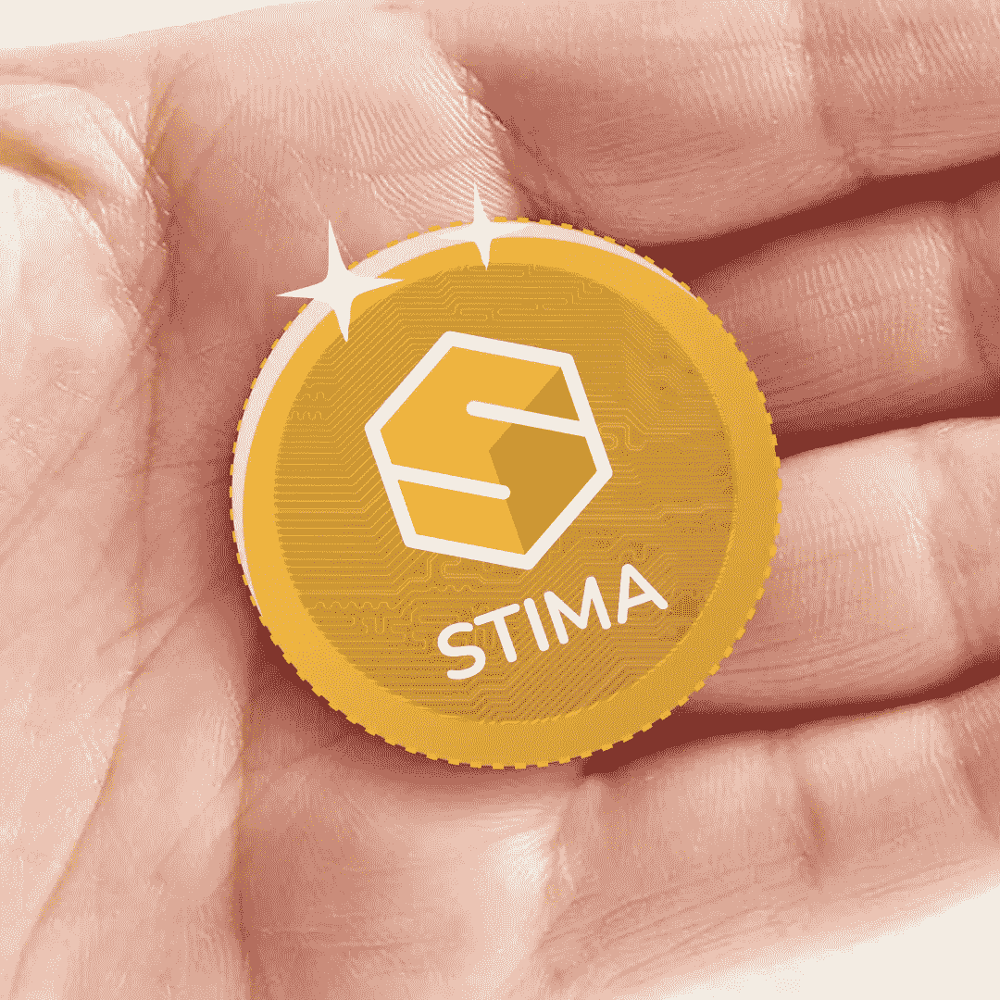

# 斯蒂马

> 原文：<https://medium.com/coinmonks/stima-d23c62af1ad0?source=collection_archive---------72----------------------->

介绍

**私有财产**得到法律的承认和保障，法律规定了获得、享有和限制的方法，以确保其社会功能并使所有人都能获得。

**财产权**或许比任何其他权利都更能诠释人类的一项基本需求，即拥有一个可以自由表达自我的空间。这个空间，独立于其他人类的空间，由地方和事物组成，人类可以自由地发展他的统治，不受其他个人的干涉。

世界各地有各种各样的**财产**，人们可以自由选择作为价值储存手段、交易媒介或投资媒介。

**STIMA** 提供由区块链开发的**交叉财产共享**服务，“一种基于加密证明而非信任的电子交换和/或支付系统，允许双方自愿直接交易，无需信任第三方”。

**CPS** (交叉财产分享)是一个基于**价值标准**原则的流程，这是一个类似于黄金标准的价值体系，其中测量单位的价值由作为担保的价值给出，在 **STIMA** 的情况下由财产价值给出。

**STIMA** 的每个计量单位，称为 **STIMA-token** ，从作为抵押品的财产的数量和质量中获取其价值，这刺激了最小交换价值的存在。

这一标准带来的另一个自动化问题是通货膨胀。采用**价值标准**的主要优势是汇率的稳定。加密货币的价值不取决于其供给和需求，而是取决于基础属性的数量。

与黄金不同，内在价值物业的价格不会波动，但会因自由市场对物业交换的需求而不断重估。

采用该系统的主要优势在于汇率的稳定性，因为加密货币或财产的最小值不取决于其供给和需求，而是取决于基础的总价值。

因此，受加密货币贬值的影响，在**价值标准**下，经济将享有固定最低汇率的优势。

查看我们的网站了解更多信息:https://stima.io/🟣

关注我们:insta gram:[https://www.instagram.com/stima.io](https://www.instagram.com/stima.io)
脸书:[https://www.facebook.com/stima.io](https://www.facebook.com/stima.io)推特:[https://twitter.com/STIMA_Crypto](https://twitter.com/STIMA_Crypto)Reddit:[https://www.reddit.com/r/stima](https://www.reddit.com/r/stima)

> 加入 Coinmonks [电报频道](https://t.me/coincodecap)和 [Youtube 频道](https://www.youtube.com/c/coinmonks/videos)了解加密交易和投资

# 另外，阅读

*   [如何购买 Monero](https://coincodecap.com/buy-monero) | [IDEX 评论](https://coincodecap.com/idex-review) | [BitKan 交易机器人](https://coincodecap.com/bitkan-trading-bot)
*   [CoinDCX 评论](/coinmonks/coindcx-review-8444db3621a2) | [加密保证金交易交易所](https://coincodecap.com/crypto-margin-trading-exchanges)
*   [红狗赌场评论](https://coincodecap.com/red-dog-casino-review) | [Swyftx 评论](https://coincodecap.com/swyftx-review) | [CoinGate 评论](https://coincodecap.com/coingate-review)
*   [Bookmap 评论](https://coincodecap.com/bookmap-review-2021-best-trading-software) | [美国 5 大最佳加密交易所](https://coincodecap.com/crypto-exchange-usa)
*   [如何在 FTX 交易所交易期货](https://coincodecap.com/ftx-futures-trading) | [OKEx vs 币安](https://coincodecap.com/okex-vs-binance)
*   [CoinLoan 评论](https://coincodecap.com/coinloan-review) | [YouHodler 评论](/coinmonks/youhodler-4-easy-ways-to-make-money-98969b9689f2) | [BlockFi 评论](https://coincodecap.com/blockfi-review)
*   XT.COM 评论 | [币安评论](https://coincodecap.com/xt-com-review)
*   [SmithBot 评论](https://coincodecap.com/smithbot-review) | [4 款最佳免费开源交易机器人](https://coincodecap.com/free-open-source-trading-bots)