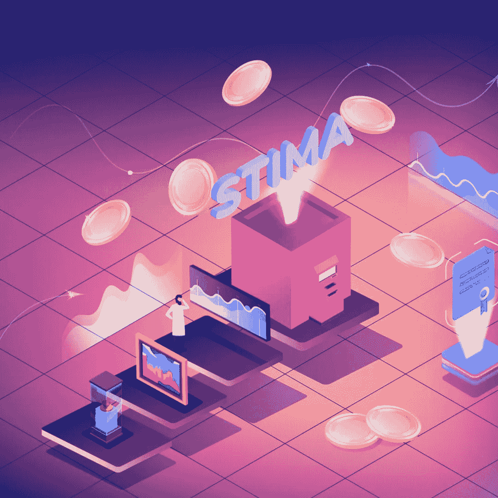
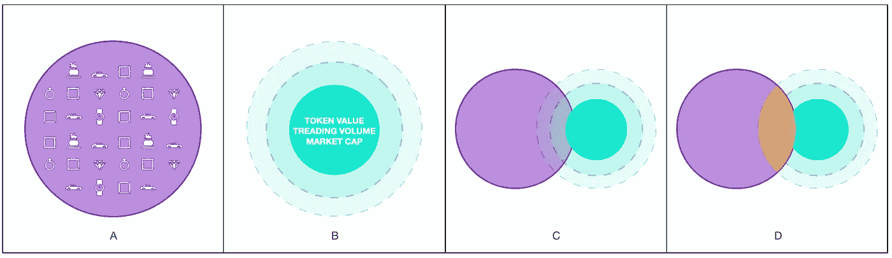
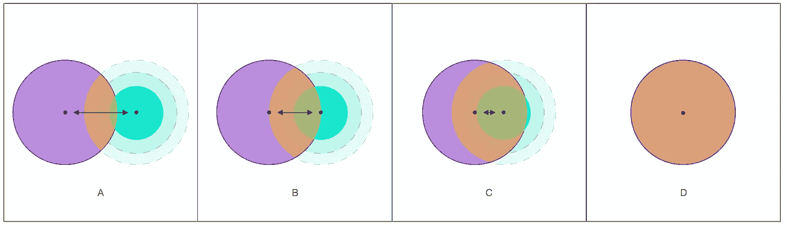

# STIMA，社会互动

> 原文：<https://medium.com/coinmonks/stima-how-it-work-7fb0b6081d2a?source=collection_archive---------38----------------------->

区块链的过程、互动和创新。

STIMA and the relationship of trust in the ecosystem

区块链系统能够并且正在创新复杂的社会互动，使生产和社会过程更加多样化和安全。

目前，在资本主义制度的基础上，存在着财产权，通过由供求法则调节的买卖过程进行交换，规定或受制于数量和价格。

Supply and demand regulation process.

STIMA 设定了修改复杂社会过程的目标，引入了新类型的社会迭代，其中提供不需要需求来完成购买和销售过程。

STIMA 引入了价值标准，该标准基于 3 个不同的原则及其交集。

*如下图所示:*

Types of interactions

**A)价值证明:**是所有已开采且仍被冻结的代币的总量:每个代币是在有价值的物品被作为担保时生成的，90%被存入被担保的资产的所有者的钱包中，该金额表明所有者将资产存入 cavea 以解锁代币的兴趣。

**B)流动性证明:**总共 10%由 STIMA 留存，作为佣金。这种佣金通过外汇市场出售，现金用于赎回资产。流动性的证明是通过以下市场数据可测量的代币流动性的证明:—代币在交易所的价值
市值
交易量

**C)**PoV(价值证明)和 PoL(流动性证明)的交集是因为对系统的信任。

**D)准备金证明**由价值证明和流动性证明的交集生成。
当 PoL 达到必要的绩效时，持有作为 PoV 一部分的冻结代币的资产所有者凭经验评估市场的可能风险，并在认为可以接受时，将资产存放在 STIMA 认可的保管库中。PoV 和 PoL 之间的联合生成 PoR(储备证明)，它代表可以用 STIMA-token 赎回的所有资产，并且它们保证 STIMA 的最低价值。

STIMA 扮演受托第三方的角色，对生态系统的信任表现如下:

Diagram on the result of interactions

整个系统在 STIMA 执行以下任务时工作:
-反洗钱流程
-选择有价值的资产
-通过无党派专家学院对其进行经验评估
-完美管理收集的资产

价值证明和流动性证明之间的交集是由于人们对 STIMA 开展的工作的质量和一致性的信任:
**【A)**对 STIMA 的信任越大，建议纳入价值证明的资产就越多。
**B)** 所选资产质量越好，人们带入流动性池的流动性就越大。
**C)** 证明流动性的结果越大；代币的价值、交易量和市值越大，资产所有者的信心就越大，因此他们会将资产存放在金库中以释放流动性
**【D】**在一个各方都对生态系统充满信心的系统中，储备的证据越多。

查看我们的网站了解更多信息:
https://stima.io/[🟣](https://stima.io/)

关注我们:
insta gram:[https://www.instagram.com/stima.io](https://www.instagram.com/stima.io)
脸书:[https://www.facebook.com/stima.io](https://www.facebook.com/stima.io)
推特:[https://twitter.com/STIMA_Crypto](https://twitter.com/STIMA_Crypto)
Reddit:[https://www.reddit.com/r/stima](https://www.reddit.com/r/stima)

> 加入 Coinmonks [电报频道](https://t.me/coincodecap)和 [Youtube 频道](https://www.youtube.com/c/coinmonks/videos)了解加密交易和投资

# 另外，阅读

*   [3 商业评论](/coinmonks/3commas-review-an-excellent-crypto-trading-bot-2020-1313a58bec92) | [Pionex 评论](https://coincodecap.com/pionex-review-exchange-with-crypto-trading-bot) | [Coinrule 评论](/coinmonks/coinrule-review-2021-a-beginner-friendly-crypto-trading-bot-daf0504848ba)
*   [莱杰 vs n rave](/coinmonks/ledger-vs-ngrave-zero-7e40f0c1d694)|[莱杰 nano s vs x](/coinmonks/ledger-nano-s-vs-x-battery-hardware-price-storage-59a6663fe3b0) | [币安评论](/coinmonks/binance-review-ee10d3bf3b6e)
*   [Bybit 交易所评论](/coinmonks/bybit-exchange-review-dbd570019b71) | [Bityard 评论](https://coincodecap.com/bityard-reivew) | [Jet-Bot 评论](https://coincodecap.com/jet-bot-review)
*   [3 commas vs crypto hopper](/coinmonks/3commas-vs-pionex-vs-cryptohopper-best-crypto-bot-6a98d2baa203)|[赚取加密利息](/coinmonks/earn-crypto-interest-b10b810fdda3)